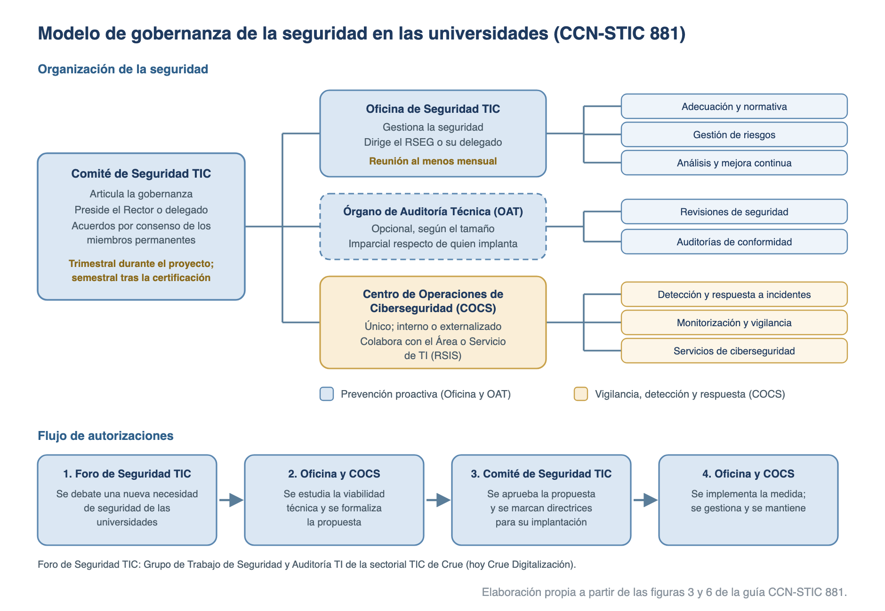

# Adecuación al ENS en las universidades (CCN-STIC 881)

**Guía CCN-STIC 881, perfil 881A y Anexos I y II: edición de mayo de 2022. Real Decreto 311/2022: texto consolidado a 6 de noviembre de 2024.**

Las universidades públicas forman parte del sector público y sus sistemas de información están sujetos al **Esquema Nacional de Seguridad** (RD 311/2022, tema [29](29-esquema-nacional-de-seguridad.md)). Para que todas se adecuen de forma homogénea, el Centro Criptológico Nacional (CCN) publicó, con la participación de la CRUE, la **guía CCN-STIC 881, de Adecuación al ENS para Universidades**. La guía aporta un modelo de gobernanza, un plan de adecuación y un **Perfil de Cumplimiento Específico para Universidades**, de categoría **MEDIA**.

## El ENS y los perfiles de cumplimiento específicos

El ENS obliga a las universidades públicas como a cualquier otra entidad del sector público. Desde 2022 admite, además, que un colectivo con riesgos semejantes aplique un conjunto de medidas propio, validado por el CCN: el perfil de cumplimiento específico.

- **Sujeción de las universidades al ENS**: el RD 311/2022 se aplica «a todo el sector público» en los términos del art. 2 de la Ley 40/2015 (art. 2.1). Ese artículo integra en el sector público institucional a «Las Universidades públicas que se regirán por su normativa específica y supletoriamente por las previsiones de la presente Ley» (**art. 2.2.c) de la Ley 40/2015**).
- **Perfil de cumplimiento específico (art. 30.1)**: «En virtud del principio de proporcionalidad y buscando una eficaz y eficiente aplicación del ENS a determinadas entidades o sectores de actividad concretos, se podrán implementar perfiles de cumplimiento específicos que comprenderán aquel conjunto de medidas de seguridad que, trayendo causa del preceptivo **análisis de riesgos**, resulten idóneas para una **concreta categoría de seguridad**».
- **Definición (glosario, Anexo IV)**: «conjunto de medidas de seguridad, comprendidas o no en el anexo II de este real decreto, que, como consecuencia del preceptivo análisis de riesgos, resulten de aplicación a una entidad o sector de actividad concreta y para una determinada categoría de seguridad, y que haya sido **habilitado por el CCN**».
- **Validación y publicación (art. 30.3)**: el **CCN** «validará y publicará los correspondientes perfiles de cumplimiento específicos que se definan».
- **Finalidad (preámbulo)**: «alcanzar una adaptación del ENS más eficaz y eficiente, racionalizando los recursos requeridos sin menoscabo de la protección perseguida y exigible».
- **Auditoría (art. 31.2)**: se realiza «en función de la categoría del sistema y, en su caso, del perfil de cumplimiento específico que corresponda».
- **Perfiles publicados**: según el portal del ENS, hay perfiles para **entidades locales** (CCN-STIC 883A a 883D: ayuntamientos por tramos de población y diputaciones), **universidades** (CCN-STIC 881A) y **servicios en la nube**.
- **µCeENS**: metodología del CCN para obtener la Certificación de Conformidad sobre la base de un perfil de cumplimiento específico, automatizada en las herramientas de gobernanza INES y AMPARO.

## La guía CCN-STIC 881: objetivo, alcance y documentos

La guía pertenece a la **serie 800** de guías CCN-STIC, las que desarrollan el ENS (disposición adicional segunda del RD 311/2022). La edita el CCN y en ella ha participado personal de la CRUE.

- **Ediciones**: primera edición de **febrero de 2022**, sobre el proyecto de real decreto; edición vigente de **mayo de 2022**, ya referida al RD 311/2022.
- **Objetivo**: «proporcionar un modelo que facilite la Adecuación al ENS de los sistemas de las universidades públicas de forma ordenada y efectiva, que permita obtener la **Certificación de Conformidad** para sus sistemas según el Perfil de Cumplimiento Específico para Universidades que se ha desarrollado».
- **Alcance**: la gestión de la ciberseguridad «de manera integral», en cuatro pasos encadenados:
    - Modelo de gobernanza, recogido en la **Política de Seguridad**.
    - **Plan de Adecuación** de los sistemas.
    - **Certificación** conforme al perfil.
    - Ciclo de gobernanza: revisión y mejora continua.
- **Adaptación**: cada universidad debe particularizar las pautas a «su ámbito, naturaleza, competencias y entorno singular».

La guía se compone de cuatro documentos:

| Documento | Contenido |
| -------- | ------------------------ |
| **CCN-STIC 881** (guía) | Modelo de gobernanza, Plan de Adecuación, implantación de las medidas y herramientas de gobernanza |
| **CCN-STIC 881A** | Perfil de Cumplimiento Específico Universidades: declaración de aplicabilidad y criterios de aplicación de las medidas |
| **Anexo I** | Modelo de Política de Seguridad para universidades |
| **Anexo II** | Modelo de Plan de Adecuación: catálogo de servicios e información, valoración, categoría y declaración de aplicabilidad provisional |

- **Referencias desfasadas en el texto de la guía**:
    - Toma las funciones de las universidades de la **LOU** (LO 6/2001), derogada por la **LOSU** (LO 2/2023, tema [103](103-sistema-universitario-losu.md)).
    - Llama Sectorial CRUE-TIC a la actual **Crue Digitalización** (tema [108](108-administracion-electronica-universitaria.md)).
    - Remite a una disposición adicional tercera del real decreto para la conformidad de los proveedores privados. En el RD 311/2022 publicado esa exigencia está en el **art. 2.3**.

## Modelo de gobernanza

Cada universidad debe «establecer y aprobar su propio modelo de gobernanza de acuerdo con su estructura, dimensión y recursos disponibles» y recogerlo en su Política de Seguridad de la Información. La guía propone un modelo consensuado con la CRUE, en el que la gobernanza «se articula a través de un Comité de Seguridad TIC, se gestiona a través de una Oficina de Seguridad TIC, y se implementa mediante Centros de Operaciones de Ciberseguridad en colaboración con el Área o Servicio de TI».

{width=100%}

- **Comité de Seguridad TIC (COMSEGTIC)**: órgano colegiado que articula la gobernanza. Si se constituye jurídicamente, se rige por la Sección 3.ª del Capítulo II del Título Preliminar de la Ley 40/2015.
    - **Presidencia**: el **Rector o delegado**.
    - **Miembros permanentes**:
        - El secretario del Comité, que es el **Secretario General** o delegado.
        - El Responsable del Sistema (**RSIS**): el director o jefe de servicio del Área TI.
        - El Responsable de Seguridad de la Información (**RSEG**), designado formalmente por el Rector o el equipo de dirección.
        - Los representantes de Información y Servicios, convocados según los asuntos (un vocal con voto por área).
        - Los asesores que se consideren oportunos; puede acudir un representante del **CCN**, con voz pero sin voto.
        - El **Delegado de Protección de Datos**, con voz pero sin voto.
    - **Miembros no permanentes**: otros representantes de la universidad y especialistas externos de los sectores público, privado o académico.
    - **Funciones**: liderar y coordinar el Proyecto de Adecuación al ENS; alentar la Certificación de Conformidad de los servicios transversales; debatir en **segunda instancia** las propuestas de la Oficina y trasladarlas al órgano que las aprueba formalmente (el Rector o, por delegación, la Junta de Gobierno, el Secretario General, el Gerente o el vicerrector con competencias TIC); proponer normas, criterios y buenas prácticas.
    - **Reuniones**: al menos **una vez al trimestre** durante el Proyecto de Adecuación y, alcanzada la certificación, al menos **dos veces al año** (semestral). Convoca la Presidencia, por medio del secretario, a iniciativa propia o por mayoría de los miembros permanentes.
    - **Acuerdos**: por **consenso de los miembros permanentes**.
- **Oficina de Seguridad TIC**: gestiona la seguridad. Sus áreas de trabajo son la adecuación al ENS, la normativa y gestión de riesgos, el análisis y mejora continua, y la seguridad en las interconexiones y conectividad.
    - **Composición**: un director nombrado por el Comité, que es el **RSEG** o la persona en quien delegue y actúa de enlace con el Comité; un secretario, nombrado por el Comité a propuesta de los miembros de la Oficina; y los **administradores especialistas de seguridad (AES)** que determine el RSEG.
    - **Funciones**: gestión y operativa de la adecuación, la implantación y la conformidad; redacción de propuestas, que debate en **primera instancia**; elaborar y revisar la Política de Seguridad; elaborar la normativa de seguridad, que aprueba el RSEG con conocimiento del Comité; programas de formación y concienciación; planes de mejora con su dotación presupuestaria; seguimiento de los riesgos residuales; promover las auditorías periódicas del ENS.
    - **Reuniones**: al menos **una vez al mes** y siempre antes de las del Comité; en pleno o en grupos de trabajo.
- **Centro de Operaciones de Ciberseguridad (COCS)**: presta servicios de ciberseguridad bajo la dirección del director de la Oficina o de la persona que este designe. Es **único** en la organización, aunque tenga varios emplazamientos físicos, y puede ser **interno o externalizado**.
    - **Funciones**: vigilar y monitorizar los sistemas y los dispositivos de defensa; analizar y correlacionar eventos y registros de actividad; operar los dispositivos de defensa; constituir, en su caso, un equipo de respuesta a incidentes; servicio de alerta temprana (**SAT**); gestión de vulnerabilidades; análisis forense digital; cibervigilancia.
- **Área o Servicio de TI**: plantilla técnica que desarrolla, opera y mantiene el sistema de información, bajo la responsabilidad de su director o jefe de servicio, que ostenta el rol de **RSIS**. Se coordina con la Oficina para definir y aplicar las medidas y colabora con el COCS en la operativa diaria. Si la universidad no dispone de COCS, puede asumir sus funciones en todo o en parte.
- **Órgano de Auditoría Técnica (OAT)**: **opcional**, en función del tamaño de la universidad. Realiza las revisiones periódicas y las auditorías de conformidad, siempre que se garantice la imparcialidad (inexistencia de conflicto de interés) entre el personal que implanta el ENS y el equipo auditor.
- **Foro de Seguridad TIC de las Universidades**: «punto de encuentro de las universidades en el ámbito del Esquema Nacional de la Seguridad». La guía lo sitúa en el **Grupo de Trabajo de Seguridad y Auditoría TI** de la sectorial TIC de Crue, en la que están representadas las universidades públicas y privadas. Se rige por el reglamento interno de la sectorial. Cada representante traslada las propuestas a su universidad, donde las aprueba, si procede, el Comité de Seguridad TIC.

Tres ideas completan el modelo:

- **Reparto de tareas**: la Oficina y el OAT hacen **prevención proactiva**; el COCS, **vigilancia, detección y respuesta**.
- **Flujo de autorizaciones** (cuatro pasos):
    1. El Foro debate una nueva necesidad de seguridad de las universidades.
    2. La Oficina y el COCS estudian la viabilidad técnica y formalizan la propuesta.
    3. El Comité aprueba la propuesta y marca directrices para su implantación.
    4. La Oficina y el COCS implementan la medida, la gestionan y la mantienen.
- **Modelo extendido**: en entidades de tamaño medio-alto y alto grado de madurez las funciones pueden segregarse en dos áreas.
    - **Cumplimiento**: la lidera el RSEG, que dirige la Oficina de Gobernanza y Cumplimiento Normativo de la Seguridad TIC y la supervisión técnica (OAT y gestión de los incidentes).
    - **Operación**: la lidera un Responsable de las Operaciones de Seguridad, que dirige el Centro de Operaciones de Seguridad.
    - En todos los escenarios «la responsabilidad última de la seguridad siempre recae en el Comité de Seguridad TIC».

### Política de Seguridad de la Información (Anexo I)

Es el documento de alto nivel en el que la universidad define su compromiso con la seguridad de los servicios que presta, y los órganos y responsables que velan por ella. El Anexo I ofrece un modelo listo para adaptar.

- **Contenido**: misión de la universidad; marco legal y regulatorio; modelo de gobernanza (órganos, roles, designación y renovación); mecanismos de coordinación y de resolución de conflictos, que puede asumir el propio Comité; compromiso con los requisitos mínimos del ENS; forma de desarrollo y periodicidad de revisión; y cumplimiento de la normativa de protección de datos.
- **Roles**: Responsable de la Información y Responsable de los Servicios, para los sistemas no operados por terceros, y Responsable de Seguridad, que «será diferente del Responsable del Sistema y no existirá dependencia jerárquica entre ambos» (art. 13.3 del RD 311/2022).
- **Perfil del RSEG**: «cargo o funcionario, de nivel ejecutivo», designado formalmente por el Rector o el equipo de dirección. No puede ser un órgano de gobierno unipersonal ni tener responsabilidad sobre la prestación de los servicios TIC.
- **Responsables de la Información y de los Servicios**: los jefes de los órganos y unidades administrativas; cabe reunir ambas figuras en el Secretario General.
- **Designación**: la creación del Comité y los nombramientos corresponden al rector. El nombramiento se revisa **cada 4 años** o cuando el puesto quede vacante.
- **Tres niveles normativos**:
    - Primer nivel: Política de Seguridad, Normativa interna del uso de los medios electrónicos y directrices generales.
    - Segundo nivel: normas de seguridad derivadas de las anteriores.
    - Tercer nivel: procedimientos, guías e instrucciones técnicas.
    - El órgano superior de la universidad aprueba la Política y la Normativa interna de uso; el Comité, los demás documentos.
- **Periodicidades**:
    - Concienciación de todo el personal: al menos **una vez al año**.
    - Análisis de riesgos: al menos **una vez al año**, cuando cambien de manera significativa la información o los servicios, y cuando ocurra un incidente grave o se detecten vulnerabilidades graves.
    - Revisión de la Política por el Comité: anual.
- **Incidentes**: se notifican al CCN los que tengan un impacto significativo (art. 33 del RD 311/2022; tema [31](31-gestion-de-ciberincidentes.md)).
- **Principios del modelo**: alcance estratégico, responsabilidad determinada, seguridad integral, gestión de riesgos, proporcionalidad, mejora continua y seguridad por defecto.

## El Plan de Adecuación al ENS

El Plan de Adecuación documenta el alcance, la categorización, la declaración de aplicabilidad y el análisis de riesgos. Como la guía aporta ya un perfil de cumplimiento, basta con **cinco pasos**:

1. **Alcance de los sistemas a certificar**: catálogo de los servicios prestados, la información que manejan y el sistema que los aloja. El Anexo II recomienda englobar los activos esenciales «en el menor número de sistemas posibles» y parte de un único sistema.
2. **Valoración y categorización**: se valora el impacto de un incidente en las cinco dimensiones (confidencialidad, integridad, trazabilidad, autenticidad y disponibilidad) en niveles BAJO, MEDIO o ALTO, conforme al Anexo I del ENS y la guía **CCN-STIC 803**.
    - Valoran los **responsables de los servicios y de la información**, que pueden tener en cuenta la opinión del RSEG y del RSIS. El RSEG puede elaborar una propuesta inicial.
    - La categoría del sistema la determina el **responsable de la seguridad** (art. 41 del RD 311/2022).
    - Las cuatro primeras dimensiones (CITA) se refieren a la información; la disponibilidad, al servicio que da acceso a ella.
3. **Declaración de Aplicabilidad Provisional**: la universidad se acoge al perfil, decisión que debe estar «argumentada formalmente». Identifica las medidas y refuerzos del perfil y las que se sustituyen por **medidas compensatorias** de igual o superior protección (guía **CCN-STIC 819**). Puede elaborarse con el asistente del Plan de Adecuación de **INES**.
4. **Análisis de riesgos**: conforme al Anexo II del ENS. La guía recomienda la metodología **MAGERIT** y la herramienta **PILAR** (PILAR, PILAR Basic o µPILAR; tema [30](30-analisis-y-gestion-de-riesgos.md)). Refleja el nivel de madurez de las medidas y termina con la aceptación formal de los **riesgos residuales** por los responsables de los servicios y de la información.
5. **Declaración de Aplicabilidad Definitiva**: el análisis de riesgos valida los criterios de aplicación del perfil. El documento lo firma el **Responsable de la Seguridad**.

Tras el plan se elabora el **plan de implantación**: el mapa normativo y la hoja de ruta con las tareas y su priorización.

### Catálogo de servicios y categoría del sistema (Anexo II)

El Anexo II incluye un catálogo estándar de **20 servicios** (U 01 a U 20), elaborado con la CRUE a partir de las competencias de las universidades, con la información que maneja cada uno y una valoración orientativa (B, nivel BAJO; M, nivel MEDIO; NA, dimensión no afectada):

| ID | Servicio | C | I | T | A | D |
| ---- | ------------------------------ | --- | --- | --- | --- | --- |
| U 01 | Universidad (estructura, gobernanza, normativa, elecciones) | B | B | B | B | B |
| U 02 | Control de infraestructuras e instalaciones | B | B | B | B | B |
| U 03 | Colaboración universitaria | B | B | B | B | B |
| U 04 | Docencia y estudios | M | M | M | M | M |
| U 05 | Investigación | B | B | B | B | B |
| U 06 | Profesorado | M | M | M | M | M |
| U 07 | Extensión universitaria | M | B | B | B | B |
| U 08 | Enseñanzas en el extranjero | M | M | M | M | M |
| U 09 | Movilidad en el extranjero | M | B | B | B | B |
| U 10 | Régimen económico | B | B | B | B | M |
| U 11 | Gabinete jurídico | M | M | M | M | M |
| U 12 | Gestión de calidad | M | M | M | M | M |
| U 13 | PAS | M | M | M | M | M |
| U 14 | Defensor universitario | M | B | B | B | B |
| U 15 | Biblioteca | NA | B | B | B | B |
| U 16 | Vigilancia y promoción de la salud | M | M | M | M | M |
| U 17 | Publicaciones | NA | B | B | B | B |
| U 18 | Servicios a fundaciones, personas físicas y personas jurídicas | B | B | B | B | B |
| U 19 | Sector público (archivo, registro, transparencia, sede) | M | M | M | M | M |
| U 20 | Apoyo colaborativo | B | B | B | B | M |

- **Resultado**: el nivel máximo es MEDIO en las cinco dimensiones y ningún servicio alcanza el nivel ALTO. El sistema es de **categoría MEDIA** [C=M, I=M, T=M, A=M, D=M].
- **Matices del catálogo**:
    - El servicio de investigación (U 05) comprende la gestión de las actividades de investigación, no sus contenidos.
    - La valoración de U 18 debe ajustarse a los servicios que se presten.
    - PAS (personal de administración y servicios) es la denominación de la LOU; la LOSU lo llama personal técnico, de gestión y de administración y servicios (PTGAS).

## El Perfil de Cumplimiento Específico para Universidades (CCN-STIC 881A)

La guía 881A contiene el perfil validado por el CCN para universidades «con necesidades de seguridad de categoría MEDIA». Tiene la forma de una declaración de aplicabilidad: para cada medida del Anexo II del ENS indica si aplica y con qué exigencia.

- **Medidas aplicables**: **69 de las 73** medidas del Anexo II: las **4** del marco organizativo, **29** de las 33 del marco operacional y las **36** medidas de protección.
- **Medidas que no aplican (4)**: protección de la cadena de suministro [op.ext.3], plan de continuidad [op.cont.2], pruebas periódicas [op.cont.3] y medios alternativos [op.cont.4]. Las cuatro son medidas que el Anexo II solo exige en categoría o nivel ALTO.
- **Columna «Aplicación»**: indica la categoría (BÁSICA, MEDIA, ALTA) cuando la medida afecta a las cinco dimensiones, y el nivel (BAJO, MEDIO, ALTO) cuando solo afecta a algunas.
- **Criterios específicos**: ocho medidas se apartan de la exigencia general de la categoría MEDIA:

| Medida | Aplicación | Criterio del perfil |
| ------------ | ------ | ------------------------ |
| [op.acc.5] Mecanismo de autenticación (usuarios externos) | MEDIO (+R5) | Si la confidencialidad de la información se valoró en nivel BAJO, bastan los requisitos de categoría BÁSICA más el refuerzo R5 (registro) |
| [op.exp.6] Protección frente a código dañino | BÁSICA (+R4) | Requisitos de categoría BÁSICA más el refuerzo R4, capacidad de respuesta en caso de incidente (**EDR**) |
| [op.mon.3] Vigilancia | BÁSICA (+R1) | Requisitos de categoría BÁSICA más el refuerzo R1, correlación de eventos |
| [mp.per.2] Deberes y obligaciones | BÁSICA | Requisitos de categoría BÁSICA |
| [mp.eq.4] Otros dispositivos conectados a la red | BAJO | Requisitos de nivel BAJO |
| [mp.si.2] Criptografía | MEDIO (+R2) | Nivel MEDIO más el refuerzo R2: copias de seguridad cifradas con algoritmos y parámetros autorizados por el CCN |
| [mp.sw.2] Aceptación y puesta en servicio | BÁSICA | Podrían aplicarse los requisitos de categoría BÁSICA cuando las aplicaciones no gestionen servicios corporativos |
| [mp.info.4] Sellos de tiempo | ALTO | Nivel ALTO para la información que pueda usarse como evidencia electrónica en el futuro; en otro caso, no aplica |

- **Balance**: el perfil parte de la categoría MEDIA, rebaja algunas medidas a BÁSICA o BAJO y añade en otras refuerzos que el Anexo II reserva a la categoría ALTA (EDR, cifrado de las copias de seguridad, sellos de tiempo).
- **Errata de la guía**: el apartado 2.1 de la 881A habla del «Anexo II del RD 3/2010». Las 73 medidas son las del Anexo II del **RD 311/2022** (tema [29](29-esquema-nacional-de-seguridad.md)).

## Implantación de las medidas

La guía recorre los tres marcos del Anexo II del ENS con indicaciones prácticas para el entorno universitario. El contenido general de cada medida se estudia en el tema [29](29-esquema-nacional-de-seguridad.md); aquí se recoge lo que la guía concreta.

### Marco organizativo [org]

- **Política de seguridad [org.1]**: la elaborada al desarrollar el modelo de gobernanza.
- **Normativa de seguridad [org.2]**: directrices sobre el uso correcto de los recursos (equipos, servicios e instalaciones). La aprueba el órgano superior correspondiente y puede basarse en la guía **CCN-STIC 821**. Debe recoger:
    - Alcance: personal propio y de terceros.
    - Vigencia.
    - Órganos de aprobación y revisión, y su periodicidad.
    - Uso correcto de los recursos TIC (correo, Internet, soportes, impresoras, carpetas de red).
    - Qué se considera **uso indebido**.
    - Régimen disciplinario.
- **Procedimientos de seguridad [org.3]**: describen las tareas habituales y quién las ejecuta (objetivo, alcance, desarrollo, responsabilidades y comunicación de deficiencias). Base: guía **CCN-STIC 822**.
- **Proceso de autorización [org.4]**: define quién autoriza la entrada o el uso de instalaciones, equipos, aplicaciones, enlaces de comunicaciones, soportes, equipos móviles y servicios de terceros. Conviene implementarlo en una herramienta de *help desk* para registrar las evidencias.

### Marco operacional [op]

- **Planificación [op.pl]**:
    - Análisis de riesgos **semiformal**, actualizado al menos **anualmente** o cuando haya cambios relevantes.
    - Arquitectura de seguridad documentada: esquemas de red físicos y lógicos, y sistema de gestión de la documentación del ENS.
    - Estudio previo a la adquisición de nuevos componentes y estudio de dimensionamiento antes de la puesta en explotación.
    - Componentes certificados del catálogo **CPSTIC** del CCN; si no los hay, se aplica el art. 19 del RD 311/2022.
- **Control de acceso [op.acc]**:
    - Cuentas individualizadas; al cesar el usuario se inhabilitan y se conservan sus registros de actividad.
    - Principios de gestión de derechos: «todo acceso está prohibido, salvo autorización expresa», mínimo privilegio, necesidad de conocer y responsabilidad de compartir, y capacidad de autorizar.
    - Segregación de funciones: si falta personal, puede sustituirse por una medida compensatoria, como el registro de actividad (guías CCN-STIC 819 y 831).
    - Los **estudiantes** se tratan como **«usuarios externos»** [op.acc.5]; no son usuarios de la organización.
    - Usuarios de la organización [op.acc.6]: contraseña solo desde zonas controladas; **doble factor** desde zonas no controladas o a través de ellas.
    - Acceso remoto: autorizado previamente, con tráfico cifrado y registros de auditoría de las conexiones.
- **Explotación [op.exp]**:
    - Inventario de activos con su responsable.
    - Configuración de seguridad (bastionado) antes de entrar en operación, con apoyo de las guías CCN-STIC y de CLARA y ROCIO.
    - Gestión de cambios con pruebas en preproducción.
    - Protección frente a código dañino con capacidad de respuesta (**EDR**).
    - Gestión de incidentes conforme a la ITS de Notificación de Incidentes de Seguridad y la guía CCN-STIC 817, con **LUCIA** como ventanilla única (tema [31](31-gestion-de-ciberincidentes.md)); si afectan a datos personales, art. 33 del RGPD.
    - Registro de actividad con, al menos, usuario, fecha y hora, información afectada, tipo de evento y resultado.
- **Recursos externos [op.ext]**:
    - Requisitos de seguridad en los pliegos y en los acuerdos de nivel de servicio, con un «servicio mínimo admisible».
    - Al proveedor se le exige la **conformidad con el ENS** en la categoría de los sistemas afectados (art. 2.3 del RD 311/2022 e ITS de Conformidad).
    - Interconexión de sistemas con autorización previa.
- **Servicios en la nube [op.nub]**: deben cumplir las guías CCN-STIC aplicables (CCN-STIC 823) y estar certificados. Requisitos mínimos: auditoría de pruebas de penetración, transparencia, cifrado y gestión de claves, y jurisdicción de los datos.
- **Continuidad del servicio [op.cont]**: análisis de impacto para determinar los requisitos de disponibilidad de cada servicio y sus elementos críticos.
- **Monitorización del sistema [op.mon]**: detección o prevención de intrusión basada en reglas; métricas e indicadores para la encuesta **INES** (ITS de Informe del Estado de la Seguridad y guía CCN-STIC 824); recolección automática de eventos con correlación.

### Medidas de protección [mp]

- **Instalaciones e infraestructuras [mp.if]**: CPD en áreas separadas y con control de acceso, con registro de entradas y salidas; suministro eléctrico de emergencia suficiente para la terminación ordenada de los procesos; protección frente a incendios e inundaciones.
- **Gestión del personal [mp.per]**: responsabilidades de seguridad en la caracterización del puesto; plan de concienciación y plan de formación por **ciclo anual**. El CCN ofrece recursos de formación en la plataforma **ÁNGELES**.
- **Protección de los equipos [mp.eq]**: puesto de trabajo despejado; bloqueo por inactividad; inventario de portátiles con su responsable; configuración específica para otros dispositivos conectados (impresoras, escáneres, proyectores, BYOD).
- **Protección de las comunicaciones [mp.com]**:
    - Perímetro seguro que separe la red interna del exterior.
    - Redes privadas virtuales (**VPN**) cifradas, con algoritmos y parámetros autorizados por el CCN.
    - Separación de flujos mediante segmentación lógica básica (VLAN de usuarios, servicios y administración), lógica avanzada (VPN) o física.
    - Las redes inalámbricas, en un segmento separado.
    - La ITS de Interconexión de Sistemas de Información que prevé el RD 311/2022 aún no se ha aprobado.
- **Soportes de información [mp.si]**: marcado según la calificación de la información; criptografía en los dispositivos removibles que salgan de las áreas controladas; **copias de seguridad cifradas**; registro de entrada y salida; borrado y destrucción seguros con productos certificados.
- **Aplicaciones informáticas [mp.sw]**: desarrollo en un sistema separado del de producción; metodología de desarrollo seguro (mínimo privilegio y seguridad desde el diseño); plan de aceptación y pruebas en preproducción.
- **Protección de la información [mp.info]**:
    - Datos personales: RGPD y LOPDGDD (tema [53](53-proteccion-de-datos-personales.md)).
    - Calificación **«USO OFICIAL»** para la información con alguna restricción de manejo.
    - Firma electrónica avanzada basada en certificados cualificados y sellos cualificados de tiempo.
    - Limpieza de documentos antes de difundirlos (metadatos, campos ocultos, comentarios, revisiones).
    - Copias de seguridad con pruebas periódicas de recuperación.
- **Protección de los servicios [mp.s]**: correo electrónico (spam, código dañino, normas de uso); aplicaciones web, con auditorías de «caja negra» o de «caja blanca»; navegación web; y protección frente a la denegación de servicio.

## Herramientas y ciclo de gobernanza

Con la certificación se inicia el ciclo de gobernanza: la revisión y mejora continua de los procesos de seguridad. Conforme al principio de vigilancia continua y reevaluación periódica (art. 10 del RD 311/2022), el CCN pone a disposición de las universidades sus herramientas de gobernanza **INES** y **AMPARO**, y la guía asigna cada tarea a una de ellas:

| Tarea | Detalle | Herramienta |
| -------------- | -------------------- | ------- |
| Elaboración y actualización del Plan de Adecuación | Alcance, categorización, declaraciones de aplicabilidad y análisis de riesgos | INES |
| Plan de implantación | Hoja de ruta detallada; seguimiento periódico y ajustes | INES y AMPARO |
| Revisión de la información y los servicios, su valoración y la categorización | Los responsables comunican al RSEG los activos nuevos y los cambios | INES |
| Elaboración y revisión de la Política de Seguridad | La revisa el Comité, normalmente con carácter **anual** | INES |
| Plan de concienciación y plan de formación | **Anual**: concienciación para todo el personal y formación para quien opera el sistema | INES y AMPARO |
| Elaboración y revisión de la normativa de seguridad | La revisa el Comité, al menos con carácter **anual** | INES y AMPARO |
| Actualización del análisis de riesgos | **Anual** y ante cambios relevantes; aprobación formal de los riesgos residuales | PILAR |
| Revisión de la declaración de aplicabilidad o del perfil | La revisa el RSEG tras cambios en la categorización, los riesgos o el perfil | INES |
| Auditorías y chequeos internos | Chequeos periódicos de las medidas, los procedimientos y el plan de implantación | AMPARO |
| Revisión del estado de la seguridad | La encuesta INES se cumplimenta **anualmente** | INES |
| Auditorías de conformidad con el ENS | Con carácter **bienal** | AMPARO |

- **INES** (Informe Nacional del Estado de Seguridad): recoge el estado de la seguridad e incluye el asistente del Plan de Adecuación.
- **AMPARO**: apoya la implantación de las medidas y las auditorías.
- **Otras soluciones del CCN citadas por la guía**: PILAR (riesgos), LUCIA (incidentes), CLARA y ROCIO (configuración segura) y ÁNGELES (formación); ver tema [28](28-ciberseguridad.md).
- **Certificación de Conformidad**: al ser el sistema de categoría MEDIA, la conformidad se acredita con una **auditoría al menos cada dos años** (art. 31 y Anexo III del RD 311/2022; tema [33](33-auditoria-informatica.md)). Certifican las entidades de certificación acreditadas por **ENAC** y, en su ámbito de competencias, los Órganos de Auditoría Técnica reconocidos por el CCN.
- **Auditoría interna**: el portal del ENS añade, para las categorías MEDIA y ALTA, una auditoría interna de cumplimiento cada año.

## Aplicación en la UPV: Política de Seguridad de la Información

La Universitat Politècnica de València aprobó su Política de Seguridad de la Información por acuerdo del **Consejo de Gobierno de 6 de junio de 2024** (BOUPV núm. 2024/0088, de 5 de julio de 2024). Tiene su origen en la política de 16 de abril de 2019, modificada el 10 de noviembre de 2022, y sigue la estructura del modelo del Anexo I de la CCN-STIC 881, con estas particularidades:

- **Órgano**: se denomina **Comité de Seguridad de la Información**, órgano colegiado consultivo y estratégico. La Política solo regula los roles y este Comité; no recoge la Oficina, el COCS ni el Foro del modelo.
- **Miembros permanentes**:
    - Presidencia: el vicerrector o vicerrectora de Planificación, Oferta Académica y Transformación Digital.
    - Vicepresidencia: el director o directora del Área de Ciberseguridad.
    - Secretaría: un técnico o técnica del Área de Sistemas de Información y las Comunicaciones.
    - Vocales: el secretario o secretaria general, el o la gerente, dos técnicos del Área de Sistemas de Información y las Comunicaciones y **tres** personas designadas por el rectorado.
- **Miembros no permanentes**: jefaturas de servicios vinculados con los asuntos a tratar, el Delegado de Protección de Datos (con voz pero sin voto) y especialistas externos.
- **Roles**: Responsable de la Información y los Servicios, Responsable de Seguridad de la Información y Responsable del Sistema. El Comité actúa como **Responsable de la Información y de los Servicios**.
- **Designación**: corresponde al **rector**; el nombramiento se revisa **cada 4 años** o cuando el puesto quede vacante.
- **Reuniones y acuerdos**: como en el modelo. Al menos una vez al trimestre durante el Proyecto de Adecuación, al menos dos veces al año tras la certificación y decisiones por consenso de los miembros permanentes.
- **Aprobación normativa**: el **Consejo de Gobierno** aprueba la Política y la Normativa de Seguridad; el Comité, los demás documentos. Los tres niveles normativos son políticas, normativas, y procedimientos, guías e instrucciones técnicas.
- **Otras previsiones**: análisis de riesgos y concienciación al menos una vez al año; notificación de incidentes al CCN (art. 33 del RD 311/2022); publicación en la sede electrónica de la Política de Privacidad y del Registro de Actividades de Tratamiento.

## Fuentes {.unnumbered .unlisted}

- CCN-STIC 881, Guía de Adecuación al ENS para Universidades (Centro Criptológico Nacional, ed. mayo 2022; primera edición de febrero de 2022).
- CCN-STIC 881A, Perfil de Cumplimiento Específico Universidades (ed. mayo 2022).
- CCN-STIC 881, Anexo I, Política de Seguridad Universidades, y Anexo II, Plan de Adecuación al ENS Universidades (ed. mayo 2022).
- Real Decreto 311/2022, de 3 de mayo, por el que se regula el Esquema Nacional de Seguridad (texto consolidado, última modificación 6 de noviembre de 2024; ver tema [29](29-esquema-nacional-de-seguridad.md)).
- Ley 40/2015, de 1 de octubre, de Régimen Jurídico del Sector Público (texto consolidado, última modificación 2 de agosto de 2024): art. 2.2.c) y Sección 3.ª del Capítulo II del Título Preliminar.
- Ley Orgánica 2/2023, de 22 de marzo, del Sistema Universitario (texto consolidado, última modificación 2 de agosto de 2024): disposición derogatoria única.
- CCN, portal del Esquema Nacional de Seguridad (<https://ens.ccn.cni.es>): normativa e instrucciones técnicas de seguridad, preguntas frecuentes, certificación y metodología µCeENS (consultado el 2 de octubre de 2026). Las ediciones de la guía y del perfil se contrastaron ese día con el portal, que enlaza la 881A como perfil vigente para universidades.
- Universitat Politècnica de València, Política de Seguridad de la Información, aprobada por el Consejo de Gobierno de 6 de junio de 2024 (BOUPV núm. 2024/0088, de 5 de julio de 2024).
- Guías CCN-STIC citadas por la 881, por número: 803 (valoración de sistemas), 817 (gestión de ciberincidentes), 819 (medidas compensatorias), 821 (normas de seguridad), 822 (procedimientos de seguridad), 823 (servicios en la nube), 824 (informe del estado de seguridad) y 831 (registro de la actividad de los usuarios), y catálogo CPSTIC.
