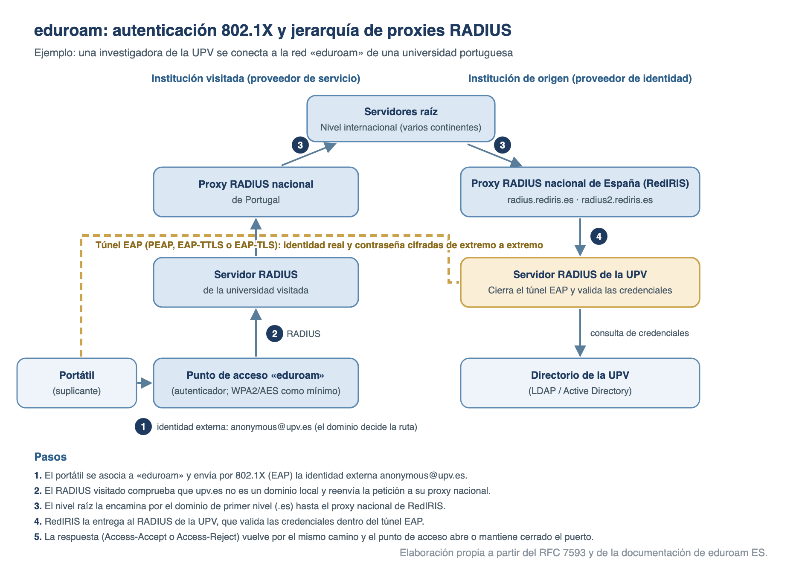

# RedIRIS e identidad digital federada

**RedIRIS** es la red académica y de investigación española: interconecta las universidades y los centros de investigación entre sí y con las redes académicas del resto del mundo, y les presta servicios TIC comunes de conectividad, seguridad e identidad. Sobre ella se apoyan los servicios de **identidad digital federada** del mundo académico: la federación **SIR2** y la interfederación **eduGAIN**, para acceder a servicios web con la cuenta institucional (*single sign-on*), y **eduroam**, para la itinerancia wifi. Los fundamentos de AAA, RADIUS, Kerberos, LDAP y 802.1X están en el tema [79](79-seguridad-en-las-comunicaciones.md), y la identificación ante las Administraciones (Cl@ve, eIDAS), en el [65](65-identificacion-y-firma-electronica.md).

## RedIRIS: la red académica y de investigación española

RedIRIS es la NREN (*National Research and Education Network*) de España, equivalente a las redes académicas nacionales del resto de Europa, con las que colabora en la asociación GÉANT. Su web la define como «la red académica y de investigación española que proporciona servicios avanzados de comunicaciones a la comunidad científica y universitaria nacional».

- **Origen (1988)**: el Plan Nacional de I+D puso en marcha el **programa horizontal especial IRIS** (Interconexión de los Recursos InformáticoS de las universidades y centros de investigación). Fue pionera en la introducción de Internet en España y gestionó el registro de dominios «.es» hasta el año **2000**.
- **Gestión**:
    - **Fundesco**, desde el inicio hasta finales de **1993**; a partir de **1991**, cerrada la etapa de promoción, el Programa IRIS se transforma en RedIRIS.
    - **CSIC** (Consejo Superior de Investigaciones Científicas), de enero de **1994** a **2003**.
    - **Red.es**, desde enero de **2004**, como departamento con autonomía e identidad propias de esta entidad pública empresarial, adscrita al **Ministerio para la Transformación Digital y de la Función Pública** a través de la **Secretaría de Estado de Digitalización e Inteligencia Artificial**.
- **Titularidad y financiación**: el **Ministerio de Ciencia, Innovación y Universidades (MICIU)** es desde **2008** el titular de RedIRIS: la financia, fija su estrategia y determina las condiciones de afiliación. Su presupuesto ordinario fue de **14,7 M€** en 2025.
- **ICTS**: es una **Infraestructura Científica y Técnica Singular**, incluida en el Mapa de ICTS del ministerio de ciencia junto a las grandes instalaciones a las que da conectividad (telescopios de Canarias, Barcelona Supercomputing Center, Estación Biológica de Doñana…).
- **Comunidad**: **más de 500 instituciones afiliadas**, sobre todo universidades y centros públicos de investigación, con más de **2 millones** de usuarios; a ellos se suman unos 3 millones de usuarios potenciales de centros de primaria y secundaria a través de las redes de centros escolares.
- **Misión** (Plan Estratégico 2025-2028): «Proporcionar excelente conectividad y otros servicios TIC a las instituciones educativas y de investigación españolas, en estrecha cooperación con esas instituciones y con las redes académicas y científicas autonómicas e internacionales, a fin de facilitar la colaboración entre ellas y su acceso a las e-infraestructuras, a escala nacional e internacional».
- **Plan Estratégico 2025-2028**, con tres objetivos:
    1. **Avanzar hacia la consolidación de la infraestructura**: renovar equipos, adquirir nuevos IRU de fibra y aumentar la redundancia.
    2. **Excelencia en la prestación de servicios seguros y fiables que aporten un valor añadido significativo**: ciberseguridad, resiliencia e innovación (IA, comunicaciones cuánticas, tiempo y frecuencia).
    3. **Adoptar un enfoque centrado en el usuario en la gestión del ciclo de vida de los servicios**: colaboración con las redes autonómicas, Crue, la RES, el CCN-CERT y los consorcios de ICTS, CRM e inteligencia de negocio.

La **afiliación** es el acto por el que una entidad entra en la comunidad RedIRIS y accede a sus servicios. Las condiciones las fija el MICIU, que puede revisarlas en cualquier momento.

- **Requisitos**: ser un organismo legalmente constituido con **personalidad jurídica propia**; participar en el Plan Estatal de Investigación Científica, Técnica y de Innovación (antes Plan Nacional de I+D+i) con actividad y personal investigador; y encajar su actividad principal en alguna de las categorías afiliables.
- **Categorías principales**: universidades públicas y privadas sin ánimo de lucro, con sus centros adscritos; organismos públicos de investigación (OPI) e ICTS con personalidad jurídica propia; centros e institutos tecnológicos y de investigación sin ánimo de lucro que participen en proyectos de I+D+i; y unidades docentes o de investigación de hospitales públicos y privados sin ánimo de lucro.
- **Otras entidades afiliables**: gestores de programas de I+D+i con financiación pública; instituciones sin ánimo de lucro con contenidos digitales relevantes para la comunidad científica; participantes en proyectos de I+D+i, durante el proyecto; parques científicos y tecnológicos, solo para uso de entidades afiliadas; centros educativos no universitarios, con acuerdo de la consejería autonómica competente; y otras entidades de especial interés.
- **Procedimiento**: formulario en la herramienta **ComunIRIS**; la Secretaría de RedIRIS lo revisa y lo remite al Comité para su valoración; si se admite, la entidad firma la **Ficha de Afiliación**, el **Acuerdo de Afiliación** y un **Acuerdo de Encargo de Tratamiento** (la afiliada es responsable del tratamiento y RedIRIS/Red.es, encargado en determinados servicios). Si en la comunidad autónoma existe una red académica, su gestor es el cauce preferente para tramitar la solicitud.
- **PER (Persona de Enlace con RedIRIS)**: cada institución afiliada designa al menos una. Es el intermediario entre los usuarios de su institución y RedIRIS, recibe los avisos de la lista **IRIS-PERS** y mantiene al día los contactos técnicos de cada servicio.

## La red: RedIRIS-NOVA, redes autonómicas y GÉANT

La red de RedIRIS ha pasado de enlaces alquilados de kilobits a una troncal propia de fibra oscura. El salto clave fue **RedIRIS-NOVA** (**2011**): en lugar de alquilar capacidad, RedIRIS adquiere **derechos irrevocables de uso (IRU)** de fibra de larga duración (unos 15-20 años) e ilumina en ella los canales que necesita.

| Etapa | Año | Características |
| --- | --- | --- |
| Programa IRIS (Fundesco) | 1988 | Conexión a la red europea EuropaNet (con centro en Berna) a **64 kbps**; nodos en Barcelona, Sevilla y Madrid |
| RedIRIS (CSIC) | 1994 | Conexión a EuropaNet ampliada a **2 Mbps** |
| RedIRIS-2 | 2002 | Troncal mallada con núcleo de **2,5 Gbps**, conectada directamente a ESPANIX |
| RedIRIS-10 | 2006 | Troncal híbrida a **10 Gbps**, con **19 puntos de presencia** |
| RedIRIS-NOVA | 2011 | Fibra oscura en IRU; circuitos de hasta **100 Gbps** |

- **RedIRIS-NOVA hoy**: unos **16.000 km** de fibra óptica terrestre y submarina (según la presentación corporativa de 2026; la portada de la web da 15.000) y **más de 70 puntos de presencia**, con circuitos de hasta **100 Gbps**, canales ópticos dedicados para proyectos de investigación y conexión de las ICTS.
- **Principios de diseño**: **sobreaprovisionamiento** de los enlaces troncales, para un retardo y un *jitter* mínimos y una pérdida de paquetes del 0 %, y **resiliencia por diseño**: cada ubicación se alcanza por al menos dos circuitos diversificados (anillos).
- **Objetivos de la red**: conectar entre sí las redes regionales de todas las comunidades autónomas, y a todas ellas con las redes académicas internacionales, en especial la portuguesa (FCCN), la francesa (RENATER) y GÉANT; y ayudar a las comunidades a construir sus redes académicas regionales.
- **Redes académicas autonómicas**: RedIRIS conecta a las instituciones con la colaboración de las redes regionales, aunque no todas las comunidades tienen una. Entre ellas están la **Anella Científica** (Cataluña), **i2BASQUE** (País Vasco), **RECETGA** (Galicia), **RedCAYLE** (Castilla y León), **REDIMadrid**, **RCT** (Extremadura), **CTNET** (Región de Murcia), **RICA** (Andalucía) y la red autonómica canaria.
- **Jerarquía**: red del campus → red autonómica (si existe) → RedIRIS → GÉANT → redes académicas de otras regiones del mundo, de modo que se controla la comunicación «de extremo a extremo».
- **Conexiones externas**: la intranet académica mundial a través de **GÉANT**; los puntos neutros de intercambio **ESPANIX** (Madrid) y **CATNIX** (Barcelona) y el portugués **GigaPIX**; y contratos de tránsito IP para el resto de Internet.
- **GÉANT**:
    - **Qué es**: la red académica paneuropea, que interconecta las NREN europeas entre sí y con las del resto del mundo. La construye y opera la **Asociación GÉANT** (la antigua TERENA, que en **2015** adoptó ese nombre y absorbió a DANTE); RedIRIS la codirige y cofinancia.
    - **Proyecto GN5-2**: fase actual del proyecto GÉANT, financiada por Horizonte Europa, del **1 de enero de 2025 al 30 de junio de 2027**, con **38 socios**: las NREN europeas, Red.es entre ellas, y la propia asociación.
    - **Alcance**: junto con las NREN conecta a unos **50 millones de usuarios** de más de **10.000 instituciones**, y enlaza con Internet2 y ESnet (EE. UU.), CANARIE (Canadá), RedCLARA (América Latina), TEIN (Asia-Pacífico), UbuntuNet, SINET o CERNET. La capacidad transatlántica con Norteamérica alcanza **2,4 Tbps** combinados en circuitos de **400 Gbps** (GÉANT, Internet2, CANARIE y ESnet).
    - **Servicios federados**: coordina eduroam y eduGAIN y negocia acuerdos colectivos para las NREN, como los certificados TCS o la nube OCRE.
- **Casos de uso**: el Tier-1 español del acelerador LHC del CERN, el **PIC** (Port d'Informació Científica), se conecta a **100 Gbps** con las redes privadas LHCOPN y LHCONE; la **Red Española de Supercomputación** (**14** nodos) se interconecta a través de RedIRIS, y el BSC dispone de enlaces de 2 × 200 Gbps (tema [51](51-computacion-en-la-nube-y-altas-prestaciones.md)).
- **UNI-DIGITAL**: el programa de modernización y digitalización del sistema universitario (Plan de Recuperación, componente 21, inversión I5) financia en RedIRIS unos **34 M€** de infraestructuras digitales (fibra a nuevos centros, renovación de las conexiones submarinas con Baleares, equipos a 100 Gbps para siete redes autonómicas) y unos **24,6 M€** de servicios TIC compartidos.

## Catálogo de servicios de RedIRIS

RedIRIS presta a sus instituciones afiliadas servicios TIC comunes que a cada centro le saldría más caro y menos robusto contratar por separado. El catálogo oficial los agrupa así:

| Categoría | Servicios |
| --- | --- |
| Conectividad | Direccionamiento IP (IPv4 e IPv6); **DNS** (alojamiento de zonas y servidores secundarios *anycast*); conectividad IP; circuitos virtuales (VPN de nivel 2 y ópticos); **IRIS-SARA**; gestión de incidencias de red (**IRIS-NOC**); sincronización horaria NTP desde `hora.rediris.es` (con GPS y los patrones del Real Observatorio de la Armada) |
| Seguridad | Gestión de incidentes (**IRIS-CERT**); mitigación de ataques **DDoS**; filtrado antispam y antivirus del correo (**Lavadora**); simulación de *phishing* (**SIMULPHISHING**); **DNS Firewall**; ciberinteligencia compartida (**SinMalos**) |
| Identidad digital | Federación de identidades (**SIR2** y **eduGAIN**); certificados digitales (**TCS**); IdP en la nube (**IdPnube**) |
| Colaboración | Listas de distribución y **AutoList**; envío de ficheros grandes (**FileSender**) |
| Cloud | Acuerdos GÉANT-**OCRE** |
| Movilidad | **eduroam.es** |
| Soporte técnico | Apoyo a la e-administración (NISUE, Cl@ve-SIR, FIRe y @firma federado, tema [108](108-administracion-electronica-universitaria.md)); monitorización (**Avizor**, **Centinela**); asesoramiento |
| Transferencia de datos | Transferencia masiva de datos para e-ciencia (Aspera) |

- **IRIS-SARA**: da acceso a la **Red SARA**, que gestiona la Agencia Estatal de Administración Digital (AEAD, antes SGAD; tema [63](63-infraestructuras-y-servicios-comunes-de-interoperabilidad.md)), a través de la propia red de RedIRIS, sin contratar una línea específica. Lo desarrollaron RedIRIS y la sectorial de Digitalización de Crue, y no lo presta ninguna otra NREN.
- **IRIS-CERT**: coordina la respuesta a los incidentes que afectan a las redes de las afiliadas, hace labor preventiva (escaneo de vulnerabilidades) y se coordina con el **CCN-CERT**, integrándose en su **Red Nacional de SOC** para aportar y recibir ciberinteligencia.
- **Mitigación DDoS**: centro de soporte **24/7** y capacidad para actuar con tráficos de varios cientos de Gbps.
- **Lavadora**: el correo de la institución atraviesa un filtro antispam y antivirus antes de entregársele «limpio»; elimina más del **90 %** del spam.
- **DNS Firewall**: bloquea o redirige el acceso de los usuarios a dominios maliciosos; usa la plataforma Cisco Umbrella, con arquitectura *anycast*, y se financió con UNI-DIGITAL.
- **SinMalos**: ciberinteligencia comunitaria: las instituciones productoras aportan indicadores y las consumidoras los cargan en cortafuegos, servidores de correo o SIEM; sus listas se comparten con la Red Nacional de SOC.
- **TCS (Trusted Certificate Service)**: desde **2006**, certificados gratuitos de servidor (también multidominio y comodín), personales y de e-ciencia, gracias a acuerdos colectivos de GÉANT. Desde **enero de 2025** presta su quinta generación (**TCS-g5**) **HARICA**, autoridad de certificación académica griega, tras rescindir su contrato el proveedor anterior.
- **FileSender**: envío web de ficheros de hasta **100 GB**, a un máximo de **100** destinatarios y con una caducidad de hasta **90 días**.
- **OCRE**: acuerdo marco de servicios en la nube (IaaS, PaaS y SaaS) licitado por GÉANT conforme a la Directiva 2014/24/UE. **OCRE 2024** está en vigor desde el **3 de febrero de 2025**, por cinco años, y permite contratar sin licitación propia.
- **Servicios TIC compartidos de UNI-DIGITAL**, pedidos por las universidades a través de la sectorial Crue Digitalización: EDR centralizado para las universidades; la red blockchain **BLUE** (Blockchain de Universidades Españolas, compatible con EBSI), para aplicaciones como los diplomas; el expediente académico canónico **ECASUE** y el archivo único universitario (tema [108](108-administracion-electronica-universitaria.md)); licencias para la docencia híbrida (tema [107](107-e-learning-plataformas-y-estandares.md)); y **PLATICA**, plataforma de impulso a la ciencia abierta.
- **Comunidad**: Jornadas Técnicas anuales (la XXXIV edición, en junio de 2026, en la Universidade da Coruña), Foro de Ciberseguridad (cada año desde **2003**), grupos de trabajo y e-Boletín.

## Identidad digital federada y single sign-on

El inicio de sesión único (*single sign-on*, SSO) permite que una sola autenticación dé acceso a muchas aplicaciones. Dentro de una organización basta un servidor de autenticación central; entre organizaciones hace falta una **federación de identidad**: un conjunto de proveedores que confían entre sí bajo reglas comunes, de modo que el usuario se autentica siempre en su institución de origen y cada servicio recibe de ella solo los datos que necesita.

- **Proveedor de identidad (IdP)**: la institución de origen. Autentica a sus usuarios contra su directorio (LDAP, Active Directory) y emite **aserciones** con su identidad y sus **atributos** (afiliación, correo, identificadores).
- **Proveedor de servicio (SP)**: la aplicación o el recurso. Delega la autenticación en el IdP y decide el acceso según los atributos recibidos.
- **Metadatos**: documentos que describen cada entidad (identificador, *endpoints* y certificados). El operador de la federación los agrega y **firma**: la confianza técnica entre IdP y SP se basa en la publicación de metadatos.
- **Servicio de descubrimiento (WAYF, *Where Are You From*)**: página en la que el usuario elige su institución de origen.
- **Liberación de atributos y consentimiento**: a cada SP solo se le entregan los atributos autorizados para él, y el usuario puede ver qué se envía y consentirlo (minimización de datos, tema [53](53-proteccion-de-datos-personales.md)).
- **Ventajas**: una sola credencial; la contraseña nunca llega al servicio; las altas y bajas se gestionan en origen; los SP se ahorran la gestión de cuentas.
- **Riesgos**: la cuenta única es un objetivo valioso, por lo que se protege con **autenticación multifactor** (en el ámbito académico, perfil REFEDS MFA), y el cierre de sesión simultáneo en todos los servicios (*single logout*) es difícil de garantizar.

### SAML 2.0

**SAML 2.0** (*Security Assertion Markup Language*) es el estándar de **OASIS**, aprobado en **marzo de 2005**, para intercambiar en XML información de autenticación y atributos entre dominios de seguridad. Es el protocolo de las federaciones académicas y de muchos servicios públicos (Cl@ve, tema [65](65-identificacion-y-firma-electronica.md)).

- **Piezas de la especificación**:
    - **Aserciones**: declaraciones firmadas por el IdP sobre un sujeto: de autenticación (cuándo y cómo se autenticó), de atributos y de decisión de autorización.
    - **Protocolos**: mensajes de petición y respuesta, como la petición de autenticación (`AuthnRequest`) o el cierre de sesión único (*Single Logout*).
    - **Enlaces (*bindings*)**: cómo viajan los mensajes sobre HTTP o SOAP: **HTTP-Redirect** (en la URL), **HTTP-POST** (formulario que el navegador reenvía solo) y **HTTP-Artifact** (viaja una referencia que el receptor resuelve por un canal directo).
    - **Perfiles**: combinaciones para un caso de uso; el principal es el **Web Browser SSO**.
- **Flujo iniciado por el SP** (el habitual):
    1. El usuario accede al SP sin sesión abierta.
    2. El SP le pregunta su institución (WAYF) y le redirige al IdP con un `AuthnRequest` (HTTP-Redirect).
    3. El IdP le autentica (contraseña, MFA). Si el usuario ya tenía sesión abierta con el IdP, no se le vuelven a pedir credenciales: ahí está el SSO.
    4. El IdP devuelve a través del navegador (HTTP-POST) una respuesta con la **aserción firmada** al servicio consumidor de aserciones (ACS) del SP.
    5. El SP valida la firma con el certificado del IdP publicado en los metadatos, comprueba el destinatario y la validez temporal, lee el identificador y los atributos y abre la sesión.

Aserción SAML (simplificada) que emite el IdP de una universidad para un recurso bibliográfico:

```xml
<saml:Assertion xmlns:saml="urn:oasis:names:tc:SAML:2.0:assertion"
    Version="2.0" ID="_7f3a9c" IssueInstant="2026-10-04T09:15:00Z">
  <saml:Issuer>https://idp.universidad.es/idp</saml:Issuer>
  <ds:Signature xmlns:ds="http://www.w3.org/2000/09/xmldsig#">...</ds:Signature>
  <saml:Subject>
    <saml:NameID Format="urn:oasis:names:tc:SAML:2.0:nameid-format:persistent">a8c2e1...</saml:NameID>
  </saml:Subject>
  <saml:Conditions NotOnOrAfter="2026-10-04T09:20:00Z">
    <saml:AudienceRestriction>
      <saml:Audience>https://revista.ejemplo.org/sp</saml:Audience>
    </saml:AudienceRestriction>
  </saml:Conditions>
  <saml:AttributeStatement>
    <saml:Attribute FriendlyName="eduPersonScopedAffiliation">
      <saml:AttributeValue>student@universidad.es</saml:AttributeValue>
    </saml:Attribute>
  </saml:AttributeStatement>
</saml:Assertion>
```

- **Lectura**: `Issuer` identifica al IdP y `Signature` garantiza el origen y la integridad; el `NameID` persistente es opaco, de modo que el SP no conoce la identidad real; `Conditions` limita la validez a cinco minutos y a un único destinatario (`Audience`), lo que impide reutilizar la aserción en otro servicio; la afiliación con ámbito (`student@universidad.es`) basta para dar acceso a la revista sin revelar quién es el usuario.

### OpenID Connect

**OpenID Connect (OIDC)** es una capa de identidad sobre **OAuth 2.0** (RFC 6749, 2012). OAuth resuelve la autorización delegada y OIDC añade la autenticación mediante un **ID token**, un **JWT** (RFC 7519) firmado por el proveedor (OP, *OpenID Provider*). Trabaja con JSON y REST, por lo que encaja mejor que SAML en aplicaciones móviles y de página única. **OpenID Connect Core 1.0** (2014) está publicado como norma internacional **ISO/IEC 26131:2024**.

- **Flujo *authorization code* con PKCE** (el recomendado):
    1. La aplicación redirige al usuario al *endpoint* de autorización del OP con `response_type=code`, `scope=openid` (más `email`, `profile`…), su `client_id`, la `redirect_uri`, `state`, `nonce` y un `code_challenge` (PKCE, RFC 7636).
    2. El usuario se autentica en el OP y da su consentimiento.
    3. El OP devuelve a la `redirect_uri` un **código** de un solo uso.
    4. La aplicación canjea el código en el *endpoint* de *token*, presentando el `code_verifier`, y recibe el **ID token** y un *access token*.
    5. La aplicación valida la firma con las claves públicas del OP (JWKS) y las *claims* `iss`, `aud`, `exp` y `nonce`.
- **Descubrimiento**: el OP publica su configuración (*endpoints*, claves y *scopes* admitidos) en `/.well-known/openid-configuration`.

Contenido (*payload*) de un ID token una vez decodificado:

```json
{
  "iss": "https://idp.universidad.es",
  "sub": "248289761001",
  "aud": "app-notas",
  "iat": 1791105300,
  "exp": 1791105600,
  "nonce": "n-0S6_WzA2Mj",
  "email": "ana.garcia@universidad.es"
}
```

- **Lectura**: `sub` identifica al usuario dentro del OP; `aud` debe coincidir con el `client_id` de la aplicación; `exp` es la caducidad en segundos desde 1970 (aquí, cinco minutos después de `iat`); `nonce` liga el token a la petición e impide reutilizarlo. El JWT completo son tres partes en Base64URL separadas por puntos: cabecera (`alg`, `kid`), contenido y firma.

### CAS y otros mecanismos

- **CAS (*Central Authentication Service*)**: protocolo de SSO web nacido en la **Universidad de Yale** y muy extendido en universidades. Lo mantiene la **Fundación Apereo**, nacida en **diciembre de 2012** de la fusión de Jasig y la Sakai Foundation. Funciona con *tickets*: tras autenticarse, el usuario obtiene un **TGT** (*ticket-granting ticket*, asociado a una *cookie* del servidor CAS), y cada aplicación recibe un **service ticket** de un solo uso, que valida directamente contra el servidor (`/serviceValidate`); la versión **3.0** del protocolo (**2013**) devuelve también atributos. El servidor Apereo CAS admite además SAML y OpenID Connect.
- **Kerberos y SPNEGO**: SSO en la intranet de un dominio Windows: el navegador presenta el *ticket* Kerberos obtenido al iniciar sesión en el puesto (temas [48](48-administracion-de-sistemas-windows-y-directorio-activo.md) y [79](79-seguridad-en-las-comunicaciones.md)).
- **Productos habituales**: **Shibboleth** (IdP y SP SAML de código abierto, iniciativa de Internet2), **SimpleSAMLphp**, **Keycloak** (gestión de identidades de código abierto, en la CNCF desde 2023), el servidor **Apereo CAS** y, en entornos Microsoft, **Entra ID** y ADFS.

| | SAML 2.0 | OpenID Connect | CAS |
| --- | --- | --- | --- |
| Origen | OASIS, 2005 | OpenID Foundation, 2014 (ISO/IEC 26131:2024) | Universidad de Yale; Fundación Apereo |
| Formato | XML (aserciones firmadas) | JSON (ID token JWT) | *Tickets* opacos; respuesta de validación XML o JSON |
| Transporte | Redirecciones y formularios del navegador | Redirecciones y llamadas REST | Redirecciones y validación de servidor a servidor |
| Uso típico | Federaciones académicas, administraciones, SSO corporativo | Aplicaciones web modernas, móviles y API | SSO web dentro de una institución |
| En SIR2 | Perfil principal (SAML2int) | Admitido | Admitido como software de IdP |

## SIR2 y eduGAIN

El **Servicio de Federación de Identidades de RedIRIS** opera la federación académica española. Su primera generación, **SIR**, fue según RedIRIS la primera federación académica de Europa junto a la primera generación de la holandesa, y heredó **PAPI**, el sistema propio de RedIRIS de control de acceso a recursos restringidos. Hoy funciona **SIR2**, «la federación de identidad digital de segunda generación ofrecida por el Servicio de Federación de Identidades de RedIRIS».

- **Arquitectura *hub & spoke***: los IdP y los SP no se conectan entre sí, sino con un **hub** central por el que pasan todas las peticiones. Sus componentes:
    - **Servicio de descubrimiento centralizado (WAYF)**.
    - **Motor de políticas de liberación de atributos**: decide qué atributos se entregan a cada SP.
    - **Módulo de consentimiento**: muestra al usuario los atributos y valores que se van a enviar y le permite aceptar o denegar la cesión.
    - **Pasarelas**: traducen entre protocolos de forma transparente al usuario.
    - **Gestor de metadatos**: con él el operador modela las relaciones de confianza.
- **Protocolos**: **SAML2** (perfil **SAML2int**), **OpenID** y **OpenID Connect**, más **PAPI** como protocolo heredado. El perfil más usado es el de **SSO web**, y la confianza entre los actores se basa en la publicación de metadatos.
- **Quién participa**:
    - **IdP**: solo instituciones **afiliadas a RedIRIS**; los centros asociados, con la aprobación de la afiliada a través de la que se conectan. Las «organizaciones virtuales» no se contemplan por ahora.
    - **SP**: no necesitan estar afiliados. Pueden ser SP de SIR2 (un servicio para varias instituciones), SP de eduGAIN, SP externalizado (conectado solo a uno o varios IdP concretos) o **SP Cl@ve**, que identifica a ciudadanos españoles (**Cl@ve**) o europeos (**eIDAS**) a través de la pasarela de RedIRIS.
    - **Subfederaciones**: grupos de IdP con un conjunto de SP, creados a petición de los IdP.
- **Adhesión de un IdP** (perfil SSO web):
    1. Contactar con RedIRIS y elegir el software del IdP: **SimpleSAMLphp** (el «IdP de referencia» que documenta RedIRIS), adAS, Apereo CAS, Shibboleth IdP, o bien Google Workspace, ADFS o Entra ID a través de una pasarela del servicio.
    2. Configurar los metadatos del hub, los certificados y el mapeo de los atributos locales a los de la federación.
    3. Intercambiar metadatos con el operador: clave pública, URL de autenticación y de cierre de sesión, nombre y logotipo.
    4. Superar la prueba de conexión en el entorno de pruebas.
    5. Firmar el documento de aceptación de las condiciones de uso, que incluye la solicitud de participación en eduGAIN; RedIRIS da de alta el IdP en producción.
- **IdPnube**: IdP alojado por RedIRIS para instituciones con poco personal técnico. Puede conectarse a repositorios de identidad remotos y actuar también como IdP de eduroam, instalando las credenciales con las aplicaciones de geteduroam.
- **CASIR (Comité Asesor de SIR)**: asesora a RedIRIS en la evolución tecnológica de la federación; lo forman, además del nivel 2 de operación, el CSUC, el Servicio de Bibliotecas del CSIC y las universidades de Córdoba, Málaga, Murcia, Jaume I y Salamanca.
- **Ojo**: el SIR de RedIRIS no tiene nada que ver con el **SIR (Sistema de Interconexión de Registros)** de las Administraciones (tema [63](63-infraestructuras-y-servicios-comunes-de-interoperabilidad.md)).

Atributos que SIR2 recomienda emitir a los IdP, pensados para que puedan entrar con garantías en eduGAIN:

| Atributo | Esquema | Contenido | Carácter |
| --- | --- | --- | --- |
| eduPersonTargetedID | eduPerson | Identificador persistente, no reasignado y que preserva la privacidad, compartido solo por cada par IdP-SP | **Requerido** |
| eduPersonPrincipalName | eduPerson | Identificador único y persistente del usuario | Recomendado |
| eduPersonAffiliation y eduPersonScopedAffiliation | eduPerson | Relación con la organización (estudiante, personal docente, investigador, de administración y servicios…); la segunda, con el dominio (`staff@universidad.es`) | Recomendado |
| eduPersonEntitlement | eduPerson | URI con derechos sobre recursos concretos | Recomendado |
| eduPersonAssurance | eduPerson | Garantías sobre el sujeto: unicidad del identificador, verificación de la identidad al darle de alta, frescura de la afiliación | Recomendado |
| eduPersonOrcid | eduPerson | Identificador individual de investigador (ORCID) | Recomendado |
| schacHomeOrganization | SCHAC | Organización de origen, expresada con su dominio | Recomendado |
| schacPersonalUniqueCode | SCHAC | Código único del sujeto (URN `urn:schac:personalUniqueCode:es:rediris:sir:mbid:...`) | Recomendado |
| mail, displayName, givenName, sn, uid | inetOrgPerson, person | Correo, nombre y apellidos, identificador corto en la organización | Recomendado |

**eduGAIN** es la **interfederación** internacional, operada por **GÉANT**, que interconecta las federaciones académicas nacionales: cada federación publica en eduGAIN los metadatos de sus entidades y consume los de las demás a través del servicio de agregación de metadatos (MDS).

- **Tamaño**: **84 federaciones** participantes y 8 candidatas a 3 de octubre de 2026, con unos 6.600 IdP y 4.100 SP; la federación española aporta **219 entidades** (181 IdP y 38 SP).
- **SIR2 en eduGAIN**: al ser *hub & spoke*, publica sus *endpoints* en el hub, que filtra los atributos hacia los SP importados de eduGAIN, y genera dos conjuntos de metadatos: las entidades que publica hacia eduGAIN y los SP que incorpora desde ella.
    - Los IdP de SIR2 participan **por defecto**, salvo renuncia expresa al validar las condiciones de uso, y deben usar el perfil **SAML2int**.
    - Los SP que quieran participar deben implementar SAML2int, consumir los metadatos de los IdP de eduGAIN (todos o una parte), delimitar los atributos que necesitan y publicar sus datos de contacto.
- **Marcos de confianza**:
    - **SIRTFI**: marco de seguridad para coordinar incidentes entre organizaciones federadas. En SIR2 se aplica a los IdP que están en eduGAIN como opción por defecto que se puede rechazar (*opt-out*, versión 1.0) y a los SP que lo soliciten (*opt-in*).
    - **REFEDS Assurance Framework**: expresa mediante eduPersonAssurance el grado de confianza en la identidad; lo exigen recursos como los de MyAccessID.
    - **REFEDS MFA**: perfil para indicar que la autenticación fue multifactor.
- **Servicios que se apoyan en eduGAIN**: **MyAccessID** (acceso a recursos de EuroHPC y EOSC), **MyAcademicID** (servicios de Erasmus+ como el acuerdo de aprendizaje en línea o la app Erasmus+, con el **identificador europeo del estudiante**, ESI; tema [108](108-administracion-electronica-universitaria.md)), **InAcademia** (acredita la condición de universitario ante ofertas comerciales) y **eduTEAMS** (gestión de grupos de colaboración).

## eduroam: movilidad wifi académica

**eduroam** (*education roaming*) es el servicio mundial de itinerancia wifi segura de la comunidad académica y de investigación: un miembro de cualquier institución participante se conecta a la red «eduroam» de cualquier otra con las credenciales de su institución de origen, sin pedir una cuenta en el centro que visita. Su lema es «abre tu portátil y estás conectado».

- **Origen**: la idea surge en **2002** en el grupo de movilidad de TERENA, a propuesta de Klaas Wierenga (SURFnet): combinar **IEEE 802.1X** con una infraestructura **RADIUS**. Tras un piloto en los Países Bajos, se adopta en **2003** con una primera prueba entre instituciones de Países Bajos, Finlandia, Portugal, Croacia y Reino Unido; España estuvo entre los primeros países en unirse.
- **Alcance**: disponible en **106 territorios**. En España lo opera **RedIRIS** (**eduroam ES**), con **181 organizaciones** participantes.
- **Gobernanza**: coordinación mundial en el marco de **GÉANT**; cada NREN opera la federación de su país y fija la política nacional.
- **Cómo funciona** (RFC 7593):
    - **802.1X**: el dispositivo (**suplicante**) pide acceso al punto de acceso (**autenticador**), que mantiene el puerto cerrado y traslada la autenticación a su servidor **RADIUS**.
    - **EAP**: el método de autenticación (**PEAP**, **EAP-TTLS** con PAP o **EAP-TLS** con certificado) abre un **túnel TLS** de extremo a extremo entre el dispositivo y el RADIUS de la institución de origen: la contraseña viaja cifrada y la institución visitada **nunca la ve**.
    - **Identidad externa e interna**: el dispositivo anuncia una identidad externa anónima con el **dominio (*realm*) obligatorio**, del tipo `anonymous@upv.es`, que solo sirve para encaminar la petición; la identidad real va dentro del túnel.
    - **Jerarquía de proxies RADIUS**: institucional → **nacional** → **raíz**, inspirada en la jerarquía DNS. Cada servidor mira el dominio: si no es suyo, reenvía la petición hacia arriba, y el nivel raíz la baja hasta el país del dominio. En España, los proxies nacionales son `radius.rediris.es` y `radius2.rediris.es`; el nivel raíz está distribuido en varios continentes. La evolución hacia **RADIUS sobre TLS** (RFC 6614) protege los enlaces entre servidores.
- **Ejemplo**: una investigadora de la UPV visita una universidad portuguesa.
    1. Su portátil se asocia a «eduroam» y envía la identidad externa `anonymous@upv.es`.
    2. El RADIUS de la universidad portuguesa comprueba que `upv.es` no es un dominio local y reenvía la petición a su proxy nacional.
    3. El proxy portugués la pasa al nivel raíz, que la encamina por el dominio de primer nivel (`.es`) al proxy nacional de RedIRIS.
    4. RedIRIS la entrega al RADIUS de la UPV, que valida las credenciales dentro del túnel EAP.
    5. La respuesta (Access-Accept o Access-Reject) recorre el camino inverso y el punto de acceso abre o mantiene cerrado el puerto.

{width=100%}

- **Roles**:
    - **Proveedor de servicio (SP)**: la organización que emite la señal «eduroam». Prácticamente cualquier organismo puede serlo, también no académico; se registra en el RADIUS nacional y comunica a RedIRIS sus localizaciones.
    - **Proveedor de identidad (IdP)**: la organización que mantiene las cuentas. En el dominio español solo pueden serlo las organizaciones **afiliadas a RedIRIS**, que además deben actuar como SP.
- **Requisitos de eduroam ES** (política **2.0.1**):
    - Cifrado mínimo **WPA2/AES** en todas las localizaciones (obligatorio desde la versión 2.0 de la política).
    - Prohibido usar la identidad eduroam en portales cautivos o aplicaciones web.
    - Un servidor RADIUS (o un controlador o punto de acceso) con dirección IPv4 pública fija que envíe las peticiones no locales al puerto **1812/UDP** de los proxies nacionales.
    - Pruebas con un usuario del dominio `@test.rediris.es`; en los IdP, usuarios de prueba y de monitorización; contactos técnicos en la lista **MovIRIS**; página web con la cobertura y el soporte local.
    - Herramientas: **eduroam CAT** (genera instaladores con la configuración segura de cada institución), **geteduroam** y **eduroam Managed IdP**, alternativa a mantener un IdP propio.
- **Seguridad del usuario**: el dispositivo debe **validar el certificado del servidor RADIUS** (autoridad de certificación y nombre del servidor); si no lo hace, un punto de acceso falso puede capturar las credenciales (ataque de intermediario). Las credenciales de eduroam nunca se introducen en un portal web.
- **Fuera del campus**: eduroam se ofrece también en transportes (participación en la iniciativa **OpenRoaming** a través de GÉANT), en hospitales (entre ellos la red de hospitales valencianos, a través de la Generalitat) y en espacios públicos de ciudades del País Vasco, Castilla-La Mancha o la Comunitat Valenciana.

## Fuentes {.unnumbered .unlisted}

- RedIRIS, web oficial (rediris.es): «Sobre RedIRIS», «Historia», «Afiliación», «PERs», «La Red», «RedIRIS-NOVA» (antecedentes y objetivos) y «Catálogo de servicios» (actualizado el 24 de septiembre de 2026), consultadas el 3 de octubre de 2026.
- RedIRIS, presentación corporativa (Madrid, junio de 2026) y Plan Estratégico 2025-2028; e-Boletín de RedIRIS núm. 18 (mayo de 2025: TCS-g5, licencias de docencia híbrida, OCRE 2024 y entrevista sobre identidad digital) y núm. 19 (noviembre de 2025).
- Servicio de Federación de Identidades de RedIRIS, web de SIR2 (rediris.es/sir2): componentes, atributos, requisitos, política, procedimientos para IdP y SP, eduGAIN, SIRTFI, marco de confianza REFEDS y CASIR, consultada el 3 de octubre de 2026.
- eduroam ES (eduroam.es): política de eduroam (versión 2.0.1), requisitos para instituciones académicas, preguntas frecuentes y listado de organizaciones, consultados el 3 de octubre de 2026.
- eduGAIN, estado de las federaciones miembro (technical.edugain.org), a 3 de octubre de 2026.
- K. Wierenga, S. Winter y T. Wolniewicz, RFC 7593, *The eduroam Architecture for Network Roaming* (septiembre de 2015); RFC 6614, *Transport Layer Security (TLS) Encryption for RADIUS* (2012).
- OASIS, *Security Assertion Markup Language (SAML) V2.0* (marzo de 2005); OpenID Connect Core 1.0 (ISO/IEC 26131:2024); RFC 6749 (OAuth 2.0, 2012), RFC 7519 (JWT, 2015) y RFC 7636 (PKCE, 2015); Apereo, CAS Protocol 3.0 (2013).
- Proyecto GÉANT GN5-2 (1 de enero de 2025 a 30 de junio de 2027), fichas del proyecto publicadas por las NREN socias, y datos generales de la red GÉANT.
