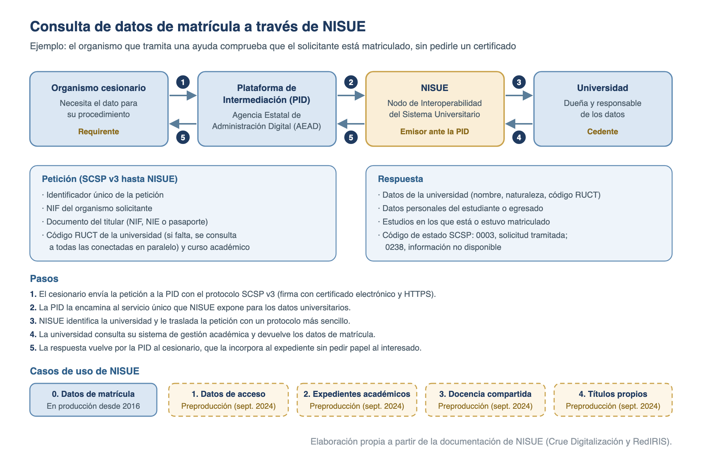

# Administración electrónica universitaria

Las universidades públicas forman parte del **sector público institucional**: según el art. 2.2.c) de las Leyes 39/2015 y 40/2015, «se regirán por su normativa específica y supletoriamente» por esas leyes, y la LOSU las dota de personalidad jurídica y autonomía (art. 3.1). Les alcanza, por tanto, el régimen común de administración electrónica (Leyes 39/2015 y 40/2015 y RD 203/2021, tema [54](54-administracion-electronica.md)), el ENI (tema [62](62-esquema-nacional-de-interoperabilidad.md)) y el ENS (temas [29](29-esquema-nacional-de-seguridad.md) y [105](105-adecuacion-al-ens-en-universidades-ccn-stic-881.md)). Este tema estudia lo propio de la universidad: la coordinación sectorial (Crue Digitalización), la sede electrónica y la firma en la UPV, el nodo de interoperabilidad **NISUE** y la gestión documental y el archivo universitarios.

## La digitalización del sistema universitario: Crue Digitalización y UNIVERSITIC

Las universidades coordinan su estrategia digital a través de la comisión sectorial de Crue Universidades Españolas, que mide la madurez digital del sistema con el informe UNIVERSITIC y canaliza proyectos y servicios compartidos (muchos de ellos prestados por RedIRIS, tema [106](106-rediris-e-identidad-federada.md)).

- **Crue Digitalización**: la **Comisión Sectorial de Digitalización** de Crue Universidades Españolas.
    - **Origen**: un grupo de trabajo creado a finales de **2003**; la comisión sectorial se creó formalmente en **2007** por acuerdo de la Asamblea General de Crue. Se llamó **Crue-TIC** hasta finales de **2022**.
    - **Misión**: «Asesorar y proponer a Crue Universidades Españolas cuantos temas se consideren oportunos en el ámbito de las tecnologías de la información y las comunicaciones para mejorar la calidad, la eficacia y la eficiencia de las universidades españolas»; estudiar las necesidades y aplicaciones de las TIC en la gestión, la docencia y la investigación; y fomentar la cooperación entre universidades.
    - **Presidencia**: desde **2025**, el rector de la **UPV**, José E. Capilla Romá; desde junio de 2026, la secretaría ejecutiva también recae en la UPV.
    - **Grupos de trabajo**: Acciones Formativas; **Administración Electrónica** (impulsor de NISUE); Análisis e Indicadores (UNIVERSITIC); Desarrollos colaborativos; Dirección de TI; Formación Online y Tecnologías Educativas (**FOLTE**, tema [107](107-e-learning-plataformas-y-estandares.md)); Inteligencia Artificial y Gobierno del Dato; y **Seguridad y Auditoría TI**, que es el Foro de Seguridad TIC del modelo de gobernanza de la CCN-STIC 881 (tema [105](105-adecuacion-al-ens-en-universidades-ccn-stic-881.md)).
    - **Convenio Crue-MINHAP**: convenio de administración electrónica con el entonces Ministerio de Hacienda y Administraciones Públicas, al que se han adherido decenas de universidades, entre ellas la UPV.
- **Informe UNIVERSITIC**: estudio de Crue Digitalización que mide con indicadores el estado de las TIC en las universidades españolas, como herramienta de autodiagnóstico, planificación estratégica y toma de decisiones. Se publica desde **2006**; la última edición es **UNIVERSITIC 2024** (publicada en 2025), la decimoquinta, que analiza la evolución de la madurez digital en **2020-2024** con datos de **59 universidades** (el 78 % de las de Crue, con el 81,4 % de su estudiantado y el 92 % de las públicas).
- **Modelo de madurez digital para universidades (md4u)**: base de las tres últimas ediciones (Llorens-Largo y otros, 2019). Tiene tres elementos: una cuadrícula de madurez, un marco de referencia (*framework*) y un catálogo de buenas prácticas.
    - **Cuadrícula**: cruza el valor que aporta una iniciativa (optimizar un proceso existente o crear uno nuevo) con su impacto (operacional o estratégico), y da cuatro áreas: **gestión**, **innovación**, **gobierno de las TI** y **transformación digital**.
    - **Marco**: **7 retos** estratégicos (extender la cultura y las competencias digitales; mantener la disponibilidad de los servicios y optimizar la seguridad de la información; obtener ventaja competitiva gracias a servicios de calidad; ofrecer formación de calidad y competitiva; satisfacer las demandas emergentes de los estudiantes; disponer de información precisa para decidir; y alcanzar los objetivos estratégicos), desplegados en **21 áreas** y **37 objetivos** con sus indicadores de buenas prácticas.
    - **Resultados 2024** (mediana de madurez): gestión **53 %**, innovación **46 %**, gobierno de las TI **43 %** y transformación digital **35 %**.
- **UNI-DIGITAL**: el programa de modernización y digitalización del sistema universitario (Plan de Recuperación, componente 21, inversión I5) ha financiado servicios de administración digital compartidos: el proyecto colaborativo **InterAE**, para mejorar la interoperabilidad de la administración electrónica universitaria (NISUE/SCSP, catálogo común de procedimientos, expediente y archivo); el expediente académico canónico **ECASUE**; el archivo único universitario; la red blockchain **BLUE** (Blockchain de Universidades Españolas, compatible con EBSI); y el proyecto **CertiDigital**, que genera credenciales verificables integradas con EBSI.
- **Anclajes en la LOSU** (tema [103](103-sistema-universitario-losu.md)): «Las universidades digitalizarán y harán accesibles de manera progresiva sus archivos y fondos bibliotecarios con el fin de democratizar el acceso al saber científico y cultural» (art. 21.4); y el estudiantado tiene derecho «Al acceso a formación para el desarrollo de las capacidades digitales, así como a recursos e infraestructuras digitales» y «A la seguridad de los medios digitales y a la garantía de los derechos fundamentales en Internet» (art. 33, letras l y m).

## Sede electrónica y servicios electrónicos: el caso UPV

La sede electrónica es la puerta oficial de la universidad en internet: según el art. 38.1 de la Ley 40/2015, «aquella dirección electrónica, disponible para los ciudadanos a través de redes de telecomunicaciones, cuya titularidad corresponde a una Administración Pública, o bien a una o varios organismos públicos o entidades de Derecho Público en el ejercicio de sus competencias». Su creación conlleva la responsabilidad del titular sobre la integridad, veracidad y actualización de lo que se publica, y se identifica con un certificado cualificado de autenticación de sitio web; el régimen detallado (creación, contenido y responsabilidad de las sedes) está en los arts. 9 a 12 del RD 203/2021 (tema [54](54-administracion-electronica.md)).

**Normativa de creación de la Sede Electrónica de la UPV: aprobada por el Consejo de Gobierno el 11 de marzo de 2010 y modificada el 23 de abril de 2020 (BOUPV núm. 133, de 30 de abril de 2020).**

- **Art. 1. Sede**: «Se crea la Sede Electrónica de la Universitat Politècnica de València, estando accesible en la siguiente dirección web <https://sede.upv.es>»; a través de ella se accede a **todos** los servicios de administración electrónica de la universidad.
- **Art. 2. Garantías**: comunicaciones seguras, sobre todo si hay datos personales; la UPV, como titular, vela por la veracidad, integridad y actualización de la información y los servicios.
- **Art. 4. Identificación**: los sistemas admitidos son los de la normativa de directrices de firma de la UPV (sección siguiente). El usuario responde de la custodia de sus credenciales.
- **Art. 6. Obligación de relacionarse electrónicamente** con la UPV y con sus fundaciones, instituciones u organismos dependientes, «al menos», de:
    - a) Las personas jurídicas.
    - b) Las entidades sin personalidad jurídica.
    - c) Quienes ejerzan una actividad profesional con colegiación obligatoria, en ejercicio de ella (incluidos notarios y registradores).
    - d) Los empleados y las empleadas de la UPV y de sus entidades dependientes, para los trámites que realicen por su condición de empleado público.
    - e) «El alumnado matriculado en cualquiera de las enseñanzas conducentes a la obtención de títulos de carácter oficial y validez en todo el territorio nacional».
    - f) «El alumnado matriculado en cualquiera de las actividades de formación no reglada de la Universitat Politècnica de València».
    - g) Las personas titulares de una concesión pública de la UPV.
    - h) Las personas físicas o jurídicas que mantengan una relación económica con la universidad.
    - i) Quienes representen a una persona interesada obligada a relacionarse electrónicamente.
- **No obligados (art. 6.2)**: las personas físicas no incluidas en la lista que no hayan elegido la vía electrónica y «El alumnado matriculado en los cursos de la Universidad Sénior».
- **Base legal de la obligación**: la Ley 39/2015 obliga en todo caso a los colectivos de su art. 14.2 y permite que, «Reglamentariamente», las Administraciones la extiendan a «ciertos colectivos de personas físicas» que tengan acceso a los medios electrónicos (art. 14.3). La UPV la extiende al estudiantado desde la reforma de 2020.
- **Art. 8. Información**: organización y competencias, cartas de servicios, direcciones de contacto, una dirección de correo para consultas, quejas y sugerencias, el **catálogo de procedimientos electrónicos** (con requisitos, formularios, fases tramitables en línea y plazos de resolución y notificación), el BOUPV y la información de transparencia.
- **Art. 9. Tablón de anuncios electrónico**: puede sustituir o complementar al tablón físico; se facilita su consulta en equipos habilitados en la universidad. «El Tablón de anuncios electrónico es público y por tanto no se requiere utilizar ninguna modalidad de identificación y autentificación electrónica para el acceso a sus contenidos».
- **Art. 10. BOUPV**: su publicación en la sede «tendrá carácter oficial y auténtico».
- **Art. 11. Registro electrónico**: se rige por su normativa específica.
- **Art. 13. Notificaciones**:
    - **Aviso** de puesta a disposición por correo electrónico.
    - **Comparecencia** en la sede de la UPV, la vía preferente, y complementariamente en **Notific@** a través de la Carpeta Ciudadana; se entiende practicada al acceder al contenido.
    - **Caducidad**: si la vía electrónica es obligatoria o se eligió, la notificación se entiende caducada «cuando hayan transcurrido **diez días naturales** desde la puesta a disposición de la notificación sin que se acceda a su contenido» (la Ley 39/2015, art. 43.2, dice que se entiende rechazada).
- **Art. 14. Estado de tramitación**: quien se relaciona electrónicamente puede consultar en la sede el estado de sus procedimientos.
- **Verificación y copias** (normativa de directrices de firma, arts. 9, 11 y 12):
    - Los documentos originales se guardan en el **repositorio institucional de documentos electrónicos**.
    - La copia auténtica se obtiene «a través de la utilidad eVerificador de la sede electrónica de la UPV mediante el Código Seguro de Verificación (CSV) asociado al mismo»; en papel, «la copia impresa incluirá el valor del CSV».
    - Si un documento tiene un defecto, se **convalida** (nuevo original subsanado, con nuevo CSV) o se **anula**. El original deja de ser accesible en el eVerificador, pero con su CSV se ve la causa y el estado de no vigencia y, si se convalidó, el CSV del documento que lo sustituye. El régimen general del CSV está en el tema [55](55-documento-y-expediente-electronico.md).

## Identidad digital y firma electrónica: la Clave de firma UPV

Cada Administración decide qué sistemas de firma admite a los interesados (art. 10.2 de la Ley 39/2015), cuáles usa en la actuación automatizada (sello electrónico o CSV, art. 42 de la Ley 40/2015) y cuáles usa su personal: «Cada Administración Pública determinará los sistemas de firma electrónica que debe utilizar su personal» (art. 43.2 de la Ley 40/2015; art. 22 del RD 203/2021). La UPV lo hace en su normativa de directrices de firma. El marco general (eIDAS, Cl@ve, @firma, FIRe) está en el tema [65](65-identificacion-y-firma-electronica.md).

**Normativa de aprobación de las directrices aplicables a la firma electrónica en el ámbito de las relaciones administrativas de la UPV: aprobada por el Consejo de Gobierno el 18 de julio de 2019 (BOUPV núm. 127, de 23 de julio de 2019).**

- **Art. 2. Sistemas admitidos a quien inicia o tramita un procedimiento**:
    - a) Firma cualificada y avanzada basada en certificados cualificados de prestadores de la Lista de confianza, incluidos los de persona jurídica y de entidad sin personalidad jurídica.
    - b) El sistema **Cl@ve**.
    - c) Para la comunidad universitaria: «En el caso de los miembros de la comunidad universitaria (empleados o empleadas y estudiantado) firma electrónica en base a clave concertada con la Universitat Politècnica de València u otros sistemas no criptográficos siempre que permitan acreditar la autenticidad de la expresión de voluntad y consentimiento de la persona».
    - d) Sello electrónico cualificado y avanzado de prestadores de la Lista de confianza.
- **Art. 3. Ámbito**: al menos, solicitudes, declaraciones responsables y comunicaciones, recursos, desistimientos y renuncias.
- **Art. 4. Actuación administrativa automatizada** (sin intervención directa de un empleado público):
    - a) **Sello electrónico de la UPV**, basado en certificado cualificado.
    - b) **Sello de órgano con custodio**: igual, pero con una persona física que actúa como custodio del sello.
    - Los sellos se crean por resolución de la **Secretaría General** que se publica en la sede.
- **Art. 5. Firma del personal** en actuaciones no automatizadas:
    - a) Certificado electrónico cualificado. El de **empleado público** de la UPV lo emite la **FNMT-RCM**, con la que la universidad ha formalizado un encargo; se solicita en línea y la identidad se acredita en persona en la **Oficina de Registro**, donde se firma el contrato de uso.
    - b) **Clave de firma UPV**: firma «en base a clave concertada con la Universitat Politècnica de València u otros sistemas no criptográficos siempre que permitan acreditar la autenticidad de la expresión de voluntad y consentimiento del empleado público o empleada pública».
    - c) **Clave de firma UPV refrendada con sello de órgano** de la UPV.
- **Qué es la Clave de firma UPV**: según el Área de Sistemas de Información y las Comunicaciones (ASIC), «La Clave de Firma UPV es una segunda clave, adicional a la contraseña UPV, que se requiere para firmar en algunas aplicaciones». El personal la usa para actas y diligencias de notas, partes de dedicación a proyectos, documentos de prácticas en empresa o la gestión de TFG y TFM, entre otros. No es un certificado: es un sistema de firma no criptográfico basado en una clave concertada. Desde **febrero de 2026** la app **MiUPV** permite firmar o rechazar en bloque las solicitudes de firma (de momento, los partes de dedicación a proyectos).
- **Art. 6. Qué firma lleva cada documento**:

| Tipo de documento | Sistema de firma |
| --- | --- |
| Decisorios (resolución, contrato, acuerdo, convenio, declaración y similares) | Certificado cualificado del personal (art. 5.a) |
| De transmisión (notificaciones, acuses de recibo y otras comunicaciones) | Cualquiera de los de los arts. 4 y 5 |
| Certificados generados por actuación automatizada consultando las bases de datos institucionales | **Sello de órgano con custodio** (art. 4.b) |
| Justificantes generados por actuación automatizada | Sello electrónico (art. 4.a) |
| Otros certificados y justificantes; actas de órganos colegiados; informes | Cualquiera de los del art. 5 |
| Actas y diligencias de asignaturas | **Clave de firma UPV refrendada con sello de órgano** (art. 5.c) |
| Facturas emitidas | Sello de órgano (art. 4) |
| Otros documentos internos | Los que fije cada procedimiento entre los del art. 5 |

- **Art. 7. Validaciones**: los vistos buenos, visados o conformidades internos «no precisarán firma electrónica»; el sistema guarda en los metadatos quién valida y cuándo.
- **Art. 8. Sello de tiempo**: los documentos firmados con certificado llevan sello de tiempo de una entidad de confianza autorizada.
- **Servicios comunes que usan las universidades**:
    - **Cl@ve e identidades europeas**: los servicios universitarios pueden identificar a ciudadanos con Cl@ve, y a europeos a través del nodo **eIDAS**, mediante la pasarela que ofrece RedIRIS en su federación SIR2 (Cl@ve-SIR). En el proyecto europeo de integración con el nodo eIDAS participaron, por Crue, las universidades de Córdoba, Jaume I y Murcia.
    - **FIRe** y **@firma**: RedIRIS da soporte a FIRe y ofrece a sus afiliadas una plataforma @firma federada adicional para validar firmas.

## Interoperabilidad universitaria: NISUE

NISUE (Nodo de Interoperabilidad del Sistema Universitario Español) es, según Crue, el «punto único para el intercambio de información universitaria tanto entre las propias universidades como entre estas y otros organismos o instituciones». Hace efectivo para los datos académicos el derecho a no aportar documentos que ya obran en poder de la Administración: en lugar de pedir un certificado de matrícula, el organismo lo consulta por medios electrónicos. El marco general (ENI, NTI de protocolos de intermediación, PID y SCSP) está en los temas [62](62-esquema-nacional-de-interoperabilidad.md) y [63](63-infraestructuras-y-servicios-comunes-de-interoperabilidad.md).

- **Origen**: proyecto del grupo de trabajo de Administración Electrónica de Crue-TIC, iniciado en **2014**. Tras una consultoría para elegir el bus de servicios (ESB) se optó por **Oracle Service Bus**, y en 2015 se lanzó el piloto de cesión de datos de matrícula con cinco universidades: la **UPV**, la de Zaragoza, la Politécnica de Cartagena, la de Castilla-La Mancha y la de Murcia.
- **Puesta en marcha**: el servicio de consulta de datos de matrícula está en producción desde **2016**; lo opera **RedIRIS** como servicio de apoyo a la e-administración, solo para instituciones afiliadas.
- **Objetivos**: intermediar en los intercambios de datos entre universidades y con otros organismos; integrarse en la **Red SARA** y conectarse con la **Plataforma de Intermediación de Datos (PID)**; publicar servicios universitarios comunes con los roles de emisor y requirente de la NTI de Protocolos de intermediación de datos; y facilitar a las universidades el cumplimiento del ENI.
- **Roles** (glosario de NISUE):
    - **Cedente**: «entidad dueña de los datos y responsable de su cesión» (la universidad).
    - **Cesionario**: «organismo que necesita los datos para sus procedimientos y pide su cesión».
    - **Emisor**: responsable del tratamiento tecnológico de los datos y de su transmisión; NISUE actúa como emisor ante la PID.
    - **Requirente**: «responsable del tratamiento tecnológico de los datos y de su recepción».
- **Funcionamiento**:
    - La PID encamina hacia NISUE las peticiones con el protocolo **SCSP v3**; NISUE expone un único servicio, ampliable a nuevos modelos de datos sin publicar servicios nuevos.
    - NISUE redirige cada petición a la universidad cedente con un protocolo más sencillo (un servicio web SOAP común a todas), y la respuesta vuelve por el mismo camino.
    - **Petición**: identificador de la petición, NIF del organismo solicitante, documento del titular (NIF, NIE o pasaporte), código **RUCT** de la universidad (si se omite, se consulta en paralelo a todas las conectadas) y curso académico.
    - **Respuesta**: datos de la universidad, datos personales del estudiante y estudios matriculados, con un código de estado SCSP (**0003**, solicitud tramitada, tanto si el alumno está matriculado como si no; **0238**, información no disponible, por ejemplo matrículas anteriores al curso 2000/2001 sin registro electrónico).
    - **Seguridad**: mensajes autenticados con WS-Security y certificados admitidos por @firma, y cifrados con HTTPS.
    - **Fuera del modelo de matrícula**: los estudiantes de movilidad temporal (Erasmus+, SICUE) y las matrículas anuladas.

{width=100%}

- **Casos de uso**: el 0, consulta de datos de matrícula, está en producción desde 2016. Desde septiembre de 2024 están en preproducción otros cuatro: 1, intercambio de datos de acceso; 2, intercambio de expedientes académicos; 3, intercambio de datos de docencia compartida; y 4, intercambio de datos de títulos propios. Sus esquemas se actualizaron el 5 de marzo de 2026. Es la evolución que UNI-DIGITAL financia con **ECASUE** (expediente académico canónico del sistema universitario español).
- **IRIS-SARA**: las universidades afiliadas acceden a la Red SARA a través de la propia red de RedIRIS, sin una línea específica (tema [106](106-rediris-e-identidad-federada.md)).
- **Interoperabilidad europea**: la **Iniciativa de la Tarjeta Europea de Estudiante** digitaliza la gestión de la movilidad Erasmus+. La red **Erasmus Without Paper (EWP)** sustituye el papel por intercambios de datos entre los sistemas de las universidades, y el acuerdo de aprendizaje en línea es el estándar desde el programa **2021-2027**. **MyAcademicID** permite al estudiante autenticarse con su cuenta institucional a través de eduGAIN, enlaza con los nodos eIDAS y aporta el **identificador europeo del estudiante (ESI)**. En España, el SEPIE, la Universidad de Málaga y RedIRIS han desplegado el proveedor de identidad **SEPIE.id** para las instituciones pequeñas.

## Gestión documental y archivo electrónico universitario

La gestión documental universitaria aplica la política de gestión de documentos electrónicos del ENI (tema [55](55-documento-y-expediente-electronico.md)) con herramientas concretas: un gestor documental para la fase de tramitación, metadatos normalizados, un cuadro de clasificación funcional y un archivo electrónico para la fase final. Las bases de la UPV citan expresamente Alfresco, el e-EMGDE, Odilo A3W y los cuadros de clasificación.

- **Alfresco**: gestor documental (ECM) con edición de código abierto (Community) y edición comercial, propiedad de **Hyland** desde 2020 (serie **25.x** en 2025).
    - **Repositorio**: los ficheros se guardan en el sistema de almacenamiento y los metadatos en la base de datos (diseño docucéntrico).
    - **Modelo de contenido**: **tipos** de documento y **aspectos** (conjuntos de metadatos y comportamientos que se añaden a cualquier documento), sobre los que se mapean los metadatos del e-EMGDE.
    - **Funciones**: versionado, permisos, reglas y flujos de trabajo, gestión de documentos de archivo (*records management*) y búsqueda (Solr o Elasticsearch).
    - **Integración**: API REST y **CMIS**, el estándar de OASIS con el que también trabaja InSide.
    - **Interfaces**: Share y Digital Workspace, que irá sustituyendo a Share.
    - **En la UPV**: el gestor documental corporativo (gdocu) funciona sobre Alfresco.
- **Metadatos**: los documentos y expedientes llevan los metadatos mínimos obligatorios de las NTI y los complementarios del **e-EMGDE** (versión **3.1**, de junio de 2025; tema [55](55-documento-y-expediente-electronico.md)). En la UPV, cuando un documento interno se valida sin firma, el sistema registra en sus metadatos quién lo valida y cuándo.
- **Cuadros de clasificación**: representan de forma jerárquica y codificada todas las funciones de la institución, y en ellos se encuadran las series documentales y los expedientes. Las universidades usan como referencia el de la **CAU (Conferencia de Archivos de las Universidades Españolas)**, que reúne desde **1994** a los archiveros universitarios y es desde **2002** un grupo de trabajo permanente de la sectorial Crue-Secretarías Generales. Su cuadro (versión **3.2**, de abril de 2023) tiene **12 clases**:

| Clase | Función | Clase | Función |
| --- | --- | --- | --- |
| A | Estructura, gobierno y organización | G | Gestión de los bienes inmuebles |
| B | Gestión de los recursos de información y sistemas de comunicación | H | Normativa y gestión jurídica |
| C | Representación y relaciones institucionales | J | Gestión académica |
| D | Gestión de los recursos humanos | K | Organización de la docencia y el estudio |
| E | Gestión de los recursos económicos | L | Gestión de la investigación y transferencia |
| F | Gestión de los bienes muebles | M | Gestión de servicios extraacadémicos y extensión universitaria |

- **Códigos del cuadro**: clase, subclase y serie, y en cada serie remite a los estudios de identificación y valoración aprobados por la CAU. Ejemplos: **J03.01** matrícula en estudios oficiales de grado; **J04.02** traslado de expediente; **K03.08** actas académicas; **B01.01** registro general de documentos.
- **Odilo A3W**: el gestor de archivo electrónico que citan las bases de la UPV. Es una solución de la empresa española ODILO (también llamada Odilo Memoria Digital) para el archivo físico y electrónico y la preservación digital conforme al modelo **OAIS** (UNE-ISO 14721), con un perfil de metadatos (odiloa3w) que se corresponde con la norma española de descripción archivística **NEDA**. Como sistema de archivo, recibe los expedientes finalizados del gestor de tramitación y gestiona su descripción, conservación, acceso, transferencias y eliminación reglada.
- **Archivo electrónico único**: cada Administración mantiene un archivo electrónico único de los documentos de los procedimientos finalizados (art. 17 de la Ley 39/2015 y art. 55 del RD 203/2021; tema [55](55-documento-y-expediente-electronico.md)). Con UNI-DIGITAL, RedIRIS despliega para las universidades la herramienta **Archive** de la AEAD (antes SGAD) en servidores dedicados (archivo único universitario), para el archivo definitivo de expedientes y documentos electrónicos conforme al ENI.

## Supuesto práctico: firma, verificación y archivo de un acta en la UPV

**Enunciado.** Un profesor de la UPV debe cerrar el acta de la convocatoria ordinaria de su asignatura. Días después detecta un error en la nota de un estudiante. Ese estudiante pide además una beca a otra Administración y necesita acreditar que está matriculado y sus calificaciones. Al terminar el curso, el acta debe pasar al archivo.

**Solución.**

1. **Firma del acta**: las actas y diligencias de asignaturas se firman con la **Clave de firma UPV refrendada con sello de órgano** (art. 6 de las directrices de firma). El profesor introduce su segunda clave, adicional a la contraseña UPV, y el sistema añade el sello de órgano. No necesita un certificado de empleado público, que se reserva para los documentos decisorios.
2. **Corrección**: el error se subsana con una diligencia, firmada igual. Si el defecto está en el propio documento, se convalida: se genera un nuevo original con un nuevo CSV, y el CSV antiguo muestra la causa y remite al nuevo (art. 12).
3. **Certificado académico**: si el estudiante lo pide, se genera por actuación automatizada consultando las bases de datos institucionales y lleva **sello de órgano con custodio** (art. 6 y art. 4.b). Su copia auténtica se obtiene, y cualquier tercero la comprueba, con el CSV en el **eVerificador** de la sede.
4. **Beca sin papel**: el organismo convocante no debería pedir el certificado de matrícula. Puede consultar el dato a través de la PID, que encamina la petición SCSP a **NISUE** (caso de uso 0) y este a la UPV, que responde con un código 0003.
5. **Notificaciones**: si la resolución de una reclamación se notifica por la sede, el estudiante (obligado a relacionarse electrónicamente, art. 6.1.e de la normativa de la sede) recibe un aviso por correo. Si no comparece en **diez días naturales**, la notificación se entiende caducada (rechazada, en los términos del art. 43.2 de la Ley 39/2015).
6. **Archivo**: el original se guarda en el **repositorio institucional de documentos electrónicos** (art. 11 de las directrices), gestionado con el gestor documental corporativo, con sus metadatos e-EMGDE y clasificado en la serie de actas académicas (**K03.08** en el cuadro de la CAU). Finalizado el procedimiento, se transfiere al sistema de archivo (en la UPV, Odilo A3W, según sus bases), que lo conserva conforme al calendario de conservación.

## Fuentes {.unnumbered .unlisted}

- Ley 39/2015, de 1 de octubre, del Procedimiento Administrativo Común de las Administraciones Públicas (texto consolidado, última modificación 6 de noviembre de 2024): arts. 2.2.c), 10.2, 14 y 17; ver tema [10](10-procedimiento-administrativo-comun.md).
- Ley 40/2015, de 1 de octubre, de Régimen Jurídico del Sector Público (texto consolidado, última modificación 2 de agosto de 2024): arts. 2.2.c), 38, 42 y 43; ver tema [9](09-regimen-juridico-del-sector-publico.md).
- Real Decreto 203/2021, de 30 de marzo, por el que se aprueba el Reglamento de actuación y funcionamiento del sector público por medios electrónicos (texto consolidado, última modificación 2 de abril de 2025): arts. 9 a 12, 22 y 55.
- Ley Orgánica 2/2023, de 22 de marzo, del Sistema Universitario (texto consolidado, última modificación 2 de agosto de 2024): arts. 3.1, 21.4 y 33.
- Universitat Politècnica de València: Normativa de creación de la Sede Electrónica (Consejo de Gobierno de 11 de marzo de 2010, modificada el 23 de abril de 2020; BOUPV núm. 133, de 30 de abril de 2020); Normativa de aprobación de las directrices aplicables a la firma electrónica (Consejo de Gobierno de 18 de julio de 2019; BOUPV núm. 127, de 23 de julio de 2019); Servicio de Administración Electrónica y Transparencia, guía básica para la obtención del certificado electrónico de empleado público (mayo de 2025); ASIC, «Incorporamos Firma UPV en la app MiUPV» (12 de febrero de 2026).
- Crue Digitalización (tic.crue.org): «Qué es Crue Digitalización», «Historia», «Grupos de trabajo», «NISUE», «Convenio CRUE-MINHAP» e «Integración con el nodo eIDAS», consultadas el 4 de octubre de 2026; D. Crespo (ed.), *UNIVERSITIC 2024. Evolución de la madurez digital de las Universidades Españolas*, Crue Universidades Españolas, 2025.
- Crue-TIC, *Nodo de Interoperabilidad del SUE. Servicio de datos de matrícula* (versión 1.5, 14 de julio de 2016); RedIRIS, wiki de Administración Electrónica, página de NISUE (actualizada el 10 de marzo de 2026).
- RedIRIS, presentación corporativa (junio de 2026): servicios UNI-DIGITAL (ECASUE, archivo único universitario, BLUE y CertiDigital) y apoyo a la e-administración; e-Boletín núm. 18 (mayo de 2025): MyAcademicID y SEPIE.id. Universidad Pablo de Olavide, ficha del proyecto InterAE (UNI-DIGITAL).
- Conferencia de Archivos de las Universidades Españolas (CAU): Cuadro de clasificación, versión 3.2 (abril de 2023), y Reglamento de la CAU.
- Esquema de Metadatos para la Gestión del Documento Electrónico (e-EMGDE), versión 3.1 (junio de 2025); ver tema [55](55-documento-y-expediente-electronico.md).
- Hyland, documentación de Alfresco Content Services Community Edition (versiones 25.x, 2025); E. Ovejero Ruiz de Pascual y M. J. Baños Moreno, «Interoperabilidad en el ámbito archivístico: el perfil de aplicación odiloa3w y NEDA», *Anales de Documentación*, 28(1), 2025.
- Comisión Europea, Iniciativa de la Tarjeta Europea de Estudiante, Erasmus Without Paper y MyAcademicID (Mecanismo Conectar Europa, 2019-2020).
