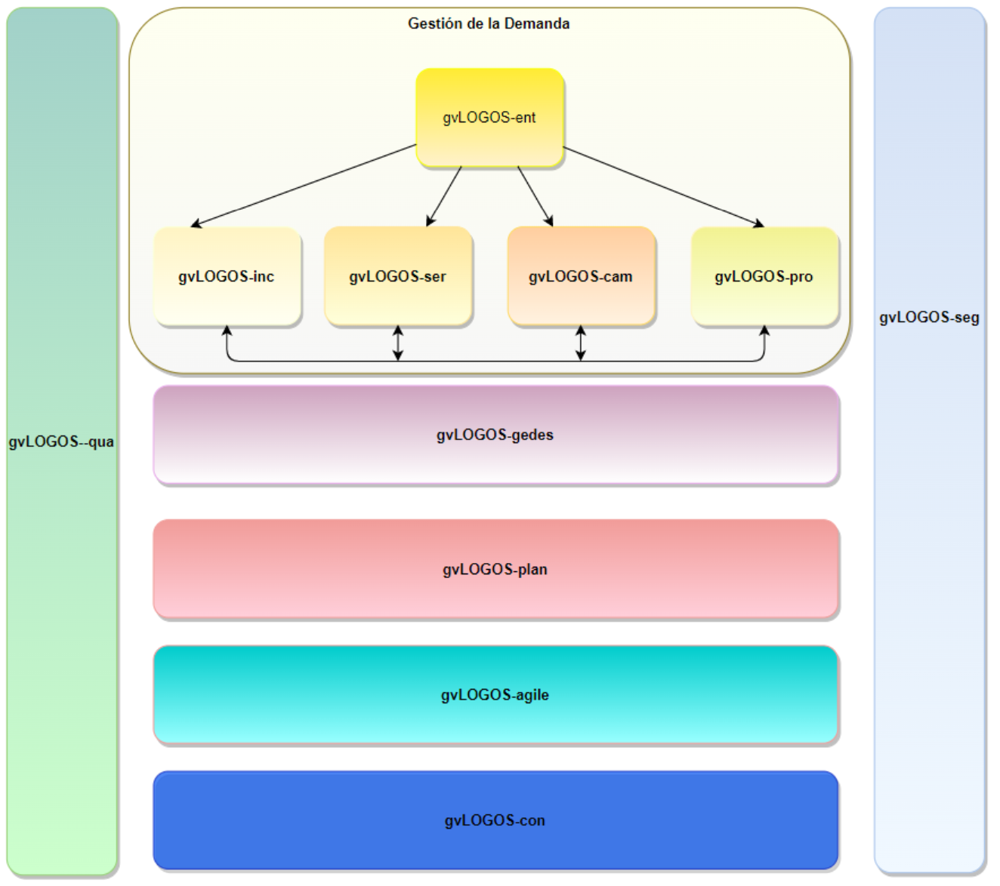
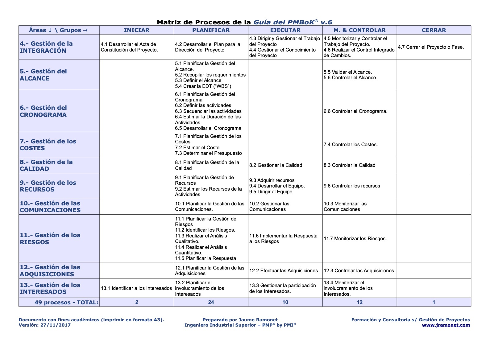
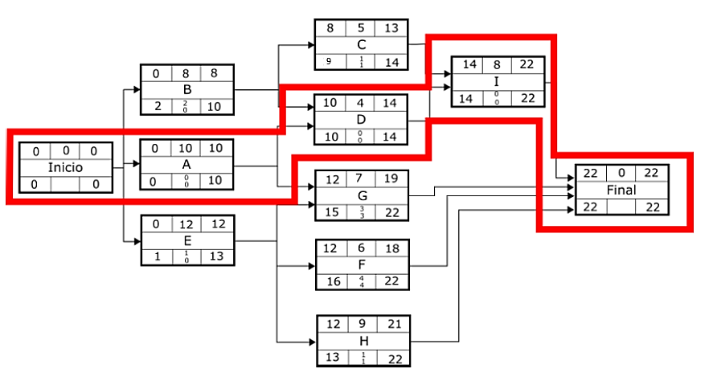

# Dirección y gestión de proyectos

### Introducción a la Gestión de Proyectos

Un **proyecto** es una estructura organizacional temporal creada para desarrollar un producto o servicio único (entregable) dentro de limitaciones como tiempo, coste y calidad.

La **gestión de proyectos** consiste en planificar, organizar, obtener, supervisar y gestionar los recursos y actividades necesarias para cumplir eficaz y eficientemente con los objetivos específicos de cada proyecto. Es fundamental adaptar el enfoque de gestión a las características de cada proyecto.

## Metodología PM2

PM2 es una metodología de gestión de proyectos desarrollada por la Comisión Europea. Su objetivo es facilitar a los Directores de Proyecto (DP) la entrega de soluciones y beneficios a sus organizaciones mediante una gestión eficaz durante el ciclo de vida del proyecto. PM2 **proporciona**:

- Una estructura de gobernanza del proyecto.
- Directrices de procesos y plantillas de artefactos.
- Pautas para el uso de estos artefactos.
- Un enfoque orientado a los resultados.

### Pilares de PM2

La metodología se estructura en torno a los siguientes elementos:

- **Modelo de gobernanza del proyecto**: Define los roles y responsabilidades.
- **Ciclo de vida del proyecto**: Organiza las fases del proyecto.
- **Conjunto de procesos**: Describe las actividades de gestión del proyecto.
- **Conjunto de artefactos del proyecto**: Proporciona plantillas y guías para la documentación.

### Ciclo de Vida del Proyecto

El ciclo de vida del proyecto en PM2 se divide en cuatro fases principales, cada una con actividades y objetivos específicos:

- **Fase de Inicio**: Define los resultados deseados, elabora un Caso de Negocio y establece el alcance del proyecto. Las **actividades** incluyen:
    - Reunión de inicio.
    - Solicitud de Inicio del Proyecto.
    - Creación del Caso de Negocio.
    - Acta de constitución del proyecto.
- **Fase de Planificación**: Asigna el Equipo Central del Proyecto (ECP), desarrolla el alcance y planifica el trabajo. Las **actividades** principales son:
    - Reunión de inicio de planificación.
    - Creación del Manual del proyecto.
    - Definición de la Matriz de partes interesadas.
    - Elaboración de planes específicos (de trabajo del proyecto, de aceptación de entregables, de implementación en el negocio, etc.).
- **Fase de Ejecución**: Coordina la ejecución de los planes y produce los entregables. Es la etapa que requiere mayor cantidad de recursos y supervisión. Las **actividades** son:
    - Reunión de inicio de ejecución.
    - Coordinación del proyecto.
    - Aseguramiento de la calidad.
    - Elaboración de informes.
    - Distribución de la información.
- **Fase de Cierre**: Implica la aceptación formal del proyecto, la elaboración de un Informe final y el cierre administrativo. Se capturan las lecciones aprendidas y recomendaciones para futuros proyectos. Las **actividades** incluyen:
    - Reunión de revisión de fin de proyecto.
    - Lecciones aprendidas y recomendaciones post-proyecto
    - Informe de fin de proyecto.
    - Cierre administrativo.

### Seguimiento y Control (Transversal)

Este proceso supervisa todas las actividades de gestión y ejecución del proyecto, abarcando el seguimiento del progreso, la medición del avance, la gestión de cambios, la identificación de riesgos y la toma de acciones correctivas. Las **actividades** incluyen:

- Seguimiento del progreso del proyecto.
- Control del cronograma y de los costes.
- Gestión de las partes interesadas, requisitos, cambios, riesgos, incidencias y decisiones, calidad, partes interesadas, aceptación de entregables, transición, implementación en el negocio, y externalización.

**\*Puertas de fase:** Cada fase del proyecto culmina con una revisión y aprobación, conocidas como “puertas de fase”.

### Roles y Organización del Proyecto

PM2 estructura los roles del proyecto en varias capas de responsabilidad:

- **Capa de gobernanza**: Establece la visión y la estrategia.
- **Capa rectora**: Ofrece la dirección y orientación general.
- **Capa de dirección**: Asegura la propiedad del Caso de Negocio.
- **Capa de gestión**: Supervisa el día a día del proyecto.
- **Capa de ejecución**: Realiza el trabajo del proyecto.

**Matriz de Asignación de Responsabilidades** (RAM o RASCI): Clarifica las funciones de cada participante, asignando roles de Responsable, Aprobador, Soporte, Consultado e Informado para las distintas tareas y decisiones del proyecto.

## Metodología gvLOGOS

gvLOGOS es la metodología desarrollada por la Dirección General de Tecnologías de la Información y las Comunicaciones (DGTIC) para la gestión y desarrollo de proyectos y servicios TIC en la Generalitat Valenciana. Se enfoca en definir procesos y métodos de trabajo necesarios para la gestión de proyectos, servicios, incidencias y cambios, cubriendo desde la recepción de la demanda hasta la entrega final. La metodología toma como base ITIL e ISO 20000 para gestión de servicios y PMI para la gestión de proyectos.

### Modelo Integral de Gestión de Calidad TIC de la DGTIC

gvLOGOS forma parte del modelo integral de calidad TIC de la DGTIC, que promueve una gestión unificada de la demanda de productos y servicios TIC, así como una gestión estructurada de los proyectos, mejorando la eficiencia en la administración de recursos.

### Subsistemas y Procesos de gvLOGOS

La metodología se estructura en **tres subsistemas** principales, con **dos procesos transversales**:

- **Subsistemas (3)**
    1. **Subsistema de Gestión de la Demanda**: Incluye la gestión de diversas solicitudes y servicios:
        1. **gvLOGOS-ent**: Gestión de Entradas.
        2. **gvLOGOS-inc**: Gestión de Incidencias.
        3. **gvLOGOS-ser**: Gestión de Peticiones de Servicio.
        4. **gvLOGOS-cam**: Gestión de Cambios.
        5. **gvLOGOS-pro**: Gestión de Proyectos.
    2. **Subsistema de Gestión de la Calidad**:
        1. **gvLOGOS-qua**: Asegura la calidad en todas las fases del proyecto y servicio.
    3. **Subsistema de Gestión de la Seguridad**:
        1. **gvLOGOS-seg**: Gestión de la seguridad aplicada a productos y servicios TIC.
- **Procesos transversales (4)**:
    1. **gvLOGOS-gedes**: Gestión de Despliegues.
    2. **gvLOGOS-plan**: Gestión del Plan de Proyectos.
    3. **gvLOGOS-agile:** Gestión Agile
    4. **gvLOGOS-con:** Gestión de Proveedores

### Herramientas de gvLOGOS

Para una ejecución efectiva, gvLOGOS utiliza varias herramientas:

- **JIRA:** Gestión de incidencias y solicitudes.
- **gvEstima:** Estimación de esfuerzos en desarrollo.
- **HP-PPM:** Herramienta de gestión de proyectos.
- **Confluence:** Espacio colaborativo para compartir conocimientos.

### Roles en la Metodología gvLOGOS

- **Responsable funcional/Usuario experto:** Define la funcionalidad de la aplicación.
- **Grupo de asignación:** Atiende, diagnostica y resuelve incidencias.
- **Gestor de proyecto:** Supervisa el desarrollo del proyecto.
- **Comité de decisión:** Aprueba recursos y propuestas.
- **Oficina de calidad:** Realiza validaciones.
- **Gestor de entregas:** Monitorea la implementación.

### gvLOGOS-pro: Ciclo de Gestión de Proyectos

El ciclo de gestión de proyectos en gvLOGOS se divide en **cuatro fases**:

1. **Fase de Verificación de la Solicitud:** Se revisa y valida la solicitud entrante a través de gvLOGOS-ent.
    - **Roles implicados:** Supervisor de la solicitud y Solicitante.
2. **Fase de Propuesta:** Gestión detallada de la propuesta del proyecto.
    - **Etapas:** (documentos)
1. **TOMREQ (TOMa de REQuisitos):** El Gestor del Proyecto realiza la toma de requisitos del solicitante o responsable funcional.
2. **VAREQ (VAlidación de REQuisitos):** La Oficina de Calidad valida los requisitos recogidos.
3. **CORACE (CORreo de ACEptación):** El Gestor del Proyecto envía el correo de aceptación de requisitos al responsable funcional o usuario experto. Si estos son aceptados, el “TOMREQ” se convierten en “Contrato”.
4. **IMPAPRO (IMPacto PROyecto):** El Gestor del Proyecto elabora el documento de impacto de la solución. Antes IMPAEV.
5. **ANCOBE (ANÁlisis COste-BEneficio):** El Gestor del Proyecto rellena el documento de análisis coste-beneficio del proyecto.
6. **VACOBE (VAlidación del análisis COste-BEneficio):** La Oficina de Calidad valida el análisis coste-beneficio. Tras esta validación, el comité de decisión decide si el proyecto se llevará a cabo o no.
    - **Roles implicados:** Gestor del Proyecto, Oficina de Calidad, Solicitante, Supervisor de la Solicitud, Comité de Decisión y Gestor de Entregas.
1. **Fase de Proyecto:** Desarrollo y gestión del proyecto basado en los requisitos y la planificación establecida.
    - **Etapas:** (documentos)
1. **PLAPRO (PLAn del PROyecto):** El Gestor del Proyecto elabora el plan del proyecto, que incluye tareas asignadas, recursos, análisis de riesgos, problemas potenciales, etc.
2. **VAPRO (VAlidación del Plan del PROyecto):** La Oficina de Calidad valida el plan del proyecto antes de iniciar su desarrollo.
    - **Desarrollo:** Se ejecutan las fases de análisis, diseño y desarrollo conforme al PLAPRO y los requisitos validados.
3. **ACTACI (ACTa de CIerre):** Se formaliza el cierre del proyecto mediante una reunión entre el responsable de entrada y el responsable funcional. Este documento es validado por la Oficina de Calidad.
    - **Roles implicados:** Oficina de Calidad, Gestor del Proyecto, Supervisor de la Solicitud y Gestor de Entregas.
1. **Fase de Cierre:** Cierre formal de la petición y finalización administrativa del proyecto.
    - **Roles implicados:** Gestor de Facturación, Oficina de Calidad y Gestor del Proyecto.

### Otros elementos de control y documentación

gvLOGOS utiliza documentos y actas para asegurar la trazabilidad y control en todas las fases del proyecto, tales como el **ACTACO** (Acta de seguimiento del contrato), el **ACTAAR** (Acta de Arranque), **ACTAFU** (Acta de Reunión Funcional), **ASI** (Análisis Funcional), **DSI** (Diseño Técnico), **DECIDE** (Toma de Decisión), **IMPACO** (Impacto Contrato), **CONFIE** (Configuración de entornos), **PLAPRU** (Plan de pruebas), **ANCOBE2** (Análisis Coste-Beneficio 2)

### gvLOGOS-con: Gestión de Contratos (Proveedores)

Este módulo se centra en la gestión eficiente de los proveedores en los proyectos y servicios TIC de la Generalitat Valenciana, asegurando un control adecuado durante todas las fases del contrato.

### Fases de la Gestión de Proveedores

- **Incorporación de Contratos**\ En esta fase se definen aspectos clave como el Acuerdo de Nivel de Servicio (**ANS**), las penalidades, la gestión de interesados y el proceso de facturación.
- **Seguimiento de Contratos**\ Incluye la gestión de la facturación, resolución de conflictos, ajustes necesarios y posibles prórrogas del contrato.
- **Finalización de Contratos**\ Se lleva a cabo la conclusión formal de los contratos, asegurando que se cumplan todos los requisitos y obligaciones establecidos.

### Documento ANS

El ANS (Acuerdo de Nivel de Servicio) es el pilar fundamental para regular la relación con los proveedores.\ Incluye:

- **Condiciones del acuerdo**: Detalla los compromisos asumidos por ambas partes.
- **Funcionalidad**: Describe las características del servicio o producto a entregar.
- **Medición**: Define los indicadores para evaluar el cumplimiento.
- **Calendario y horario de atención**: Especifica la disponibilidad requerida del servicio.
- **Reducciones**: Establece penalizaciones por incumplimientos.

### Tipos de ANS

- **Calidad de Producto (CPD)**\ Relacionado con el cumplimiento de especificaciones del producto.
- **Calidad de Proceso (CPC)**\ Asegura que los procesos se ejecutan conforme a lo definido.
- **Calidad de Servicio (CSV)**\ Orientado a garantizar la calidad del servicio ofrecido.

### Tipos de mediciones en los ANS

- **Tiempo**: Cumplimiento de plazos.
- **Fechas específicas**: Eventos clave en el contrato.
- **Campo informado**: Identificación de entregas defectuosas.
- **Registro de proyecto ANS**: Documentación de incumplimientos detectados.

### Pilares de ITIL aplicados a gvLOGOS-con

- **Procesos (prácticas):** Basados en la gestión estructurada de servicios.
- **Calidad:** Estándares elevados en todas las fases del contrato.
- **Cliente:** Enfoque centrado en satisfacer las necesidades del cliente.
- **Independencia:** Gestión imparcial y objetiva de los proveedores.

### ITIL v4 en gvLOGOS

ITIL v4 introduce un enfoque basado en la **cadena de valor**, estructurando actividades y componentes para maximizar el impacto positivo en la organización. Las prácticas se dividen en:

- **Prácticas generales de gestión**: Incluyen estrategia, gestión de riesgos y mejora continua.
- **Prácticas de gestión de servicios**: Diseño, transición, operación del servicio y **Service Desk**.
    - Ejemplos: Gestión de incidentes, cambios, problemas, peticiones de servicio, niveles de servicio y configuración del servicio.
- **Prácticas técnicas**: Como la implementación de modelos de servicios en la nube.

**Ciclo de vida ITIL:** Registro, Diagnostico, Aprobación, Implementación, y Cierre

- **Gestión de incidentes:** Identificación y registro, Investigación y diagnóstico, Resolución, Cierre
- **Gestión de cambios:** Solicitud y registro, Revisión y autorización de la construcción, Construcción y pruebas, Aprobación del despliegue, Implementación del cambio, Revisión y cierre
- **Gestión de problemas:** Identificación y registro, categorización y priorización, investigación y diagnóstico, Resolución, Revisión y cierre.
- **Gestión de peticiones de servicio:** Solicitud y registro, Aprobación, Implementación, Revisión y cierre
- **Gestión de ANS:** Definición de los ANS, Implementación de los ANS, y monitorización de resultados

### gvLOGOS-agile: Metodología Agile de la Generalitat

La metodología **gvLOGOS-agile** adapta los principios del enfoque Agile al entorno de la Generalitat Valenciana, priorizando flexibilidad, eficiencia y colaboración en la gestión de proyectos.

### Valores principales de Agile

- **Individuos e interacciones** por encima de procesos y herramientas.
- **Software que funciona** por encima de documentación exhaustiva.
- **Colaboración con el cliente** por encima de negociación contractual.
- **Respuesta al cambio** frente al seguimiento estricto de un plan.

### Scrum: Principios de gvLOGOS-agile

Scrum es la metodología principal dentro de gvLOGOS-agile, estructurada en roles, artefactos y eventos clave.

### Roles en Scrum

- **Scrum Master:** Facilita la metodología y elimina impedimentos.
- **Product Owner:** Define las prioridades del producto y su valor para el cliente.
- **Equipo de desarrollo:** Responsable de la entrega incremental del producto.

### Artefactos de Scrum

- **Product backlog:** Lista priorizada de tareas o necesidades del producto.
- **Sprint backlog:** Trabajo que el equipo realizará en un sprint específico.
- **Incremento:** Resultado funcional entregado al final de un sprint.

### Gestión del backlog

Los elementos del backlog se gestionan en los siguientes pasos:

1. **Creación:** Definida por el Product Owner y el equipo.
2. **Priorización:** Según el valor y la urgencia del elemento.
3. **Estimación:** Tiempo y esfuerzo necesario para completar el trabajo.
4. **Definición:** Clarificación de los requisitos.
5. **Refinamiento:** Ajustes continuos por parte del equipo.

### Elementos del backlog

- **Tema:** Objetivo general del proyecto, como "Mejorar métricas de una aplicación".
- **Épica:** Agrupación de funcionalidades relacionadas (e.g., "Integración con GPS").
- **Historia de usuario:** Descripción específica de una necesidad, e.g., “Como [usuario], quiero [ver mi recorrido en bici] para [mejorar mis rutas]”.
- **Subtareas:** Actividades técnicas derivadas de la historia, como "Conectar API de Google Maps".

### Eventos de Scrum

- **Reunión de planificación:** (1 hora/semana) Se define el objetivo del sprint y las tareas asignadas.
- **Reunión diaria:** (15 minutos/día) Coordina al equipo para asegurar el progreso.
- **Revisión del sprint:** (2-3 horas) Al final del sprint, se evalúa el incremento realizado.
- **Retrospectiva:** (1-3 horas) Reflexión sobre el proceso para mejoras futuras.

### Escalado Agile

En proyectos complejos, gvLOGOS-agile utiliza enfoques de escalado como:

- **SoS (Scrum of Scrums):** Coordinación entre múltiples equipos Scrum.
- **SAFe (Scaled Agile Framework):** Integración estratégica y operativa.
- **Nexus y LeSS:** Optimización para entornos con varios equipos.

### MVP (Minimum Viable Product)

Se prioriza la entrega de un **Producto Mínimo Viable**, reduciendo riesgos al lanzar una versión básica funcional para validar su viabilidad.

### Técnicas de priorización de requisitos

- **Método MoSCoW:** Clasifica elementos como Must, Should, Could, Won’t.
- **Matriz de Eisenhower:** Evalúa tareas según su importancia y urgencia.
- **Modelo Kano:** Priorización basada en la satisfacción del usuario (requeridos, deseados, emocionantes, indiferentes).

### Gestión por Objetivos (MBO) y Metodología OKR

Se utiliza como marco para alinear los objetivos estratégicos de gvLOGOS-con con resultados concretos.

- **Objetivos SMART**:
    - **Específicos**
    - **Medibles**
    - **Alcanzables**
    - **Relevantes**
    - **Temporales**
- **Resultados Clave**: Indicadores cuantificables que permiten evaluar el progreso y éxito de los objetivos.

### gvLOGOS-gedes: Gestión de Despliegues

### Beneficios de gvLOGOS-gedes

Esta metodología garantiza la homogeneización y normalización de los procesos de entrega y despliegue, facilitando la coordinación de los actores involucrados y asegurando controles de calidad. Además, consolida un catálogo de aplicaciones y proporciona conocimiento sobre las mismas y sus sistemas relacionados.

### Fases:

- **Preparación:** El gestor de entregas solicita la preparación de los entornos de trabajo.
- **Desarrollo:** Se realizan las primeras iteraciones de pruebas.
- **Preproducción:** Se despliega el producto y se ejecutan pruebas de aceptación. Si no son correctas, se activa el plan de reversión.
- **Producción:** El producto final se despliega tras validar y aceptar las pruebas realizadas.

### Componentes:

- **Entornos:** Desarrollo, preproducción y producción.
- **Informes:** Informe VADESA, de pruebas funcionales y/o de garantía.
- **Versionado:** Se sigue el esquema “Nombre_MAJOR.minor.patch”
- **Tipos de pruebas:** Unitarias, integración, regresión, funcionales y end-to-end.
- **Plan de reversión:** Incluye pasos específicos para restaurar la base de datos, desplegar versiones anteriores, entre otros.

### Unidades de entrega:

- **Desarrollo:** Alta en CATI, repositorio actualizado, código fuente y documentos necesarios.
- **Preproducción:** Informe de pruebas unitarias, análisis estático, especificaciones de pruebas funcionales y plan de reversión.
- **Producción:** Informe de pruebas funcionales y documentos finales.

### Herramientas utilizadas:

- **CATI:** Para el alta de activos software.
- **CONFIE:** Para la configuración de entornos.
- **Subversión:** Gestión de documentación técnica, tareas y auditorías.
- **Nexus:** Repositorio de dependencias y artefactos.
- **Jenkins:** Automatización de compilación y entrega.
    - **jenkins-qua:** Construcción de aplicaciones.
    - **jenkins-sis:** Despliegue de aplicaciones.
    - **Tipos de jobs:** Integración continua, entrega y despliegue, análisis de código.
- **Condesa:** Control de despliegues de aplicaciones específicas.
- **Sonar:** Herramienta para análisis estático y generación de informes.

### Modelo de Calidad del Software ISO/IEC 25010

La calidad del software se define como el grado en que un producto satisface las necesidades de los usuarios. Este modelo incluye características esenciales para evaluar y asegurar la calidad del software desarrollado.

### Características principales:

- **Adecuación funcional:** Cumple los requisitos especificados.
- **Eficiencia de desempeño:** Optimización de recursos.
- **Compatibilidad:** Interoperabilidad entre sistemas.
- **Usabilidad:** Facilidad de uso.
- **Fiabilidad:** Continuidad operativa y tolerancia a fallos.
- **Seguridad:** Protección contra accesos no autorizados.
- **Mantenibilidad:** Facilidad para corregir, mejorar y adaptar el software.
- **Portabilidad:** Capacidad de adaptación a diferentes entornos.

### Testing y niveles de pruebas:

- **Pruebas funcionales:** Validan que el software cumple con los requisitos especificados.
    - Ejemplos: Unitarias, integración, regresión, aceptación, end-to-end.
- **Pruebas no funcionales:** Evalúan aspectos como rendimiento, carga, estrés, volumen y seguridad.

### Niveles de pruebas:

- **Componentes:** Realizadas por el equipo de programación.
- **Integración:** Verificadas por el equipo de programación y la Oficina de test.
- **Sistemas:** Gestionadas por el equipo de negocio y la Oficina de test.
- **Aceptación:** Validación final por los usuarios y la Oficina de test.
- **Implantación:** Ejecutadas por el equipo de operaciones.

### Proceso de pruebas:

- **Planificación:** Se define el alcance y los objetivos.
- **Preparación:** Diseño de casos de prueba.
- **Ejecución:** Realización de pruebas según los planes establecidos.
- **Cierre:** Generación de informes finales.

### Entregables clave:

- Plan de test.
- Casos de test.
- Registro de defectos.
- Informe de resultados.

### Estructura Común de Subversión

- **Carpetas**:
    - **app:** Archivos de la aplicación.
    - **Trunk:** Rama de desarrollo principal.
    - **doc:** Documentación dividida en secciones como requisitos, gestión, desarrollo, lanzamiento y auditorías.
    - **Fuentes:** Archivos de configuración (bbdd, confie, etc.).
    - **Tag:** Versiones marcadas.
    - **Branch:** Ramas alternativas de desarrollo.
- **Nomenclatura de Documentos**: Carpetas en minúsculas y documentos en MAYÚSCULAS.

**ITI.Framekwork:** Marco de referencia

### Herramientas de la metodologías gvLOGOS

### CATI: Repositorio de Activos Software de la DGTIC

CATI es el **repositorio de activos software** de la DGTIC, considerado la "CMDB software" de la Generalitat Valenciana. Se utiliza para gestionar datos, propiedades y relaciones entre diferentes sistemas. Además, permite identificar los responsables técnicos, funcionales o departamentales de cada **Componente Informático (CI)** y asignar el nivel de seguridad correspondiente.

### Roles en CATI

- **Administrador**: Responsable de la gestión general del sistema.
- **Técnico DGTIC**: Accede en modo consulta.
- **Responsable Técnico**: Actualiza los datos de los componentes informáticos.
- **Responsable de Calidad**: Garantiza que se cumplan los estándares establecidos.
- **Coordinador**: Supervisa las tareas relacionadas con el CI.
- **Jefe de Servicio**: Da la autorización final de los cambios o solicitudes.

### Tareas Básicas sobre un CI

- **Solicitud de alta de un CI**: Se completa un formulario que incluye información como:
    - Tipo de activo.
    - Fecha.
    - Acrónimo y nombre.
    - Conselleria responsable.
    - Responsables funcionales y técnicos.
    - Categoría, área, marco y grupo de asignación.
    - Otros datos relevantes.\ Tras completarlo, el formulario se envía al portafirmas para que el jefe de servicio lo valide.
- **Mantenimiento del CI**: Actualización de datos o ajustes según necesidades.
- **Solicitud de consumo de servicios web (PAI)**: Gestión del uso de servicios asociados al CI.

### GV_CESTA

GV_CESTA es el equivalente de CATI para activos **hardware**. Gestiona elementos físicos relacionados con el ecosistema TIC y está dividido en los siguientes módulos:

- **Mantenimiento**.
- **Servicio**.
- **Recursos**.
- **Aplicaciones CATI**.

### gvLOGIN: Sistema Corporativo de Autenticación, Autorización y Auditoría (SSO)

gvLOGIN es el sistema corporativo que centraliza la **autenticación**, **autorización** (opcional) y **auditoría** de los accesos a los sistemas informáticos de la Generalitat Valenciana. Su arquitectura permite **SSO (Single Sign-On)**, optimizando el acceso a los sistemas mediante un único inicio de sesión.

### Fases de gvLOGIN

- **Autenticación**: Validación de la identidad del usuario mediante credenciales.
- **Autorización (opcional)**: Determina los permisos del usuario para acceder a recursos específicos.
- **Post-Procesamiento (opcional)**: Etapa final para realizar configuraciones adicionales según los permisos asignados.

### Sistemas Integrados en gvLOGIN

- **gvCLAU**: Sistema utilizado en la fase de autorización. Ofrece una gestión integral de accesos mediante un repositorio único de usuarios y gestión de permisos.
- **gvCREDENCIALS**: Permite aceptar o rechazar permisos asociados a los usuarios según las políticas establecidas.
- **CADENAT**: Herramienta para la gestión de contraseñas, permitiendo cambios de manera segura y eficiente.

## Metodología PMBOK

El **Project Management Institute (PMI)** es la principal organización mundial dedicada a la dirección de proyectos. Se encarga de:

- **Establecer los estándares** de la dirección de proyectos.
- **Certificar a profesionales** en este ámbito.

### Guía PMBOK

La **Guía PMBOK (Project Management Body of Knowledge)** es un compendio de buenas prácticas reconocidas en dirección de proyectos. Define **47 procesos** clasificados en **5 grupos** y **10 áreas de conocimiento**:

- **Grupos de procesos**:
    - Inicio.
    - Planificación.
    - Ejecución.
    - Monitorización y Control.
    - Finalización.
- **Áreas de conocimiento**:
    - Integración.
    - Alcance.
    - Tiempo.
    - Costos.
    - Calidad.
    - Recursos Humanos.
    - Comunicaciones.
    - Riesgos.
    - Adquisiciones.
    - Interesados.

### Definición de Proyecto

Según el PMBOK, un **proyecto** es un **esfuerzo temporal** llevado a cabo para crear un **producto, servicio y/o resultado singular**. En el ámbito tecnológico, un **proyecto TI** incluye la supervisión de:

- Desarrollo de software.
- Instalaciones de hardware.
- Actualizaciones de red.
- Despliegues de computación en nube y virtualización.
- Gestión de datos y análisis de negocios.
- Implementación de servicios de TI.

### Dirección de Proyectos

La **dirección de proyectos** es la aplicación de **conocimientos, habilidades, herramientas y técnicas** por parte del director de proyecto en un ambiente de **incertidumbre y riesgo**. Las competencias clave son:

- **Conocimiento**.
- **Rendimiento**.
- **Comportamiento**.

**Grupos de dirección de proyectos**:Inicio, Planificación, Ejecución, Supervisión y Control, y Cierre.

### Gestión de un Proyecto

Implica la **administración de los recursos asignados** para llevar el proyecto a término. La **triple restricción** del éxito de un proyecto comprende:

- **Visión restringida**:
    - **Alcance**.
    - **Tiempo**.
    - **Coste**.
- **Visión expandida**:
    - **Calidad**.
    - **Riesgo**.
    - **Eficiencia**.

### Stakeholders (Interesados)

Son los **interesados con capacidad de influencia** en el desarrollo del proyecto, incluyendo:

- **Directivos**.
- **Clientes**.
- **Usuarios afectados**.

### Triángulo del Talento del PMI

Enfatiza tres áreas clave:

- **Dirección Técnica y de Proyectos**.
- **Liderazgo**.
- **Gestión Estratégica y de Negocios**.

### Valor de Negocio

Se refiere al **valor total de la empresa**, sumando todos los elementos **tangibles e intangibles**.

### Project Based Organization (PBO)

La mayoría de las empresas actuales son **Organizaciones Orientadas a Proyectos (PBO)**, donde las actividades se gestionan como proyectos.

### Elementos de la Dirección de Proyectos

- **Plan Estratégico**: Define los objetivos a corto, medio y largo plazo, así como los recursos e inversiones necesarios.
- **Gestión del Portafolio**: Administración de la **cartera de proyectos** de una determinada área.
- **Dirección de Programa o Megaproyecto**: Incluye varios proyectos y operaciones relacionados que contribuyen a un mismo resultado definido en los objetivos estratégicos.
- **Oficina de Gestión de Proyectos (PMO)**: Unidad que centraliza y coordina la dirección de proyectos. Supervisa la dirección de proyectos, programas o una combinación de ambos. Tipos de PMO:
    - **De Apoyo**.
    - **De Control**.
    - **De Dirección**.
- **Sistema de Gestión de Proyectos (PMS)**: Conjunto de herramientas, técnicas, recursos y procedimientos para gestionar proyectos.
- **Sistema de Información de la Gestión de Proyectos (PMIS)**: Conjunto estandarizado de herramientas automatizadas integradas en un sistema digital.
- **Organizational Project Management (OPM)**: Modelo que promueve el uso sistemático de la dirección de proyectos para lograr objetivos estratégicos.
- **Organizational Project Management Maturity Model (OPM3)**: Estándar del PMI para determinar y mejorar el grado de madurez OPM de una organización.

### Ciclo de Vida del Proyecto

Es el **conjunto de fases\*** por las que pasa un proyecto. Tipos de ciclos de vida:

- **Predictivo**: El proyecto se planifica completamente desde el inicio.
- **Iterativo e Incremental**: Las fases (iteraciones) repiten actividades a medida que aumenta el entendimiento del producto.
- **Adaptativo (Ágil)**: Similar al iterativo e incremental, pero con iteraciones más rápidas y de **duración y coste fijos**.

**\*Fases del proyecto:** Conjunto de actividades relacionadas que culmina con la finalización de uno o más **entregables**. Ejemplos: **Iniciales, Intermedias, y Finales**.

### Documentos Principales de la Gestión de Proyectos

- **Plan de Dirección del Proyecto (PDP)**: Establece las **metas, métodos y métricas**.
- **Registros del Proyecto**: Reflejan las **decisiones tomadas**.
- **Documentación del Proyecto**: Incluye el PDP, registros y otros documentos.

### Procesos de Gestión

Están orientados a **realizar y mantener actualizados los planes de gestión** y a **producir los entregables** del proyecto.

### Procesos Directivos

Los **procesos directivos** (o de dirección de proyectos) se enfocan en **coordinar todo el trabajo del proyecto**, incluyendo los procesos productivos, bajo la supervisión del director de proyecto y/o el equipo de dirección. Características:

- **Comunes a todos los proyectos**.
- Clasificados en un **Grupo de Procesos** y un **Área de Conocimiento**.

**Grupos de Procesos**: Inicio, Planificación, Ejecución, Supervisión y Control, y Cierre.

## Caso práctico: PERT y CPM

El objetivo principal de un ejercicio práctico de **PERT** (Program Evaluation and Review Technique) y **CPM** (Critical Path Method) es construir un diagrama que represente visualmente las relaciones y dependencias entre actividades de un proyecto, y determinar la **ruta crítica**, es decir, la secuencia de actividades que define la duración mínima total del proyecto.

### Elementos básicos de un ejercicio típico

El ejercicio suele presentar una tabla que incluye:

- **Actividades**: Tareas o procesos del proyecto identificados mediante letras (A, B, C…).
- **Duración**: Tiempo estimado para completar cada actividad.
- **Precedencia**: Relación entre actividades, indicando cuáles deben completarse antes de que otra comience.

### Ejemplo de tabla típica

|               |              |                  |
| :-----------: | :----------: | :--------------: |
| **Actividad** | **Duración** | **Predecesoras** |
|       A       |      10      |                  |
|       B       |      8       |                  |
|       C       |      5       |        B         |
|       D       |      4       |       A, B       |
|       E       |      12      |                  |
|       F       |      6       |        E         |
|       G       |      7       |       A, E       |
|       H       |      9       |        E         |
|       I       |      8       |       C, D       |

### Solución

*(Fuente: <https://www.diagramapertcpm.online> + Corrección)*

**Ruta crítica (CPM):** Inicio → A → D → I → Final

### Nodo final

<table style="width:18%;">
<colgroup>
<col style="width: 6%" />
<col style="width: 6%" />
<col style="width: 6%" />
</colgroup>
<thead>
<tr>
<th style="text-align: center;"><strong>22</strong></th>
<th style="text-align: center;"><strong>0</strong></th>
<th style="text-align: center;"><strong>22</strong></th>
</tr>
</thead>
<tbody>
<tr>
<td colspan="3" style="text-align: center;"><strong>FIN</strong></td>
</tr>
<tr>
<td style="text-align: center;"><strong>22</strong></td>
<td style="text-align: center;"></td>
<td style="text-align: center;"><strong>22</strong></td>
</tr>
</tbody>
</table>
