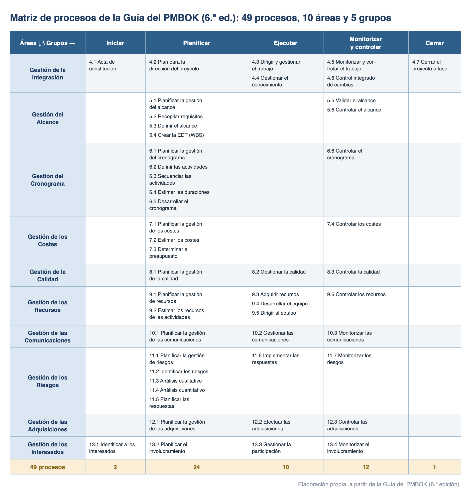
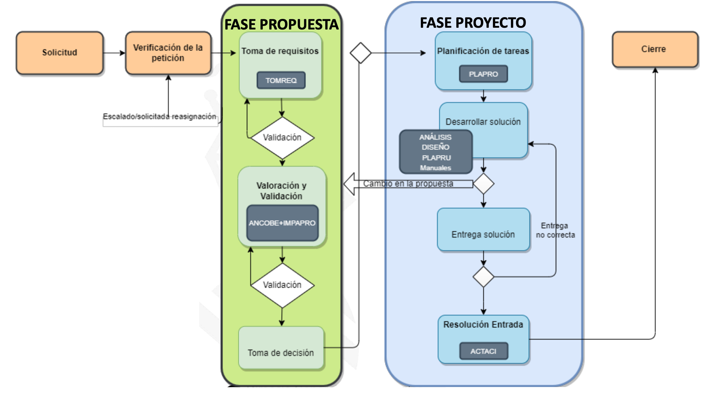
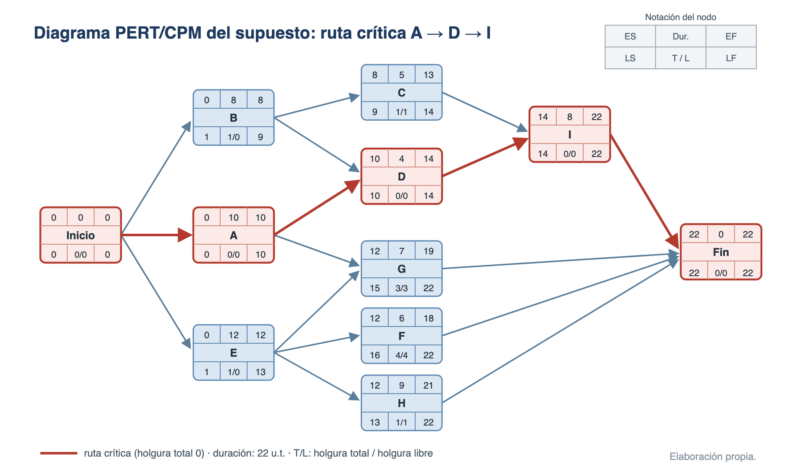

# Dirección y gestión de proyectos

Un **proyecto** es un esfuerzo temporal que se lleva a cabo para crear un producto, servicio o resultado único, con un inicio y un fin definidos y bajo restricciones de alcance, tiempo, coste y calidad. La **gestión (o dirección) de proyectos** consiste en aplicar conocimientos, habilidades, herramientas y técnicas a las actividades del proyecto para cumplir sus objetivos, adaptando el enfoque a las características de cada proyecto. Este tema recorre el marco de referencia del PMI (PMBOK), la metodología **PM²** de la Comisión Europea, la metodología **gvLOGOS** de la Generalitat Valenciana y un supuesto práctico de planificación con PERT y CPM.

## Fundamentos y áreas de conocimiento (PMBOK)

El **Project Management Institute (PMI)** es la principal organización mundial dedicada a la dirección de proyectos: establece estándares (la **Guía del PMBOK**, *Project Management Body of Knowledge*) y certifica profesionales (PMP, CAPM). La Guía del PMBOK es un compendio de buenas prácticas reconocidas y la referencia terminológica habitual en los temarios.

### Conceptos fundamentales

- **Proyecto**: esfuerzo **temporal** emprendido para crear un **producto, servicio o resultado único**. Se opone a las *operaciones*, que son trabajo continuo y repetitivo. Un proyecto TI típico abarca desarrollo de software, implantación de aplicaciones, actualizaciones de red, despliegues en la nube, gestión de datos o implantación de servicios TI.
- **Dirección de proyectos**: aplicación de conocimientos, habilidades, herramientas y técnicas por parte del director de proyecto, en un entorno de incertidumbre y riesgo.
- **Triple restricción**: el equilibrio entre **alcance, tiempo y coste** determina la calidad del resultado; las visiones ampliadas añaden calidad, riesgo y recursos como restricciones adicionales en competencia.
- **Interesados (stakeholders)**: personas u organizaciones con capacidad de influir en el proyecto o afectadas por él (directivos, clientes, usuarios, proveedores, reguladores).
- **Programa**: grupo de proyectos relacionados gestionados de forma coordinada para obtener beneficios que no se lograrían gestionándolos por separado.
- **Portafolio (cartera)**: colección de proyectos, programas y operaciones gestionados conjuntamente para alcanzar los objetivos estratégicos de la organización.
- **Oficina de Gestión de Proyectos (PMO)**: unidad que centraliza y coordina la dirección de proyectos. Tipos según su grado de control: **de apoyo** (consultiva), **de control** (exige cumplimiento de marcos y plantillas) y **directiva** (asume la dirección de los proyectos).
- **PMS y PMIS**: el *Project Management System* es el conjunto de herramientas, técnicas y procedimientos para gestionar proyectos; el *Project Management Information System* es su soporte automatizado e integrado.
- **OPM y OPM3**: la dirección organizacional de proyectos (OPM) promueve el uso sistemático de la gestión de proyectos para lograr los objetivos estratégicos; **OPM3** es el estándar del PMI para medir y mejorar la madurez OPM de una organización.
- **Triángulo del Talento del PMI**: las tres áreas de competencia del profesional de proyectos, denominadas actualmente **Ways of Working** (formas de trabajar: enfoques predictivos, ágiles e híbridos), **Power Skills** (habilidades interpersonales y de liderazgo) y **Business Acumen** (visión de negocio). Sustituyen a las denominaciones anteriores (dirección técnica de proyectos, liderazgo y gestión estratégica y de negocio).

### Ciclo de vida del proyecto

El ciclo de vida es el conjunto de **fases** por las que pasa un proyecto (cada fase agrupa actividades relacionadas y culmina con uno o más entregables). Según cómo se planifica y entrega el trabajo, se distinguen:

- **Predictivo (en cascada o tradicional)**: el alcance, el cronograma y el coste se planifican al detalle desde el inicio; los cambios se gestionan de forma controlada.
- **Iterativo e incremental**: las fases (iteraciones) repiten actividades a medida que mejora el entendimiento del producto, que se entrega por incrementos.
- **Adaptativo (ágil)**: iteraciones rápidas de duración y coste fijos, con alcance flexible y entregas frecuentes basadas en la retroalimentación.
- **Híbrido**: combina elementos predictivos y adaptativos; adecuado cuando unas partes del proyecto son estables y otras requieren flexibilidad.

### La Guía del PMBOK y sus ediciones

- **6.ª edición (2017)**: la última organizada por procesos: **49 procesos** clasificados en **5 grupos de procesos** y **10 áreas de conocimiento**. Sigue siendo la referencia clásica en exámenes.
- **7.ª edición (2021)**: cambio de enfoque: sustituye los procesos por **12 principios** de la dirección de proyectos y **8 dominios de desempeño**, aplicables a cualquier enfoque de entrega (predictivo, ágil o híbrido).
- **8.ª edición (noviembre de 2025)**: recombina ambos enfoques: **6 principios**, **7 dominios de desempeño** y **40 procesos** no prescriptivos agrupados en 5 áreas de foco. El examen PMP se alinea con ella desde julio de 2026.

### Grupos de procesos y áreas de conocimiento (6.ª edición)

Los **5 grupos de procesos** ordenan la dirección del proyecto en el tiempo:

- **Inicio** (2 procesos): autorizar formalmente el proyecto o la fase (acta de constitución, identificación de interesados).
- **Planificación** (24 procesos): definir alcance, cronograma, costes, calidad, recursos, comunicaciones, riesgos, adquisiciones e interesados.
- **Ejecución** (10 procesos): dirigir y gestionar el trabajo, el conocimiento, el equipo y las comunicaciones.
- **Monitorización y control** (12 procesos): medir el desempeño frente a la línea base y gestionar los cambios de forma integrada.
- **Cierre** (1 proceso): cerrar el proyecto o la fase.

Las **10 áreas de conocimiento** agrupan los procesos por disciplina:

| Área de conocimiento | Qué cubre |
| --- | --- |
| **Integración** | Acta de constitución, plan para la dirección del proyecto, control integrado de cambios, cierre |
| **Alcance** | Recopilar requisitos, definir el alcance, crear la EDT/WBS, validar y controlar el alcance |
| **Cronograma** | Definir y secuenciar actividades, estimar duraciones, desarrollar y controlar el cronograma |
| **Costes** | Estimar costes, determinar el presupuesto, controlar los costes |
| **Calidad** | Planificar, gestionar y controlar la calidad |
| **Recursos** | Estimar, adquirir y controlar recursos; desarrollar y dirigir al equipo |
| **Comunicaciones** | Planificar, gestionar y monitorizar las comunicaciones |
| **Riesgos** | Identificar riesgos, análisis cualitativo y cuantitativo, planificar e implementar respuestas |
| **Adquisiciones** | Planificar, efectuar y controlar las adquisiciones |
| **Interesados** | Identificar a los interesados y planificar, gestionar y monitorizar su involucramiento |

En la 6.ª edición, «Cronograma» y «Recursos» sustituyen a las áreas «Tiempo» y «Recursos Humanos» de ediciones anteriores. La matriz completa cruza las **10 áreas** con los **5 grupos** (49 procesos):

{width=100%}

### PMBOK 7: principios y dominios de desempeño

Los **12 principios** de la 7.ª edición: ser un administrador diligente y respetuoso (*stewardship*), crear un entorno de equipo colaborativo, involucrar eficazmente a los interesados, enfocarse en el valor, reconocer y responder a las interacciones del sistema, demostrar liderazgo, adaptar el enfoque al contexto (*tailoring*), incorporar la calidad en procesos y entregables, navegar la complejidad, optimizar las respuestas a los riesgos, adoptar la adaptabilidad y la resiliencia, y facilitar el cambio para lograr el estado futuro previsto.

Los **8 dominios de desempeño**: interesados, equipo, enfoque de desarrollo y ciclo de vida, planificación, trabajo del proyecto, entrega, medición e incertidumbre.

## Metodología PM²

PM² es la metodología de gestión de proyectos desarrollada por la **Comisión Europea** (Centro de Excelencia en PM², **CoEPM²**). Es abierta y gratuita (licencia CC BY), utilizable por cualquier organización, y está pensada para facilitar a los directores de proyecto la entrega de soluciones y beneficios durante todo el ciclo de vida. La versión vigente es la **Guía PM² v3.1** (diciembre de 2023; edición española de 2024). PM² proporciona:

- Una estructura de **gobernanza** del proyecto (roles y responsabilidades).
- Directrices de **procesos** y plantillas de **artefactos**, con pautas para su uso.
- Un conjunto de **mentalidades** (el Enfoque PM²) y una orientación a resultados.

### La Casa de PM²

La metodología se apoya en **cuatro pilares**:

- **Modelo de gobernanza del proyecto**: los roles y responsabilidades.
- **Ciclo de vida del proyecto**: las fases del proyecto.
- **Conjunto de procesos**: las actividades de gestión del proyecto.
- **Conjunto de artefactos**: las plantillas de documentación y sus guías.

El **Enfoque PM²** (*PM² Mindsets*) es el aglutinante que mantiene unidas las prácticas: actitudes y comportamientos comunes de los equipos PM². Entre ellos: aplicar las mejores prácticas recordando que las metodologías sirven a los proyectos (y no al revés), orientarse a resultados y al valor de los entregables más allá del cumplimiento de los planes, promover una cultura de colaboración, comunicación clara y rendición de cuentas, asignar los roles a las personas más adecuadas, gestionar activamente las lecciones aprendidas y compartir el conocimiento.

### Ciclo de vida y puertas de fase

El ciclo de vida PM² tiene **cuatro fases secuenciales y no solapadas**, con un tipo de actividad predominante en cada una (aunque las actividades pueden extenderse a fases contiguas), más el **Seguimiento y Control** como actividad transversal:

| Fase | Descripción | Agente clave |
| --- | --- | --- |
| **1. Inicio** | Define los resultados deseados, crea el Caso de Negocio y define el alcance | Propietario del Proyecto (PP) |
| **2. Planificación** | Asigna el Equipo Central del Proyecto, desarrolla el alcance y planifica el trabajo | Director de Proyecto (DP) |
| **3. Ejecución** | Coordina la ejecución de los planes y produce los entregables | Equipo Central del Proyecto (ECP) |
| **4. Cierre** | Coordina la aceptación formal, informa del desempeño, captura las lecciones aprendidas y cierra administrativamente | Partes interesadas |
| **Seguimiento y Control** (transversal) | Supervisa todo el trabajo: mide el progreso, gestiona cambios, riesgos e incidencias y aplica acciones correctivas | Director de Proyecto (DP) |

Al final de una fase, el proyecto pasa por un punto de revisión y aprobación llamado **puerta de fase**, que asegura que las personas adecuadas lo revisan antes de continuar. PM² define **tres puertas**:

- **LpP (Listo para Planificación)**, *Ready for Planning (RfP)*: al final de la Fase de Inicio.
- **LpE (Listo para Ejecución)**, *Ready for Executing (RfE)*: al final de la Fase de Planificación.
- **LpC (Listo para Cierre)**, *Ready for Closing (RfC)*: al final de la Fase de Ejecución.

### Actividades y artefactos por fase

- **Fase de Inicio**: reunión de inicio, **Solicitud de Inicio del Proyecto** (formaliza la petición y el contexto), **Caso de Negocio** (justificación y requisitos presupuestarios) y **Acta de Constitución del Proyecto** (alcance de alto nivel; base para la puerta LpP).
- **Fase de Planificación**: reunión de lanzamiento de la planificación, **Manual del Proyecto** (define el enfoque de gestión), **Matriz de Partes Interesadas**, **Plan de Trabajo del Proyecto** (desglose del trabajo, esfuerzo y costes, cronograma) y otros planes específicos (aceptación de entregables, transición, implementación en el negocio, externalización).
- **Fase de Ejecución**: reunión de lanzamiento de la ejecución, coordinación del proyecto, aseguramiento de la calidad, elaboración de informes y distribución de la información; el equipo produce los entregables y el Propietario del Proyecto los acepta.
- **Fase de Cierre**: reunión de revisión de fin de proyecto, lecciones aprendidas y recomendaciones post-proyecto, **Informe de Fin de Proyecto** y cierre administrativo.

### Gobernanza: capas y roles

PM² organiza los roles en capas de responsabilidad. Solo hay un equipo de proyecto, formado por las personas de las capas de Dirección, Gestión y Ejecución:

| Capa | Función | Roles |
| --- | --- | --- |
| **Gobernanza** | Visión y estrategia de la organización; prioridades, inversiones y recursos | **Órgano de Gobernanza Pertinente (OGP)**: aprueba el proyecto y lo dota de fondos; gestiona la cartera |
| **Rectora** | Dirección y orientación general del proyecto | **Comité de Dirección del Proyecto (CDP)**: presidido por el PP; principal órgano de decisión y resolución de incidencias |
| **Dirección** | Abandera el proyecto y se apropia del Caso de Negocio; moviliza recursos | **Propietario del Proyecto (PP)** (cliente, parte solicitante) y **Proveedor de Soluciones (PS)** (responsable de los entregables, parte proveedora) |
| **Gestión** | Día a día del proyecto: organiza, supervisa y controla el trabajo | **Responsable de Negocio (RN)** y **Director de Proyecto (DP)** |
| **Ejecución** | Realiza el trabajo: produce los entregables y los implanta | **Grupo de Implementación en el Negocio (GIN)** y **Equipo Central del Proyecto (ECP)** |

El **CDP** está compuesto al menos por los cuatro roles de las capas de Dirección y Gestión (PP, PS, RN, DP), con equilibrio entre parte solicitante y proveedora, y puede incorporar roles opcionales: representantes de usuarios, director de proyecto del contratista, oficina de arquitectura TI, oficina de soporte a proyectos, garantía de calidad, gestión documental, protección de datos o seguridad de la información.

### Matriz de asignación de responsabilidades (RAM o RASCI)

La guía documenta la asignación de responsabilidades de cada artefacto con una tabla **RASCI**:

| Letra | Rol | Significado |
| --- | --- | --- |
| **R** | Responsable | Hace el trabajo; solo hay una persona responsable por tarea |
| **A** | Aprobador | Rinde cuentas de la correcta y completa realización; solo una por tarea |
| **S** | Soporte | Trabaja con el responsable ayudando a completar la tarea |
| **C** | Consultado | Se solicita su opinión; comunicación bidireccional |
| **I** | Informado | Se le mantiene al corriente del progreso |

PM² cuenta además con una extensión ágil (**PM² Ágil**) para proyectos con entrega iterativa, que se trata junto con el resto de marcos ágiles en el tema correspondiente.

## Metodología gvLOGOS

gvLOGOS es la metodología desarrollada por la **Dirección General de Tecnologías de la Información y las Comunicaciones (DGTIC)** para la gestión de los proyectos y servicios TIC de la **Generalitat Valenciana**. Forma parte del modelo integral de gestión de calidad TIC de la DGTIC: promueve una gestión unificada de la demanda y una gestión estructurada de proyectos, servicios, incidencias y cambios, desde la recepción de la demanda hasta la entrega, incorporando de forma transversal la **seguridad**, la **calidad** y la **planificación**. Toma como base **ITIL** e **ISO/IEC 20000** para la gestión de servicios y los marcos **PMBOK 7** y **PM²** para la gestión de proyectos.

### Estructura de gvLOGOS

En su versión vigente, la metodología se organiza en **tres cadenas de valor** con dos procesos **transversales** (calidad y seguridad) integrados en todas ellas:

| Ámbito | Proceso | Objeto |
| --- | --- | --- |
| **Gestión de proyectos** | gvLOGOS-pro | Gestión de proyectos |
| | gvLOGOS-agile | Gestión ágil |
| **Gestión de servicios** | gvLOGOS-inc | Gestión de incidencias |
| | gvLOGOS-ser | Gestión de peticiones de servicio |
| | gvLOGOS-problema | Gestión de problemas |
| | gvLOGOS-cam | Gestión de cambios |
| | gvLOGOS-con | Gestión de proveedores |
| **Gestión de entregas** | gvLOGOS-gedes | Gestión de despliegues |
| **Transversales** | gvLOGOS-qua / gvLOGOS-seg | Calidad y seguridad, integradas en la cadena de valor |

Las versiones anteriores de la metodología se organizaban en subsistemas (gestión de la demanda, con un proceso de entrada gvLOGOS-ent que derivaba a incidencias, peticiones, cambios o proyectos; calidad; y seguridad) más procesos transversales como gvLOGOS-plan (plan de proyectos); esa estructura pervive en parte de la documentación y materiales de formación.

La **PMO DGTIC** (oficina de gestión de proyectos, adscrita al Servicio de Tecnología y Calidad de las TIC) promueve la cultura de proyectos, actúa transversalmente y ofrece soporte continuo: **todos los proyectos nuevos deben notificarse a la PMO** para su categorización y para determinar el tipo de seguimiento.

### gvLOGOS-pro: el proceso de gestión de proyectos

El proceso **gvLOGOS-pro** (versión vigente **4.1**, aprobado en julio de 2024) detalla las directrices de gestión de proyectos de la DGTIC para facilitar su control, homogeneidad y alineamiento estratégico. Es aplicable a proyectos de cualquier tipología: prestación de servicios, software, formación, innovación (I+D+i, BI, IA), procesos, consultoría, comunicaciones, sistemas y ciberseguridad.

Terminología y enfoques (alineados con PMBOK 7): proyecto, programa, portafolio, hito y riesgo se definen como en el PMI, y el gestor decide el **enfoque** del proyecto: **predictivo** (cascada), **adaptativo** (ágil) o **híbrido**.

- **Roles**:
    - **Usuario**: propone la idea o necesidad y registra el proyecto; detalla los requisitos a alto nivel.
    - **Gestor de proyecto**: responsable de la gestión; planifica, coordina, supervisa, involucra a los interesados y decide el enfoque metodológico. Puede ser interno o externo (en proyectos con proveedor coexisten gestor interno y externo).
    - **Equipo de especialistas**: ejecuta las tareas y colabora en la finalización.
    - **Aprobador**: valida requisitos, entregables y el propio proyecto; decide si se ejecuta y cuándo. Incluye las figuras de responsable funcional, aprobador DGTIC y patrocinador.
    - **Interesados**: personas o entidades externas con interés directo o indirecto (usuarios finales, proveedores, reguladores).
- **Ciclo de vida en tres fases**, independiente de la tipología:
    1. **Lanzamiento**: registro del proyecto en la herramienta corporativa, asignación del gestor (con escalado a proveedor si procede) y cumplimentación del **Documento de Proyecto** (objetivos, alcance, presupuesto, cronograma, hitos y entregas, riesgos, problemas y dependencias, con vista Gantt); se solicita la aprobación y el aprobador decide el paso a ejecución o devuelve el proyecto para ajustes. Los costes de recursos son bajos (planificación y preparación).
    2. **Ejecución**: realización de las tareas planificadas, registro del avance (estimado frente a real, para detectar desviaciones) y entrega de tareas conforme se completan; los cambios se canalizan por **gvLOGOS-cam**. El aprobador revisa cada entrega: si la acepta y es la última, se elabora el **Acta de Cierre**; si la rechaza por cambio de requisitos, el proyecto vuelve a lanzamiento. Los costes alcanzan su punto máximo.
    3. **Cierre**: se completa el **Acta de Cierre** (coste real frente a estimado, fechas reales frente a previstas, desviaciones y lecciones aprendidas) y el aprobador la revisa; aceptada, el proyecto se cierra y toda la documentación se remite a la **PMO DGTIC** para análisis y archivo.
- **Gestión en Jira**: para reducir burocracia, la versión vigente sustituye gran parte de los documentos por **campos estructurados en Jira** (frontal digital): el Documento de Proyecto (descripción, riesgos con gravedad alta/media/baja y mitigación por aceptación o transferencia, hitos, coste estimado sin IVA, estimación de esfuerzo y fechas) y el Acta de Cierre (costes y fechas previstos frente a reales, fecha de entrega del ANS, hitos revisados y lecciones aprendidas). Los documentos extensos clásicos (TOMREQ, PLAPRO) pueden seguir anexándose a criterio del gestor.

### Flujo documental clásico de gvLOGOS

Las versiones anteriores del proceso, todavía presentes en materiales de formación, estructuraban la gestión en **cuatro fases** (verificación de la solicitud, propuesta, proyecto y cierre) con un flujo de documentos validados por la **Oficina de Calidad** en cada paso. Sus siglas siguen siendo de uso común:

{width=100%}

| Sigla | Documento | Quién lo elabora o valida |
| --- | --- | --- |
| **TOMREQ** | Toma de requisitos | Gestor del proyecto, con el solicitante o responsable funcional |
| **VAREQ** | Validación de requisitos | Oficina de Calidad |
| **CORACE** | Correo de aceptación de requisitos | Gestor del proyecto; aceptados los requisitos, el TOMREQ se convierte en «contrato» |
| **IMPAPRO** | Impacto de la solución (antes IMPAEV) | Gestor del proyecto |
| **ANCOBE** | Análisis coste-beneficio | Gestor del proyecto |
| **VACOBE** | Validación del análisis coste-beneficio | Oficina de Calidad; después el **Comité de Decisión** aprueba o rechaza el proyecto |
| **PLAPRO** | Plan del proyecto (tareas, recursos, riesgos) | Gestor del proyecto |
| **VAPRO** | Validación del plan del proyecto | Oficina de Calidad |
| **ACTACI** | Acta de cierre | Reunión entre responsable de entrada y responsable funcional; valida la Oficina de Calidad |

Otros documentos y actas de control: **ACTAAR** (acta de arranque), **ACTACO** (acta de seguimiento del contrato), **ACTAFU** (acta de reunión funcional), **ASI** (análisis funcional), **DSI** (diseño técnico), **DECIDE** (toma de decisión), **IMPACO** (impacto en contrato), **CONFIE** (configuración de entornos), **PLAPRU** (plan de pruebas) y **ANCOBE2** (análisis coste-beneficio revisado).

### gvLOGOS-agile: gestión ágil

gvLOGOS-agile adapta los principios ágiles al entorno de la Generalitat, priorizando flexibilidad, eficiencia y colaboración. Parte de los **cuatro valores del Manifiesto Ágil**: individuos e interacciones sobre procesos y herramientas; software que funciona sobre documentación exhaustiva; colaboración con el cliente sobre negociación contractual; y respuesta al cambio sobre el seguimiento estricto de un plan.

**Scrum** es el marco principal dentro de gvLOGOS-agile (el detalle de Scrum y del escalado ágil se desarrolla en su propio tema):

- **Roles**: **Product Owner** (prioriza el producto y su valor), **Scrum Master** (facilita el marco y elimina impedimentos) y **desarrolladores** (entrega incremental del producto).
- **Artefactos**: **Product Backlog** (lista priorizada de necesidades), **Sprint Backlog** (trabajo del sprint) e **Incremento** (resultado funcional del sprint).
- **Eventos** (duraciones máximas de la Guía de Scrum 2020, para un sprint de un mes): *Sprint Planning* (**8 horas**), *Daily Scrum* (**15 minutos** diarios), *Sprint Review* (**4 horas**) y *Sprint Retrospective* (**3 horas**).
- **Gestión del backlog**: creación (Product Owner y equipo), priorización (valor y urgencia), estimación (tiempo y esfuerzo), definición (clarificación de requisitos) y refinamiento continuo.
- **Elementos del backlog**: **tema** (objetivo general), **épica** (agrupación de funcionalidades), **historia de usuario** («como [usuario], quiero [función] para [beneficio]») y **subtareas** técnicas.
- **MVP (producto mínimo viable)**: se prioriza entregar una versión básica funcional para validar la viabilidad y reducir riesgos.
- **Técnicas de priorización**: **MoSCoW** (Must, Should, Could, Won't), **matriz de Eisenhower** (importancia frente a urgencia) y **modelo Kano** (satisfacción del usuario: requisitos básicos, de desempeño y entusiasmantes).
- **Escalado ágil**: **SoS** (Scrum of Scrums, coordinación entre equipos), **SAFe** (integración estratégica y operativa) y **LeSS y Nexus** (varios equipos sobre un mismo producto).
- **Objetivos y resultados clave (OKR)**: marco para alinear objetivos estratégicos con resultados medibles; los objetivos se formulan **SMART** (específicos, medibles, alcanzables, relevantes y temporales).

### gvLOGOS-con: gestión de proveedores

Gestiona la relación con los proveedores de proyectos y servicios TIC durante todas las fases del contrato:

- **Incorporación de contratos**: se definen el **Acuerdo de Nivel de Servicio (ANS)**, las penalidades, la gestión de interesados y el proceso de facturación.
- **Seguimiento de contratos**: facturación, resolución de conflictos, ajustes y prórrogas.
- **Finalización de contratos**: conclusión formal verificando el cumplimiento de requisitos y obligaciones.

El **ANS** es el pilar que regula la relación con el proveedor. Incluye las condiciones del acuerdo, la funcionalidad a entregar, los indicadores de medición, el calendario y horario de atención y las **reducciones** (penalizaciones por incumplimiento). Se distinguen ANS de **calidad de producto**, de **calidad de proceso** y de **calidad de servicio**, con mediciones por tiempo (plazos), por fechas clave, por campo informado (entregas defectuosas) o por registro de incumplimientos. El proceso se apoya en cuatro pilares heredados de ITIL: procesos (prácticas), calidad, cliente e independencia (gestión imparcial del proveedor).

### ITIL en la gestión de servicios gvLOGOS

La parte de servicios de gvLOGOS se apoya en **ITIL 4** (el marco se desarrolla en su propio tema), cuyas **prácticas** se agrupan en tres bloques: **generales de gestión** (estrategia, riesgos, mejora continua), **de gestión de servicios** (incidentes, problemas, cambios, peticiones, niveles de servicio, configuración, *service desk*) y **técnicas** (por ejemplo, gestión de plataformas en la nube). Los flujos típicos que gvLOGOS toma de estas prácticas siguen un ciclo genérico de registro, diagnóstico, aprobación, implementación y cierre:

- **Gestión de incidentes**: identificación y registro, investigación y diagnóstico, resolución y cierre.
- **Gestión de problemas**: identificación y registro, categorización y priorización, investigación y diagnóstico, resolución, revisión y cierre.
- **Gestión de cambios**: solicitud y registro, revisión y autorización, construcción y pruebas, aprobación del despliegue, implementación, revisión y cierre.
- **Gestión de peticiones de servicio**: solicitud y registro, aprobación, implementación, revisión y cierre.
- **Gestión de los ANS**: definición, implementación y monitorización de resultados.

### gvLOGOS-gedes: gestión de despliegues

Homogeneiza y normaliza los procesos de entrega y despliegue de aplicaciones: coordina a los actores, asegura controles de calidad y consolida el catálogo de aplicaciones y el conocimiento sobre ellas.

- **Fases**: **preparación** (el gestor de entregas solicita la preparación de los entornos), **desarrollo** (primeras iteraciones de pruebas), **preproducción** (despliegue y pruebas de aceptación; si fallan se activa el plan de reversión) y **producción** (despliegue final tras validar las pruebas).
- **Componentes**: entornos de desarrollo, preproducción y producción; informes (VADESA, pruebas funcionales, garantía); versionado con el esquema **Nombre_MAJOR.minor.patch**; tipos de pruebas (unitarias, integración, regresión, funcionales, extremo a extremo); y plan de reversión (pasos para restaurar la base de datos y desplegar versiones anteriores).
- **Unidades de entrega por entorno**: a desarrollo, alta en CATI, repositorio actualizado, código fuente y documentación; a preproducción, informe de pruebas unitarias, análisis estático, especificaciones de pruebas funcionales y plan de reversión; a producción, informe de pruebas funcionales y documentos finales.

### Calidad y pruebas del software en gvLOGOS

El control de calidad del software entregado se apoya en el modelo **ISO/IEC 25010** (familia SQuaRE), que define **8 características** de calidad del producto: adecuación funcional, eficiencia de desempeño, compatibilidad, usabilidad, fiabilidad, seguridad, mantenibilidad y portabilidad (la revisión de 2023 amplía el modelo a nueve características; se detalla en el tema de calidad del software).

Las pruebas (desarrolladas en su propio tema) se organizan en:

- **Pruebas funcionales** (unitarias, integración, regresión, aceptación, extremo a extremo) y **no funcionales** (rendimiento, carga, estrés, volumen, seguridad).
- **Niveles de prueba** y responsables: componentes (equipo de programación), integración (programación y oficina de test), sistema (negocio y oficina de test), aceptación (usuarios y oficina de test) e implantación (equipo de operaciones).
- **Proceso de pruebas**: planificación (alcance y objetivos), preparación (diseño de casos), ejecución y cierre (informes). Entregables: plan de test, casos de test, registro de defectos e informe de resultados.

### Herramientas corporativas

- **Jira**: frontal digital de gestión de proyectos y servicios (incidencias, solicitudes y, en gvLOGOS-pro v4.1, el Documento de Proyecto y el Acta de Cierre como campos estructurados).
- **Confluence**: espacio colaborativo de documentación y conocimiento.
- **gvEstima**: estimación de esfuerzos de desarrollo.
- **CATI**: **repositorio de activos software** de la DGTIC (la «CMDB software» de la Generalitat). Gestiona datos, propiedades y relaciones de cada **componente informático (CI)**, sus responsables técnicos, funcionales y departamentales y su nivel de seguridad. Roles: administrador, técnico DGTIC (consulta), responsable técnico (actualiza los CI), responsable de calidad, coordinador y jefe de servicio (autorización final). Tareas básicas sobre un CI: solicitud de alta (formulario con tipo de activo, acrónimo y nombre, conselleria responsable, responsables funcionales y técnicos, categoría y grupo de asignación, que se envía al portafirmas para validación del jefe de servicio), mantenimiento y solicitud de consumo de servicios web de la PAI.
- **GV_CESTA**: equivalente de CATI para activos **hardware**, con módulos de mantenimiento, servicio, recursos y aplicaciones CATI.
- **Entrega y despliegue**: **CONFIE** (configuración de entornos), **Subversion** (control de versiones y documentación técnica, con estructura normalizada de carpetas: trunk, branches, tags, doc y fuentes), **Nexus** (repositorio de dependencias y artefactos), **Jenkins** (automatización de construcción y despliegue, con instancias jenkins-qua y jenkins-sis y jobs de integración continua, entrega y análisis de código), **Sonar** (análisis estático) y **Condesa** (control de despliegues).
- **gvLOGIN**: sistema corporativo de **autenticación, autorización y auditoría** con **SSO** (inicio de sesión único) para los sistemas de la Generalitat. Fases: autenticación (validación de credenciales), autorización opcional (permisos sobre recursos) y post-procesamiento opcional. Se integra con **gvCLAU** (gestión de accesos con repositorio único de usuarios y permisos), **gvCREDENCIALS** (aceptación o rechazo de permisos según políticas) y **CADENAT** (gestión segura de contraseñas).

## Supuesto práctico 1: PERT y CPM

**PERT** (*Program Evaluation and Review Technique*) y **CPM** (*Critical Path Method*) son técnicas de planificación que representan el proyecto como un grafo de actividades con dependencias y determinan la **ruta crítica**: la secuencia de actividades que fija la **duración mínima total** del proyecto. Se diferencian en el tratamiento de las duraciones:

- **CPM** es determinista: cada actividad tiene una duración única conocida.
- **PERT** es probabilista: cada actividad se estima con tres valores (optimista *a*, más probable *m* y pesimista *b*) y se opera con la **duración esperada** `te = (a + 4m + b) / 6` y la desviación típica `s = (b - a) / 6`.

### Método de resolución

1. **Construir el grafo** a partir de la tabla de actividades, duraciones y precedencias.
2. **Pasada hacia adelante**: calcular para cada actividad el inicio y fin más tempranos (**ES**, *early start*; **EF** = ES + duración). El ES de una actividad es el mayor EF de sus predecesoras. El mayor EF final es la **duración del proyecto**.
3. **Pasada hacia atrás**: partiendo de la duración total, calcular el fin y el inicio más tardíos (**LF**, *late finish*; **LS** = LF - duración). El LF de una actividad es el menor LS de sus sucesoras.
4. **Holgura total** de cada actividad: `H = LS - ES = LF - EF`. Las actividades con **holgura 0** forman la **ruta crítica**: cualquier retraso en ellas retrasa el proyecto.

### Enunciado

| Actividad | Duración | Predecesoras |
| :---: | :---: | :---: |
| A | 10 | |
| B | 8 | |
| C | 5 | B |
| D | 4 | A, B |
| E | 12 | |
| F | 6 | E |
| G | 7 | A, E |
| H | 9 | E |
| I | 8 | C, D |

### Resolución

Aplicando las pasadas hacia adelante y hacia atrás:

| Actividad | ES | EF | LS | LF | Holgura | ¿Crítica? |
| :---: | :---: | :---: | :---: | :---: | :---: | :---: |
| A | 0 | 10 | 0 | 10 | **0** | Sí |
| B | 0 | 8 | 1 | 9 | 1 | No |
| C | 8 | 13 | 9 | 14 | 1 | No |
| D | 10 | 14 | 10 | 14 | **0** | Sí |
| E | 0 | 12 | 1 | 13 | 1 | No |
| F | 12 | 18 | 16 | 22 | 4 | No |
| G | 12 | 19 | 15 | 22 | 3 | No |
| H | 12 | 21 | 13 | 22 | 1 | No |
| I | 14 | 22 | 14 | 22 | **0** | Sí |

{width=100%}

- **Ruta crítica**: Inicio → **A → D → I** → Fin.
- **Duración del proyecto**: **22** unidades de tiempo.
- El nodo final del diagrama resume el resultado (notación: tiempo más temprano, holgura y tiempo más tardío):

| Más temprano | Holgura | Más tardío |
| :---: | :---: | :---: |
| 22 | 0 | 22 |

## Supuesto práctico 2: gestión del valor ganado (EVM)

La **gestión del valor ganado** (EVM, *Earned Value Management*) es la técnica del PMBOK para medir de forma integrada **alcance, plazo y coste**: compara lo que se planificó producir, lo que se ha producido realmente y lo que ha costado producirlo. Magnitudes básicas en la fecha de control:

- **BAC** (*Budget at Completion*): presupuesto total del proyecto.
- **PV** (*Planned Value*, valor planificado): coste presupuestado del trabajo que debería estar hecho.
- **EV** (*Earned Value*, valor ganado): coste presupuestado del trabajo realmente hecho.
- **AC** (*Actual Cost*, coste real): lo realmente gastado en el trabajo hecho.

### Enunciado

Un proyecto de desarrollo tiene una duración prevista de **12 meses** y un presupuesto (**BAC**) de **600.000 €**, con avance planificado uniforme. En el control de fin del **mes 6**: debería estar completado el **50 %** del trabajo, se ha completado realmente el **40 %** y se han gastado **280.000 €**. Se pide: calcular las variaciones e índices de valor ganado, diagnosticar el estado del proyecto y estimar el coste y el plazo finales si se mantiene el rendimiento actual.

### Resolución

Valores base: PV = 50 % × 600.000 = **300.000 €**; EV = 40 % × 600.000 = **240.000 €**; AC = **280.000 €**.

| Magnitud | Fórmula | Cálculo | Resultado | Lectura |
| --- | --- | --- | :---: | --- |
| **SV** (variación de plazo) | EV - PV | 240.000 - 300.000 | **-60.000 €** | Negativa: retraso |
| **CV** (variación de coste) | EV - AC | 240.000 - 280.000 | **-40.000 €** | Negativa: sobrecoste |
| **SPI** (índice de desempeño de plazo) | EV / PV | 240.000 / 300.000 | **0,80** | Se avanza al 80 % del ritmo previsto |
| **CPI** (índice de desempeño de coste) | EV / AC | 240.000 / 280.000 | **0,857** | Cada euro gastado produce 0,86 € de trabajo |
| **EAC** (coste final estimado) | BAC / CPI | 600.000 / 0,857 | **700.000 €** | Si el rendimiento de coste se mantiene |
| **ETC** (coste del trabajo restante) | EAC - AC | 700.000 - 280.000 | **420.000 €** | Pendiente de gastar |
| **VAC** (desviación final prevista) | BAC - EAC | 600.000 - 700.000 | **-100.000 €** | Sobrecoste esperado al cierre |
| **TCPI** (índice para cumplir el BAC) | (BAC - EV) / (BAC - AC) | 360.000 / 320.000 | **1,125** | Habría que rendir un 12,5 % mejor que lo planificado en lo que queda |

- **Diagnóstico**: el proyecto va **retrasado** (SPI < 1) **y con sobrecoste** (CPI < 1), el peor de los cuatro cuadrantes posibles.
- **Plazo estimado**: si el ritmo se mantiene, la duración total aproximada es 12 / SPI = **15 meses** (3 meses de retraso).
- **Decisiones de dirección**: analizar causas (estimación optimista, crecimiento del alcance, baja productividad), replanificar formalmente con una **nueva línea base** aprobada por el comité de seguimiento, valorar medidas correctoras (repriorizar alcance con el patrocinador, reforzar el equipo sabiendo que incorporar personal tarde puede empeorar el plazo) y comunicar el EAC actualizado. Un **TCPI de 1,125** indica que terminar dentro del presupuesto original es poco realista.

## Fuentes {.unnumbered .unlisted}

- Project Management Institute: *Guía del PMBOK*, 6.ª edición (2017) y 7.ª edición (2021); *PMBOK Guide*, 8.ª edición (noviembre de 2025). Triángulo del Talento del PMI (pmi.org, consulta de julio de 2026).
- Comisión Europea, Centro de Excelencia en PM² (CoEPM²): *Metodología de Gestión de Proyectos PM², Guía 3.1* (diciembre de 2023; edición española, Oficina de Publicaciones de la UE, 2024).
- DGTIC, Generalitat Valenciana: *Proceso de Gestión de Proyectos (gvLOGOS-pro)*, versión 4.1 (aprobado el 11 de julio de 2024; revisión de 16 de enero de 2026).
- Schwaber, K. y Sutherland, J.: *La Guía de Scrum* (noviembre de 2020), para los eventos y roles de Scrum.
- ISO/IEC 25010:2011 (SQuaRE), modelo de calidad del producto software.
