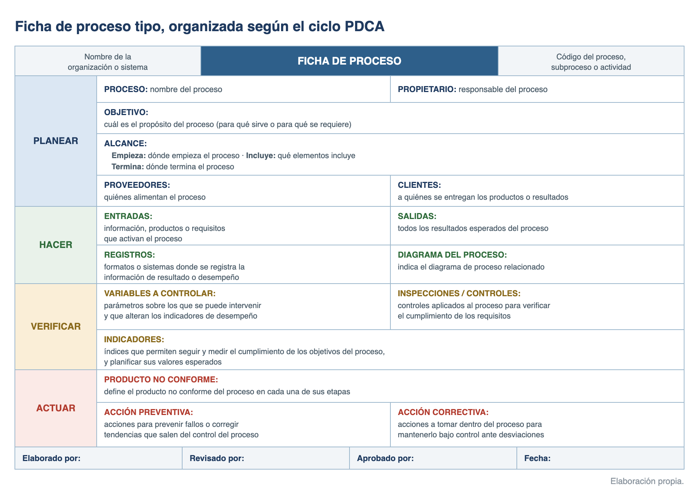
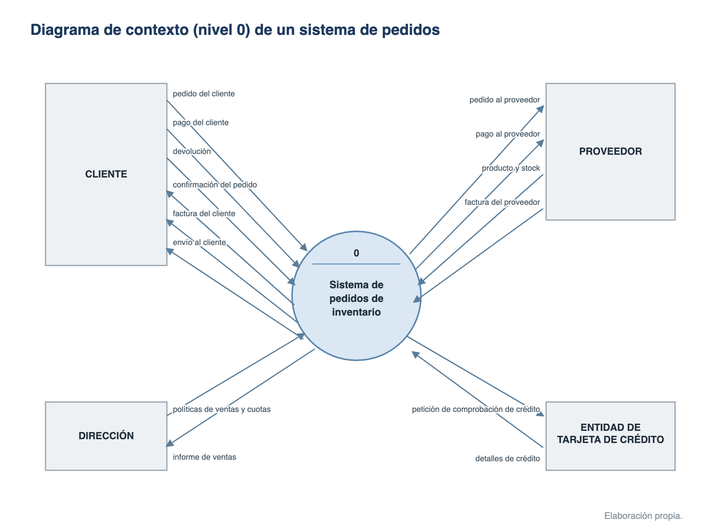
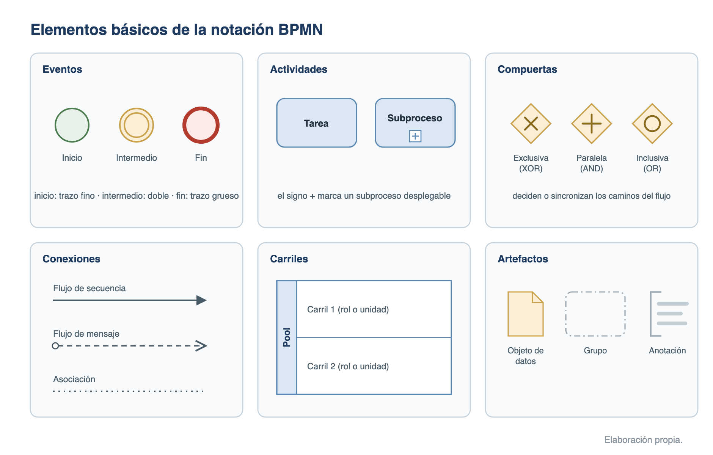
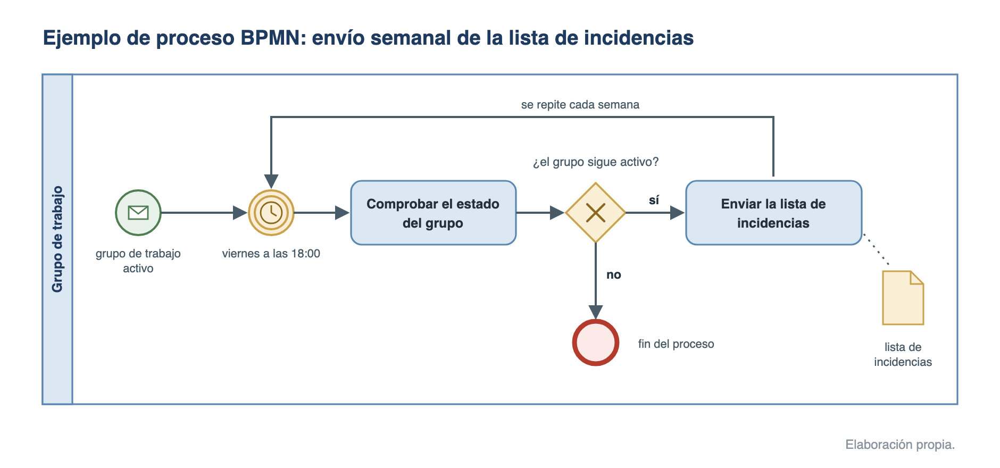
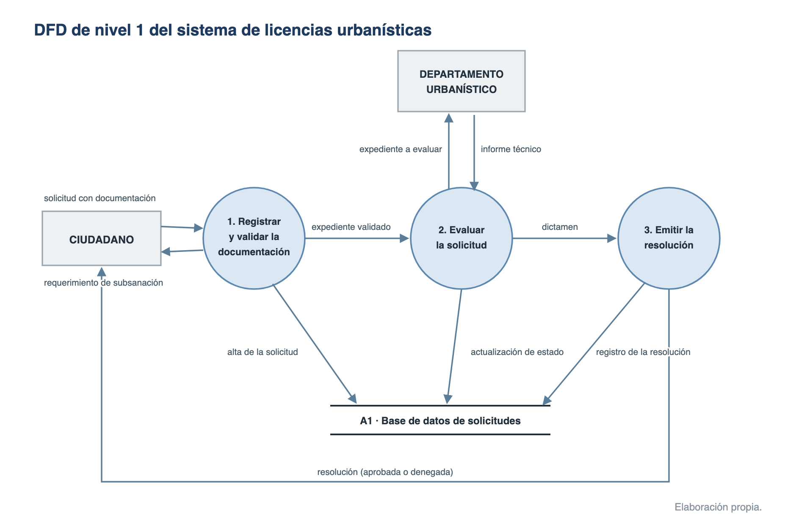

# Análisis de procesos

El análisis de procesos estudia cómo trabaja una organización para describir, medir y mejorar sus procesos. Es la base del enfoque a procesos de la gestión de la calidad (**ISO 9001:2015**) y de la gestión por procesos (**BPM**), y se apoya en herramientas de modelado: el mapa, el diagrama y la ficha de proceso, el diagrama de flujo de datos y la notación estándar **BPMN**.

## Análisis y modelado de procesos

Un proceso es un «conjunto de actividades mutuamente relacionadas que utilizan las entradas para proporcionar un resultado previsto» (**ISO 9000:2015**). Todo proceso transforma unas entradas en salidas que aportan valor a un cliente, interno o externo:

- **Entrada**: necesidad del cliente (información, materiales, requisitos).
- **Proceso**: transformación que añade valor.
- **Salida**: necesidad cubierta (producto, servicio, resolución).

Conceptos asociados:

- **Actividad**: cada una de las divisiones internas de un proceso; se descompone a su vez en **tareas** (unidades elementales de trabajo). La cadena habitual es proceso, subproceso, actividad y tarea.
- **Procedimiento**: «forma especificada de llevar a cabo una actividad o un proceso» (ISO 9000). El proceso define el qué; el procedimiento, el cómo, y suele estar documentado.
- **Indicador**: métrica que permite hacer seguimiento y medir el cumplimiento de los objetivos del proceso.

### Clasificación de los procesos

- **Procesos estratégicos**: vinculados a la dirección: definición de estrategias, objetivos y políticas. Ejemplo: planificación presupuestaria, diseño de producto.
- **Procesos clave (u operativos)**: materializan la actividad principal de la organización y tienen contacto directo con el cliente. Ejemplo: desarrollar software, tramitar una licencia.
- **Procesos de apoyo (o soporte)**: proveen recursos y soporte a los procesos clave. Ejemplo: formación, logística, informática.

### Herramientas de modelado

- **Mapa de procesos**: representación global de la actividad de una organización o área, con sus procesos y las relaciones entre ellos. Ventaja: permite identificar los procesos y su estructura. Limitación: no detalla lo que ocurre dentro de cada proceso; para eso hacen falta el diagrama y la ficha de proceso.
- **Diagrama de proceso (flujograma)**: describe la secuencia de actividades internas de un proceso; puede organizarse en carriles según el responsable de cada actividad.
- **Ficha de proceso**: documento que recoge los componentes principales de un proceso (propietario, objetivo, alcance, entradas y salidas, indicadores, acciones de mejora). Suele estructurarse según el ciclo **PDCA** (planear, hacer, verificar, actuar).

{width=100%}

### El diagrama de flujo de datos (DFD)

El DFD es la técnica de modelado del **análisis estructurado** (DeMarco, 1979): representa el sistema como una red de procesos que transforman flujos de datos. Modela la perspectiva funcional (qué se hace con los datos), no el orden temporal ni el flujo de control.

Componentes (notación Yourdon/DeMarco):

- **Entidad externa** (rectángulo): fuente o destino de los datos, fuera del sistema. Ejemplo: cliente, proveedor.
- **Proceso** (círculo o burbuja): función que transforma entradas de datos en salidas.
- **Almacén de datos** (líneas paralelas): datos en reposo. Es un depósito lógico (un fichero de clientes, una tabla de solicitudes), no un soporte físico.
- **Flujo de datos** (flecha): datos en movimiento entre los demás componentes.

{width=45%}

**Reglas de conexión**: todo flujo de datos nace o termina en un proceso. Son válidas las conexiones entidad-proceso (E-P), proceso-proceso (P-P) y proceso-almacén (P-A, en lectura o escritura); están prohibidas entidad-entidad, entidad-almacén y almacén-almacén.

{width=90%}

**Niveles** (descomposición descendente):

- **Nivel 0 o diagrama de contexto**: un único proceso (el sistema completo) con sus entidades externas y los flujos que intercambian.
- **Nivel 1 o diagrama de nivel superior**: los subsistemas o funciones principales del sistema.
- **Niveles de detalle (2 y siguientes)**: explosión de cada proceso hasta llegar a procesos primitivos, que se describen mediante una especificación de proceso.
- **Equilibrado (balancing)**: al explotar un proceso, los flujos que entran y salen de él deben conservarse en el nivel inferior.

{width=95%}

### Diccionario de datos

Repositorio técnico que define con precisión todos los datos que aparecen en el DFD (flujos, almacenes y sus elementos). Para cada dato se recogen:

- **Nombre**: identificación completa del dato.
- **Descripción**: origen y función del dato.
- **Tipo de dato**: entero, texto, fecha, documento.
- **Longitud**: número de caracteres o dígitos.
- **Nulo**: si el dato puede quedar vacío.
- **Alias**: nombre corto para simplificar la referencia. Ejemplo: «Nombre del cliente» → «NC».

### La gestión por procesos (BPM)

**BPM** (*Business Process Management*) es la disciplina de gestión que busca la mejora continua de los procesos de negocio de extremo a extremo, combinando gestión y tecnología. Parte del mapa de procesos y trata la organización como un sistema de procesos, no de departamentos.

- **Ciclo de vida BPM**: **diseño** (identificar el proceso actual, *as-is*), **modelado** (representarlo y simular alternativas, *to-be*), **ejecución** (implantarlo, con o sin automatización), **monitorización** (medir sus indicadores, KPI) y **optimización** (corregir y mejorar, volviendo al diseño).
- **BPMS** (*BPM Suite*): plataformas software que soportan el ciclo completo: modelador gráfico (BPMN), motor de ejecución de procesos, formularios y monitorización de la actividad (BAM). Ejemplos: Camunda, Bonita, Flowable.

## La notación BPMN

**BPMN** (*Business Process Model and Notation*) es la notación gráfica estándar para modelar procesos de negocio como flujos de trabajo. La mantiene el **OMG** (*Object Management Group*); la versión vigente es **BPMN 2.0.2 (enero de 2014)**, adoptada como norma **ISO/IEC 19510:2013**. Persigue una notación comprensible por todos los implicados y, desde la versión 2.0, incorpora una semántica de ejecución y un formato de intercambio XML que permiten ejecutar los modelos en un motor de procesos. Se ciñe a los procesos de negocio: quedan fuera del estándar las estructuras organizativas, los modelos de datos y la estrategia.

Destinatarios (*stakeholders*):

- **Analistas de negocio**: definen y refinan los procesos.
- **Desarrolladores técnicos**: implementan los procesos definidos.
- **Gestores y administradores del negocio**: supervisan y gestionan los procesos en operación.

Tipos de diagrama (BPMN 2.0):

- **Diagrama de proceso (orquestación)**: el flujo interno de un único participante (privado o público).
- **Diagrama de colaboración**: interacción entre dos o más participantes (piscinas) conectados por flujos de mensaje.
- **Diagrama de coreografía**: modela el intercambio de mensajes entre participantes como un contrato entre ellos, sin orquestador central.
- **Diagrama de conversación**: vista simplificada de la colaboración que agrupa los intercambios de mensajes.

### Elementos de la notación

BPMN 2.0 organiza sus elementos en **cinco categorías**: objetos de flujo, datos, objetos de conexión, carriles y artefactos.

- **Objetos de flujo**: los nodos del diagrama.
    - **Eventos** (círculos): algo que sucede durante el proceso. Por su posición: **inicial** (trazo fino), **intermedio** (trazo doble) y **final** (trazo grueso). Por su desencadenante: mensaje, temporizador, error, señal, condición.
    - **Actividades** (rectángulos redondeados): el trabajo que se realiza. Tipos: **tarea** (unidad atómica), **subproceso** (puede mostrarse contraído, con el marcador «+», o expandido) y **transacción** (agrupa actividades que deben ejecutarse juntas como un todo, con compensación si falla).
    - **Compuertas** (rombos): controlan la divergencia y convergencia del flujo.

| Compuerta | Marcador | Comportamiento |
| --- | --- | --- |
| **Exclusiva (XOR)** | rombo vacío o con «X» | sigue una sola rama, según su condición |
| **Inclusiva (OR)** | círculo | sigue una o varias ramas cuyas condiciones se cumplan |
| **Paralela (AND)** | cruz «+» | sigue todas las ramas a la vez; al converger, sincroniza |
| **Basada en eventos** | pentágono en círculo doble | la rama la decide el primer evento que ocurra |
| **Compleja** | asterisco | condiciones avanzadas de bifurcación o sincronización |

- **Datos**:
    - **Objetos de datos**: información que una actividad requiere o produce, con variantes de entrada y de salida.
    - **Almacén de datos** (*data store*): datos que persisten más allá de la vida del proceso.
- **Objetos de conexión**:
    - **Flujo de secuencia** (línea continua): orden de ejecución de las actividades. Variantes: **condicional** (mini-rombo en el origen) y **por defecto** (barra diagonal).
    - **Flujo de mensaje** (línea discontinua): comunicación entre participantes distintos; cruza las fronteras de las piscinas.
    - **Asociación** (línea punteada): vincula artefactos y anotaciones con los objetos de flujo.
- **Carriles de nado (swimlanes)**:
    - **Piscina (pool)**: representa a un participante del proceso; puede mostrarse cerrada (caja negra, solo sus mensajes) o abierta, con su proceso interno.
    - **Carril (lane)**: subdivisión de la piscina que organiza las actividades por rol, función o departamento.
- **Artefactos**: información adicional que no afecta al flujo: **grupo** (recuadro discontinuo que agrupa elementos) y **anotación** (texto explicativo).

{width=100%}

{width=100%}

### Niveles del modelo de procesos

Un mismo proceso se modela con tres niveles de refinamiento sucesivos:

- **Nivel I (descriptivo)**: describe solo el flujo normal del proceso (el «camino feliz»), representando la lógica de negocio de forma sencilla y comprensible para todos.
- **Nivel II (operacional)**: incluye toda la lógica de negocio, con los casos de excepción y las reglas. Para el usuario de negocio sirve de guía o manual de procedimientos; para el analista de procesos, de input para evaluar la eficiencia y plantear mejoras.
- **Nivel III (técnico)**: adapta el proceso a un modelo ejecutable con consideraciones técnicas. Puede interpretarse como código fuente y refleja siempre la situación actual del proceso.

## Supuesto práctico: análisis de procesos

La Generalitat Valenciana está implementando un sistema de gestión de licencias urbanísticas para agilizar el proceso de solicitud, evaluación y resolución. Como técnico del cuerpo superior de ingeniería informática, se te encarga diseñar una **ficha de proceso**, un **diagrama de flujo de datos (DFD)** y un **diccionario de datos** para describir el proceso de tramitación de estas licencias.

Requisitos:

1. **Ficha de proceso**
    - **Entrada**: solicitud del ciudadano con documentación adjunta.
    - **Actividades**: recepción de la solicitud y registro; validación de la documentación; evaluación técnica por parte del departamento urbanístico; emisión de la resolución (aprobada o denegada).
    - **Salida**: resolución de la solicitud enviada al ciudadano.
2. **Diagrama de flujo de datos (DFD)**
    - **Entidades**: ciudadano (fuente de entrada) y departamento urbanístico (evalúa y emite la resolución).
    - **Procesos**: validar documentación, evaluar solicitud y emitir resolución.
    - **Flujos de datos**: solicitud enviada por el ciudadano; resolución emitida al ciudadano.
    - **Almacenes**: base de datos de solicitudes.
3. **Diccionario de datos**: definir, al menos, los datos «Solicitud» y «Resolución».

### Solución

**1. Ficha de proceso.** Estructurada según el ciclo PDCA:

| Fase | Campo | Contenido |
| --- | --- | --- |
| | Empresa / sistema | Generalitat Valenciana / Sistema de Gestión de Licencias Urbanísticas |
| | Código de proceso | SGLU-001 |
| Planear | Proceso | Tramitación de licencias urbanísticas |
| Planear | Propietario | Departamento de Urbanismo |
| Planear | Objetivo | Gestionar las solicitudes de licencia urbanística desde su recepción hasta la emisión de una resolución (aprobada o denegada) |
| Planear | Alcance | Empieza: recepción de la solicitud del ciudadano. Incluye: validación documental, evaluación técnica y emisión de la resolución. Termina: comunicación de la resolución al ciudadano |
| Planear | Proveedor | Ciudadanos y empresas solicitantes |
| Planear | Cliente | Ciudadanos y empresas que reciben la resolución de su licencia |
| Hacer | Entradas | Documentación aportada por el ciudadano (solicitud, planos, informes técnicos) |
| Hacer | Insumos | Normativa urbanística vigente; personal técnico del departamento de urbanismo |
| Hacer | Salidas | Resolución aprobatoria o denegatoria de la licencia |
| Hacer | Diagrama del proceso | DFD del apartado 2 |
| Verificar | Variables a controlar | Compleción de la documentación requerida; cumplimiento de los plazos legales |
| Verificar | Inspecciones / controles | Verificación técnica de la documentación; supervisión de los plazos de tramitación |
| Verificar | Indicadores | Porcentaje de licencias resueltas en plazo; tiempo medio de tramitación por licencia |
| Actuar | Producto no conforme | Solicitudes rechazadas por documentación incompleta o fuera de plazo |
| Actuar | Acción preventiva | Informar de los requisitos mediante guías detalladas y recursos online |
| Actuar | Acción correctiva | Subsanación de errores dentro del plazo; automatización del sistema para reducir errores humanos |
| | Elaborado / revisado / aprobado por | Responsable, revisor y aprobador, con fecha de elaboración |

**2. Diagrama de flujo de datos.** En notación Yourdon/DeMarco, en dos niveles:

- **Nivel 0 (diagrama de contexto)**: un único proceso, «0. Tramitar licencia urbanística», con dos entidades externas:
    - **Ciudadano**: envía el flujo *solicitud con documentación*; recibe *requerimiento de subsanación* y *resolución*.
    - **Departamento urbanístico**: recibe el *expediente a evaluar*; devuelve el *informe técnico*.
- **Nivel 1 (explosión del proceso 0)**: tres procesos y un almacén:
    - **1. Registrar y validar documentación**: recibe la *solicitud* del ciudadano, la anota en el almacén **A1 Base de datos de solicitudes** y comprueba que está completa. Si falta documentación, envía el *requerimiento de subsanación* al ciudadano; si es válida, pasa el *expediente validado* al proceso 2.
    - **2. Evaluar solicitud**: remite el *expediente a evaluar* al departamento urbanístico, recibe su *informe técnico*, actualiza el estado en A1 y traslada el *dictamen* al proceso 3.
    - **3. Emitir resolución**: genera la *resolución* (aprobada o denegada), la registra en A1 y la comunica al ciudadano.
- **Comprobación de las reglas**: todos los flujos nacen o terminan en un proceso (no hay conexiones entidad-entidad ni entidad-almacén) y los flujos externos del nivel 1 coinciden con los del nivel 0 (equilibrado).

{width=100%}

**3. Diccionario de datos.**

| Nombre del dato | Descripción | Tipo de dato | Longitud | Nulo | Alias |
| --- | --- | --- | --- | --- | --- |
| Solicitud | Documento enviado por el ciudadano con los datos necesarios para tramitar la licencia urbanística | Documento (PDF) | Máximo 10 MB | No | SOL |
| Identificador de solicitud | Número único que identifica cada solicitud en el sistema | Entero | 10 dígitos | No | ID_SOL |
| Ciudadano | Datos del ciudadano que realiza la solicitud (nombre, DNI, dirección) | Cadena de texto | 255 caracteres | No | CIUDADANO |
| Estado de solicitud | Estado actual de la solicitud: en trámite, completada, aprobada, denegada | Cadena de texto | 50 caracteres | No | ESTADO |
| Documentación adicional | Información complementaria requerida para la evaluación técnica (planos, informes) | Documento (PDF) | Máximo 15 MB | Sí | DOC_ADIC |
| Resolución | Resultado de la evaluación técnica indicando si la solicitud fue aprobada o denegada | Cadena de texto | 500 caracteres | No | RES |
| Fecha de solicitud | Fecha en que el ciudadano presentó la solicitud | Fecha | - | No | F_SOL |
| Fecha de resolución | Fecha en que se emitió la resolución correspondiente | Fecha | - | No | F_RES |
| Plazo de subsanación | Tiempo máximo para corregir errores en la documentación aportada | Entero (días) | 2 dígitos | No | PLAZO_SUB |
| Técnico asignado | Nombre del técnico encargado de evaluar la solicitud | Cadena de texto | 100 caracteres | No | TECNICO |
| Base normativa | Referencia a la normativa urbanística aplicada en la evaluación | Cadena de texto | 255 caracteres | Sí | NORMATIVA |

## Fuentes {.unnumbered .unlisted}

- OMG, Business Process Model and Notation (BPMN), versión 2.0.2, enero de 2014 (última versión formal, verificada online en julio de 2026); adoptada como ISO/IEC 19510:2013.
- ISO 9000:2015 e ISO 9001:2015 (definiciones de proceso y procedimiento, enfoque a procesos y ciclo PDCA).
- T. DeMarco, Structured Analysis and System Specification, Yourdon Press, 1979 (análisis estructurado y DFD).
- J. Freund, B. Rücker y B. Hitpass, BPMN 2.0: Manual de referencia y guía práctica, 4.ª ed., 2014 (niveles descriptivo, operacional y técnico del modelo de procesos).
