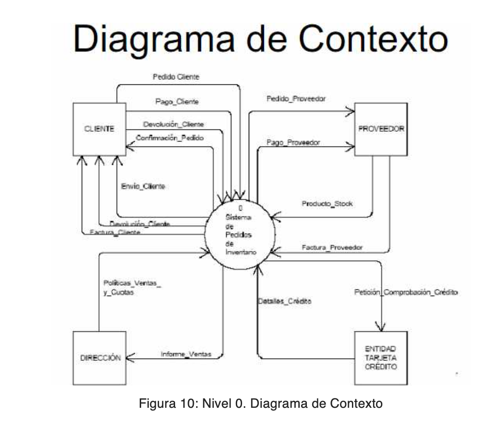
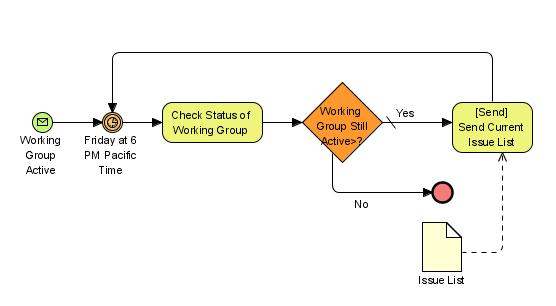

# Análisis de procesos
## Análisis de Procesos

**Proceso**\
Conjunto de actividades que convierten elementos de entrada en elementos
de salida.

- **Entrada**: Necesidad del cliente.

- **Proceso**: Transformación de la necesidad.

- **Salida**: Necesidad cubierta.

**Ficha y Diagrama de Flujo de Datos**\
Son herramientas clave para describir y analizar los procesos.

**Clasificación de Procesos**

- **Procesos clave (u operativos)**: Relacionados con la actividad
  principal de la empresa. Ejemplo: desarrollar software, producir
  carne.

- **Procesos estratégicos**: Vinculados con el desarrollo de estrategias
  y la definición de objetivos. Ejemplo: diseño de producto,
  planificación presupuestaria.

- **Procesos de apoyo (o soporte)**: Proveen recursos y soporte para
  ejecutar los procesos clave. Ejemplo: formación, logística,
  informática.

**Actividades**\
Divisiones internas de un proceso, clasificadas como:

- **Nucleares**: Imprescindibles para que la empresa funcione.

- **Operativas**: Generan valor. Ejemplo: escribir código.

- **De síntesis y administrativas**: Recopilan, clasifican y organizan
  información.

- **De razonamiento y análisis**: Relacionadas con estudios como
  análisis de inversión.

- **De gestión y toma de decisiones**: Vinculadas a la dirección.

- **De mejora o crecimiento**: Enfocadas en aumentar la rentabilidad u
  optimizar procesos.

**Procedimiento**\
Forma específica de ejecutar un proceso o actividad.

**Mapa de Procesos**\
Representa de manera completa la actividad de una empresa o área.

- **Ventaja**: Permite identificar los procesos y su estructura.

- **Limitación**: No detalla lo que ocurre dentro de cada proceso, lo
  que requiere un diagrama de proceso y ficha de proceso.

**Diagrama de Proceso**\
Describe las actividades internas de un proceso y puede representarse
como un **Diagrama de Flujo de Datos**.

**Ficha de Proceso**\
{width="5.363194444444445in"
height="5.455555555555556in"}Documento que incluye los componentes
principales de un proceso.

**Diagrama de Flujo de Datos (DFD)**\
Representación gráfica que muestra cómo los datos fluyen a través de un
sistema de información.

- **Describe**:

  - Origen y destino de los datos.

  - Transformaciones internas o procesos.

  - Almacenes de datos.

  - {width="1.673847331583552in"
    height="2.4337740594925634in"}Canales de circulación.

- **Componentes**:

  - **Entidad (externa)**: Representa fuentes o destinos de
    transacciones, como clientes o proveedores.

  - **Proceso**: Funciones que transforman entradas de datos en salidas.

  - **Almacén**: Archivos lógicos donde se almacenan datos. Ejemplo:
    HDD.

  - {width="5.8560520559930005in"
    height="0.9433398950131233in"}**Flujo de datos**: Representa los
    datos en movimiento.

- **Conexiones permitidas**:

  - Entidad-Proceso (E-P).

  - Proceso-Proceso (P-P).

  - Proceso-Almacén (P-A).

{width="6.779166666666667in"
height="4.064583333333333in"}

**Niveles de un DFD**

- **Nivel 0 o Diagrama de Contexto**: Representa interacciones del
  sistema con su entorno, mostrando un único proceso.

- **Nivel 1 o Diagrama de Nivel Superior**: Detalla los procesos
  principales o subsistemas.

- **Nivel 2 o Diagrama de Detalle**: Aumenta
  el nivel de detalle.

**Diccionario de Datos**\
Repositorio técnico que organiza los detalles del DFD.

- **Elementos clave**:

  - **Nombre**: Identificación completa del dato.

  - **Descripción**: Origen y función del dato.

  - **Tipo de dato**: Ejemplo: entero, texto.

  - **Longitud**: Número de caracteres o dígitos.

  - **Nulo**: Indica si el dato puede quedar vacío.

  - **Alias**: Nombre corto para simplificar la referencia.

    - **Ejemplo:** "Nombre del {width="5.946219378827647in"
      height="1.532746062992126in"}cliente" → "NC".

**BPM (Business Process Management)**\
Metodología y disciplina de gestión enfocada en la mejora continua de
procesos empresariales.

- **Objetivo**: Optimizar la eficiencia y eficacia de los procesos.

- **Base**: Parte del mapa de procesos para mejorar resultados.

## BPMN (Business Process Model and Notation)

BPMN es una **notación gráfica estandarizada** utilizada en la gestión
de procesos de negocio para modelar procesos como flujos de trabajo. Se
centra exclusivamente en **procesos aplicables a negocios**.

**Stakeholders**

- **Analistas de negocio**: Definen y ajustan los procesos.

- **Desarrolladores técnicos**: Implementan los procesos definidos.

- **Gerentes y administradores del negocio**: Supervisan y gestionan los
  procesos operativos.

**Business Process Diagram (BPD)**

- Diagramas **simples** que representan los procesos de negocio.

- Tipos principales:

  - **Colaboración**: Interacción entre múltiples participantes.

  - **Orquestación**: Define el flujo interno de un proceso individual.

**Elementos de la notación**

- **Objetos de Flujo**: Elementos principales que describen las
  actividades y eventos.

  - **Eventos ( ):** Representan sucesos específicos.

    - Tipos:

      - **Inicial ( )**: Marca el inicio del proceso.

      - **Intermedio ( )**: Indica un cambio o evento en el proceso.

      - **Final ( )**: Representa el fin del proceso.

  - **Actividades ( )**: Describen el trabajo a realizar.

    - Tipos:

      - **Tarea**: Unidad de trabajo específica.

      - **Subproceso**: Puede mostrar u ocultar detalles adicionales.

      - **Transacción**: Agrupa actividades que deben ejecutarse juntas
        como un todo.

  - **Compuertas, Rombos de Control de Flujo o Gateways ( )**: Permiten
    la bifurcación o unión del flujo.

- **Objetos de Conexión**: Enlazan los elementos del flujo.

  - **Flujo de Secuencia ( )**: Indica el orden de las actividades.

    - **Flujo condicional ( )**: Representado por un diamante.

    - **Flujo por defecto ( )**: Representado por una barra diagonal.

  - **Flujo de Mensaje ( )**: Indica interacción entre participantes a
    través de fronteras organizativas.

  - **Asociaciones ( )**: Conectan artefactos o textos explicativos con
    los objetos de flujo.

- **Carriles de Nado (Swimlanes)**:

  - **Piscina**: Representa a los principales participantes del proceso.
    Puede dividirse en carriles y estar abierta o cerrada.

  - **Carril**: Organiza actividades según roles o funciones dentro de
    la piscina.

- **Artefactos**: Añaden información adicional al modelo.

  - **Objetos de Datos**: Identifican datos requeridos o generados por
    una actividad.

  - **Grupo ( )**: Agrupa actividades sin impactar el flujo.

  - **Anotación**: Explica conceptos del modelo o diagrama.

{width="5.896527777777778in"
height="2.402083333333333in"}{width="5.22170384951881in"
height="2.2857141294838144in"}

{width="4.611111111111111in"
height="1.3375in"}

**Niveles del modelo de procesos**

- **Nivel I (Descriptivo)**:

  - Enfocado en describir el flujo normal del proceso.

  - Objetivo: Representar la lógica de negocio de forma sencilla y
    comprensible.

- **Nivel II (Operacional)**:

  - Incluye toda la lógica del negocio, casos de excepción y reglas.

  - Usos:

    - Para el usuario de negocio: **Guía o manual de procedimientos**.

    - Para el analista de procesos: Input para evaluar la eficiencia y
      plantear mejoras.

- **Nivel III (Técnico)**:

  - Adapta los procesos a un modelo ejecutable con consideraciones
    técnicas.

  - Objetivo: Optimizar los procesos a través de software.

  - Características:

    - Puede interpretarse como **código fuente**.

    - Refleja siempre la **situación actual** del proceso.

## Caso práctico: Análisis de procesos

La Generalitat Valenciana está implementando un sistema de gestión de
licencias urbanísticas para agilizar el proceso de solicitud, evaluación
y resolución. Como técnico del cuerpo superior de ingeniería
informática, se te encarga diseñar una **Ficha de Proceso**, un
**Diagrama de Flujo de Datos (DFD)** y un **Diccionario de Datos** para
describir el proceso de tramitación de estas licencias.

**Requisitos**:

1.  **Ficha de Proceso**

    - **Entrada**: Solicitud del ciudadano con documentación adjunta.

    - **Actividades**:

      - Recepción de la solicitud y registro.

      - Validación de la documentación.

      - Evaluación técnica por parte del departamento urbanístico.

      - Emisión de la resolución (aprobada o denegada).

    - **Salida**: Resolución de la solicitud enviada al ciudadano.

2.  **Diagrama de Flujo de Datos (DFD)**

    - **Entidades**:

      - Ciudadano (fuente de entrada).

      - Departamento Urbanístico (procesa y emite la resolución).

    - **Procesos**:

      - Validar documentación.

      - Evaluar solicitud.

      - Emitir resolución.

    - **Flujos de datos**:

      - Solicitud enviada por el ciudadano.

      - Resolución emitida al ciudadano.

    - **Almacenes**:

      - Base de datos de solicitudes.

3.  **Diccionario de Datos**

    - **Solicitud**:

      - **Descripción**: Documento enviado por el ciudadano para
        tramitar la licencia.

      - **Tipo de dato**: Documento (PDF).

      - **Longitud**: Máximo 10 MB.

      - **Alias**: "SOL".

    - **Resolución**:

      - **Descripción**: Resultado del análisis técnico (aprobado o
        denegado).

      - **Tipo de dato**: Texto.

      - **Longitud**: 500 caracteres.

      - **Alias**: "RES".

**Solución**

**1. Ficha de proceso**

<table>
<colgroup>
<col style="width: 11%" />
<col style="width: 30%" />
<col style="width: 58%" />
</colgroup>
<thead>
<tr>
<th style="text-align: center;">Campo</th>
<th style="text-align: center;">Ficha de proceso</th>
<th style="text-align: center;">Detalle</th>
</tr>
</thead>
<tbody>
<tr>
<td></td>
<td><strong>Nombre de la Empresa/Sistema</strong></td>
<td>Generalitat Valenciana / Sistema de Gestión de Licencias
Urbanísticas</td>
</tr>
<tr>
<td></td>
<td><strong>Código de Proceso</strong></td>
<td>SGLU-XXX</td>
</tr>
<tr>
<td rowspan="6">Planear</td>
<td><strong>Proceso</strong></td>
<td>Tramitación de Licencias Urbanísticas</td>
</tr>
<tr>
<td><strong>Propietario</strong></td>
<td>Departamento de Urbanismo</td>
</tr>
<tr>
<td><strong>Objetivo</strong></td>
<td>Gestionar las solicitudes de licencias urbanísticas desde su
recepción hasta la emisión de una resolución (aprobada o denegada).</td>
</tr>
<tr>
<td><strong>Alcance</strong></td>
<td><strong>Empieza:</strong> Recepción de la solicitud del
ciudadano. 
<strong>Incluye:</strong> Validación documental, evaluación técnica y
emisión de la resolución. 
<strong>Termina:</strong> Comunicación de la resolución al
ciudadano.</td>
</tr>
<tr>
<td><strong>Proveedor</strong></td>
<td>Ciudadanos y empresas solicitantes</td>
</tr>
<tr>
<td><strong>Cliente</strong></td>
<td>Ciudadanos y empresas que reciben la resolución de su licencia</td>
</tr>
<tr>
<td rowspan="4">Hacer</td>
<td><strong>Entradas</strong></td>
<td>Documentación aportada por el ciudadano (solicitud, planos, informes
técnicos, etc.)</td>
</tr>
<tr>
<td><strong>Insumos</strong></td>
<td>Normativa urbanística vigente 
Personal técnico del departamento de urbanismo</td>
</tr>
<tr>
<td><strong>Salidas</strong></td>
<td>Resolución aprobatoria o denegatoria de la licencia</td>
</tr>
<tr>
<td><strong>Diagrama del proceso</strong></td>
<td>Adjuntar un diagrama de flujo que describa las actividades
principales</td>
</tr>
<tr>
<td rowspan="3">Verificar</td>
<td><strong>Variables a controlar</strong></td>
<td>Compleción de toda la documentación requerida 
Cumplimiento con los plazos legales establecidos</td>
</tr>
<tr>
<td><strong>Inspecciones/controles</strong></td>
<td>Verificación técnica de la documentación 
Supervisión de plazos de tramitación</td>
</tr>
<tr>
<td><strong>Indicadores</strong></td>
<td>% de licencias aprobadas en plazo 
Tiempo promedio de tramitación por licencia</td>
</tr>
<tr>
<td rowspan="3">Actuar</td>
<td><strong>Producto no conforme</strong></td>
<td>Solicitudes rechazadas por documentación incompleta o fuera de
plazo</td>
</tr>
<tr>
<td><strong>Acción preventiva</strong></td>
<td>Informar a los ciudadanos sobre los requisitos de la solicitud
mediante guías detalladas y recursos online</td>
</tr>
<tr>
<td><strong>Acción correctiva</strong></td>
<td>Subsanar errores en la documentación dentro del periodo de
subsanación 
Automatizar el sistema para reducir errores humanos en la
tramitación</td>
</tr>
<tr>
<td></td>
<td><strong>Elaborado por</strong></td>
<td>[Nombre del responsable]</td>
</tr>
<tr>
<td></td>
<td><strong>Revisado por</strong></td>
<td>[Nombre del revisor]</td>
</tr>
<tr>
<td></td>
<td><strong>Aprobado por</strong></td>
<td>[Nombre del aprobador]</td>
</tr>
<tr>
<td></td>
<td><strong>Fecha</strong></td>
<td>[Fecha de elaboración]</td>
</tr>
</tbody>
</table>

**2. Diagrama de flujo de datos:** Hacer cualquier dibujito

**3. Diccionario de datos**

| **Nombre del Dato** | **Descripción** | **Tipo de Dato** | **Longitud** | **Nulo** | **Alias** |
|----|----|----|----|----|----|
| **Solicitud** | Documento enviado por el ciudadano que contiene los datos necesarios para tramitar la licencia urbanística. | Documento (PDF) | Máximo 10 MB | No | SOL |
| **Identificador de Solicitud** | Número único que identifica cada solicitud en el sistema. | Entero | 10 dígitos | No | ID_SOL |
| **Ciudadano** | Datos del ciudadano que realiza la solicitud (nombre, DNI, dirección). | Cadena de texto | 255 caracteres | No | CIUDADANO |
| **Estado de Solicitud** | Estado actual de la solicitud: en trámite, completada, aprobada, denegada. | Cadena de texto | 50 caracteres | No | ESTADO |
| **Documentación Adicional** | Información complementaria requerida para la evaluación técnica (planos, informes). | Documento (PDF) | Máximo 15 MB | Sí | DOC_ADIC |
| **Resolución** | Resultado de la evaluación técnica indicando si la solicitud fue aprobada o denegada. | Cadena de texto | 500 caracteres | No | RES |
| **Fecha de Solicitud** | Fecha en que el ciudadano presentó la solicitud. | Fecha | \- | No | F_SOL |
| **Fecha de Resolución** | Fecha en que se emitió la resolución correspondiente. | Fecha | \- | No | F_RES |
| **Plazo de Subsanación** | Tiempo máximo para corregir errores en la documentación aportada. | Entero (días) | 2 dígitos | No | PLAZO_SUB |
| **Técnico Asignado** | Nombre del técnico encargado de evaluar la solicitud. | Cadena de texto | 100 caracteres | No | TECNICO |
| **Base Normativa** | Referencia a la normativa urbanística aplicada en la evaluación de la solicitud. | Cadena de texto | 255 caracteres | Sí | NORMATIVA |
