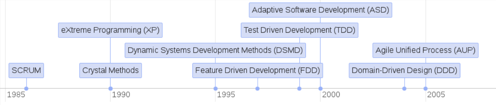
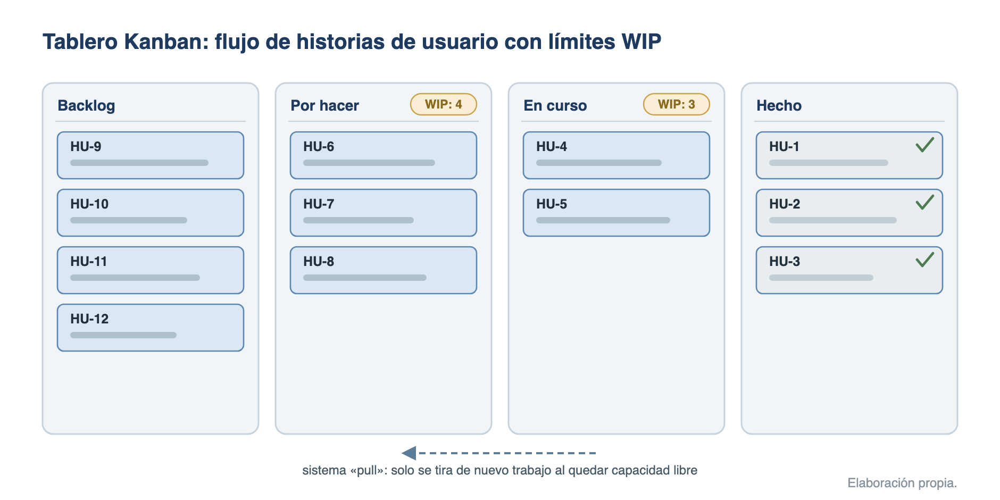

# Metodologías ágiles y escalado ágil

Las metodologías ágiles organizan el desarrollo en iteraciones cortas con entregas frecuentes y adaptación continua al cambio, frente al enfoque predictivo clásico de planificarlo todo por adelantado. Este tema recorre esa contraposición, el **Manifiesto Ágil (2001)**, los métodos ágiles principales (**Scrum**, **Lean**, **Kanban** y **XP**) y los frameworks para escalarlos a organizaciones grandes (**SAFe**, **LeSS** y **SoS**).

## Metodologías predictivas frente a ágiles

Las metodologías de desarrollo se pueden clasificar según tres conceptos clave:

- **Desarrollo**:
    - **Completo**: desde el inicio del proyecto se dispone de una definición detallada de todos los requerimientos.
    - **Incremental**: los requerimientos se van incorporando progresivamente a lo largo del proyecto.
- **Trabajo**:
    - **Secuencial**: el trabajo se realiza en fases que se suceden una tras otra.
    - **Concurrente**: las fases pueden solaparse, permitiendo mayor flexibilidad y adaptación.
- **Conocimiento**:
    - **En los procesos**: siguiendo pasos predefinidos, cualquier persona puede llevar a cabo el trabajo.
    - **En las personas**: depende de la aptitud y actitud individual de cada miembro del equipo.

De ahí salen los dos modelos de gestión:

- **Predictiva (o clásica)**: define y planifica todo el proceso desde el principio (alcance, plazos y costes cerrados) y gestiona el cambio como excepción. Su ciclo de vida típico es la cascada.
- **Adaptativa (o evolutiva, ágil)**: asume que los requisitos cambiarán y adapta el plan de forma continua a las necesidades del cliente, entregando valor en ciclos cortos.

| Aspecto | Enfoque predictivo | Enfoque ágil |
| --- | --- | --- |
| Requisitos | cerrados al inicio | evolucionan durante el proyecto |
| Entrega | única, al final | incremental y frecuente |
| Cambio | excepción, gestión formal | bienvenido, incluso tardío |
| Cliente | al inicio y al final | colabora a diario con el equipo |
| Medida de progreso | cumplimiento del plan | software funcionando |
| Adecuado para | requisitos estables, entornos regulados | incertidumbre alta, necesidad de feedback rápido |

En la práctica ambos enfoques conviven: muchos proyectos (también en la Administración) usan **enfoques híbridos**, con marco contractual predictivo y ejecución iterativa.

### El Manifiesto Ágil

En 2001, un grupo de 17 expertos en desarrollo de software (después constituidos como **Agile Alliance**) firmó el **Manifiesto por el Desarrollo Ágil de Software**, basado en **4 valores** y **12 principios**. El desarrollo ágil es **iterativo e incremental**: los requisitos y las soluciones evolucionan con el proyecto.

Los 4 valores (lo de la izquierda se valora más que lo de la derecha):

- **Individuos e interacciones** sobre procesos y herramientas: los procesos deben adaptarse a las personas, no al revés.
- **Software funcionando** sobre documentación exhaustiva: el software operativo y los prototipos aportan más valor que los documentos extensos.
- **Colaboración con el cliente** sobre negociación contractual: el cliente se integra como un miembro más del equipo, esencial en proyectos difíciles de definir o inestables.
- **Respuesta ante el cambio** sobre seguir un plan: adaptabilidad frente a planes rígidos preestablecidos.

Los 12 principios:

1. **Satisfacer al cliente** mediante entregas tempranas y continuas de software con valor.
2. **Aceptar cambios** en los requisitos, incluso en etapas tardías del desarrollo.
3. **Entregar software funcional frecuentemente**, entre dos semanas y dos meses, con preferencia por los periodos cortos.
4. **Colaboración diaria** entre responsables de negocio y desarrolladores durante todo el proyecto.
5. **Construir los proyectos en torno a individuos motivados**, dándoles el entorno y el apoyo que necesitan.
6. **Conversación cara a cara** como método más eficiente y efectivo de comunicar información.
7. **El software funcionando es la medida principal de progreso**.
8. **Desarrollo sostenible**: mantener un ritmo constante de forma indefinida.
9. **Atención continua a la excelencia técnica y al buen diseño** para mejorar la agilidad.
10. **Simplicidad**: maximizar la cantidad de trabajo no realizado es esencial.
11. **Equipos auto-organizados** generan las mejores arquitecturas, requisitos y diseños.
12. **Reflexión y ajuste periódicos** del equipo para ser más efectivo.

### Estilo de trabajo ágil

- Se parte de un **producto mínimo viable (MVP)** y se añade funcionalidad en **iteraciones** guiadas por la retroalimentación.
- Las funcionalidades se introducen **cuando son necesarias**, evitando trabajo innecesario, y se busca que el **coste del cambio** no se dispare con el avance del proyecto.
- El **cliente participa activamente** como miembro del equipo, lo que ataca las causas principales de fracaso: retrasos, insatisfacción del cliente y frustración del equipo.
- Como marco de gestión, Highsmith (*Agile Project Management*, 2004) resume el ciclo ágil en **5 fases**: **concebir** (visión y alcance), **especular** (planificación flexible de funcionalidades y entregas), **explorar** (desarrollar y probar), **adaptar** (ajustar el plan con la retroalimentación) y **cerrar** (finalizar y evaluar).

Además de Scrum, Lean, Kanban y XP, son métodos ágiles Crystal, DSDM, Feature Driven Development (FDD), Adaptive Software Development (ASD) y Agile Unified Process (AUP):

{width=100%}

## Scrum

Scrum es un **marco de trabajo (framework) ligero** para generar valor a través de soluciones adaptativas a problemas complejos. La **Guía de Scrum 2020** (Schwaber y Sutherland) subraya que **no es una metodología**: es deliberadamente **incompleto** y solo define las partes necesarias para aplicar su teoría; sobre él cada organización monta sus propios procesos y prácticas. El nombre procede del artículo «The New New Product Development Game» (Takeuchi y Nonaka, 1986), pero el marco lo formalizaron **Ken Schwaber y Jeff Sutherland** a principios de los 90 (presentado en OOPSLA 1995); la guía oficial se publica desde 2010 y su versión vigente es la de **noviembre de 2020**.

- **Teoría**: Scrum se basa en el **empirismo** (el conocimiento proviene de la experiencia y las decisiones se toman sobre lo observado) y el **pensamiento Lean** (reducir el desperdicio y centrarse en lo esencial). Emplea un enfoque **iterativo e incremental** sobre tres pilares:
    - **Transparencia**: el proceso y el trabajo deben ser visibles para quienes lo realizan y lo reciben; se materializa en los artefactos.
    - **Inspección**: los artefactos y el progreso se inspeccionan con frecuencia; los 5 eventos dan la cadencia.
    - **Adaptación**: cuando algo se desvía, se ajusta cuanto antes.
- **Valores (5)**: **compromiso, enfoque, apertura, respeto y coraje**. Su práctica diaria construye la confianza que hace funcionar los pilares.
- **El equipo Scrum**: una única unidad cohesionada, **sin sub-equipos ni jerarquías**, de **10 o menos personas**, **autogestionada** (elige quién, cómo y en qué trabaja) y **multifuncional** (tiene todas las habilidades para crear valor en cada Sprint). Define **tres responsabilidades** (la Guía 2020 ya no habla de «roles»):
    - **Developers (desarrolladores)**: crean el incremento; responsables del Sprint Backlog, de la calidad conforme a la Definición de Hecho y de adaptar su plan cada día.
    - **Product Owner**: maximiza el valor del producto; responsable único de la gestión del **Product Backlog** (objetivo del producto, orden y transparencia de sus elementos). Es **una persona, no un comité**.
    - **Scrum Master**: responsable de la **efectividad del equipo** y de que Scrum se aplique según la guía. Es un **líder verdadero al servicio** del equipo y de la organización (forma, elimina impedimentos, facilita los eventos cuando hace falta), no un mero facilitador ni un jefe de proyecto.

Los **5 eventos** (el Sprint contiene a los otros cuatro, que son oportunidades formales de inspección y adaptación):

| Evento | Duración (Sprint de 1 mes) | Propósito |
| --- | --- | --- |
| **Sprint** | **un mes o menos**, duración fija | contenedor del resto de eventos; cada Sprint entrega un incremento y empieza inmediatamente después del anterior |
| **Sprint Planning** | máximo **8 horas** | plan del Sprint sobre tres temas: **por qué** es valioso (Sprint Goal), **qué** se puede hacer (selección del Product Backlog) y **cómo** se hará el trabajo |
| **Daily Scrum** | **15 minutos**, cada día | los desarrolladores inspeccionan el progreso hacia el Sprint Goal y adaptan su plan del día |
| **Sprint Review** | máximo **4 horas** | inspeccionar el incremento con los interesados y adaptar el Product Backlog |
| **Sprint Retrospective** | máximo **3 horas** | planificar mejoras de calidad y efectividad del propio equipo; cierra el Sprint |

Para sprints más cortos, los eventos suelen acortarse en proporción. Durante el Sprint no se hacen cambios que pongan en peligro el Sprint Goal; solo el Product Owner puede **cancelar un Sprint** si el objetivo queda obsoleto.

Los **3 artefactos** representan trabajo o valor y cada uno incorpora un **compromiso** (novedad de la Guía 2020) que refuerza el empirismo:

| Artefacto | Qué es | Compromiso asociado |
| --- | --- | --- |
| **Product Backlog** | lista **emergente y ordenada** de lo necesario para mejorar el producto; única fuente de trabajo del equipo | **Product Goal** (objetivo del producto): estado futuro que sirve de meta a largo plazo |
| **Sprint Backlog** | el Sprint Goal, los elementos seleccionados y el plan de los desarrolladores para entregarlos | **Sprint Goal** (objetivo del Sprint): único objetivo del Sprint, da foco y flexibilidad |
| **Incremento** | escalón concreto y **utilizable** hacia el Product Goal; puede haber varios por Sprint | **Definition of Done** (definición de hecho): descripción formal de la calidad exigida para que el trabajo cuente como incremento |

## Lean y Kanban

Ambos proceden del **sistema de producción de Toyota (TPS)** y comparten el foco en el flujo de valor y la eliminación de desperdicio; aplicados al software, Lean aporta los principios y Kanban el método de gestión visual del flujo.

### Lean Software Development

Adaptación de los principios de la producción ajustada al software (Mary y Tom Poppendieck, 2003). Se centra en **eliminar todo lo que no aporta valor** al cliente (tiempos muertos, cuellos de botella, trabajo innecesario). Sus **7 principios**:

- **Eliminar desperdicios**: suprimir toda actividad que no agrega valor.
- **Incorporar la calidad** (*build quality in*): hacerlo bien desde el principio, no inspeccionar al final.
- **Crear conocimiento**: el desarrollo es aprendizaje; documentar y compartir lo aprendido.
- **Aplazar el compromiso**: tomar las decisiones irreversibles lo más tarde posible, con más información.
- **Entregar rápido**: proporcionar valor al cliente lo antes posible.
- **Respetar a las personas**: valorar y empoderar al equipo.
- **Optimizar el conjunto**: ver el sistema completo, no optimizar partes aisladas.

Los **7 desperdicios** del desarrollo de software (traslación de los *muda* de Toyota): trabajo a medias, funcionalidades extra, reaprendizaje, traspasos de trabajo entre personas, cambios de tarea, esperas y defectos.

### Kanban

Método visual para **gestionar y mejorar el flujo de trabajo**, formulado para el trabajo del conocimiento por David J. Anderson (2010). Es **evolutivo y no prescriptivo**: se empieza con el proceso actual y se mejora de forma incremental, sin roles ni iteraciones obligatorias. Sus **6 prácticas**:

- **Visualizar el flujo de trabajo**: tablero con columnas por estado (por ejemplo: backlog, por hacer, en curso, hecho); cada tarjeta es un elemento de trabajo.
- **Limitar el trabajo en curso (WIP)**: máximo de elementos simultáneos por columna; es el rasgo definitorio del método y convierte el flujo en un **sistema pull** (se «tira» de nuevo trabajo solo al quedar capacidad libre).
- **Gestionar el flujo**: medir y suavizar el avance, detectando cuellos de botella.
- **Hacer las políticas explícitas**: criterios claros de entrada y salida de cada estado.
- **Establecer bucles de retroalimentación**: cadencias de revisión del servicio y del sistema.
- **Mejorar colaborativamente**: evolución continua basada en datos y experimentación.

El tablero debe estar **visible para todo el equipo**, para facilitar la colaboración y la detección de impedimentos:

{width=100%}

- **Métricas de flujo**: **lead time** (desde la petición hasta la entrega), **cycle time** (desde que se empieza hasta que se termina), rendimiento (*throughput*) y diagrama de flujo acumulado (CFD).
- **Scrumban**: híbrido que combina la estructura de Scrum con el flujo visual y los límites WIP de Kanban.
- **Frente a Scrum**: Kanban no impone iteraciones ni responsabilidades; entrega en flujo continuo mientras Scrum trabaja en sprints con cadencia fija.

## Extreme Programming (XP)

Metodología ágil formulada por **Kent Beck** (*Extreme Programming Explained*, 1999; 2.ª edición, 2004) que lleva al extremo las mejores prácticas de ingeniería del software, con foco en la **calidad técnica** y la adaptación continua. Es la metodología ágil que más prescribe **cómo programar**, y complementa bien a Scrum (que solo define la gestión).

- **Valores (5)**: **comunicación** (fluida entre equipo y cliente), **simplicidad** (el diseño más simple que funcione), **retroalimentación** (continua, del código y del cliente), **coraje** (para cambiar lo que haga falta) y **respeto** (entre los miembros del equipo).
- **Prácticas principales**, agrupadas por ámbito:
    - **Planificación**: *planning game* (cliente y equipo negocian alcance de cada entrega), **historias de usuario** como unidad de requisito, **entregas pequeñas y frecuentes** (*small releases*) y **ritmo sostenible** (semana de 40 horas, sin heroicidades).
    - **Diseño**: **diseño simple**, **metáfora del sistema** (visión compartida de la arquitectura) y **refactorización continua** para mejorar el código sin cambiar su comportamiento.
    - **Codificación**: **programación en parejas** (*pair programming*: dos personas, un teclado; mejora el código y difunde conocimiento), **propiedad colectiva del código**, **integración continua** (integrar y construir varias veces al día) y **estándares de codificación**.
    - **Pruebas**: **desarrollo dirigido por pruebas (TDD)**: primero la prueba, después el código; **pruebas unitarias continuas**, **pruebas de aceptación** definidas por el cliente y **cliente on-site** (disponible en el equipo para resolver dudas).
- **Regla de calidad**: corregir los errores detectados **antes** de añadir nuevas funcionalidades.

## Escalado ágil: SAFe, LeSS, SoS

Los métodos ágiles se diseñaron para equipos pequeños; cuando muchos equipos trabajan sobre un mismo producto u organización hacen falta **frameworks de escalado** que coordinen dependencias, prioridades e integración.

- **SoS (Scrum of Scrums)**: el mecanismo más ligero: escala la Daily Scrum con una **reunión periódica de coordinación entre equipos**, a la que cada equipo envía un **embajador** para sincronizar avances, dependencias e impedimentos. Coste muy bajo, sin cambios estructurales; suficiente para pocos equipos.
- **LeSS (Large-Scale Scrum)** (Larman y Vodde, less.works): aplica las reglas de Scrum de un equipo a varios equipos con la mínima estructura añadida («más con menos»): **un solo Product Owner, un solo Product Backlog y un Sprint común** que produce un único incremento integrado. Dos configuraciones: **LeSS (2 a 8 equipos)** y **LeSS Huge (más de 8)**, que divide el producto en áreas de requisitos con Area Product Owners. Coste moderado: exige simplificar la organización, no añadirle capas.
- **SAFe (Scaled Agile Framework)**: el framework más completo y **prescriptivo**, orientado a grandes organizaciones; versión vigente **SAFe 6.0 (marzo de 2023)**, de Scaled Agile Inc. Elementos característicos:
    - **4 configuraciones**: **Essential** (la base), **Large Solution**, **Portfolio** y **Full**.
    - **ART (Agile Release Train)**: «equipo de equipos» de larga duración (**50-125 personas**) que planifica, integra y entrega valor conjuntamente.
    - **PI (Planning Interval)**: cadencia de planificación de **8-12 semanas**; su evento central es la **PI Planning**, que reúne a todo el ART.
    - **Roles propios**: **Release Train Engineer (RTE)** (facilita el ART), Product Management, System Architect, Business Owners.
    - Base doctrinal: **10 principios Lean-Agile**, pensamiento sistémico, DevOps y entrega bajo demanda; la comunicación alcanza hasta el nivel ejecutivo (Lean Portfolio Management).
    - Coste de implantación **alto**: cambios estructurales, formación y certificaciones.

| Framework | Escala típica | Prescripción | Coste | Rasgo diferencial |
| --- | --- | --- | --- | --- |
| **SoS** | pocos equipos Scrum | mínima | bajo | escala la Daily con embajadores |
| **LeSS** | 2-8 equipos (Huge: más de 8) | media | moderado | un Product Owner, un backlog y un Sprint comunes |
| **SAFe** | grandes organizaciones | alta | alto | ARTs con PI Planning; 4 configuraciones |

Otros enfoques citables: **Nexus** (Scrum.org, 3-9 equipos sobre un único Product Backlog) y el **modelo Spotify** (squads, tribus, chapters y guilds), más una cultura organizativa que un framework formal.

## Fuentes {.unnumbered .unlisted}

- Manifiesto por el Desarrollo Ágil de Software, 2001 (agilemanifesto.org): 4 valores y 12 principios.
- K. Schwaber y J. Sutherland, La Guía de Scrum, noviembre de 2020 (versión oficial vigente, verificada en scrumguides.org en julio de 2026; traducción española, PDF local).
- K. Beck, Extreme Programming Explained: Embrace Change, 2.ª ed., 2004.
- M. Poppendieck y T. Poppendieck, Lean Software Development: An Agile Toolkit, 2003.
- D. J. Anderson, Kanban: Successful Evolutionary Change for Your Technology Business, 2010.
- J. Highsmith, Agile Project Management: Creating Innovative Products, 2004 (fases del Agile Project Management framework).
- Scaled Agile Inc., SAFe 6.0, marzo de 2023 (framework.scaledagile.com, consultado en julio de 2026); C. Larman y B. Vodde, Large-Scale Scrum (less.works).
