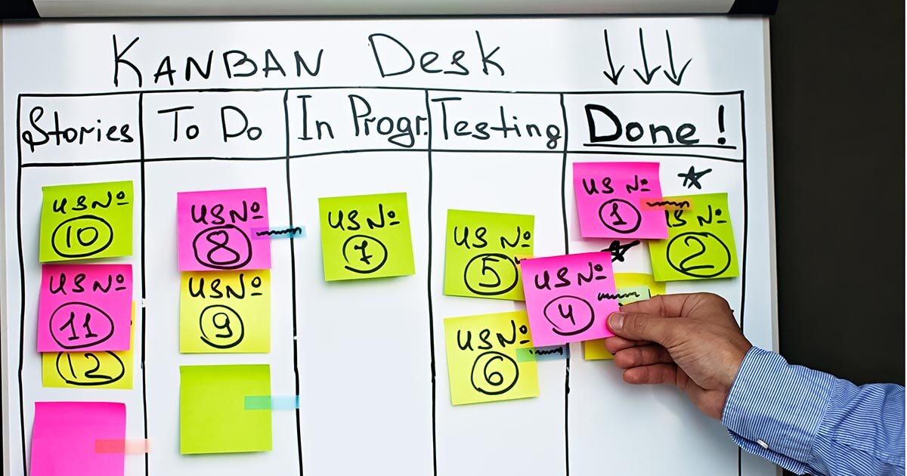

# Metodologías ágiles y escalado ágil

!!! warning "Tema pendiente de revisión"
    Este tema **no ha sido revisado** ni actualizado. Su contenido puede estar
    incompleto, desactualizado o contener errores. Úsalo con precaución y
    contrástalo siempre con fuentes oficiales.

## Clasificación de las Metodologías de Desarrollo

Las metodologías de desarrollo se clasifican en función de tres conceptos clave: **desarrollo**, **trabajo** y **conocimiento**.

- **Desarrollo**:
    - **Completo**: Desde el inicio del proyecto se dispone de una definición detallada de todos los requerimientos.
    - **Incremental**: Los requerimientos se van incorporando progresivamente a lo largo del proyecto.
- **Trabajo**:
    - **Secuencial**: El trabajo se realiza en fases que se suceden una tras otra.
    - **Concurrente**: Las fases pueden solaparse, permitiendo mayor flexibilidad y adaptación.
- **Conocimiento**:
    - **En los procesos**: Siguiendo pasos predefinidos, cualquier persona puede llevar a cabo el trabajo.
    - **En las personas**: Depende de la aptitud y actitud individual de cada miembro del equipo.

Además, existen dos modelos de gestión:

- **Predictiva**: Se busca definir y planificar todo el proceso de desarrollo desde el principio.
- **Evolutiva**: La gestión se adapta continuamente a las necesidades cambiantes del cliente.

## Metodologías Ágiles de Desarrollo

En 2001, un grupo de 17 expertos en desarrollo de software formó la **Agile Alliance**, dando lugar al **Manifiesto Ágil** (Beck et al., 2001), basado en **4 valores** y **12 principios** fundamentales. El desarrollo ágil se caracteriza por ser **iterativo e incremental**, permitiendo que los requisitos y soluciones evolucionen según las necesidades del proyecto.

### Los 4 Valores de la Agilidad

- **Personas e interacciones sobre procesos y herramientas**: Se valora la comunicación y colaboración entre individuos por encima de los procedimientos establecidos y las herramientas utilizadas. Los procesos deben adaptarse a las personas, no al revés.
- **Software que funciona sobre documentación exhaustiva**: Se prioriza la entrega de software operativo antes que una documentación extensa. La interacción directa y los prototipos aportan más valor que los documentos.
- **Colaboración con el cliente sobre negociación contractual**: Se fomenta una relación cercana y colaborativa con el cliente, considerándolo un miembro más del equipo. Esto es esencial en proyectos difíciles de definir o inestables.
- **Respuesta al cambio sobre seguimiento de un plan**: Se valora la adaptabilidad y flexibilidad ante los cambios por encima de seguir planes rígidos y preestablecidos.

### Los 12 Principios del Manifiesto Ágil

1. **Satisfacer al cliente** mediante entregas tempranas y continuas de software valioso.
2. **Aceptar cambios** en los requisitos, incluso en etapas tardías del desarrollo.
3. **Entregar software funcional frecuentemente**, con intervalos de entre dos semanas y dos meses, dando preferencia a periodos cortos.
4. **Colaboración diaria** entre desarrolladores y personas de negocios a lo largo del proyecto.
5. **Construir proyectos alrededor de individuos motivados**, proporcionándoles el entorno y apoyo necesarios.
6. **Comunicación cara a cara** como el método más eficiente y efectivo de transmitir información.
7. **El software que funciona es la medida principal** de progreso.
8. **Desarrollo sostenible**, manteniendo un ritmo constante e indefinido.
9. **Excelencia técnica y buen diseño** para mejorar la agilidad.
10. **Simplicidad**, entendida como maximizar el trabajo no realizado, es esencial.
11. **Equipos auto-organizados** que generan las mejores arquitecturas, requisitos y diseños.
12. **Reflexión y adaptación** periódica del equipo para mejorar su eficacia.

### Estilo General de las Metodologías Ágiles

- Se desarrolla un **prototipo inicial** con funcionalidad mínima (MVP) y se añade funcionalidad a través de **iteraciones** basadas en retroalimentación constante.
- El **coste de realizar cambios** es independiente de la fase de desarrollo.
- Las funcionalidades se introducen **cuando son necesarias**, evitando trabajo innecesario.
- El **cliente participa activamente** como miembro del equipo.
- Se eliminan los principales causantes de fracaso: retrasos y **insatisfacción del cliente**, así como la frustración del equipo de desarrollo.

### Fases del Agile Project Management Framework

1. **Concebir**: Definir la visión y alcance del proyecto.
2. **Especular**: Planificar de forma flexible las funcionalidades y entregas.
3. **Explorar**: Desarrollar y probar las funcionalidades.
4. **Adaptar**: Ajustar el plan según la retroalimentación y cambios.
5. **Cerrar**: Finalizar el proyecto y evaluar los resultados.

**Ejemplos de Metodologías Ágiles**: Scrum, Extreme Programming (XP), Crystal, Test Driven Development, Agile Unified Process

### SCRUM: Metodología de Gestión de Proyectos

Scrum es una metodología ágil propuesta en 1986 por Ikujiro Nonaka e Hirotaka Takeuchi en "The New New Product Development Game". Se basa en un proceso iterativo organizado en torno a **roles**, **artefactos** y **eventos**.

- **Roles**:
    - **Scrum Master**: Facilita el proceso y asegura la correcta aplicación de Scrum. Debe tener amplio conocimiento de la metodología.
    - **Product Owner**: Representa al cliente, define y prioriza los requisitos para maximizar el valor.
    - **Equipo de Desarrollo**: Grupo multidisciplinar de 3 a 8 personas responsables de crear el incremento del producto.
- **Artefactos**:
    - **Product Backlog**: Lista priorizada de requisitos o "historias de usuario". Es responsabilidad del Product Owner.
    - **Sprint Backlog**: Conjunto de tareas seleccionadas para el próximo sprint. Es responsabilidad del equipo.
    - **Incremento**: Producto funcional obtenido al final de cada sprint.
- **Eventos**:
    - **Sprint**: Iteración de desarrollo de 1 a 2 semanas con objetivos definidos.
    - **Planificación del Sprint**: Reunión para determinar el objetivo y las tareas del sprint (máximo 1 día).
    - **Reunión Diaria**: Encuentro de 15 minutos donde el equipo sincroniza actividades y detecta impedimentos.
    - **Revisión del Sprint**: Evaluación del incremento desarrollado y ajuste del Product Backlog (máximo 4 horas).
    - **Retrospectiva**: Análisis del proceso y definición de mejoras para próximos sprints (1-2 horas).

### Extreme Programming (XP)

XP es una metodología ágil que lleva al extremo las mejores prácticas de desarrollo, enfocándose en la **calidad** y la **eficiencia**.

- **5 Valores**:
    - **Comunicación**: Fluida y constante entre el equipo y con el cliente.
    - **Simplicidad**: Mantener el código y las soluciones lo más simples posible.
    - **Retroalimentación**: Continua para adaptarse y mejorar.
    - **Coraje**: Para enfrentar cambios y tomar decisiones difíciles.
    - **Respeto**: Entre todos los miembros del equipo.
- **Características**:
    - **Desarrollo iterativo e incremental**.
    - **Pruebas unitarias continuas** para asegurar la calidad.
    - **Programación en parejas** para mejorar el código y compartir conocimiento.
    - **Integración frecuente** con el cliente para alinearse con sus necesidades.
    - **Corrección de errores** antes de añadir nuevas funcionalidades.
    - **Refactorización** constante para mejorar el diseño del código.
    - **Propiedad compartida** del código entre todos los desarrolladores.
    - **Simplicidad** en las soluciones y diseño.

### Metodología Lean

Lean se enfoca en **eliminar todo lo que no aporta valor** al cliente, optimizando recursos y procesos.

- **Problemas a eliminar**:
    - **Tiempos muertos** que generan ineficiencias.
    - **Cuellos de botella** que ralentizan el flujo de trabajo.
- **Principios (7)**:
    - **Eliminar desperdicios**: Identificar y eliminar actividades que no agregan valor.
    - **Orientación a la calidad**: Hacerlo bien desde el principio.
    - **Conocimiento compartido**: Entender profundamente lo que el cliente necesita.
    - **Diferir el compromiso**: Tomar decisiones lo más tarde posible para tener más información.
    - **Entregas rápidas**: Proporcionar valor al cliente lo antes posible.
    - **Respeto**: Valorar y empoderar a las personas involucradas.
    - **Visión holística**: Optimizar el sistema completo, no solo partes aisladas.

### KANBAN

Kanban es una técnica visual para **gestionar y mejorar el flujo de trabajo** en proyectos.

- **Objetivos**:
    - **Gestionar el flujo** de tareas de manera eficiente.
    - **Comunicar el estado** del proyecto a todo el equipo de forma transparente.
- **División de tareas**:
    - **Backlog**: Tareas pendientes de priorización.
    - **To Do**: Tareas por hacer.
    - **Doing**: Tareas en proceso.
    - **Done**: Tareas completadas.
- **Nota**: El tablero Kanban debe estar **visible para todo el equipo** para facilitar la colaboración y la detección de impedimentos.

### Escalado Ágil

Para aplicar metodologías ágiles en **organizaciones grandes o complejas**, se utilizan frameworks especializados.

- **SAFe (Scaled Agile Framework)**:
    - **Principios**: Liderazgo ágil, agilidad técnica y de equipos, DevOps y entregas bajo demanda, enfoque Lean en soluciones empresariales.
    - **Características**:
        - **Tamaño de compañía**: Grandes organizaciones.
        - **Comunicación**: Se extiende hasta niveles ejecutivos.
        - **Costo**: Alto, requiere cambios estructurales significativos.
- **LeSS (Large Scale Scrum)**:
    - **Modelos**:
        - **LeSS Básico**: Hasta 8 equipos de 8 personas.
        - **LeSS Huge**: Para cientos de personas trabajando en conjunto.
    - **Características**:
        - **Tamaño de compañía**: Organizaciones medianas.
        - **Comunicación**: Entre equipos y niveles de gestión.
        - **Costo**: Bajo, enfoque en simplicidad y eficiencia.
- **SoS (Scrum of Scrums)**:
    - **Descripción**: Estructura jerárquica que permite escalar Scrum en múltiples equipos.
    - **Características**:
        - **Tamaño de compañía**: Varias células Scrum trabajando en un mismo proyecto.
        - **Comunicación**: Enfocada entre equipos para coordinar esfuerzos.
        - **Costo**: Bajo, facilita la colaboración sin grandes cambios estructurales.
