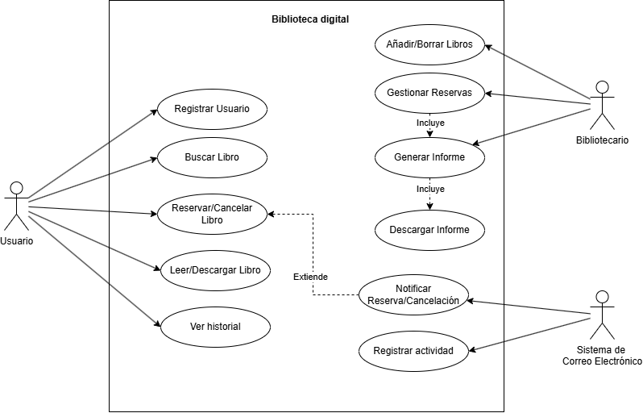
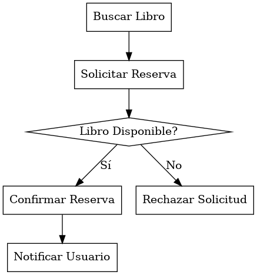

# Análisis y diseño de aplicaciones

El análisis y el diseño son las etapas del desarrollo que transforman las necesidades del usuario en una especificación construible: el análisis define qué debe hacer el sistema y el diseño cómo lo hará. Este tema repasa el ciclo de vida del software y sus modelos, la ingeniería de requisitos, las dos técnicas principales de captura funcional (casos de uso e historias de usuario) y el prototipado y diseño.

## Ciclo de vida del software y sus modelos

El **ciclo de vida del software** es el conjunto de etapas por las que pasa un sistema de información desde su concepción hasta su retirada. El estándar **ISO/IEC/IEEE 12207:2017** normaliza los procesos del ciclo de vida (procesos de acuerdo, organizativos, de gestión y técnicos); a efectos de examen, lo esencial son las etapas clásicas y los modelos que las organizan.

### Etapas del ciclo de vida

- **Estudio de viabilidad (factibilidad)**: analiza beneficios, costes y alternativas de implantar el sistema, evaluando su viabilidad **técnica, económica y operativa**.
- **Análisis de requisitos**: identifica, especifica y documenta los requisitos funcionales y no funcionales que debe satisfacer el sistema.
- **Diseño**: elabora la arquitectura y las especificaciones detalladas (módulos, datos, interfaces) que guían la construcción.
- **Desarrollo (implementación)**: transforma el diseño en código funcional.
- **Pruebas**: verifican que el sistema cumple los requisitos y detectan defectos antes de la entrega. Los niveles, tipos y técnicas de prueba se estudian en el tema [27](27-testeo-de-software.md).
- **Implantación**: prepara el entorno de hardware y software, configura el sistema y lo despliega en producción.
- **Mantenimiento**: conserva el sistema operativo y actualizado durante su vida útil. Es la etapa más larga del ciclo y suele concentrar la mayor parte del coste total del sistema.

### Tipos de mantenimiento

El estándar **ISO/IEC/IEEE 14764:2022** distingue **cuatro tipos** de mantenimiento:

- **Correctivo**: elimina defectos detectados durante el uso del sistema.
- **Preventivo**: corrige defectos latentes antes de que se manifiesten como fallos.
- **Adaptativo**: ajusta el sistema a cambios de su entorno (normativa, plataformas, tecnología).
- **Perfectivo**: mejora o añade funcionalidad y atributos de calidad.

Correctivo y preventivo constituyen el mantenimiento de **corrección**; adaptativo y perfectivo, el de **evolución**.

### Modelos de ciclo de vida

Los modelos de ciclo de vida (o modelos de proceso) organizan las etapas anteriores en el tiempo:

- **Cascada (clásico)**: enfoque **secuencial**: cada etapa se completa antes de iniciar la siguiente.
    - *Ventajas*: desarrollo ordenado, fácil de planificar y documentar; adecuado para proyectos con requisitos estables y bien definidos.
    - *Inconvenientes*: el usuario no valida hasta el final; los errores de requisitos se descubren tarde y son caros de corregir.
- **Modelo en V**: variante de la cascada que asocia a cada fase de definición su nivel de prueba: requisitos con las **pruebas de aceptación**, análisis del sistema con las **pruebas de sistema**, diseño arquitectónico con las **pruebas de integración** y diseño detallado con las **pruebas unitarias**. Hace explícitas la verificación y la validación desde el inicio del proyecto.
- **Prototipado**: enfoque **iterativo** que construye versiones preliminares del sistema para validar los requisitos con el usuario.
    - *Ventajas*: reduce el riesgo de fracaso en productos poco conocidos; aclara requisitos ambiguos.
    - *Inconvenientes*: el usuario puede confundir el prototipo con el producto final y consolidar aspectos no óptimos.
- **Iterativo e incremental**: divide el producto en porciones que se desarrollan en ciclos repetidos.
    - *Iterativo*: produce versiones sucesivas completas que se refinan (v0.1, v0.2, v0.3…).
    - *Incremental*: entrega bloques de funcionalidad que se van sumando (incremento 1, 2, 3…).
- **Espiral (Boehm, 1988)**: modelo **dirigido por el riesgo** que combina iteración y prototipado. Cada vuelta de la espiral recorre **cuatro cuadrantes**: (1) determinar objetivos y restricciones, (2) evaluar alternativas e identificar y resolver **riesgos**, (3) desarrollar y verificar, y (4) planificar la siguiente iteración. La dimensión radial representa el coste acumulado.
    - *Ventajas*: permite determinar la viabilidad en fases tempranas; integra el análisis de riesgos en el propio proceso.
    - *Inconvenientes*: complejo de gestionar; exige experiencia en evaluación de riesgos.
- **Ágil**: familia de enfoques iterativos ligeros basados en el **Manifiesto Ágil (2001)** y sus cuatro valores: individuos e interacciones, software funcionando, colaboración con el cliente y respuesta al cambio. Prima la entrega frecuente de valor y admite requisitos evolutivos. Scrum, Kanban, XP y el escalado ágil se estudian en el tema [21](21-metodologias-agiles-y-escalado-agil.md).

## Análisis de requisitos: técnicas y gestión

La **ingeniería de requisitos** es el proceso de descubrir, especificar, validar y gestionar los requisitos de un sistema. Un **requisito** es una condición o capacidad que el sistema debe cumplir para satisfacer una necesidad del cliente, del usuario o de una norma.

Los requisitos se clasifican en **dos tipos principales**:

- **Funcionales**: definen las funciones y comportamientos concretos del sistema (qué hace); se capturan típicamente como casos de uso o historias de usuario.
- **No funcionales**: definen atributos de calidad y restricciones (cómo lo hace): rendimiento, seguridad, usabilidad, disponibilidad, portabilidad… Las características de calidad se estudian con ISO/IEC 25010 en el tema [25](25-calidad-del-software.md).

Por nivel de abstracción se distinguen los **requisitos de negocio** (objetivos de la organización), los **de usuario** (tareas que el usuario debe poder realizar) y los **de sistema** (especificación detallada y verificable).

### El proceso de ingeniería de requisitos

- **Estudio de viabilidad**: evalúa si el proyecto es factible en términos de tecnología, coste y recursos.
- **Elicitación (obtención) y análisis**: recolecta los requisitos de los interesados y resuelve conflictos, solapes y ambigüedades.
- **Especificación**: documenta los requisitos de forma precisa y verificable (la ERS).
- **Validación**: confirma con el cliente que los requisitos reflejan sus necesidades reales.
- **Gestión de requisitos**: actividad transversal que controla los cambios y la trazabilidad durante todo el proyecto.

### Técnicas de elicitación

- **Entrevistas**: abiertas (exploratorias) o estructuradas (guion cerrado); la técnica más habitual.
- **Talleres de trabajo (workshops, JAD)**: sesiones conjuntas de usuarios y analistas para acordar requisitos en grupo.
- **Cuestionarios y encuestas**: recogen información de muchos usuarios a bajo coste.
- **Observación (etnografía)**: el analista observa el trabajo real del usuario en su contexto; descubre requisitos implícitos.
- **Análisis de documentación**: normativa, procedimientos, sistemas existentes.
- **Prototipos**: versiones preliminares que provocan realimentación temprana.
- **Escenarios y casos de uso**: descripciones de interacciones concretas con el sistema.
- **Tormenta de ideas (brainstorming)**: generación libre de ideas al inicio, útil con requisitos difusos.

### La especificación de requisitos (ERS)

La **especificación de requisitos del software (ERS)** es el documento que describe de forma completa el comportamiento externo del sistema, separando la funcionalidad de la implementación. El estándar de referencia es **ISO/IEC/IEEE 29148:2018**, que sustituyó al clásico **IEEE 830-1998** (del que procede la lista de características). Todo requisito (y la ERS en conjunto) debe ser:

- **Correcto y necesario**: refleja una necesidad real.
- **Inequívoco**: admite una sola interpretación.
- **Completo**: no faltan requisitos ni casos por definir.
- **Consistente**: sin contradicciones internas.
- **Priorizado**: ordenado por importancia y estabilidad.
- **Verificable**: existe un método de prueba finito y objetivo para comprobarlo.
- **Modificable**: puede cambiarse de forma controlada sin afectar al resto.
- **Trazable**: su origen y sus productos derivados pueden seguirse en ambos sentidos.

### Gestión de requisitos

- **Línea base**: conjunto de requisitos revisado y aprobado que sirve de referencia contractual; solo cambia mediante control formal.
- **Trazabilidad**: la **matriz de trazabilidad** enlaza cada requisito con su origen (interesado, norma) y con los elementos que lo materializan (diseño, código, pruebas), en ambos sentidos.
- **Control de cambios**: procedimiento formal de solicitud, evaluación de impacto, aprobación e incorporación de cambios sobre la línea base.
- **Priorización**: la técnica **MoSCoW** clasifica los requisitos en *Must have* (imprescindible), *Should have* (importante), *Could have* (deseable) y *Won't have* (descartado por ahora).
- **Herramientas**: IBM DOORS, Jira, Azure DevOps, hojas de trazabilidad.

## Casos de uso e historias de usuario

Los casos de uso y las historias de usuario son las dos técnicas principales para capturar **requisitos funcionales**: los primeros proceden del mundo del Proceso Unificado y UML; las segundas, de las metodologías ágiles.

### Casos de uso

Un **caso de uso** describe una secuencia de interacciones entre el sistema y sus actores que produce un **resultado de valor observable** para un actor. Cada caso de uso se centra en una única **meta o tarea** y se redacta en el lenguaje del dominio, sin tecnicismos, en colaboración con el cliente.

- **Actor**: rol externo que interactúa con el sistema (persona, otro sistema u organización). El actor **primario** inicia el caso de uso y obtiene el valor; el **secundario** da soporte (por ejemplo, un sistema externo de notificaciones).
- **Relaciones** del diagrama de casos de uso (UML 2.5.1):
    - **Asociación**: vincula un actor con los casos de uso en que participa.
    - **Inclusión (include)**: el caso base incorpora **siempre** el comportamiento del caso incluido; factoriza pasos comunes a varios casos.
    - **Extensión (extend)**: el caso extensor añade comportamiento **opcional o condicional** al caso base; la flecha discontinua apunta del extensor al base.
    - **Generalización**: herencia entre actores o entre casos de uso (el hijo hereda y especializa el comportamiento del padre).
- **Niveles de estructuración**: del **diagrama de contexto** (límites del sistema y su entorno) se pasa al **diagrama inicial** (principales casos de uso) y de ahí al **modelo de casos de uso** completo (relaciones y descripciones detalladas).
- **Plantilla de descripción**: título, actores implicados, resumen, **precondiciones** (qué debe cumplirse antes), **postcondiciones** (estado resultante), relaciones (incluye, extiende, hereda de) y **flujo de eventos actor-sistema**, con flujo principal, flujos alternativos y excepciones.

### Historias de usuario

Una **historia de usuario** es una descripción breve de una funcionalidad contada desde la perspectiva de quien la necesita, con el formato: **«Como [rol], quiero [funcionalidad] para [beneficio]»**. No pretende ser una especificación completa, sino un recordatorio para conversar.

- **Las 3 C** (Ron Jeffries): **tarjeta** (*card*: la frase breve), **conversación** (*conversation*: el detalle se acuerda hablando justo a tiempo) y **confirmación** (*confirmation*: los criterios de aceptación).
- **Criterios INVEST** (Bill Wake, 2003) de una buena historia: **I**ndependiente, **N**egociable, **V**aliosa, **E**stimable, pequeña (**S**mall) y verificable (**T**estable).
- **Criterios de aceptación**: condiciones verificables que debe cumplir la historia para darse por terminada; es habitual el formato **Dado-Cuando-Entonces** (*Given-When-Then*, sintaxis Gherkin), que sirve de base a las pruebas de aceptación automatizadas.
- **Épicas**: historias demasiado grandes para una iteración, que se descomponen en historias más pequeñas; todas viven en el *product backlog* priorizado.

### Comparación

| Aspecto | Casos de uso | Historias de usuario |
| --- | --- | --- |
| Origen | Jacobson (OOSE, 1992); Proceso Unificado y UML | Metodologías ágiles (XP, Scrum) |
| Nivel de detalle | Completo por adelantado (flujos, excepciones) | Mínimo; se detalla en conversación justo a tiempo |
| Forma | Documento estructurado y diagrama UML | Frase breve más criterios de aceptación |
| Alcance | Meta completa de un actor | Incremento pequeño de valor |
| Uso típico | Requisitos estables, contratos, sistemas complejos | Backlog evolutivo, entregas iterativas |

## Prototipado y diseño

Validados los requisitos, el prototipado permite explorar la solución con el usuario antes de construirla, y el diseño transforma la especificación en una estructura técnica realizable.

### Prototipado

- **Según su destino**:
    - **Desechable** (*throwaway*): se construye rápido para aclarar requisitos y se descarta; no debe pasar a producción.
    - **Evolutivo**: se refina iterativamente hasta convertirse en el producto final.
- **Según su fidelidad**:
    - **Baja fidelidad**: esbozos en papel o esquemas simples; baratos y rápidos de cambiar.
    - **Alta fidelidad**: apariencia e interacción casi finales; útiles para validar la experiencia de uso.
- **Artefactos habituales**: **sketch** (esbozo a mano), **wireframe** (estructura de pantalla sin estilo visual), **mockup** (diseño visual estático) y **prototipo interactivo** (navegable, sin lógica real).
- **Riesgos**: generar expectativas irreales de avance, confundir el prototipo con el producto y promocionar a producción código de prototipo sin calidad suficiente.

### Diseño del software

El diseño se aborda en dos niveles complementarios:

- **Diseño arquitectónico (alto nivel)**: descompone el sistema en componentes o subsistemas y define sus interfaces; selecciona el estilo arquitectónico (capas, cliente-servidor, microservicios; ver tema [56](56-arquitecturas-de-desarrollo-web.md)) y las tecnologías.
- **Diseño detallado (bajo nivel)**: define estructuras de datos, clases, algoritmos e interfaces internas de cada módulo; se modela habitualmente con UML (ver tema [24](24-proceso-unificado-y-uml.md)).

Dimensiones del diseño según Pressman: diseño **de datos**, **arquitectónico**, **de interfaz** y **procedimental** (a nivel de componentes).

Principios de un buen diseño:

- **Abstracción**: trabajar en cada nivel con los conceptos relevantes, ocultando el detalle inferior.
- **Modularidad**: dividir el sistema en módulos con responsabilidad única y bien delimitada.
- **Alta cohesión y bajo acoplamiento**: cada módulo hace una sola cosa completa (cohesión) y depende lo mínimo de los demás (acoplamiento).
- **Ocultación de información** (Parnas): cada módulo esconde sus decisiones internas tras una interfaz estable.
- **Separación de intereses** (*separation of concerns*): aspectos distintos (presentación, negocio, datos) en elementos distintos.

## Supuesto práctico 1: diagramas de casos de uso y de actividades

### Enunciado

La Generalitat Valenciana quiere implantar un **sistema de gestión de una biblioteca digital** para su red de bibliotecas públicas. El sistema debe permitir a los usuarios registrarse, buscar libros, reservarlos y leerlos en línea o descargarlos si la licencia lo permite. Los bibliotecarios deben poder añadir nuevos libros, gestionar reservas y generar y descargar informes de uso.

Requisitos funcionales:

- **Usuarios**: registrarse con nombre de usuario y contraseña; buscar libros por título, autor, género o palabras clave; reservar libros para leerlos en línea o descargarlos; cancelar una reserva; ver el historial de lecturas y las reservas activas.
- **Bibliotecarios**: añadir libros con sus metadatos (título, autor, género, licencia); eliminar libros no disponibles; gestionar reservas (aprobarlas o rechazarlas); generar y descargar informes de uso.
- **Sistema**: enviar notificaciones por correo electrónico al confirmar o cancelar reservas; mantener un registro de actividad para auditorías.

Se pide: (1) el diagrama de casos de uso con actores y relaciones, y (2) el diagrama de actividades del proceso «Reserva de un libro».

### Solución: diagrama de casos de uso

- **Actores**: *Usuario* y *Bibliotecario* (primarios) y *Sistema de correo electrónico* (secundario: sistema externo que da soporte a las notificaciones).
- **Casos de uso**: Registrar usuario, Buscar libro, Reservar/cancelar libro, Leer/descargar libro y Ver historial (Usuario); Añadir/borrar libros, Gestionar reservas y Generar informe (Bibliotecario); Notificar reserva/cancelación y Registrar actividad (soporte).
- **Relaciones**:
    - **Asociación**: el Usuario con sus cinco casos de uso; el Bibliotecario con Añadir/borrar libros, Gestionar reservas y Generar informe; el Sistema de correo electrónico con Notificar reserva/cancelación y Registrar actividad.
    - **Inclusión**: «Gestionar reservas» incluye «Generar informe», que a su vez incluye «Descargar informe»: comportamiento que se ejecuta siempre como parte del caso base.
    - **Extensión**: «Notificar reserva/cancelación» extiende «Reservar/cancelar libro»: solo se ejecuta cuando la reserva llega a confirmarse o cancelarse (flecha discontinua del extensor al caso base).

### Solución: diagrama de actividades

El flujo del proceso «Reserva de un libro» es el siguiente:

1. El usuario busca un libro y el sistema muestra los resultados.
2. El usuario selecciona un libro y solicita la reserva.
3. El sistema verifica la disponibilidad y la licencia (**nodo de decisión**).
    - Si el libro está disponible, se confirma la reserva y se notifica al usuario.
    - Si no lo está, se rechaza la solicitud.
4. El sistema actualiza el estado del libro y el registro de reservas.

En notación UML completa, el diagrama incorpora además un **nodo inicial** (círculo relleno), un **nodo final** (círculo con borde), guardas entre corchetes en cada rama de la decisión («[disponible]», «[no disponible]») y, opcionalmente, **calles** (*swimlanes*) que reparten las actividades entre usuario y sistema. La figura muestra la versión simplificada del flujo:

{width=40%}

## Supuesto práctico 2: estimación por puntos de función

El **análisis de puntos de función** (Albrecht, IBM, **1979**; método **IFPUG**, normalizado como **ISO/IEC 20926**) mide el **tamaño funcional** del software desde la perspectiva del usuario, con independencia de la tecnología, y es la base habitual para estimar esfuerzo, plazo y coste (es la técnica que subyace a herramientas corporativas de estimación como gvEstima, tema [19](19-direccion-y-gestion-de-proyectos.md)). Se cuentan cinco tipos de funciones, ponderadas por complejidad:

| Componente | Qué mide | Simple | Media | Compleja |
| --- | --- | :---: | :---: | :---: |
| **EI** (entrada externa) | Proceso que introduce o modifica datos | 3 | 4 | 6 |
| **EO** (salida externa) | Salida con elaboración o cálculo (informes) | 4 | 5 | 7 |
| **EQ** (consulta externa) | Recuperación de datos sin cálculo | 3 | 4 | 6 |
| **ILF** (fichero lógico interno) | Grupo de datos mantenido por la aplicación | 7 | 10 | 15 |
| **EIF** (fichero de interfaz externo) | Grupo de datos de otra aplicación, solo consultado | 5 | 7 | 10 |

Los **puntos de función sin ajustar (PFSA)** se multiplican por el **factor de ajuste**: VAF = 0,65 + 0,01 × ΣGSC, donde ΣGSC es la suma de las **14 características generales del sistema** (comunicaciones de datos, procesamiento distribuido, rendimiento, facilidad de uso, reutilización, facilidad de cambio...), valoradas de **0 a 5**; el factor queda así entre **0,65 y 1,35**.

### Enunciado

Se estima una aplicación de **gestión de ayudas** con estas funciones: registro de solicitudes (entrada compleja), modificación de solicitudes (entrada media) y alta de solicitantes (entrada simple); generación de resoluciones (salida media) e informe estadístico anual (salida compleja); consulta del estado de una solicitud (consulta simple) y consulta del histórico (consulta media). Datos: fichero de solicitudes (interno, complejidad media), fichero de solicitantes (interno, simple) y verificación de identidad contra la Plataforma de Intermediación de Datos (fichero externo, simple). La valoración de las 14 características generales suma **42** puntos. La organización tiene una productividad histórica de **8 horas por punto de función**, jornadas efectivas de **130 horas/mes** por persona y una tarifa media de **50 €/hora**. Se pide: calcular los puntos de función ajustados y estimar esfuerzo, plazo (con un equipo de 2 personas) y coste.

### Resolución

**1. Puntos de función sin ajustar**:

| Tipo | Funciones contadas | Cálculo | Subtotal |
| --- | --- | --- | :---: |
| EI | Registro (compleja), modificación (media), alta de solicitante (simple) | 6 + 4 + 3 | 13 |
| EO | Resoluciones (media), informe anual (compleja) | 5 + 7 | 12 |
| EQ | Estado (simple), histórico (media) | 3 + 4 | 7 |
| ILF | Solicitudes (media), solicitantes (simple) | 10 + 7 | 17 |
| EIF | Identidad vía PID (simple) | 5 | 5 |
| **PFSA** | | | **54** |

**2. Ajuste**: VAF = 0,65 + 0,01 × 42 = **1,07**; puntos de función ajustados = 54 × 1,07 = 57,8 ≈ **58 PF**.

**3. Esfuerzo**: 58 PF × 8 h/PF = **464 horas**.

**4. Plazo y coste**: con **2 personas** a 130 h/mes efectivas, 464 / (2 × 130) ≈ **1,8 meses**; coste estimado: 464 h × 50 €/h = **23.200 €**. Debe explicitarse qué cubre el ratio de productividad: si solo la construcción, el plazo total añade análisis, pruebas e implantación; si es de ciclo completo, ya lo incluye.

- **Observaciones**: la fiabilidad depende de usar **ratios históricos propios** por tecnología, no valores de manual; los puntos de función miden **tamaño**, y su conversión a esfuerzo puede refinarse con modelos paramétricos como **COCOMO II** (esfuerzo = a × tamaño^b × factores de coste); la estimación se revisa al cerrar el análisis, cuando el cono de incertidumbre se estrecha.

## Fuentes {.unnumbered .unlisted}

- ISO/IEC/IEEE 12207:2017, *Systems and software engineering. Software life cycle processes*.
- ISO/IEC/IEEE 29148:2018, *Requirements engineering* (sustituye a IEEE 830-1998, origen de las características de la ERS).
- ISO/IEC/IEEE 14764:2022, *Software engineering. Software life cycle processes. Maintenance*.
- OMG, *Unified Modeling Language* (UML) 2.5.1, diciembre de 2017.
- Boehm, B., «A Spiral Model of Software Development and Enhancement», *IEEE Computer*, 1988.
- Beck, K. *et al.*, *Manifiesto por el Desarrollo Ágil de Software*, 2001.
- Cohn, M., *User Stories Applied*, Addison-Wesley, 2004; Wake, B., criterios INVEST, 2003.
- Sommerville, I., *Software Engineering*, 10.ª ed., Pearson, 2016.
- Pressman, R. y Maxim, B., *Software Engineering: A Practitioner's Approach*, 9.ª ed., McGraw-Hill, 2020.
- IFPUG, *Function Point Counting Practices Manual*, versión 4.3.1 (2010); ISO/IEC 20926:2009 (medición del tamaño funcional, método IFPUG).
