# Proceso unificado y UML

El proceso unificado es el marco de referencia clásico del desarrollo de software orientado a objetos, y UML su lenguaje de modelado. Este tema repasa ambos, su refinamiento comercial (RUP) y una visión de síntesis de Métrica v3, la metodología de desarrollo de las administraciones públicas españolas.

## El proceso unificado de desarrollo

El **Proceso Unificado de Desarrollo de Software** (PUDS o UP, *Unified Process*) es un marco de proceso publicado en **1999** por **Ivar Jacobson, Grady Booch y James Rumbaugh**. Ofrece un conjunto mínimo de prácticas que maximizan la eficiencia de los equipos de desarrollo, con independencia del tipo de proyecto. Emplea **UML** como notación para especificar y diseñar el sistema, y su refinamiento más conocido es el **RUP** (*Rational Unified Process*).

### Características principales

- **Dirigido por casos de uso**: los casos de uso capturan los requisitos y guían el desarrollo y las pruebas, garantizando que el sistema aporte valor al usuario.
- **Centrado en la arquitectura**: la arquitectura se define pronto, se representa mediante vistas del modelo (las vistas **4+1**) y asegura la calidad estructural del sistema.
- **Iterativo e incremental**: el proyecto se divide en iteraciones que producen incrementos del producto. Cada iteración identifica y especifica los casos de uso relevantes, diseña la arquitectura, implementa componentes y verifica que cumplen los requisitos.

### Elementos del proceso

- **Proceso**: actúa como plantilla reutilizable de desarrollo.
- **Producto**: el sistema de software resultante.
- **Disciplina (flujo de trabajo)**: colección de actividades vinculadas a un área del proyecto.
- **Trabajador o rol**: papel desempeñado por una persona o equipo en un momento dado.
- **Artefacto**: producto de trabajo tangible (modelos, código fuente, documentos). El artefacto más importante es el **modelo**, que abstrae el sistema desde una perspectiva concreta.

### Modelos del sistema

El proceso unificado describe el sistema como un conjunto de modelos, cada uno asociado a un flujo de trabajo:

- **Modelo de casos de uso**: requisitos (diagramas de casos de uso, secuencia, comunicación y actividades).
- **Modelo de análisis**: análisis (diagramas de clases, objetos, secuencia, comunicación y actividades).
- **Modelo de diseño** y **modelo de despliegue**: diseño (los anteriores más los diagramas de despliegue).
- **Modelo de implementación**: implementación (diagramas de componentes, secuencia y comunicación).
- **Modelo de pruebas**: prueba (utiliza todos los diagramas).

{width=75%}

Conviene distinguir los tres primeros modelos, que se suceden en el desarrollo:

| Modelo de casos de uso | Modelo de análisis |
| :------------------------------------ | :------------------------------------ |
| Descrito en el lenguaje del cliente | Descrito en el lenguaje del desarrollador |
| Vista externa del sistema, estructurada por los casos de uso | Vista interna del sistema, estructurada por clases y paquetes estereotipados |
| Contrato entre el cliente y los desarrolladores sobre qué debe hacer el sistema | Guía de los desarrolladores sobre cómo diseñar e implementar el sistema |
| Puede contener redundancias e inconsistencias entre requisitos | No debe contener redundancias ni inconsistencias |
| Define los casos de uso | Define las realizaciones de los casos de uso (una por caso de uso analizado) |

| Modelo de análisis | Modelo de diseño |
| :------------------------------------ | :------------------------------------ |
| Conceptual; genérico respecto al diseño (aplicable a varios diseños) | Físico; específico de una implementación |
| Tres estereotipos de clase: **entidad, control e interfaz** | Cualquier número de estereotipos físicos |
| Menos formal y menos caro de desarrollar; pocas capas | Más formal y más caro; más capas |
| Creado principalmente como trabajo manual | Creado como «programación visual» (ingeniería de ida y vuelta) |
| Puede no mantenerse durante todo el ciclo de vida | Debe mantenerse durante todo el ciclo de vida |

### Fases del ciclo de vida (estructura dinámica)

El proyecto se organiza en ciclos, y cada ciclo atraviesa **cuatro fases**. Cada fase termina en un **hito principal** que actúa como punto de control:

| Fase | Contenido | Artefactos típicos | Hito |
| :---------- | :------------------- | :------------------------ | :--------------- |
| **Inicio** (*inception*) | Alcance, caso de negocio y riesgos principales | Documento de visión, casos de uso iniciales, especificación de requisitos | **Objetivos del ciclo de vida** |
| **Elaboración** | Planificación detallada y diseño de la arquitectura | Modelos y diagramas de las vistas lógica, de proceso, de desarrollo y física | **Arquitectura del ciclo de vida** |
| **Construcción** | Desarrollo iterativo del producto | Casos de uso implementados, pruebas de desarrollo y de regresión | **Capacidad operacional inicial** |
| **Transición** | Ajustes finales, despliegue y estabilización | Pruebas de aceptación, puesta en producción | **Lanzamiento del producto** |

### Flujos de trabajo (estructura estática)

El proceso unificado define **cinco flujos de trabajo fundamentales**: **requisitos, análisis, diseño, implementación y prueba**. RUP los amplía hasta **nueve disciplinas**:

- **Del proceso (6)**: modelado del negocio, requisitos, análisis y diseño, implementación, pruebas y despliegue.
- **De soporte (3)**: gestión del cambio y configuraciones, gestión del proyecto y entorno.

### Iteraciones e hitos

Cada iteración es un miniproyecto que atraviesa todos los flujos de trabajo (desde los requisitos hasta las pruebas) y culmina en un hito que permite revisar el progreso. El esfuerzo dedicado a cada disciplina varía con la fase, como refleja el clásico diagrama de «jorobas» de RUP:

{width=85%}

### Trabajadores y artefactos asociados

- **Analista de sistemas**: modelo de casos de uso, actores y glosario.
- **Especificador de casos de uso**: casos de uso detallados.
- **Diseñador de interfaz de usuario**: prototipos de interfaz.
- **Arquitecto**: modelos de análisis, diseño, despliegue e implementación (descripción de la arquitectura).
- **Ingeniero de casos de uso**: realizaciones de casos de uso.
- **Ingeniero de componentes**: clases, subsistemas, interfaces y componentes.
- **Integrador de sistemas**: plan de integración.
- **Diseñador de pruebas**: modelo de pruebas, casos y procedimientos de prueba.
- **Ingenieros de pruebas de integración y de sistema**: identificación y documentación de defectos.

## UML: diagramas estructurales y de comportamiento

El **Lenguaje Unificado de Modelado** (UML, *Unified Modeling Language*) es un lenguaje gráfico estándar para **visualizar, especificar, construir y documentar** sistemas de software. Lo mantiene el **OMG** (*Object Management Group*) y su versión vigente es **UML 2.5.1** (diciembre de **2017**), que define **14 tipos de diagramas**: **7 estructurales** (estáticos) y **7 de comportamiento** (dinámicos).

### Diagramas estructurales

Representan la estructura estática del sistema: sus elementos y las relaciones entre ellos.

| Diagrama | Descripción |
| :------------- | :------------------------------------------ |
| **De clases** | Clases del sistema con sus atributos, operaciones y relaciones; es el diagrama central del diseño orientado a objetos |
| **De componentes** | División del sistema en componentes y dependencias entre ellos, con las interfaces que proporcionan y requieren |
| **De despliegue** | Disposición física de los artefactos software sobre los nodos hardware (topología) |
| **De objetos** (o de instancias) | Vista de los objetos del sistema y sus relaciones en un instante concreto de ejecución |
| **De paquetes** | Agrupaciones lógicas del sistema y dependencias entre ellas |
| **De perfil** | Personaliza UML para un dominio o plataforma mediante estereotipos, valores etiquetados y restricciones |
| **De estructura compuesta** | Estructura interna de una clase y colaboraciones que esa estructura hace posibles |

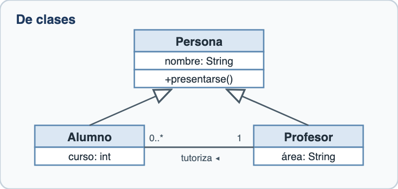{width=70%}

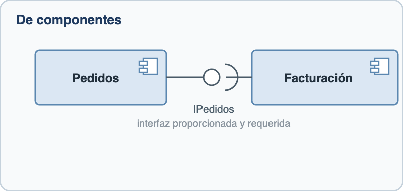{width=70%}

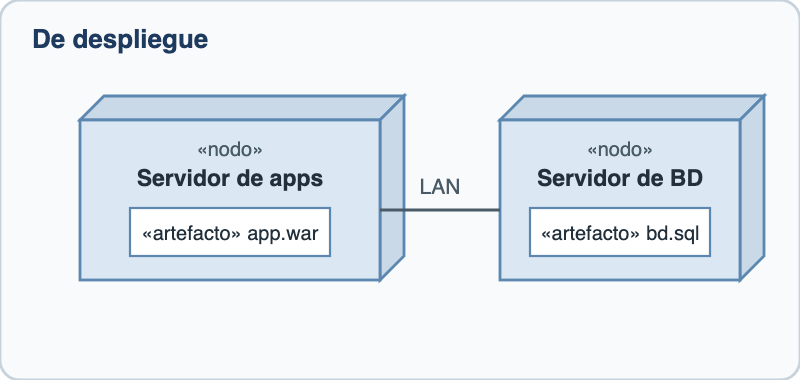{width=70%}

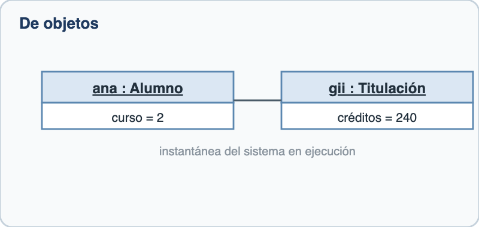{width=70%}

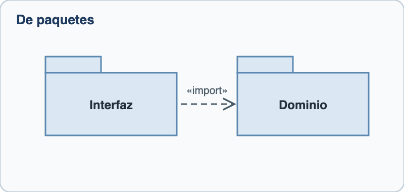{width=70%}

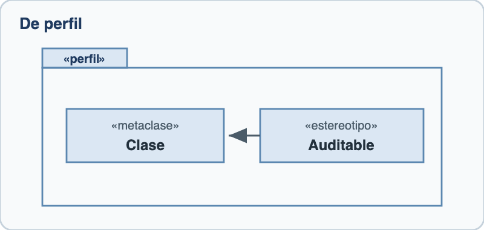{width=70%}

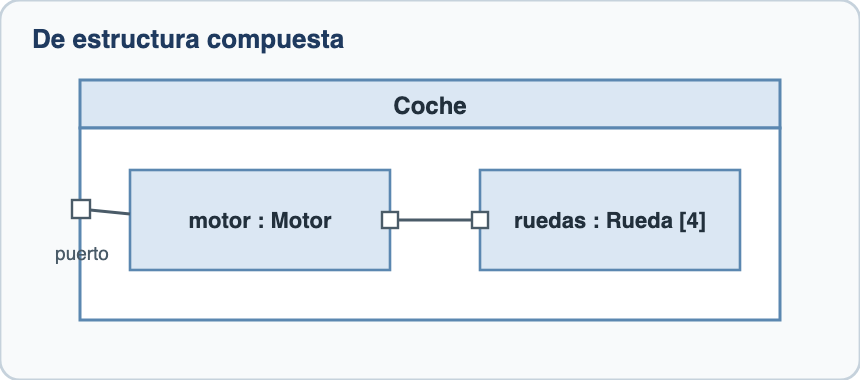{width=75%}

### Diagramas de comportamiento

Capturan la dinámica del sistema: cómo evoluciona y cómo interactúan sus elementos. Los **cuatro últimos** forman el subgrupo de los **diagramas de interacción**.

| Diagrama | Descripción |
| :------------- | :------------------------------------------ |
| **De actividades** (o de flujo) | Flujos de trabajo paso a paso, con decisiones, bifurcaciones y uniones; representa procesos y algoritmos |
| **De casos de uso** | Interacciones entre los actores y el sistema; visión general de la funcionalidad requerida |
| **De máquina de estados** | Estados por los que pasa un objeto y transiciones entre ellos ante eventos |
| **De secuencia** *(interacción)* | Intercambio de mensajes entre objetos ordenado en el tiempo, sobre líneas de vida |
| **De comunicación** *(interacción)* | Interacción centrada en los enlaces entre objetos, con los mensajes numerados en secuencia |
| **De tiempos** *(interacción)* | Evolución del estado o valor de uno o varios objetos a lo largo de un eje temporal (formas de onda) |
| **Global de interacciones** *(interacción)* | Combina el diagrama de actividades con diagramas de interacción anidados para mostrar secuencias completas |

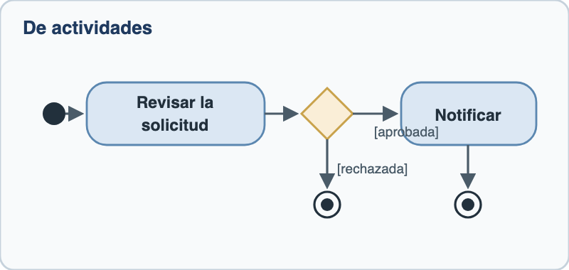{width=70%}

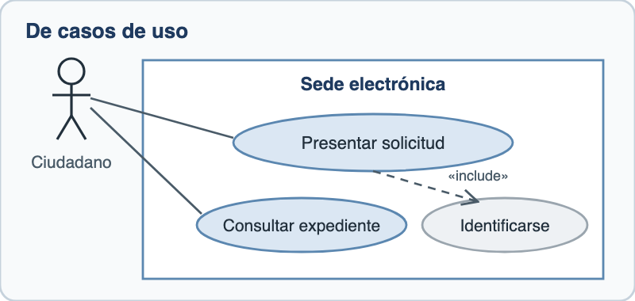{width=70%}

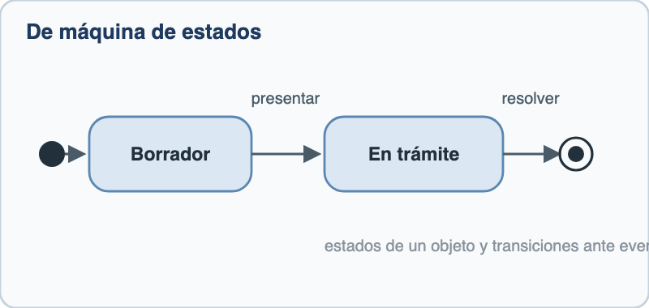{width=70%}

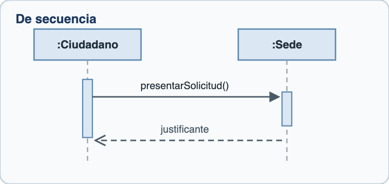{width=70%}

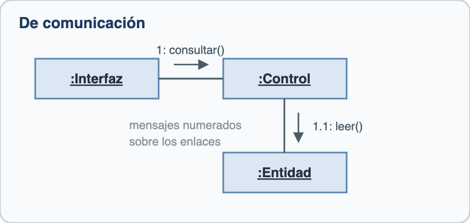{width=70%}

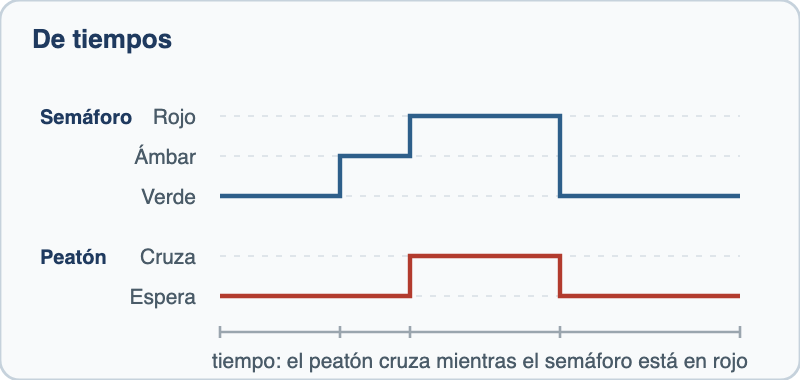{width=70%}

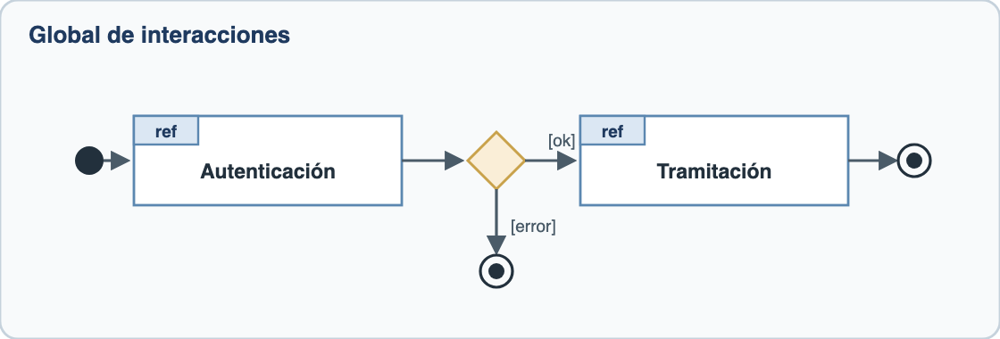{width=90%}

### Notación del modelado estructural

El diagrama de clases concentra la mayor parte de la notación estructural de UML.

- **Clasificador**: cualquier elemento del modelo que describe características y comportamiento: clases, interfaces, casos de uso, actores, componentes, nodos.
- **Visibilidad de los miembros**: **público (+)**, **privado (-)**, **protegido (#)** y **de paquete (~)**. Además, la barra (/) señala los atributos **derivados** (calculados a partir de otros) y el subrayado, los miembros **estáticos**.
- **Ámbito de los miembros**: de **instancia** (cada objeto tiene su propio valor) o de **clase** (compartido por todas las instancias, como los miembros *static* de los lenguajes de programación).
- **Otros elementos**: **señales** (comunicación asíncrona y unidireccional entre objetos), **tipos de datos** y **enumeraciones**, **interfaces** (contrato que las clases realizan), **paquetes** (agrupan clasificadores relacionados) y **artefactos** (elementos físicos: documentos, ejecutables, bases de datos).

Las **relaciones** entre clasificadores y su notación:

| Relación | Notación | Significado |
| :---------------- | :--------------------- | :---------------------------------------- |
| **Dependencia** | Flecha discontinua | Un elemento usa a otro y le afectan sus cambios |
| **Asociación** | Línea continua, con la multiplicidad en cada extremo | Relación estructural simple (una Persona lee 0 o 1 Revistas) |
| **Agregación** | Rombo hueco (blanco) en el «todo» | Relación todo-parte débil: las partes existen sin el todo (una Clase tiene Alumnos; si desaparece, los alumnos siguen existiendo) |
| **Composición** | Rombo relleno (negro) en el «todo» | Relación todo-parte fuerte: la parte no existe sin el todo (si desaparece la Empresa, desaparecen sus Facturas) |
| **Generalización (herencia)** | Flecha de triángulo hueco hacia la superclase | Las subclases heredan estructura y comportamiento |
| **Realización** | Flecha discontinua de triángulo hueco | Una clase implementa el contrato de una interfaz |

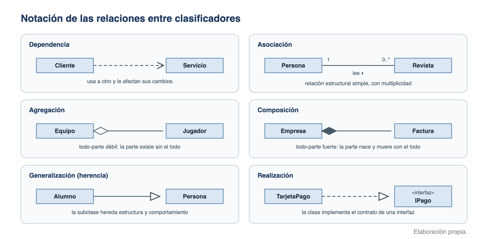{width=100%}

En código, la diferencia entre agregación y composición está en quién controla el ciclo de vida del objeto contenido:

```java
public class Clase {           // Agregación: el Alumno existe fuera de la Clase
    private Alumno alumno;
    public Clase(Alumno alumno) { this.alumno = alumno; }
}

public class Empresa {         // Composición: la Factura nace y muere con la Empresa
    private Factura factura;
    public Empresa() { this.factura = new Factura(); }
}
```

- **Multiplicidad**: número de instancias que participan en cada extremo de una asociación: `1`, `0..1`, `0..*` (o `*`), `1..*`.
- **Navegabilidad**: las asociaciones pueden ser bidireccionales o unidireccionales (punta de flecha en el extremo navegable).
- **Restricciones sobre la generalización**: **complete/incomplete** (si toda instancia de la superclase debe pertenecer a alguna subclase) y **disjoint/overlapping** (si una instancia puede pertenecer a varias subclases a la vez).

### Modelado arquitectónico: las vistas 4+1

El proceso unificado describe la arquitectura mediante el modelo de vistas **«4+1» de Kruchten** (**1995**): cuatro vistas complementarias más los **escenarios (casos de uso)**, que las conectan y validan.

| Vista | Qué modela | Destinatarios | Notación típica |
| :---------- | :-------------------------- | :--------------- | :------------------ |
| **Lógica** | Funcionalidad y modelo de información; requisitos funcionales | Usuarios finales | Diagramas de clases y de paquetes |
| **De proceso** | Concurrencia y sincronización; rendimiento, disponibilidad, fiabilidad | Integradores de sistemas | Diagramas de actividades y de interacción |
| **De desarrollo** | Organización del software en el entorno de desarrollo; reuso, portabilidad, mantenibilidad | Programadores | Diagramas de componentes y de paquetes |
| **Física (de despliegue)** | Correspondencia software-hardware; topología, comunicaciones, escalabilidad | Ingenieros de sistemas | Diagramas de despliegue |
| **Escenarios (+1)** | Casos de uso que ilustran y validan las otras cuatro vistas | Todos los implicados | Diagramas de casos de uso |

- **Criterios de selección arquitectónica**: extensibilidad, modificabilidad, simplicidad y eficiencia.

### Qué notación usar en cada contexto

Como síntesis, la correspondencia entre las necesidades de modelado habituales y su notación:

| Necesidad | Notación o diagrama |
| :---------------------------- | :------------------------------------------------ |
| Diseño de bases de datos | Modelo **entidad/relación** para el diseño conceptual; modelo relacional para el lógico y DDL/SQL para el físico (cap. 36) |
| Análisis y diseño estructurado | **Diagrama de contexto**, **diagrama de flujo de datos (DFD)**, **diccionario de datos** y diagrama de estructura (jerarquía de módulos) (cap. 23) |
| Análisis y diseño orientado a objetos | **UML**: diagramas de clases para la estática y de interacción para la dinámica |
| Captura de requisitos funcionales | **Casos de uso** e historias de usuario (cap. 23) |
| Modelado de procesos de negocio | **BPMN**, diagramas de flujo normalizados para procesos de negocio (cap. 20) |

## Proceso Unificado Racional (RUP)

El **RUP** (*Rational Unified Process*) es el refinamiento comercial más extendido del proceso unificado. Lo desarrolló **Rational Software** y pertenece a **IBM** desde **2003**. Más que un proceso cerrado es un **marco de proceso adaptable**: cada organización selecciona y configura sus elementos (disciplinas, artefactos, roles) según el contexto y las necesidades del cliente.

### Principios y buenas prácticas

RUP asume los tres rasgos del proceso unificado (dirigido por casos de uso, centrado en la arquitectura, iterativo e incremental) y los articula en **seis buenas prácticas**:

- **Desarrollo iterativo**: el sistema se construye en iteraciones cortas con entregas incrementales.
- **Gestión de requisitos**: los requisitos se documentan, trazan y priorizan de forma sistemática.
- **Arquitectura basada en componentes**: la arquitectura se construye pronto sobre componentes reutilizables.
- **Modelado visual**: los modelos UML elevan el nivel de abstracción y facilitan la comunicación.
- **Verificación continua de la calidad**: las pruebas se integran en todas las iteraciones, no solo al final.
- **Gestión del cambio**: los cambios se controlan mediante gestión de configuración, versiones e incidencias.

Promueve además la **colaboración entre equipos** y la elevación del nivel de abstracción mediante patrones de diseño y *frameworks*.

### Estructura y variantes

- **Eje dinámico (horizontal)**: las cuatro fases (inicio, elaboración, construcción y transición) con sus hitos, recorridas en iteraciones.
- **Eje estático (vertical)**: las nueve disciplinas (seis del proceso y tres de soporte), cuyo peso por fase refleja el diagrama de «jorobas».
- **Variantes**: **OpenUP** (versión ligera y abierta, dentro del Eclipse Process Framework) y **AUP** (*Agile Unified Process*).

## Métrica v3: visión de síntesis

**Métrica versión 3** es la metodología de **planificación, desarrollo y mantenimiento de sistemas de información** de las administraciones públicas españolas, promovida por el entonces **Ministerio de Administraciones Públicas** (**2001**) y publicada en el PAe. Sigue siendo la referencia metodológica habitual en el desarrollo de software público, y en los desarrollos orientados a objetos emplea la notación UML.

- **Base**: el modelo de ciclo de vida de la norma **ISO/IEC 12207** (procesos del ciclo de vida del software), con referencias a ISO/IEC 15504 (SPICE), ISO 9000/9001, IEEE 610.12 y a metodologías como SSADM, Merise, MAGERIT o Eurométodo.
- **Cobertura**: en una única estructura cubre los desarrollos **estructurado** y **orientado a objetos**.
- **Estructura**: cada proceso se descompone en **actividades** y estas en **tareas**; para cada tarea se definen participantes, productos de entrada y salida, y técnicas y prácticas.

### Procesos principales

- **Planificación de Sistemas de Información (PSI)**: marco estratégico de referencia para los sistemas de información de la organización; produce el **catálogo de requisitos** y la **arquitectura de información** (modelo de información, modelo de sistemas de información, arquitectura tecnológica, plan de proyectos y plan de mantenimiento del PSI).
- **Desarrollo de Sistemas de Información**, subdividido en cinco procesos:
    - **Estudio de Viabilidad del Sistema (EVS)**: analiza un conjunto de necesidades y propone una solución a corto plazo con criterios tácticos (económicos, técnicos, legales y operativos); las alternativas pueden ser a medida, producto de mercado o mixtas.
    - **Análisis del Sistema de Información (ASI)**: especificación detallada del sistema mediante el catálogo de requisitos y los modelos: **casos de uso y clases** en orientación a objetos, **datos y procesos** en desarrollo estructurado.
    - **Diseño del Sistema de Información (DSI)**: arquitectura del sistema y entorno tecnológico, especificaciones de construcción de los componentes, especificación técnica del plan de pruebas y requisitos de implantación.
    - **Construcción del Sistema de Información (CSI)**: codificación y pruebas **unitarias, de integración y del sistema**; manuales de usuario y, si procede, componentes de migración y carga inicial de datos.
    - **Implantación y Aceptación del Sistema (IAS)**: entrega y aceptación del sistema (pruebas de **implantación**, responsabilidad del usuario de operación, y de **aceptación**, del usuario final), plan de mantenimiento, acuerdo de nivel de servicio y paso a producción.
- **Mantenimiento de Sistemas de Información (MSI)**: obtiene una nueva versión del sistema a partir de las peticiones de los usuarios (por problemas detectados o mejoras). Solo contempla los mantenimientos **correctivo y evolutivo** (excluye el adaptativo y el perfectivo).

### Interfaces

Cuatro interfaces dan soporte organizativo a los procesos principales:

- **Gestión de Proyectos (GP)**: planificación, seguimiento y control de las actividades y los recursos; actividades de **inicio (GPI)**, de **seguimiento y control (GPS)** y de **finalización (GPF)** del proyecto.
- **Seguridad (SEG)**: incorpora mecanismos de seguridad adicionales al sistema y al propio proceso de desarrollo; contempla los riesgos lógicos y utiliza **MAGERIT** como metodología de análisis y gestión de riesgos si la organización no dispone de una propia.
- **Gestión de la Configuración (GC)**: identificación y control de los elementos de configuración, sus cambios y versiones mediante un plan de gestión de la configuración; evita cambios incontrolados y facilita el análisis de impacto en el mantenimiento.
- **Aseguramiento de la Calidad (CAL)**: marco común para definir planes de aseguramiento de la calidad de proyectos concretos; las actividades de evaluación las realiza un grupo de calidad **independiente** de los responsables de los productos.

### Participantes

La metodología clasifica a los participantes en **cinco perfiles**: **directivo**, **jefe de proyecto**, **consultor**, **analista** y **programador**.

## Fuentes {.unnumbered .unlisted}

- Jacobson, I.; Booch, G.; Rumbaugh, J.: *El Proceso Unificado de Desarrollo de Software*. Addison-Wesley, 1999.
- OMG: *Unified Modeling Language (UML), versión 2.5.1*, diciembre de 2017.
- Kruchten, P.: «Architectural Blueprints: The "4+1" View Model of Software Architecture», *IEEE Software*, noviembre de 1995.
- Métrica versión 3, Ministerio de Administraciones Públicas, 2001: documentos «Introducción» y «Participantes» (PAe, consultados en julio de 2026).
