# Proceso unificado y UML

!!! warning "Tema pendiente de revisión"
    Este tema **no ha sido revisado** ni actualizado. Su contenido puede estar
    incompleto, desactualizado o contener errores. Úsalo con precaución y
    contrástalo siempre con fuentes oficiales.

## Proceso Unificado de Desarrollo de Software

El **Proceso Unificado de Desarrollo de Software (PUDS)** es un marco de desarrollo que se caracteriza por ser **dirigido por casos de uso**, **centrado en la arquitectura** y **iterativo e incremental**. Ofrece un conjunto mínimo de prácticas que maximizan la eficiencia de los equipos de desarrollo, independientemente del tipo de proyecto. Hace uso de **UML** para la especificación y diseño y tiene como refinamiento más conocido el **RUP (Rational Unified Process)**, una versión privada desarrollada por IBM.

### Características principales

- **Dirigido por casos de uso**: Los casos de uso guían el desarrollo del sistema al definir los requisitos y garantizar que se aporte valor al cliente.
- **Centrado en la arquitectura**: La arquitectura se representa mediante vistas del modelo (como las vistas **4+1**) y asegura la calidad estructural del sistema.
- **Iterativo e incremental**: Cada iteración identifica y especifica casos de uso relevantes, diseña una arquitectura basada en ellos, implementa componentes y verifica que cumplen con los requisitos definidos. Este enfoque divide el proyecto en **ciclos de vida**.

### Elementos del proceso

- **Proceso**: Actúa como una plantilla de desarrollo.
- **Producto**: Es el sistema de software resultante.
- **Disciplina**: Colección de actividades vinculadas a áreas específicas del proyecto.
- **Trabajador o rol**: Define el papel desempeñado por una persona en un momento dado.
- **Artefactos**: Productos tangibles generados, como modelos, código fuente, etc. El artefacto más importante es el **modelo**, que abstrae diferentes perspectivas del sistema.

### Modelos del sistema

- **Modelo de casos de uso**: Requisitos (Artefactos: Diagramas de casos de uso, secuencia, colaboración y actividad).
- **Modelo de análisis y diseño**: Análisis y diseño (Artefactos: Diagramas de clases, objetos, secuencia, colaboración y actividad).
- **Modelo de despliegue**: Diseño (Artefactos: Diagramas de despliegue, secuencia y colaboración).
- **Modelo de implementación**: Implementación (Artefactos: Diagramas de componentes, secuencia y colaboración).
- **Modelo de pruebas**: Prueba (Artefactos: Todos los diagramas).

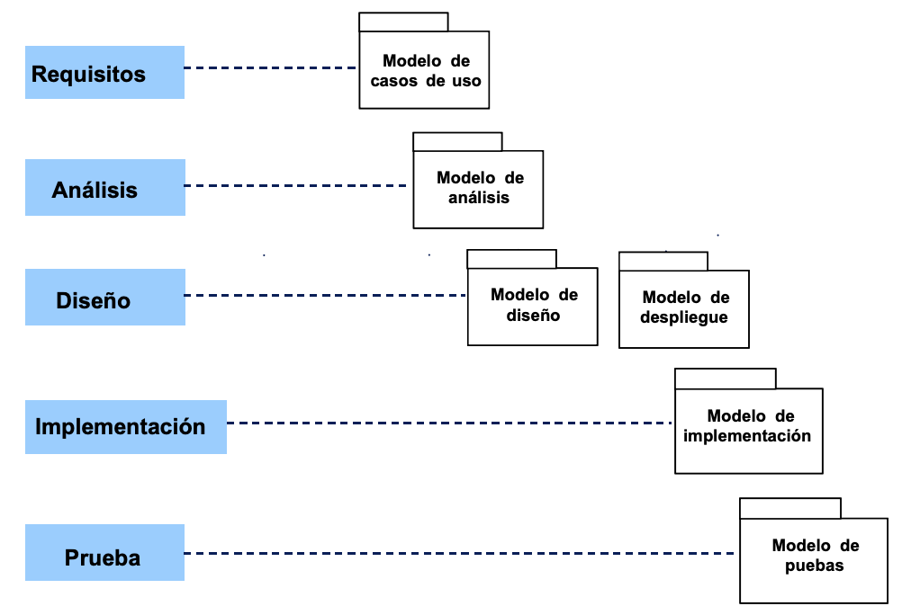

### Fases del ciclo de vida (estructura dinámica)

- **Inicio**: Define el alcance y desarrolla los casos de negocio.
    - **Hito**: Objetivos.
    - **Artefactos**: Documento visión, diagramas de casos de uso, especificaciones de requisitos.
- **Elaboración**: Planificación detallada y diseño de la arquitectura.
    - **Hito**: Arquitectura.
    - **Artefactos**: Modelos y diagramas en vistas lógica, conceptual, física e implementación.
- **Construcción**: Desarrollo del producto.
    - **Hito**: Capacidad operacional inicial.
    - **Artefactos**: Desarrollo de casos de uso, pruebas de desarrollo, pruebas de regresión, etc.
- **Transición**: Ajustes finales y lanzamiento.
    - **Hito**: Versión liberada.
    - **Artefactos**: Pruebas de aceptación, puesta en producción, estabilización.

### Flujos de trabajo (estructura vertical)

- **Del proceso**: Modelado de negocio, requisitos, análisis, diseño, implementación, pruebas, despliegue.
- **De soporte**: Gestión de cambio, gestión del proyecto, entorno.

### Iteración y hitos

Cada iteración abarca varias disciplinas (desde requisitos hasta pruebas) y culmina en un **hito**, que actúa como punto de control para revisar el progreso.

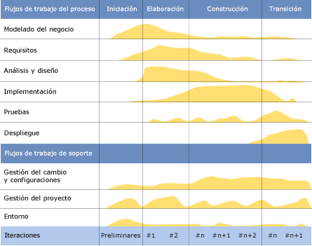

### Trabajadores y artefactos asociados

- **Analista de sistemas**: Modelos de casos de uso, actores, glosario.
- **Especificador de casos de uso**: Casos de uso.
- **Diseñador de interfaz de usuario**: Prototipos.
- **Arquitecto**: Modelos de análisis, diseño, despliegue e implementación.
- **Ingeniero de casos de uso**: Realización de casos de uso.
- **Ingeniero de componentes**: Clases, subsistemas, interfaces, componentes.
- **Integrador de sistemas**: Integración del sistema.
- **Diseñador de pruebas**: Modelos de prueba, casos y procedimientos de prueba.
- **Ingenieros de pruebas de integración y sistema**: Identificación y documentación de defectos.

## Lenguaje Unificado de Modelado (UML)

El Lenguaje Unificado de Modelado (UML) es un **lenguaje gráfico estándar** utilizado para modelar sistemas de software. Su objetivo principal es **visualizar, especificar, construir y documentar** los diferentes aspectos de un sistema. UML se utiliza ampliamente en el diseño y desarrollo de sistemas debido a su capacidad para representar tanto la **estructura estática** como el **comportamiento dinámico** de los mismos.

### Tipos de diagramas en UML 2.5

Los diagramas de UML se dividen en **estructurales** y **de comportamiento**, ofreciendo herramientas para capturar aspectos estáticos y dinámicos del sistema.

### Diagramas estructurales: (Ver tabla)

Son siete y se centran en la estructura estática del sistema:

- **Diagrama de clases**: Representa las clases de un sistema, junto con sus atributos, operaciones y relaciones.
- **Diagrama de componentes**: Muestra cómo se divide el sistema en componentes y las dependencias entre ellos.
- **Diagrama de despliegue**: Modela la disposición física de los artefactos del software en los nodos (plataformas de hardware). Representa topologías.
- **Diagrama de objetos** (o de instancia): Captura una vista específica de los objetos y sus relaciones en un momento determinado.
- **Diagrama de paquetes**: Agrupa elementos lógicos del sistema y muestra las dependencias entre estos agrupamientos.
- **Diagrama de perfil**: Permite personalizar UML para un dominio o plataforma específica mediante la definición de estereotipos y restricciones.
- **Diagrama de estructura compuesta**: Describe la estructura interna de una clase y las colaboraciones que facilita.

<table>
<colgroup>
<col style="width: 27%" />
<col style="width: 38%" />
<col style="width: 33%" />
</colgroup>
<thead>
<tr>
<th colspan="3" style="text-align: center;"><blockquote>

<strong>Diagramas de Estructurales</strong>
 </blockquote></th>
</tr>
</thead>
<tbody>
<tr>
<td style="text-align: center;"><blockquote>

<strong>Diagrama</strong>
 </blockquote></td>
<td style="text-align: center;"><blockquote>

<strong>Descripción</strong>
 </blockquote></td>
<td style="text-align: center;"><blockquote>

<strong>Imagen</strong>
 </blockquote></td>
</tr>
<tr>
<td style="text-align: center;"><strong>Diagrama de clases</strong></td>
<td style="text-align: center;">Muestra las clases en un sistema,
atributos y operaciones de cada clase y la relación entre cada clase</td>
<td style="text-align: center;">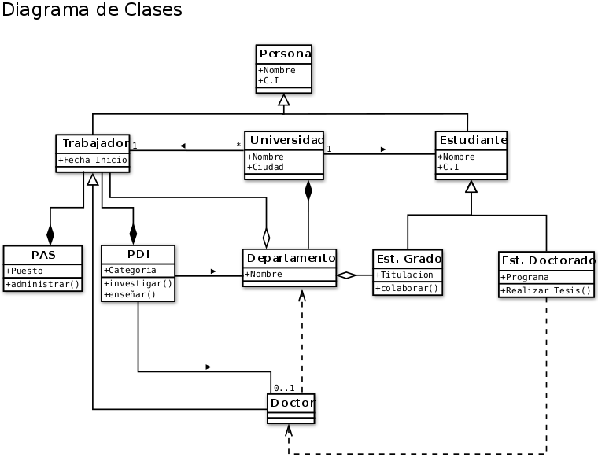</td>
</tr>
<tr>
<td style="text-align: center;"><strong>Diagrama de
componentes</strong></td>
<td style="text-align: center;">Representa cómo un sistema
de software es dividido en componentes y muestra las dependencias entre estos componentes.</td>
<td style="text-align: center;"></td>
</tr>
<tr>
<td style="text-align: center;"><strong>Diagrama de
despliegue</strong></td>
<td style="text-align: center;">Se utiliza para modelar la disposición
física de los artefactos software en nodos (usualmente plataforma de hardware). Topologías.</td>
<td style="text-align: center;">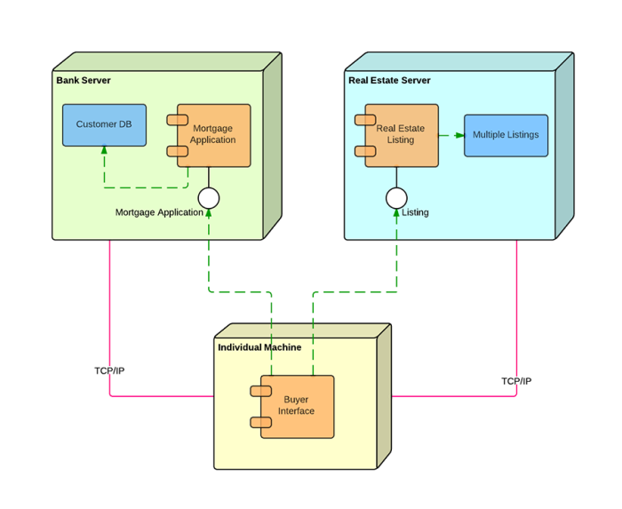</td>
</tr>
<tr>
<td style="text-align: center;"><strong>Diagramas de objetos o diagramas
de instancia</strong></td>
<td style="text-align: center;">Muestra una vista completa o parcial de
los objetos de un sistema en un instante de ejecución específico.</td>
<td style="text-align: center;">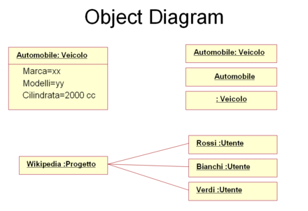</td>
</tr>
<tr>
<td style="text-align: center;"><strong>Diagrama de
paquetes</strong></td>
<td style="text-align: center;">Muestra cómo un sistema está dividido en
agrupaciones lógicas y las dependencias entre esas agrupaciones</td>
<td style="text-align: center;">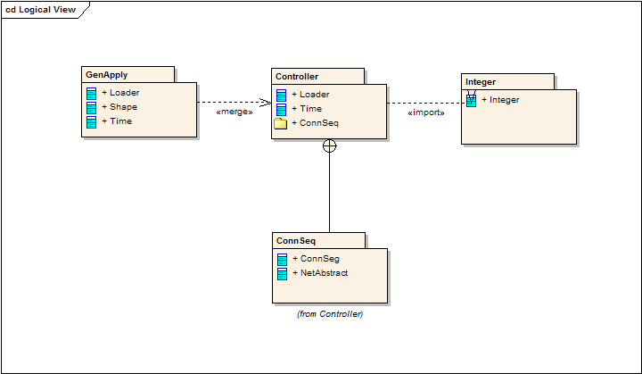</td>
</tr>
<tr>
<td style="text-align: center;"><strong>Diagrama de perfil</strong></td>
<td style="text-align: center;"></td>
<td style="text-align: center;">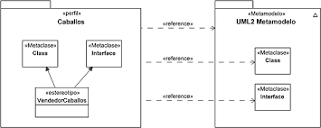</td>
</tr>
<tr>
<td style="text-align: center;"><strong>Diagrama de estructura
compuesta</strong></td>
<td style="text-align: center;">Muestra la estructura interna de
una clase y las colaboraciones que esta estructura hace posibles.</td>
<td style="text-align: center;">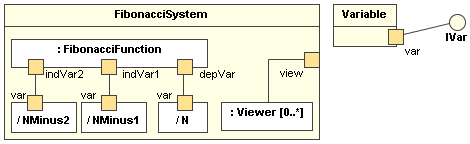</td>
</tr>
</tbody>
</table>

### Diagramas de comportamiento: (Ver tabla)

Son cuatro y capturan el comportamiento dinámico de los objetos:

- **Diagrama de actividades** (o de flujo): Representa procesos o flujos de trabajo paso a paso, ilustrando el flujo de control general.
- **Diagrama de casos de uso**: Describe las interacciones entre actores y el sistema, proporcionando una visión general de las funcionalidades requeridas.
- **Diagrama de máquina de estados**: Representa el comportamiento de objetos según su estado actual, similar a los diagramas de actividades pero enfocados en los estados.
- **Diagramas de interacción**: Incluyen:
    - **Diagrama de secuencia**: Muestra cómo los objetos interactúan en secuencia.
    - **Diagrama de comunicación**: Representa las interacciones entre objetos en términos de mensajes.
    - **Diagrama de tiempos**: Describe el comportamiento de los objetos en un marco de tiempo dado.
    - **Diagrama global de interacciones**: Combina aspectos de los diagramas de actividad e interacción para ilustrar secuencias completas.

<table>
<colgroup>
<col style="width: 27%" />
<col style="width: 38%" />
<col style="width: 33%" />
</colgroup>
<thead>
<tr>
<th colspan="3" style="text-align: center;">Diagramas de
comportamiento</th>
</tr>
</thead>
<tbody>
<tr>
<td style="text-align: center;">Diagrama</td>
<td style="text-align: center;"><strong>Descripción</strong></td>
<td style="text-align: center;"><strong>Imagen</strong></td>
</tr>
<tr>
<td style="text-align: center;">Diagrama de actividades o flujo</td>
<td style="text-align: center;">Representación gráfica de un algoritmo o
proceso. Flujos de trabajo paso a paso / Flujo de control general.</td>
<td style="text-align: center;">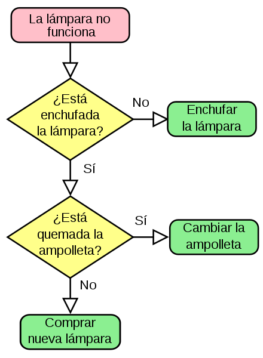</td>
</tr>
<tr>
<td style="text-align: center;">Diagramas de casos de uso</td>
<td style="text-align: center;">Representación gráfica de las posibles
interacciones de un usuario con un sistema. Es decir, ofrecen una visión general de los actores involucrados en un sistema, las diferentes funciones que necesitan esos actores y cómo interactúan estas diferentes funciones.</td>
<td style="text-align: center;">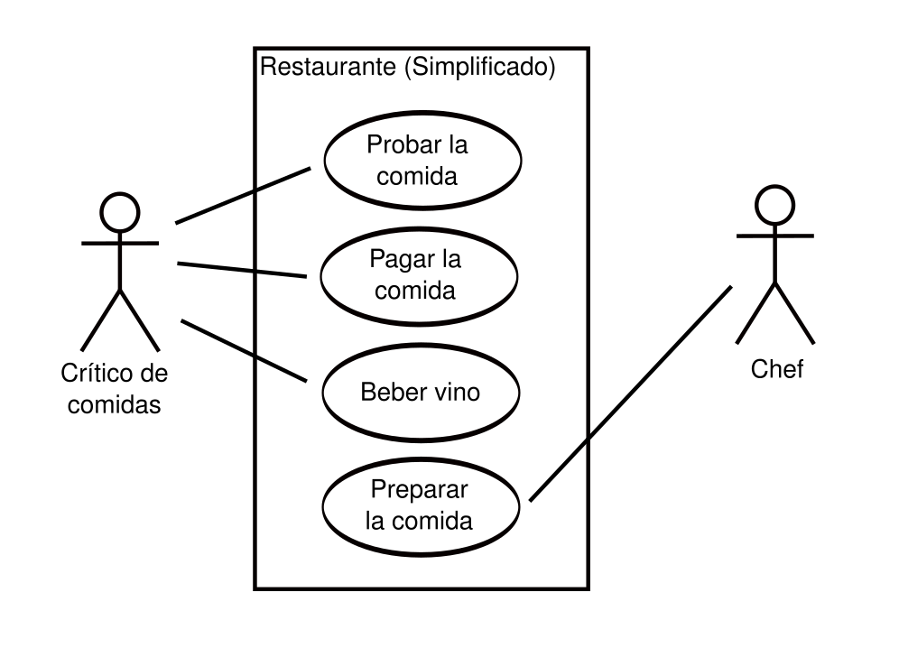</td>
</tr>
<tr>
<td style="text-align: center;">Diagrama de máquina de estados</td>
<td style="text-align: center;">Similar a los diagramas de actividad.
Permiten describir el comportamiento de los objetos que actúan de manera diferente de acuerdo con el estado en que se encuentran en el momento.</td>
<td style="text-align: center;">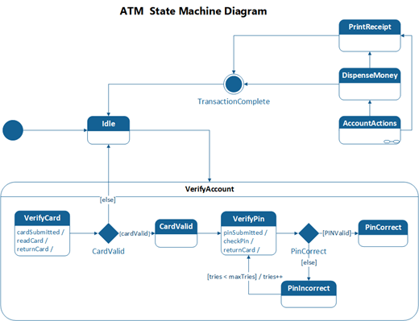</td>
</tr>
<tr>
<td style="text-align: center;">Diagrama de secuencia</td>
<td style="text-align: center;">Muestran cómo los objetos interactúan
entre sí y el orden en que se producen esas interacciones.</td>
<td style="text-align: center;">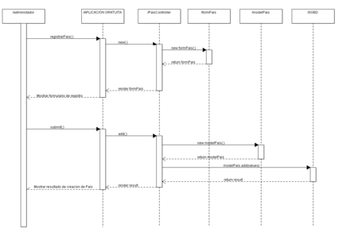</td>
</tr>
<tr>
<td style="text-align: center;">Diagrama de comunicación</td>
<td style="text-align: center;">Modela las interacciones entre objetos o
partes en términos de mensajes en secuencia. Es decir, el foco está en los mensajes pasados entre objetos.</td>
<td style="text-align: center;">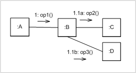</td>
</tr>
<tr>
<td style="text-align: center;">Diagrama de tiempos / Cronograma</td>
<td style="text-align: center;">Similar a los diagramas de secuencia;
representan el comportamiento de los objetos en un marco de tiempo dado. Es una gráfica de formas de ondas digitales que muestra la relación temporal entre varias señales, y cómo varía cada señal en relación a las demás.</td>
<td style="text-align: center;">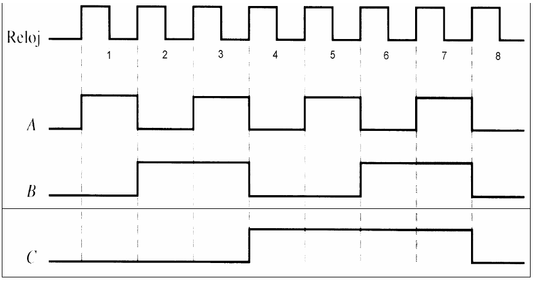</td>
</tr>
<tr>
<td style="text-align: center;">Diagrama global de interacciones</td>
<td style="text-align: center;">Similares a los diagramas de actividad
pero muestran una secuencia de diagramas de interacción</td>
<td style="text-align: center;">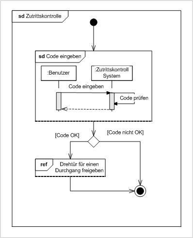</td>
</tr>
</tbody>
</table>

### Modelado estructural avanzado

Describe los tipos de objetos y sus relaciones estáticas:

- **Clasificador**: Representa el comportamiento y características de los elementos (clases, interfaces, casos de uso, actores).
- **Modificadores de acceso / Visibilidad**:
    - Público (+), privado (-), protegido (#), derivado (/), paquete (~), estático (subrayado).
- **Alcance de los miembros / Ámbito**:
    - **Instance members**: Propiedades y métodos asociados a instancias específicas.
    - **Class members**: Propiedades y métodos comunes a todas las instancias (similares a los miembros estáticos en programación).
- **Relaciones**:
    - **Asociación**:
        - **Relación:** Relación simple entre dos clases.
        - **Dibujo:** [Persona 1 0..1 Revistas]
        - **Ejemplo:** Una persona puede leer una o ninguna revista.
        - **Codigo:**

> public class Persona { > > // Una persona puede tener 0 o 1 revista. > > private Revista revista; > > }

- **Agregación o Agrupación**: Una clase contiene a otra, pero ambas pueden existir independientemente.
    - **Dibujo:** [Clase 1 1 Alumno]
    - **Ejemplo:** Una clase "tiene" alumnos, pero si la clase desaparece, los alumnos pueden seguir existiendo.
    - **Código:**

> public class Clase { > > private Alumno alumno; > > public Clase(Alumno alumno) { > > this.alumno = alumno; > > } > > }

- **Composición**: Relación fuerte donde la existencia de un objeto depende del otro.
    - **Dibujo:** [Facturas 0..\* 1 Empresa]
    - **Ejemplo:** Una empresa tiene facturas. Si la empresa desaparece, sus facturas también dejan de existir.
    - **Código:**

> public class Empresa { > > private Factura factura; > > public Empresa() { > > // Las facturas dependen de la empresa. > > this.factura = new Factura(); > > } > > }

- **Restricciones**:
    - **Complete/incomplete**: Define si todas las instancias de una superclase deben pertenecer a una subclase.
    - **Disjoint/overlapping**: Define si una instancia puede pertenecer a varias subclases simultáneamente.

### Componentes del modelado estructural

- **Clases**: Plantillas para crear objetos con atributos y métodos.
- **Señales**: Representan comunicaciones unidireccionales y asincrónicas entre objetos.
- **Tipos de datos**: Definen valores de datos (ej.: enteros, cadenas).
- **Paquetes**: Agrupan clasificadores relacionados.
- **Interfaces**: Definen un contrato que las clases deben implementar.
- **Enumeraciones**: Tipos de datos definidos por el usuario con valores predefinidos.
- **Artefactos**: Elementos concretos como documentos, bases de datos o ejecutables.
- **Relaciones avanzadas**:
    - **Herencia/Generalización**: Subclases que heredan de superclases.
    - **Asociaciones unidireccionales y bidireccionales**: Relación entre clases con distinta visibilidad.

### Modelado arquitectónico

El diseño arquitectónico de un sistema incluye una visión de alto nivel:

- **Vistas arquitectónicas "4+1"**:
    - **Vista lógica**: Funcionalidad del sistema desde la perspectiva del usuario.
    - **Vista de desarrollo**: Cómo se organiza el software desde la perspectiva del programador.
    - **Vista de proceso**: Enfoque en aspectos dinámicos como concurrencia y escalabilidad.
    - **Vista física**: Componentes físicos y conexiones entre ellos.
    - **Vista de casos de uso**: Describe escenarios de interacción para validar la arquitectura.
- **Criterios de selección arquitectónica**: Extensibilidad, modificabilidad, simplicidad y eficiencia.

<table style="width:100%;">
<colgroup>
<col style="width: 16%" />
<col style="width: 16%" />
<col style="width: 20%" />
<col style="width: 24%" />
<col style="width: 21%" />
</colgroup>
<thead>
<tr>
<th style="text-align: center;">Vista</th>
<th style="text-align: center;">Lógica (conceptual)</th>
<th style="text-align: center;">Proceso (ejecución)</th>
<th style="text-align: center;">Desarrollo (implementación)</th>
<th style="text-align: center;">Física (despliegue)</th>
</tr>
</thead>
<tbody>
<tr>
<td>Aspecto</td>
<td>Modelo de información</td>
<td>Concurrencia y sincronización</td>
<td>Organización del software en el entorno de desarrollo</td>
<td>Correspondencia software-hardware</td>
</tr>
<tr>
<td>Stakeholders</td>
<td>Usuarios finales</td>
<td>Integradores del sistema</td>
<td>Programadores</td>
<td>Ingenieros de sistemas</td>
</tr>
<tr>
<td>Requisitos</td>
<td>Funcionales</td>
<td>
Rendimiento

Disponibilidad
 
Fiabilidad
 
Concurrencia
 
Distribución
 
Seguridad
</td>
<td>
Gestión del software

Reuso
 
Portabilidad
 
Mantenibilidad
 
Restricciones impuestas por la plataforma o el lenguaje
</td>
<td>
Rendimiento

Disponibilidad
 
Fiabilidad
 
Escalabilidad
 
Topología
 
Comunicaciones
</td>
</tr>
<tr>
<td>Notación</td>
<td>Clases y asociaciones</td>
<td>Procesos y comunicaciones</td>
<td>Componentes y relaciones de uso</td>
<td>Nodos y rutas de comunicación</td>
</tr>
</tbody>
</table>

## El Proceso Unificado Racional (RUP)

El **RUP** es una especificación más detallada del proceso unificado, comercializada por Rational Software (IBM). Se caracteriza por su adaptabilidad al contexto y a las necesidades del cliente.

### Principios clave del RUP

- **Dirigido por casos de uso**: Los requisitos guían el desarrollo.
- **Centrado en la arquitectura**: Garantiza una arquitectura de calidad.
- **Iterativo e incremental**: Se refina continuamente en ciclos iterativos.
- **Colaboración entre equipos**: Comunicación fluida y coordinación entre roles.
- **Foco en la calidad**: Garantiza el cumplimiento de estándares desde el inicio.
- **Elevación del nivel de abstracción**: Uso de patrones de diseño, frameworks y modelado visual.

## Aclaraciones: …sobre los modelos

### Modelos de Casos de Uso vs. Modelo de Análisis

| Modelo de Casos de Uso                                                                                                               | Modelo de Análisis                                                                                                                                                          |
| ------------------------------------------------------------------------------------------------------------------------------------ | --------------------------------------------------------------------------------------------------------------------------------------------------------------------------- |
| Descrito en el lenguaje del cliente.                                                                                                 | Descrito en el lenguaje del desarrollador.                                                                                                                                  |
| Vista externa del sistema.                                                                                                           | Vista interna del sistema.                                                                                                                                                  |
| Estructurado por casos de uso; proporciona la estructura a la vista externa.                                                         | Estructurado por clases y paquetes estereotipados; proporciona la estructura a la vista interna.                                                                            |
| Utilizado fundamentalmente como contrato entre el cliente y los desarrolladores sobre qué debería y qué no debería hacer el sistema. | Utilizado fundamentalmente por los desarrolladores para comprender cómo deberá darse forma al sistema, es decir, cómo deberá ser diseñado e implementado.                   |
| Puede contener redundancias e inconsistencias entre requisitos.                                                                      | No debería contener redundancias ni inconsistencias entre requisitos.                                                                                                       |
| Captura la funcionalidad del sistema, incluida la funcionalidad significativa para la arquitectura.                                  | Esboza cómo llevar a cabo la funcionalidad dentro del sistema, incluida la funcionalidad significativa para la arquitectura; sirve como una primera aproximación al diseño. |
| Define casos de uso que se analizarán con más profundidad en el modelo de análisis.                                                  | Define realizaciones de caso de uso, y cada una de ellas representa el análisis de un caso de uso del modelo de casos de uso.                                               |

### Modelos de Modelo de Análisis vs. Modelo del diseño

| Modelo de Análisis                                        | Modelo de Diseño                                                                  |
| --------------------------------------------------------- | --------------------------------------------------------------------------------- |
| Modelo conceptual.                                        | Modelo físico (implementación).                                                   |
| Genérico respecto al diseño (aplicable a varios diseños). | Específico para una implementación.                                               |
| Tres estereotipos: entidad, control, interfaz.            | Cualquier número de estereotipos físicos.                                         |
| Menos formal.                                             | Más formal.                                                                       |
| Menos caro de desarrollar.                                | Más caro.                                                                         |
| Menos capas.                                              | Más capas.                                                                        |
| Dinámico (no muy centrado en la secuencia).               | Dinámico (muy centrado en la secuencia).                                          |
| Creado principalmente como trabajo manual.                | Creado fundamentalmente como “programación visual” en ingeniería de ida y vuelta. |
| Puede no mantenerse todo el ciclo de vida.                | Debe ser mantenido todo el ciclo de vida.                                         |

## Aclaraciones: …sobre los diagramas

<table>
<colgroup>
<col style="width: 16%" />
<col style="width: 19%" />
<col style="width: 13%" />
<col style="width: 27%" />
<col style="width: 23%" />
</colgroup>
<thead>
<tr>
<th style="text-align: center;">Área</th>
<th style="text-align: center;"></th>
<th style="text-align: center;"></th>
<th style="text-align: center;">Diagramas</th>
<th style="text-align: center;">Uso</th>
</tr>
</thead>
<tbody>
<tr>
<td rowspan="3">Diseño bases de datos</td>
<td></td>
<td></td>
<td>Diagrama E/R</td>
<td>Diseño conceptual</td>
</tr>
<tr>
<td></td>
<td></td>
<td>Pseudocódigo</td>
<td>Diseño lógico</td>
</tr>
<tr>
<td></td>
<td></td>
<td>Lenguaje de programación</td>
<td>Diseño físico</td>
</tr>
<tr>
<td rowspan="4">Análisis y Diseño Estructurado</td>
<td></td>
<td></td>
<td>Diagrama de contexto de sistema (DCS)</td>
<td>Describir entorno</td>
</tr>
<tr>
<td></td>
<td></td>
<td>Diagrama de flujo de datos (DFD)</td>
<td>ENTIDAD-PROCESO</td>
</tr>
<tr>
<td></td>
<td></td>
<td>Diagrama de Estructura</td>
<td>Árbol de directorios</td>
</tr>
<tr>
<td></td>
<td></td>
<td>Diccionario de datos</td>
<td>Tabla (nombre, tipo, tamaño, descripción)</td>
</tr>
<tr>
<td rowspan="14">Análisis y Diseño Orientado a Objetos (UML)</td>
<td rowspan="7"><strong>Diagramas estructurales</strong></td>
<td rowspan="7"></td>
<td>Diagrama de clases</td>
<td>Típico para POO (clases, atributos y métodos)</td>
</tr>
<tr>
<td>Diagrama de componentes</td>
<td>Arquitectura</td>
</tr>
<tr>
<td>Diagrama de despliegue</td>
<td>BDs-Server-Printer</td>
</tr>
<tr>
<td>Diagrama de objetos</td>
<td>Interacción entre objetos (A-B)</td>
</tr>
<tr>
<td>Diagrama de paquetes</td>
<td>Para agrupar “cosas” (simplificar)</td>
</tr>
<tr>
<td>Diagrama de perfiles</td>
<td>?</td>
</tr>
<tr>
<td>Diagrama de estructura compuesta</td>
<td>Estructuras internas (PC→[cpu, ram, hdd]</td>
</tr>
<tr>
<td rowspan="7"><strong>Diagramas de comportamiento</strong></td>
<td rowspan="3"></td>
<td>Diagrama de actividades (o de flujo)</td>
<td>If/elses, loops</td>
</tr>
<tr>
<td>Diagrama de casos de uso</td>
<td>“Comprar café”</td>
</tr>
<tr>
<td>Diagrama de máquina de estados</td>
<td>Building → Testing → Deploying,…</td>
</tr>
<tr>
<td rowspan="4"><strong>Diagrama de interacción</strong></td>
<td>Diagrama de secuencia</td>
<td>Eventos, Redes… |&gt;|</td>
</tr>
<tr>
<td>Diagrama de comunicación</td>
<td>Mensajes entre objetos A→B</td>
</tr>
<tr>
<td>Diagrama de tiempos (o cronograma)</td>
<td>Señales digitales</td>
</tr>
<tr>
<td>Diagrama global de interacciones</td>
<td>Múltiples diagramas de interacción</td>
</tr>
<tr>
<td>BPMN</td>
<td></td>
<td></td>
<td>Diagrama de procesos de negocio</td>
<td>Diagramas de flujo con un par de reglas</td>
</tr>
</tbody>
</table>

### Notas rápidas:

- **Bases de datos:** Modelos E/R
- **Datos de una organización:** Análisis estructurado (DFD, Diccionario de datos,…)
- **Programación Orientada a Objetos:** UML (Diagramas de clases, típicamente)
- **Proceso Unificado de Desarrollo de Software:** Gestión de proyectos + Diagramas UML
    - **RUP (Rational Unified Process):** Especificación propietaria
- **Análisis de requisitos:** UML (Casos de uso)
- **BPMN (Business Process Model and Notation):** Permite modelar procesos de negocio
