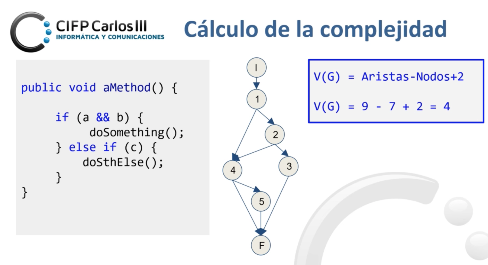

# Calidad del software
## Aseguramiento de la calidad del software

El aseguramiento de la calidad del software es un conjunto de
procedimientos y normas que garantizan que el desarrollo y los productos
de software cumplan con los niveles de calidad establecidos. Este
proceso busca minimizar errores y asegurar que el software entregado se
ajuste a las especificaciones y necesidades del cliente, garantizando su
correcto funcionamiento y fiabilidad.

**Marco de Trabajo y Normativa**

El aseguramiento de calidad se apoya en estándares y normativas, como
**ISO 9000**, que define principios para la gestión y control de calidad
en proyectos de software. Estos estándares ayudan a establecer un marco
de trabajo que guía la evaluación de calidad, la auditoría, la seguridad
y la eficiencia del software.

**Departamentos de Calidad**

Los departamentos de calidad incluyen oficinas técnicas, oficinas de
proyectos y oficinas de gestión de proyectos (PMO), además de los
equipos de aseguramiento de calidad (QA). Cada uno tiene roles
específicos en el control y supervisión de calidad a lo largo del ciclo
de vida del desarrollo del software.

**Evaluación del Proyecto**

En la evaluación del proyecto, se consideran múltiples factores para
asegurar un desarrollo de calidad:

- **Facilidad de auditoría**: Que permita una revisión clara y precisa.

- **Consistencia y Completitud**: Todos los elementos deben estar bien
  definidos y ser coherentes.

- **Estandarización y Exactitud**: Cumplir con las normas establecidas
  para facilitar el control y la precisión.

- **Tolerancia a errores y Seguridad**: Proveer de mecanismos que
  minimicen errores y riesgos de seguridad.

**Plan de Calidad: Principios**

El plan de calidad se estructura en torno a tres principios:

- **Gestión de la Calidad**: Involucra políticas de calidad y asignación
  de responsabilidades.

- **Aseguramiento de la Calidad**: Conjunto de actividades planificadas
  para garantizar que el software cumple con los requisitos.

- **Control de la Calidad**: Actividades para verificar el cumplimiento
  de los requisitos de calidad mediante la evaluación de procesos y
  productos.

**Actividades y Métodos de Aseguramiento de la Calidad**

- **Revisiones Técnicas y de Gestión**: Evaluaciones para detectar
  errores en las fases tempranas.

- **Inspección (Verificación)**: Revisión detallada de los productos de
  trabajo para asegurar que cumplan los requisitos.

- **Pruebas (Validación)**: Validación mediante pruebas funcionales y no
  funcionales.

- **Auditorías (Cumplimiento)**: Evaluación independiente para asegurar
  que se sigan los procesos y estándares de calidad.

**Principios de los Sistemas de Calidad**

Los sistemas de calidad en software se basan en los siguientes
principios:

- **Enfoque en el cliente**: La calidad se define en función de las
  necesidades del cliente.

- **Compromiso organizacional**: Todos los miembros de la organización
  son responsables de la calidad.

- **Medición y Mejora Continua**: Seguimiento y análisis continuo para
  mejorar los procesos de desarrollo.

- **Comunicación y Reconocimiento**: Transparencia en la comunicación de
  políticas de calidad y reconocimiento de logros.

**Tipos de Mantenimiento de Software**

Existen diferentes tipos de mantenimiento, cada uno con un objetivo
específico:

- **Correctivo**: Corregir defectos y errores encontrados en el
  software.

- **Evolutivo**: Implementar cambios para añadir nuevas funcionalidades.

- **Adaptativo**: Modificar el software para adaptarse a nuevos entornos
  o plataformas.

- **Perfectivo**: Optimizar el rendimiento o mejorar la usabilidad del
  software.

**Métricas de Calidad**

Las métricas de calidad permiten evaluar aspectos clave del software:

- **Medidas**: Indicadores cuantitativos de atributos como tamaño y
  capacidad.

- **Métricas**: Indicadores específicos de la calidad del proceso,
  producto o proyecto.

- **Indicadores**: Combinaciones de métricas que ofrecen una visión
  general del estado de calidad.

**Tipos de métricas**:

- **Orientadas al tamaño**: Como líneas de código (LoC) o personas-mes.

- **Orientadas a la función**: Basadas en la complejidad del problema.

- **Orientadas a la productividad**: Enfocadas en el proceso de
  desarrollo.

**Tipos de Pruebas de Software**

El aseguramiento de calidad incluye pruebas para validar y verificar el
funcionamiento del software:

- **Pruebas Funcionales**: Aseguran que el software cumpla con los
  requisitos especificados, como pruebas unitarias, de integración, de
  regresión y de aceptación.

- **Pruebas No Funcionales**: Evalúan atributos no relacionados
  directamente con la funcionalidad, como rendimiento, carga y estrés.

**Deuda Técnica y Métricas de Complejidad**

La deuda técnica es el esfuerzo futuro necesario para solucionar
problemas introducidos durante el desarrollo por urgencias u otras
limitaciones. Existen métricas específicas para evaluar la complejidad
del software, como:

- **Complejidad ciclomática**: Mide la cantidad de caminos
  independientes en el código.

- **Índice de mantenibilidad**: Evalúa la facilidad de mantenimiento del
  software.

- **Cobertura de código**: Proporción de código ejecutado durante las
  pruebas.

**Notas Relevantes sobre la Calidad**

Es importante recordar que la calidad del software es difícil de medir
de forma absoluta debido a su naturaleza. La certificación de calidad se
otorga a los procesos de desarrollo, no al software en sí. En última
instancia, el usuario final percibe la calidad del software según su
experiencia y sus necesidades.

## Familia ISO/IEC 25000 (SQuaRE)

La familia de normas ISO/IEC 25000, también conocida como SQuaRE (System
and Software Quality Requirements and Evaluation), tiene como objetivo
proporcionar un marco de trabajo común para evaluar la calidad de los
productos de software. Estas normas abarcan desde la especificación de
requisitos de calidad hasta la evaluación de dicha calidad, facilitando
su aplicación en diversas áreas del desarrollo de software.

**Objetivos de ISO/IEC 25000**

Las normas ISO/IEC 25000 están diseñadas para:

- **Especificación de requisitos de calidad**: Determinar los atributos
  de calidad necesarios para el software.

- **Evaluación de la calidad del software**: Proveer herramientas para
  medir y analizar la calidad del producto de software.

**Divisiones de las Normas ISO/IEC 25000**

Las normas se dividen en varias categorías, cada una enfocada en un
aspecto específico de la calidad del software:

- **División de Gestión de Calidad (ISO/IEC 2500n)**: Define los
  modelos, términos y definiciones comunes utilizados en la familia
  25000.

- **División de Modelo de Calidad (ISO/IEC 2501n)**: Contiene modelos
  detallados para evaluar la calidad interna, externa y en uso del
  software.

  - **ISO/IEC 25010**: Proporciona un modelo de calidad para productos
    de software y su calidad en uso.

  - **ISO/IEC 25012**: Modelo de calidad de datos para evaluar datos
    estructurados en sistemas de información.

- **División de Medición de Calidad (ISO/IEC 2502n)**: Proporciona un
  modelo de referencia y definiciones de métricas para la calidad.

- **División de Requisitos de Calidad (ISO/IEC 2503n)**: Ayuda en la
  especificación de requisitos de calidad.

  - **ISO/IEC 25030**: Contiene recomendaciones para la especificación
    de requisitos de calidad.

- **División de Evaluación de Calidad (ISO/IEC 2504n)**: Proporciona
  guías y modelos para la evaluación del software.

  - **ISO/IEC 25040**: Modelo de referencia para la evaluación, que
    incluye las entradas, restricciones y recursos necesarios para el
    proceso.

**ISO/IEC 25010: Modelo de Calidad del Software**

La norma ISO/IEC 25010 define un modelo de calidad que identifica las
características a evaluar en un producto de software. Estas
características son:

- **Adecuación Funcional**: Capacidad para cumplir con la funcionalidad
  acordada.

  - Completitud funcional, Corrección funcional y Pertinencia funcional.

- **Eficiencia de desempeño**: Uso de recursos de manera óptima.

  - Comportamiento temporal, Utilización de recursos y Capacidad.

- **Compatibilidad**: Capacidad para funcionar en conjunto con otros
  sistemas.

  - Coexistencia e Interoperabilidad.

- **Usabilidad**: Facilidad de uso y comprensión del software.

  - Reconocibilidad, Aprendizabilidad, Operabilidad, Estética de la
    interfaz de usuario, Accesibilidad.

- **Fiabilidad**: Capacidad para mantener un funcionamiento correcto.

  - Madurez, Disponibilidad, Tolerancia a fallos y Capacidad de
    recuperación.

- **Seguridad**: Protección contra accesos no autorizados.

  - Confidencialidad, Integridad, No repudio, Responsabilidad,
    Autenticidad.

- **Mantenibilidad**: Facilidad para realizar cambios y adaptaciones.

  - Modularidad, Reusabilidad, Analizabilidad, Modificabilidad,
    Capacidad para ser probado.

- **Portabilidad**: Capacidad para ser transferido y usado en otros
  entornos.

  - Adaptabilidad, Capacidad para ser instalado, Capacidad para ser
    reemplazado.

Además, la **ISO/IEC 25059** extiende este modelo para considerar
aspectos específicos de la Inteligencia Artificial, como la
Adaptabilidad Funcional y la Intervenibilidad.

**ISO/IEC 25012: Modelo de Calidad de Datos**

La norma ISO/IEC 25012 define las características de calidad que deben
tener los datos en un sistema de información. Estas características se
agrupan en dos categorías:

- **Calidad de Datos Inherente**: Grado en que los datos poseen
  cualidades intrínsecas.

  - Exactitud, Completitud, Consistencia, Credibilidad, Actualidad.

- **Calidad de Datos Dependiente del Sistema**: Grado en que el sistema
  mantiene la calidad de los datos.

  - Disponibilidad, Portabilidad, Recuperabilidad.

**ISO/IEC 25040: Proceso de Evaluación del Software**

La norma ISO/IEC 25040 describe el proceso de evaluación de software,
que consta de cinco actividades:

1.  **Establecer los requisitos de la evaluación**: Definir qué aspectos
    del software se evaluarán.

2.  **Especificar la evaluación**: Detallar los criterios y métodos de
    evaluación.

3.  **Diseñar la evaluación**: Preparar el plan de evaluación.

4.  **Ejecutar la evaluación**: Realizar las pruebas y análisis
    correspondientes.

5.  **Concluir la evaluación**: Documentar los resultados y
    conclusiones.

## Caso práctico: cálculo de la complejidad ciclomática

El **cálculo de la complejidad ciclomática** mide la complejidad de un
programa basándose en el número de caminos linealmente independientes en
su flujo de control. Esto ayuda a evaluar la calidad, mantenibilidad y
facilidad de pruebas del código. Se realiza en los siguientes pasos:

1.  **Representar el programa como un grafo de flujo de control**:

    - Los nodos (nodes) representan bloques de código secuenciales
      (instrucciones o declaraciones).

    - Las aristas (edges) representan los flujos de control entre esos
      bloques (saltos, bucles, condiciones, etc.).

2.  **Aplicar la fórmula de McCabe**:\
    La complejidad ciclomática V(G) se calcula como:

> **V(G) = E – N + 2**
>
> **Donde:**

1.  E: Número de aristas (líneas que conectan nodos).

2.  N: Número de nodos (bloques de código).

<!-- -->

3.  **Alternativamente, usar el número de regiones**:\
    Contar el número de **regiones cerradas** (incluyendo la región
    externa) del grafo. Este número es igual a la complejidad
    ciclomática.

4.  **Interpretar el resultado**:

    - V(G)=1: Código sin bifurcaciones (secuencial).

    - V(G)\> 1: Cada incremento representa un camino independiente
      adicional.

    - Complejidades mayores a 10 suelen considerarse difíciles de
      mantener y probar.
