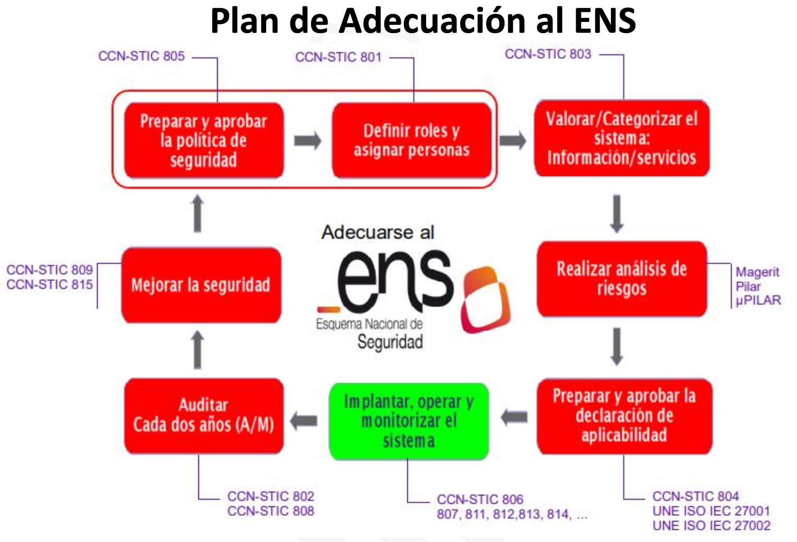

# El Esquema Nacional de Seguridad (Real Decreto 311/2022)
## Principios básicos y requisitos mínimos

**Objeto**\
El objeto de este Real Decreto es regular el Esquema Nacional de
Seguridad, el cual establece los principios básicos y requisitos mínimos
necesarios para una protección adecuada de la información, a fin de
asegurar el acceso, confidencialidad, integridad, trazabilidad,
autenticidad, disponibilidad y conservación de los datos, información y
servicios.

**Ámbito de aplicación**\
El ENS aplica a todo el sector público y a las entidades del sector
privado cuando presten servicios a las entidades del sector público.
Para los sistemas de información clasificada, se podrán adoptar medidas
complementarias.

**Principios básicos**

1.  **Seguridad como proceso integral:** Involucra elementos técnicos,
    humanos, materiales y organizativos.

2.  **Gestión de la seguridad basada en los riesgos:** La seguridad debe
    gestionarse mediante un sistema actualizado que evalúe riesgos.

3.  **Prevención, detección, respuesta y conservación:** Se requiere un
    enfoque preventivo y reactivo.

4.  **Existencia de líneas de defensa:** Deben implementarse medidas
    organizativas, físicas y lógicas.

5.  **Vigilancia continua:** Monitoreo constante de la seguridad.

6.  **Reevaluación periódica:** Revisión y actualización constantes.

7.  **Diferenciación de responsabilidades:**

    - **Responsable de Información:** Determina los requisitos de la
      información tratada.

    - **Responsable del Servicio:** Define los requisitos de los
      servicios prestados.

    - **Responsable de Seguridad:** Establece los requisitos de
      seguridad de la información y los servicios.

    - **Responsable del Sistema:** Implementa y supervisa la seguridad
      del sistema, pudiendo delegar en administradores u operadores.

**Requisitos mínimos de la política de seguridad**\
Permiten una protección adecuada de la información y los servicios,
incluyendo:

- **Organización e implantación del proceso de seguridad.**

- **Análisis y gestión de riesgos específicos de cada organización.**

- **Gestión de personal:** Formación, información y supervisión.

- **Profesionalidad:** Personal cualificado y dedicado.

- **Autorización y control de accesos:** Control y limitación de
  accesos.

- **Protección de instalaciones:** Control de acceso y áreas
  diferenciadas.

- **Adquisición de productos y servicios de seguridad acorde a la
  categoría y nivel de seguridad.**

- **Mínimo privilegio y seguridad por defecto.**

- **Integridad y actualización del sistema con autorización formal
  previa.**

- **Protección de la información almacenada y en tránsito.**

- **Prevención ante interconexiones de redes públicas.**

- **Registro de actividad y detección de código dañino.**

- **Gestión de incidentes de seguridad y continuidad de la actividad.**

- **Mejora continua del proceso de seguridad.**

**Perfiles de cumplimiento específicos**\
El Centro Criptológico Nacional (CCN) valida y publica perfiles de
cumplimiento específicos aplicables a entidades o sectores de actividad
concretos.

**Esquemas de acreditación y validación**\
Garantizan que las implementaciones y configuraciones de soluciones de
seguridad cumplan con el ENS y las guías de seguridad CCN-STIC.

**Auditoría de la seguridad**\
Es obligatoria una auditoría ordinaria cada dos años o cuando se
realicen modificaciones sustanciales en el sistema. Los niveles de
auditoría dependen de la categoría del sistema:

- **Básica**: Autoevaluación y análisis del responsable de seguridad.

- **Media/Alta**: Auditoría completa con informe de cumplimiento.

**Estado de seguridad de los sistemas**\
El Comité Sectorial de Administración Electrónica debe conocer el estado
de la seguridad en los sistemas de información. El CCN facilita la
recogida y consolidación de información de seguridad.

**Centro Criptológico Nacional (CCN)**\
El CCN, a través del CCN-CERT, gestiona la respuesta ante incidentes de
seguridad. Sus funciones incluyen:

- Respuesta a incidentes, formación, concienciación y sensibilización.

- Divulgación de buenas prácticas, guías CCN-STIC y avisos de
  ciberseguridad.

- Validación de perfiles de cumplimiento específicos y esquemas de
  acreditación.

**CCN-CERT**\
Es el coordinador estatal de la respuesta técnica ante incidentes de
seguridad en el sector público. Actúa en coordinación con INCIBE-CERT
para el sector privado, brindando soporte y supervisando la reconexión
de sistemas tras incidentes.

**Normas de conformidad**\
El ENS rige la seguridad en sedes y registros electrónicos, así como el
acceso de los ciudadanos a servicios públicos. Cada organismo debe
establecer su propio mecanismo de control.

**Actualización**\
El ENS requiere una actualización constante para adaptarse a los cambios
tecnológicos.

**Plazos de adecuación**\
Las entidades tienen un plazo de 24 meses para adaptarse a los nuevos
requisitos del ENS.

**Categorización de los sistemas de información**\
Los sistemas se clasifican en función del impacto de un incidente en las
dimensiones de seguridad (Disponibilidad, Autenticidad, Integridad,
Confidencialidad, Trazabilidad) y pueden tener una categoría de
seguridad Básica, Media o Alta.

**Anexo I: Categorías de los sistemas**\
Determina la categoría del sistema en función del nivel de seguridad en
cada dimensión. Los niveles de seguridad son:

- **Bajo:** Perjuicio limitado.

- **Medio:** Perjuicio grave.

- **Alto:** Perjuicio muy grave.

**Anexo II: Medidas de seguridad**\
Las medidas de seguridad se estructuran en el Marco Organizativo, el
Marco Operacional y las Medidas de Protección:

- **Marco Organizativo:** Define normativa, política y procedimientos de
  seguridad.

- **Marco Operacional:** Protege la operación del sistema, incluye
  control de acceso, gestión de recursos externos, servicios en nube y
  continuidad del servicio.

- **Medidas de Protección:** Protección de instalaciones, gestión del
  personal, seguridad de equipos y comunicaciones, protección de
  soportes de información y aplicaciones.

## Categorización de los sistemas

La categorización de sistemas es fundamental para determinar el nivel de
protección necesario. El proceso incluye:

1.  **Participantes y Procedimiento**:

    - **Responsable de Información (RINFO)** y **Responsable de Servicio
      (RSER)**: Aprueban los niveles de seguridad del sistema.

    - En sistemas departamentales, RINFO y RSER pueden ser la misma
      persona.

    - **Responsable de Seguridad (RSEG)**: Asesora y valida la
      categorización.

    - **Responsable Funcional (RFUN)**: Define los requisitos
      funcionales.

    - **Responsable Informático (RINF)**: Jefe de proyecto, analista o
      responsable técnico. Puede proponer niveles cuando RINFO/RSER no
      lo hayan hecho y el RFUN no muestre iniciativa.

2.  **Dimensiones del ENS**: **DICTA**

    - **Disponibilidad**

    - **Integridad**

    - **Confidencialidad**

    - **Trazabilidad**

    - **Autenticidad**

3.  **Categorización del Sistema**:

    - Se determina el nivel de seguridad como **BÁSICO**, **MEDIO** o
      **ALTO**, tomando el valor máximo entre las dimensiones: **MAX(D,
      I, C, T, A)**.

4.  **Criterios de Valoración según el ENS**:

    - **Activos de tipo Información (ICTA)**:

      - **ALTO**: Daño grave de difícil o imposible reparación.

      - **MEDIO**: Daño importante aunque subsanable.

      - **BAJO**: Algún perjuicio.

      - **N/A**: Irrelevante.

    - **Activos de tipo Servicio (Disponibilidad)**:

      - **ALTO**: **RTO** (Recovery Time Objective) menor a 4 horas.

      - **MEDIO**: RTO entre 4 horas y 1 día.

      - **BAJO**: RTO entre 1 y 5 días.

      - **N/A**: RTO superior a 5 días.

    - **Tratamiento de Alto Riesgo**:

      - Evaluación sistemática y exhaustiva de aspectos personales.

      - Elaboración de perfiles.

      - Datos de categorías especiales.

      - Observación de una zona pública.

**Nivel de Madurez en la Implantación de Medidas**

- **L0 - Inexistente**: Medida no aplicada.

- **L1 - Inicial / Ad hoc**: Depende de la buena voluntad de los
  operarios.

- **L2 - Repetible**: Existe un mínimo de planificación, además de la
  buena voluntad.

- **L3 - Proceso Definido**: Existe un catálogo de procesos actualizado
  y definido.

- **L4 - Gestionado y Medible**: Se conoce la eficacia y eficiencia de
  los procesos mediante métricas.

- **L5 - Optimizado**: Existe una mejora continua del proceso.

**Documentación de Seguridad**

El **Responsable de Seguridad del Sistema** es el encargado de elaborar
la documentación de seguridad, que varía según la categoría del sistema:

- **Categoría BÁSICA**:

  - **Declaración de Conformidad**: Basada en una **autoevaluación**.

  - **Documento de Autoevaluación**: Analizado y validado por el RSEG.

- **Categoría MEDIA/ALTA**:

  - **Certificación de Conformidad**: Requiere una **auditoría formal**.

  - **Informe de Auditoría**: Analizado y validado por el RSEG.

**Aclaraciones**:

- Las **autoevaluaciones y auditorías** se realizarán cada **2 años** de
  forma ordinaria, y de forma extraordinaria cada vez que se produzcan
  **modificaciones significativas** en el sistema.

- Ambas categorías pueden someterse a una auditoría formal si se
  considera necesario.

**Contenido de la Documentación**:

- **Política de Seguridad** del sistema.

- **Información que maneja el sistema**, junto con su valoración.

- **Servicio que presta el sistema**, junto con su valoración.

- **Datos de carácter personal** involucrados.

- **Categoría del sistema** determinada.

- **Declaración de Aplicabilidad** de las medidas de seguridad.

- **Análisis de Riesgos** realizado.

- **Insuficiencia del sistema** en términos de nivel de madurez:

  - **BÁSICO**: Nivel L2.

  - **MEDIO**: Nivel L3.

  - **ALTO**: Nivel L4.

- **Plan de Mejora de la Seguridad**, incluyendo plazos y responsables.

## Medidas de seguridad

## Plan de adecuación al ENS
{width="5.7444444444444445in" height="3.910416666666667in"}
**Nota:** Según la fuente los pasos y el orden de como realizarlo
cambia.

**1. Identificar el alcance del sistema / Política de Seguridad y
Definición de Roles**

- **Identificar roles y personas participantes**:

  - **Aprobadores**: Responsable de la Información (**RINFO**),
    Responsable del Servicio (**RSER**), Responsable Funcional
    (**RFUN**).

  - **Proponentes de la categorización**: Responsable de Seguridad
    (**RSEG**), Responsable del Sistema (**RSIS**), Responsable de
    Infraestructura/Tecnología (**RINF/RTEC**).

- **Identificar tipos de activo**: **Información y Servicios**.

**2. Categorización del Sistema**

- **Listar activos**: Catalogar los activos de **información y
  servicios**.

- **Valorar activos**: Según **DICTA** y justificando cada valoración.

- **Categorizar sistema**: Basado en el valor máximo de **Disponibilidad
  (D), Integridad (I), Confidencialidad (C), Trazabilidad (T)** y
  **Autenticidad (A)**.

**\*3. Declaración de Aplicabilidad Provisional**

Resultado inicial de la categorización del sistema

**4. Análisis de Riesgos**

- **Categoría Básica**: Análisis informal (**autoevaluación**).

- **Categoría Media/Alta**: Análisis formal (**MAGERIT** y herramientas
  como **PILAR**).

**5. Aprobar la Declaración de Aplicabilidad Definitiva o Perfil de
Cumplimiento Específico**

- **Aplicar niveles de cumplimiento**: Implementar medidas y, si es
  necesario, medidas compensatorias.

- **Aceptación del nivel del riesgo**: Aceptar el **riesgo residual**.

- **Declaración de Aplicabilidad Final**: Documento definitivo tras la
  aceptación del riesgo.

**6. Política de seguridad.**

## Adecuación, conformidad y certificación

Para la Certificación o conformidad con el ENS abordar las siguientes
fases:

1.  **Plan de adecuación**

    1.  Identificación del alcance del sistema.

    2.  Categorización del sistema.

    3.  Declaración de Aplicabilidad Provisional.

    4.  Análisis de riesgos.

    5.  Validación de la Declaración de Aplicabilidad Definitiva o
        Perfil de Cumplimiento Específico.

    6.  Política de seguridad.

2.  **Implantación de la seguridad**

    1.  Hoja de ruta para la implementación de medidas de seguridad.

    2.  Elaboración del marco normativo e implementación.

    3.  Aprobación del sistema de gestión de seguridad.

3.  **Declaración / Certificación de conformidad**

    1.  Auditoría formal (Categoría MEDIA o Alta) o Autoevaluación
        (Categoría BÁSICA)

4.  **Informar sobre el Estado de Seguridad**

    1.  Métricas e indicadores

5.  **Vigilancia y Mejora continua**

    1.  **Acciones:** Revisión de la política de seguridad de la
        información, revisión de la información y servicios,
        actualización de riesgos, revisión de la Declaración de
        Aplicabilidad, Realización de auditorías internas, Revisión del
        Plan de Mejora, Revisión de las medidas de seguridad, Revisión y
        actualización de procedimientos, y Revisión de estado de
        seguridad

6.  **Procesos de Adecuación para Entidades Locales**

7.  **Catálogo de Productos Cualificados**

**\*Fuente:**
<https://ens.ccn.cni.es/es/conformidad/proceso-de-adecuacion>

## Caso práctico: plan de adecuación al ENS

La Subsecretaría de la Conselleria de Hacienda y Administración Pública
de la Generalitat Valenciana debe adaptar sus sistemas de información al
Esquema Nacional de Seguridad (ENS). Los sistemas implicados gestionan
los siguientes activos:

- **Información**:

  - Trámites telemáticos de tributos y juego.

- **Servicios**:

  - Plataforma de contratación de la Generalitat Valenciana.

  - Tramitación electrónica de procedimientos en materia de juego.

  - Pago de tributos.

**Se solicita:**

1.  **Identificar y Categorización de Activos**

2.  Identificar las **medidas de seguridad** del Anexo II del ENS
    aplicables a cada activo, en función de su categorización.

3.  Realizar un **análisis de riesgos semiformal**, identificando
    amenazas, evaluando su probabilidad e impacto, y proponiendo medidas
    para su mitigación.

4.  **Declaración de Aplicabilidad Definitiva**

**Solución.**

**Paso 1: Identificación y Categorización de Activos**

1.  **Activos identificados:**

    1.  **Información:**

        1.  Trámites telemáticos de tributos y juegos

    2.  **Servicio:**

        1.  Plataforma de contratación de la GVA

        2.  Tramitación electrónica de procedimientos en materia de
            juego

        3.  Pago de tributos

2.  **Valoración según DICTA:**

Basándonos en los principios del ENS (Disponibilidad, Integridad,
Confidencialidad, Trazabilidad y Autenticidad), caracterizamos los
activos de la siguiente manera:

1.  **Tabla de activos de información**

| Información | Responsable | D | I | C | T | A |
|----|----|----|----|----|----|----|
| Trámites telemáticos tributos y juego | Subsecretaría de la conselleria de hacienda y administración pública | n/a | M | M | M | M |

2.  **Tabla de activos de servicio**

| Servicio | Responsable | D | I | C | T | A |
|----|----|----|----|----|----|----|
| Plataforma de contratación GVA | Secretaría gral. Admva. De la conselleria de hacienda y administración pública | B | n/a | n/a | B | B |
| Tramitación electrónica de procedimientos en materia de juego | Secretaría gral. Admva. De la conselleria de hacienda y administración pública | M | n/a | n/a | M | M |
| Pago de tributos | Secretaría gral. Admva. De la conselleria de hacienda y administración pública | M | n/a | n/a | M | M |

3.  **Categorización del sistema:**

> Según la fórmula ENS (MAX(D, I, C, T, A)), el sistema se clasifica con
> categoría **MEDIA**.

**Paso 2: Identificación de Medidas del Anexo II a Aplicar**

1.  **Información:**

    - **Trámites telemáticos de tributos y juego:**

      1.  **Gestión de accesos**: Doble factor, contraseñas robustas,…

      2.  **Auditoría y registros:** Registro de eventos, alertas
          automáticas,…

2.  **Servicio:**

    - **Plataforma de contratación:**

      1.  **Protección de la información:** Cifrado básico, copias de
          seguridad diarias,…)

      2.  **Gestión de accesos:** Limitar accesos, mínimos privilegios,
          sistemas de registro,…

      3.  **Disponibilidad:** Redundancia mínima,…

    - **Tramitación electrónica:**

      1.  **Protección de la información:** AES-256, segregación
          lógica,…

      2.  **Gestión de accesos:** Doble factor, listas de control,…

      3.  **Auditoría y registro:** Detección de intrusiones (IDS),…

      4.  **Disponibilidad:** Sistemas de balanceo, redundancia de
          servidores,…

    - **Pago tributos:**

      1.  **Protección de la información:** AES-256 y TLS 1.3

      2.  **Auditoría y registro:** Registro centralizado de eventos,
          generar informes regulares,…

      3.  **Disponibilidad y continuidad:** Tolerancia a fallos, planes
          de contingencia,…

**Resultado:** Se emite una Declaración de Aplicabilidad Provisional,
pendiente del análisis de riesgos para su validación definitiva. Sistema
de categoría **MEDIA.**

**Paso 3: Análisis de Riesgos (Semiformal)**

Basado en los activos identificados en la fase anterior, se evalúan las
principales amenazas, su probabilidad, impacto, y se proponen medidas de
mitigación.

1.  **Identificación de Riesgos**

<table>
<colgroup>
<col style="width: 28%" />
<col style="width: 28%" />
<col style="width: 16%" />
<col style="width: 11%" />
<col style="width: 15%" />
</colgroup>
<thead>
<tr>
<th>Activo</th>
<th style="text-align: center;">Amenaza</th>
<th style="text-align: center;">
Probabilidad

(P)
</th>
<th style="text-align: center;">
Impacto

(I)
</th>
<th style="text-align: center;">
Riesgo Inicial

(R = P x I)
</th>
</tr>
</thead>
<tbody>
<tr>
<td rowspan="2">Trámites telemáticos</td>
<td>Acceso no autorizado</td>
<td style="text-align: center;">Media</td>
<td style="text-align: center;">Alto</td>
<td style="text-align: center;">Alto</td>
</tr>
<tr>
<td>Fuga de información</td>
<td style="text-align: center;">Media</td>
<td style="text-align: center;">Alto</td>
<td style="text-align: center;">Alto</td>
</tr>
<tr>
<td rowspan="2">Plataforma de contratación</td>
<td>Ataque DDoS</td>
<td style="text-align: center;">Alta</td>
<td style="text-align: center;">Alto</td>
<td style="text-align: center;">Alto</td>
</tr>
<tr>
<td>Pérdida de disponibilidad</td>
<td style="text-align: center;">Media</td>
<td style="text-align: center;">Medio</td>
<td style="text-align: center;">Medio</td>
</tr>
<tr>
<td rowspan="2">Tramitación electrónica</td>
<td>Modificación no autorizada</td>
<td style="text-align: center;">Media</td>
<td style="text-align: center;">Alto</td>
<td style="text-align: center;">Alto</td>
</tr>
<tr>
<td>Fallos en la integridad</td>
<td style="text-align: center;">Media</td>
<td style="text-align: center;">Medio</td>
<td style="text-align: center;">Medio</td>
</tr>
<tr>
<td rowspan="2">Pago de tributos</td>
<td>Acceso no autorizado</td>
<td style="text-align: center;">Media</td>
<td style="text-align: center;">Alto</td>
<td style="text-align: center;">Alto</td>
</tr>
<tr>
<td>Pérdida de disponibilidad</td>
<td style="text-align: center;">Media</td>
<td style="text-align: center;">Alto</td>
<td style="text-align: center;">Alto</td>
</tr>
</tbody>
</table>

2.  **Medidas de Seguridad y Tratamiento de Riesgos**

<table style="width:100%;">
<colgroup>
<col style="width: 18%" />
<col style="width: 9%" />
<col style="width: 24%" />
<col style="width: 12%" />
<col style="width: 21%" />
<col style="width: 11%" />
</colgroup>
<thead>
<tr>
<th style="text-align: center;">Amenaza</th>
<th style="text-align: center;">Riesgo Inicial</th>
<th style="text-align: center;">Medidas de Seguridad</th>
<th style="text-align: center;">Madurez (L1-L5)</th>
<th style="text-align: center;">Propuesta de Tratamiento</th>
<th style="text-align: center;">Riesgo Residual</th>
</tr>
</thead>
<tbody>
<tr>
<td>Acceso no autorizado en trámites telemáticos</td>
<td style="text-align: center;">Alto</td>
<td>- Autenticación multifactor 
- Contraseñas robustas 
- Cifrado de datos</td>
<td style="text-align: center;">L2</td>
<td>Desplegar autenticación multifactor y actualizar políticas de
contraseñas</td>
<td style="text-align: center;">Medio</td>
</tr>
<tr>
<td>Fuga de información en trámites telemáticos</td>
<td style="text-align: center;">Alto</td>
<td>- Registro de eventos 
- Auditorías periódicas 
- Alertas automáticas</td>
<td style="text-align: center;">L1</td>
<td>Implementar un sistema de registro centralizado y realizar
auditorías semestrales</td>
<td style="text-align: center;">Medio</td>
</tr>
<tr>
<td>Ataque DDoS en plataforma de contratación</td>
<td style="text-align: center;">Alto</td>
<td>- Solución AntiDDoS 
- Redundancia de servidores 
- Balanceo de carga</td>
<td style="text-align: center;">L2</td>
<td>Ampliar capacidad de balanceo y garantizar redundancia de
servidores</td>
<td style="text-align: center;">Bajo</td>
</tr>
<tr>
<td>Pérdida de disponibilidad en plataforma de contratación</td>
<td style="text-align: center;">Medio</td>
<td>- Copias de seguridad 
- Planes de contingencia</td>
<td style="text-align: center;">L3</td>
<td>Revisar y probar regularmente los planes de contingencia</td>
<td style="text-align: center;">Bajo</td>
</tr>
<tr>
<td>Modificación no autorizada en tramitación electrónica</td>
<td style="text-align: center;">Alto</td>
<td>- Control de acceso 
- Gestión de privilegios mínimos 
- Cifrado AES-256</td>
<td style="text-align: center;">L2</td>
<td>Implementar listas de control de acceso y sistemas de segregación
lógica</td>
<td style="text-align: center;">Medio</td>
</tr>
<tr>
<td>Fallos en la integridad en tramitación electrónica</td>
<td style="text-align: center;">Medio</td>
<td>- Verificación de integridad 
- Supervisión automática</td>
<td style="text-align: center;">L3</td>
<td>Automatizar supervisión continua y realizar pruebas regulares de
integridad</td>
<td style="text-align: center;">Bajo</td>
</tr>
<tr>
<td>Acceso no autorizado en pago de tributos</td>
<td style="text-align: center;">Alto</td>
<td>- TLS 1.3 
- Cifrado AES-256 
- Autenticación multifactor</td>
<td style="text-align: center;">L2</td>
<td>Reforzar el cifrado en todas las comunicaciones y aplicar
autenticación multifactor</td>
<td style="text-align: center;">Bajo</td>
</tr>
<tr>
<td>Pérdida de disponibilidad en pago de tributos</td>
<td style="text-align: center;">Alto</td>
<td>- Tolerancia a fallos 
- Sistemas de respaldo</td>
<td style="text-align: center;">L3</td>
<td>Garantizar mecanismos de failover en tiempo real y aumentar
capacidad de respaldo</td>
<td style="text-align: center;">Bajo</td>
</tr>
</tbody>
</table>

**Paso 4: Declaración de Aplicabilidad definitiva**

Tras implementar las medidas de seguridad propuestas y alcanzar un nivel
de madurez adecuado **(L2-L3 para la mayoría de riesgos)**, los riesgos
residuales se consideran aceptables para el sistema categorizado como
**MEDIA**. Se emite la Declaración de Aplicabilidad Definitiva,
incluyendo las medidas adoptadas, su eficacia comprobada, y los
responsables asignados para garantizar el cumplimiento continuo del ENS.
