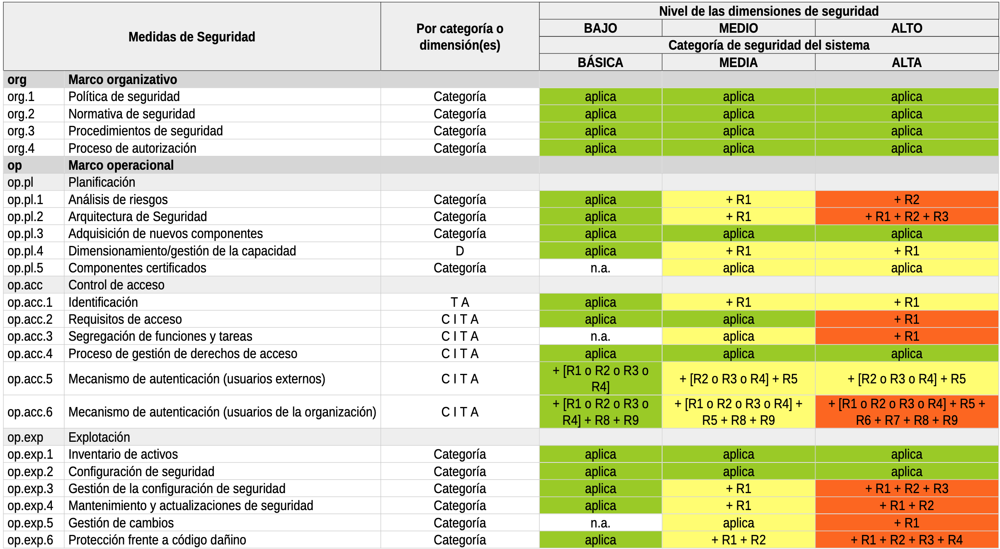
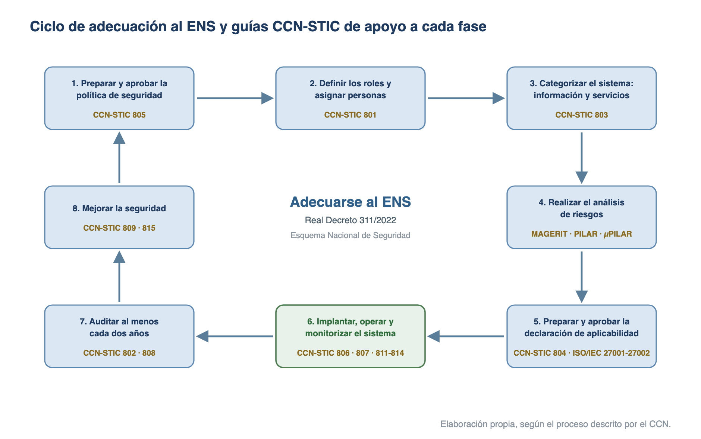

# Esquema Nacional de Seguridad (Real Decreto 311/2022)

**Texto consolidado a 6 de noviembre de 2024.**

El **Real Decreto 311/2022, de 3 de mayo**, regula el **Esquema Nacional de Seguridad (ENS)**, establecido en el **artículo 156.2 de la Ley 40/2015**, de Régimen Jurídico del Sector Público. Deroga el **Real Decreto 3/2010, de 8 de enero**, para adaptar el esquema a la evolución de las ciberamenazas, al marco europeo de ciberseguridad y a la creciente dependencia tecnológica del sector público.

## Características y estructura

- **Objeto (art. 1)**: el ENS «está constituido por los principios básicos y requisitos mínimos necesarios para una protección adecuada de la información tratada y los servicios prestados», con objeto de asegurar «el acceso, la confidencialidad, la integridad, la trazabilidad, la autenticidad, la disponibilidad y la conservación de los datos, la información y los servicios utilizados por medios electrónicos».
- **Publicación y entrada en vigor**: publicado en el BOE el **4 de mayo de 2022**; en vigor desde el **5 de mayo de 2022** (día siguiente al de su publicación).
- **Estructura**: **41 artículos** en **7 capítulos** (disposiciones generales; principios básicos; política de seguridad y requisitos mínimos; auditoría, informe e incidentes de seguridad; normas de conformidad; actualización; categorización), 3 disposiciones adicionales, 1 transitoria, 1 derogatoria, 3 finales y **4 anexos**:
    - **Anexo I**: categorías de seguridad de los sistemas de información.
    - **Anexo II**: medidas de seguridad.
    - **Anexo III**: auditoría de la seguridad.
    - **Anexo IV**: glosario.
- **Adecuación (disposición transitoria única)**: los sistemas preexistentes dispusieron de **24 meses** desde la entrada en vigor (hasta el **5 de mayo de 2024**) para alcanzar su plena adecuación al nuevo ENS; los sistemas nuevos lo aplican desde su concepción.
- **Novedades frente al RD 3/2010**: principio de vigilancia continua, **perfiles de cumplimiento específicos** para entidades o sectores concretos, y un Anexo II renovado sobre la base de un requisito general por medida y unos posibles **refuerzos** graduados según el nivel de seguridad perseguido.

### Ámbito de aplicación (art. 2)

- **Todo el sector público**, en los términos del **art. 2 de la Ley 40/2015** (Administración General del Estado, comunidades autónomas, entidades locales y sector público institucional).
- **Sistemas que tratan información clasificada**: también se les aplica el ENS, sin perjuicio de la **Ley 9/1968, de Secretos Oficiales**, pudiendo requerir medidas complementarias de seguridad.
- **Entidades del sector privado** cuando, en virtud de una relación contractual, **presten servicios o provean soluciones** a las entidades del sector público. Deben contar con su propia **política de seguridad**, aprobada por su órgano con máximas competencias ejecutivas. Los **pliegos** de los contratos incluirán los requisitos de conformidad con el ENS, cautela que se extiende a la **cadena de suministro** de los contratistas en lo necesario según el análisis de riesgos.
- **Redes y servicios 5G**: se aplica además el **Real Decreto-ley 7/2022**, de requisitos de seguridad de redes y servicios 5G.
- **Sistemas que tratan datos personales (art. 3)**: se aplican también el **RGPD** y la **LO 3/2018 (LOPDGDD)** (o la LO 7/2021 en el ámbito penal). El responsable o encargado del tratamiento, asesorado por el delegado de protección de datos, realizará el análisis de riesgos del art. 24 del RGPD y, en los supuestos de su art. 35, la evaluación de impacto. **Prevalecen las medidas que resulten agravadas** respecto de las previstas en el ENS.

### Desarrollo del ENS (disposición adicional segunda)

El ENS se desarrolla mediante **instrucciones técnicas de seguridad (ITS)**, de **obligado cumplimiento**, aprobadas por resolución de la Secretaría de Estado competente en función pública, y mediante las **guías CCN-STIC** (particularmente la **serie 800**), elaboradas y difundidas por el **Centro Criptológico Nacional (CCN)**. Las cuatro ITS aprobadas son:

| ITS | Aprobación |
| --- | --- |
| Informe del Estado de la Seguridad | Resolución de **7 de octubre de 2016** |
| Conformidad con el ENS | Resolución de **13 de octubre de 2016** |
| Auditoría de la Seguridad de los Sistemas de Información | Resolución de **27 de marzo de 2018** |
| Notificación de Incidentes de Seguridad | Resolución de **13 de abril de 2018** |

## Principios básicos y requisitos mínimos

Los **siete principios básicos** (art. 5, desarrollados en los arts. 6 a 11) orientan las decisiones en materia de seguridad; los **quince requisitos mínimos** (art. 12) son las exigencias que toda política de seguridad debe desarrollar.

### Principios básicos

- **Seguridad como proceso integral (art. 6)**: constituido por todos los elementos humanos, materiales, técnicos, jurídicos y organizativos relacionados con el sistema; excluye cualquier actuación puntual o tratamiento coyuntural. Máxima atención a la **concienciación** de las personas.
- **Gestión de la seguridad basada en los riesgos (art. 7)**: el análisis y la gestión de riesgos es una actividad **continua y permanentemente actualizada**; las medidas deben ser proporcionadas a la información, los servicios y los riesgos.
- **Prevención, detección, respuesta y conservación (art. 8)**: prevenir que las amenazas se materialicen, detectar los ciberincidentes, responder restaurando información y servicios, y **conservar** los datos en soporte electrónico durante todo el ciclo vital.
- **Existencia de líneas de defensa (art. 9)**: múltiples capas de seguridad de naturaleza **organizativa, física y lógica**, que permitan reaccionar ante incidentes no evitados y minimizar el impacto final.
- **Vigilancia continua (art. 10)**: detección de actividades o comportamientos anómalos y respuesta oportuna; evaluación permanente del estado de la seguridad de los activos.
- **Reevaluación periódica (art. 10)**: las medidas de seguridad se reevalúan y actualizan periódicamente, pudiendo llegar a un replanteamiento de la seguridad.
- **Diferenciación de responsabilidades (art. 11)**: se diferencian el responsable de la información, el del servicio, el de la seguridad y el del sistema; la responsabilidad de la seguridad estará **diferenciada** de la responsabilidad sobre la explotación.

### Roles y responsabilidades (arts. 11 y 13)

- **Responsable de la información**: determina los requisitos de la información tratada.
- **Responsable del servicio**: determina los requisitos de los servicios prestados.
- **Responsable de la seguridad**: determina las decisiones para satisfacer los requisitos de seguridad, supervisa la implantación de las medidas y reporta sobre ellas.
- **Responsable del sistema**: desarrolla la forma concreta de implementar la seguridad y supervisa la operación diaria, pudiendo **delegar en administradores u operadores**.
- El responsable de la seguridad **será distinto** del responsable del sistema y **sin dependencia jerárquica** entre ambos; solo excepcionalmente, por falta justificada de recursos, pueden coincidir aplicando **medidas compensatorias** (art. 13.3).
- En servicios externalizados, la organización prestataria designará un **POC** (punto o persona de contacto) para la seguridad de la información tratada y el servicio prestado, sin perjuicio de que la responsabilidad última resida en la entidad del sector público destinataria (art. 13.5).
- Una ITS regulará el **Esquema de Certificación de Responsables de la Seguridad** (art. 13.4).

### Política de seguridad (art. 12)

Conjunto de directrices que rigen cómo una organización gestiona y protege la información que trata y los servicios que presta. **Cada administración pública** contará con una política de seguridad **formalmente aprobada** por el órgano competente; los municipios pueden disponer de una política común elaborada por la entidad comarcal o provincial que asuma esa responsabilidad. Su contenido mínimo:

- Los objetivos o misión de la organización.
- El marco regulatorio de las actividades.
- Los roles o funciones de seguridad (deberes, responsabilidades, designación y renovación).
- La estructura y composición del comité o comités de gestión y coordinación de la seguridad.
- Las directrices para la estructuración de la documentación de seguridad del sistema.
- Los riesgos que se derivan del tratamiento de los datos personales.

### Requisitos mínimos (art. 12.6)

La política de seguridad se desarrollará aplicando estos **quince requisitos mínimos**, que se exigen **en proporción a los riesgos** identificados en cada sistema (algunos podrán obviarse en sistemas sin riesgos significativos):

1. Organización e implantación del proceso de seguridad.
2. Análisis y gestión de los riesgos.
3. Gestión de personal.
4. Profesionalidad.
5. Autorización y control de los accesos.
6. Protección de las instalaciones.
7. Adquisición de productos de seguridad y contratación de servicios de seguridad.
8. Mínimo privilegio.
9. Integridad y actualización del sistema.
10. Protección de la información almacenada y en tránsito.
11. Prevención ante otros sistemas de información interconectados.
12. Registro de la actividad y detección de código dañino.
13. Incidentes de seguridad.
14. Continuidad de la actividad.
15. Mejora continua del proceso de seguridad.

Cada requisito se desarrolla en los arts. 13 a 27. Destacan para examen:

- **Adquisición de productos y servicios (art. 19)**: se utilizarán, de forma proporcionada a la categoría del sistema y al nivel de seguridad, productos con **funcionalidad de seguridad certificada**. El **Organismo de Certificación** del Esquema Nacional de Evaluación y Certificación de la Seguridad de las TI, del **CCN**, determina los requisitos de certificación. El CCN publica el **Catálogo de Productos y Servicios STIC (CPSTIC)** con productos cualificados.
- **Cumplimiento de los requisitos mínimos (art. 28)**: se materializa aplicando las **medidas de seguridad del Anexo II**, formalizado en la **Declaración de Aplicabilidad** (ver más abajo).

## Categorización de los sistemas

La **categoría de seguridad** de un sistema modula el equilibrio entre la importancia de la información y los servicios y el **esfuerzo de seguridad** requerido, bajo el principio de proporcionalidad (art. 40). Se determina valorando el **impacto que tendría un incidente** sobre la capacidad de la organización para alcanzar sus objetivos, proteger sus activos y garantizar la conformidad con el ordenamiento jurídico (Anexo I). La categoría debe **reevaluarse anualmente** o cuando se produzcan modificaciones significativas.

### Dimensiones de la seguridad

El impacto se valora sobre **cinco dimensiones** de la seguridad, identificadas por sus iniciales (regla mnemotécnica **DICTA**):

- **D**isponibilidad
- **I**ntegridad
- **C**onfidencialidad
- **T**razabilidad
- **A**utenticidad

### Niveles de seguridad por dimensión

Cada dimensión afectada se adscribe a un nivel **BAJO**, **MEDIO** o **ALTO**; si una dimensión no se ve afectada, no se adscribe a ningún nivel:

| Criterio | BAJO (perjuicio limitado) | MEDIO (perjuicio grave) | ALTO (perjuicio muy grave) |
| --- | --- | --- | --- |
| Capacidad de la organización | Reducción apreciable (sigue funcionando) | Reducción significativa (sigue funcionando) | **Anulación efectiva** |
| Daño en los activos | Menor | Significativo | Muy grave, incluso irreparable |
| Incumplimiento de ley o regulación | Formal, subsanable | Material, o formal no subsanable | Grave |
| Perjuicio a individuos | Menor, fácilmente reparable | Significativo, de difícil reparación | Grave, de difícil o imposible reparación |

Cuando un sistema trate diferentes informaciones y preste diferentes servicios, su nivel en cada dimensión será el **mayor** de los establecidos para cada información y servicio.

### Categorías de seguridad

Se definen **tres categorías**: un sistema es de categoría **ALTA** si alguna dimensión alcanza el nivel ALTO; **MEDIA** si alguna alcanza el nivel MEDIO y ninguna uno superior; y **BÁSICA** si alguna alcanza el nivel BAJO y ninguna uno superior.

- **Facultades (art. 41)**: la **valoración** de cada información o servicio corresponde al **responsable de la información o del servicio**; la **determinación de la categoría** del sistema, al **responsable de la seguridad**. En la práctica, la propuesta de valoración suele elaborarse de forma delegada por los responsables funcionales o técnicos que conocen el sistema, sin perjuicio de a quién corresponde la facultad.
- En la práctica administrativa, los **servicios** se valoran principalmente en la dimensión de **disponibilidad**, y la **información** en las restantes (integridad, confidencialidad, autenticidad y trazabilidad). Cada valoración se acompaña de una **justificación** basada en los criterios del Anexo I; la guía **CCN-STIC 803** (valoración de los sistemas en el ENS) y el informe de buenas prácticas **BP/14** del CCN (Declaración de Aplicabilidad en el ENS) ofrecen criterios de referencia comunes (disposiciones legales, perjuicio al ciudadano, incumplimientos normativos, pérdidas económicas, daño reputacional).

## Las medidas de seguridad (Anexo II)

Para cumplir los principios básicos y los requisitos mínimos se aplican las medidas del Anexo II, proporcionales a las **dimensiones de seguridad relevantes** y a la **categoría** del sistema. Son **73 medidas** organizadas en **tres grupos**:

- **Marco organizativo [org]** (4 medidas): relacionadas con la organización global de la seguridad. Comprende la política de seguridad, la normativa de seguridad, los procedimientos de seguridad y el proceso de autorización.
- **Marco operacional [op]** (33 medidas): para proteger la operación del sistema como conjunto integral de componentes para un fin.
- **Medidas de protección [mp]** (36 medidas): protegen activos concretos, según su naturaleza y la calidad exigida por el nivel de seguridad de las dimensiones afectadas.

| Grupo | Familia | Contenido | Medidas |
| --- | --- | --- | --- |
| op.pl | Planificación | Análisis de riesgos, arquitectura de seguridad, componentes certificados | 5 |
| op.acc | Control de acceso | Identificación, requisitos de acceso, segregación, mecanismos de autenticación | 6 |
| op.exp | Explotación | Inventario, configuración, mantenimiento, gestión de incidentes, registros, claves | 10 |
| op.ext | Recursos externos | Contratación y ANS, gestión diaria, **cadena de suministro**, interconexión | 4 |
| op.nub | Servicios en la nube | Protección de servicios en la nube (novedad de 2022) | 1 |
| op.cont | Continuidad del servicio | Análisis de impacto, plan de continuidad, pruebas, medios alternativos | 4 |
| op.mon | Monitorización del sistema | Detección de intrusión, sistema de métricas, vigilancia | 3 |
| mp.if | Instalaciones e infraestructuras | Áreas separadas, control de acceso físico, energía, incendios, inundaciones | 7 |
| mp.per | Gestión del personal | Caracterización del puesto, deberes, concienciación, formación | 4 |
| mp.eq | Protección de los equipos | Puesto despejado, bloqueo, portátiles, otros dispositivos | 4 |
| mp.com | Protección de las comunicaciones | Perímetro seguro, confidencialidad, integridad y autenticidad, separación de flujos | 4 |
| mp.si | Soportes de información | Marcado, criptografía, custodia, transporte, borrado y destrucción | 5 |
| mp.sw | Aplicaciones informáticas | Desarrollo, aceptación y puesta en servicio | 2 |
| mp.info | Protección de la información | Datos personales, calificación, firma electrónica, sellos de tiempo, copias de seguridad | 6 |
| mp.s | Protección de los servicios | Correo electrónico, servicios web, navegación, denegación de servicio | 4 |

Convenciones de aplicación de las medidas:

- Cada medida se exige atendiendo a la **categoría del sistema** o al **nivel de una o más dimensiones concretas** (p. ej. la continuidad del servicio depende de la Disponibilidad; la identificación, de Trazabilidad y Autenticidad).
- Para cada nivel o categoría, la medida puede no aplicar («n.a.»), aplicar en su **requisito base** («aplica») o aplicar con **refuerzos** («+ Rn»), incrementales o alternativos entre sí.
- Cuando en un sistema existan **subsistemas** que requieran un nivel de medidas diferente al del sistema principal, podrán **segregarse** de este, aplicando a cada uno su nivel con los refuerzos correspondientes, siempre que puedan delimitarse la información y los servicios afectados (Anexo II.2). Debe mantenerse en todo caso un sistema global que agrupe a los subsistemas.
- Las medidas seleccionadas se formalizan en la **Declaración de Aplicabilidad**, **firmada por el responsable de la seguridad** (art. 28.2). En la práctica se mantiene como documento vivo que detalla, para cada medida, su aplicabilidad, estado de implantación, justificación y evidencias, alineado con la categorización y el análisis de riesgos.
- Las medidas del Anexo II pueden reemplazarse por **medidas compensatorias** cuando se justifique documentalmente que protegen igual o mejor el riesgo; la correspondencia se recoge en la Declaración de Aplicabilidad y requiere aprobación formal del responsable de la seguridad (art. 28.3).
- **Perfiles de cumplimiento específicos (art. 30)**: conjuntos de medidas idóneos para entidades o sectores concretos (p. ej. entidades locales), en virtud del principio de proporcionalidad; los **valida y publica el CCN**.

{width=100%}

## Adecuación, conformidad y certificación

El proceso de adecuación al ENS que describe el CCN en su portal se articula en cinco fases: elaborar el **plan de adecuación**, implantar la seguridad, obtener la **declaración o certificación de conformidad**, informar sobre el **estado de la seguridad** y mantener una **vigilancia y mejora continua**. Las guías de la serie CCN-STIC 800 dan soporte a cada fase.

{width=100%}

### Plan de adecuación

Documento inicial que recoge:

1. **Política de seguridad** y definición de roles (responsables de la información, del servicio, de la seguridad y del sistema).
2. **Identificación del alcance**: activos de tipo **información** y de tipo **servicio**.
3. **Categorización del sistema**: valorar cada activo en las cinco dimensiones (DICTA), justificando cada valoración, y categorizar según el nivel máximo.
4. **Declaración de aplicabilidad provisional**, derivada de la categorización.
5. **Análisis de riesgos**, con una metodología reconocida internacionalmente (art. 14): en la práctica, **MAGERIT** con herramientas como **PILAR** (ver tema [30](30-analisis-y-gestion-de-riesgos.md)).
6. **Declaración de aplicabilidad definitiva** (o perfil de cumplimiento específico), tras la aceptación del **riesgo residual**.

Tras el plan viene la **implantación**: hoja de ruta de medidas, elaboración del marco normativo interno y aprobación del sistema de gestión de la seguridad. Para las **entidades locales** existe un itinerario específico desarrollado con la FEMP, y el catálogo **CPSTIC** facilita la selección de productos cualificados.

### Auditoría de la seguridad (art. 31 y Anexo III)

- **Auditoría ordinaria**: **al menos cada dos años**, para verificar el cumplimiento del ENS.
- **Auditoría extraordinaria**: siempre que se produzcan **modificaciones sustanciales** en el sistema; su realización **reinicia el cómputo** de los dos años.
- El plazo puede **extenderse tres meses** por impedimentos de fuerza mayor no imputables a la entidad.
- **Categoría BÁSICA**: no necesita auditoría; basta una **autoevaluación** realizada por el mismo personal que administra el sistema (o en quien delegue), documentada. Los informes de autoevaluación los analiza el responsable de la seguridad, que eleva las conclusiones al responsable del sistema.
- **Categorías MEDIA y ALTA**: auditoría formal conforme a la **ITS de Auditoría de la Seguridad**. El informe dictamina el grado de cumplimiento, identifica hallazgos y se presenta al responsable del sistema y al responsable de la seguridad.
- En sistemas de categoría **ALTA**, ante deficiencias graves, el responsable del sistema podrá **suspender temporalmente** el tratamiento de información, la prestación del servicio o la operación del sistema (art. 31.6).

### Conformidad (art. 38 e ITS de Conformidad)

- **Categoría BÁSICA**: **autoevaluación** que da lugar a una **Declaración de Conformidad** (puede optar voluntariamente por certificarse).
- **Categorías MEDIA y ALTA**: **auditoría de certificación** que da lugar a una **Certificación de Conformidad**, emitida por **entidades de certificación acreditadas por ENAC** (norma UNE-EN ISO/IEC 17065) o por órganos públicos con competencias de auditoría.
- Los **distintivos de conformidad** (de declaración o de certificación) deben publicarse en las **sedes electrónicas o portales de internet** de las entidades, con enlace al documento correspondiente.

### Informe del estado de la seguridad (art. 32)

La **Comisión Sectorial de Administración Electrónica** recoge la información sobre las principales variables de seguridad de los sistemas para elaborar un perfil general del estado de la seguridad. El **CCN** articula los procedimientos de recogida y consolidación, a través de la plataforma **INES** (Informe Nacional del Estado de Seguridad).

### Respuesta a incidentes de seguridad (arts. 33 y 34)

- El CCN articula la respuesta a incidentes en torno al **CCN-CERT**, que ejerce la **coordinación nacional** de la respuesta técnica de los CSIRT en el ámbito del sector público.
- Las entidades del sector público **notificarán al CCN** los incidentes con **impacto significativo**, conforme a la ITS de Notificación de Incidentes de Seguridad.
- Las organizaciones **privadas** que presten servicios a entidades públicas notificarán al **INCIBE-CERT**, que lo pondrá inmediatamente en conocimiento del CCN-CERT.
- Tras un incidente, el CCN-CERT determina técnicamente el **riesgo de reconexión** de los sistemas afectados.
- El CCN-CERT presta soporte y coordinación ante incidentes, investiga y divulga mejores prácticas (guías **CCN-STIC**), forma especialistas e informa sobre vulnerabilidades y amenazas (art. 34). La gestión de ciberincidentes se desarrolla en el tema [31](31-gestion-de-ciberincidentes.md).

## Supuesto práctico: plan de adecuación al ENS

La Subsecretaría de la Conselleria de Hacienda y Administración Pública de la Generalitat Valenciana debe adaptar sus sistemas de información al ENS. Los sistemas implicados gestionan los siguientes activos:

- **Información**: trámites telemáticos de tributos y juego.
- **Servicios**: plataforma de contratación de la Generalitat, tramitación electrónica de procedimientos en materia de juego y pago de tributos.

Se solicita: (1) identificar y categorizar los activos; (2) identificar las medidas del Anexo II aplicables; (3) realizar un análisis de riesgos semiformal; y (4) emitir la declaración de aplicabilidad definitiva.

### Paso 1: identificación y categorización de activos

Se identifican los **servicios esenciales** y la **información esencial** del sistema y se valoran en las cinco dimensiones (DICTA): los servicios, en disponibilidad; la información, en las dimensiones restantes. La propuesta la elaboran los responsables funcionales o técnicos y la aprueban los responsables de la información y del servicio:

| Información | Responsable | D | I | C | T | A |
| --- | --- | --- | --- | --- | --- | --- |
| Trámites telemáticos de tributos y juego | Subsecretaría de la Conselleria de Hacienda y Administración Pública | n/a | M | M | M | M |

| Servicio | Responsable | D | I | C | T | A |
| --- | --- | --- | --- | --- | --- | --- |
| Plataforma de contratación de la GVA | Secretaría General Administrativa de la Conselleria | B | n/a | n/a | B | B |
| Tramitación electrónica en materia de juego | Secretaría General Administrativa de la Conselleria | M | n/a | n/a | M | M |
| Pago de tributos | Secretaría General Administrativa de la Conselleria | M | n/a | n/a | M | M |

Cada valoración se justifica con los criterios del Anexo I. Por ejemplo: los trámites de tributos y juego se valoran **MEDIO** en confidencialidad e integridad porque su revelación o alteración supondría un perjuicio significativo de difícil reparación (datos fiscales personales) y un incumplimiento material de la normativa tributaria y de protección de datos; la plataforma de contratación se valora **BAJO** en disponibilidad porque una interrupción causaría un perjuicio limitado y subsanable (los plazos de licitación pueden ampliarse).

Ninguna dimensión alcanza el nivel ALTO y varias alcanzan el MEDIO: el sistema se clasifica de categoría **MEDIA**. El responsable de la seguridad determina la categoría y la reevaluará anualmente.

### Paso 2: identificación de medidas del Anexo II

Selección orientativa por activo, conforme a las dimensiones relevantes y la categoría MEDIA:

- **Trámites telemáticos de tributos y juego**: control de acceso (doble factor, contraseñas robustas) y auditoría y registros (registro de eventos, alertas automáticas).
- **Plataforma de contratación**: protección de la información (cifrado, copias de seguridad diarias), control de acceso (mínimo privilegio) y disponibilidad (redundancia mínima).
- **Tramitación electrónica de juego**: protección de la información (AES-256, segregación lógica), control de acceso (doble factor, listas de control), auditoría y registro (detección de intrusiones) y disponibilidad (balanceo, redundancia de servidores).
- **Pago de tributos**: protección de la información (AES-256, TLS 1.3), auditoría y registro (registro centralizado de eventos) y disponibilidad y continuidad (tolerancia a fallos, planes de contingencia).

Resultado: se emite la **declaración de aplicabilidad provisional**, pendiente del análisis de riesgos para su validación definitiva.

### Paso 3: análisis de riesgos (semiformal)

Se identifican las principales amenazas por activo y se evalúan su probabilidad (P) y su impacto (I) para obtener el riesgo inicial (R = P x I):

| Activo | Amenaza | Probabilidad | Impacto | Riesgo inicial |
| --- | --- | --- | --- | --- |
| Trámites telemáticos | Acceso no autorizado | Media | Alto | Alto |
| Trámites telemáticos | Fuga de información | Media | Alto | Alto |
| Plataforma de contratación | Ataque DDoS | Alta | Alto | Alto |
| Plataforma de contratación | Pérdida de disponibilidad | Media | Medio | Medio |
| Tramitación electrónica | Modificación no autorizada | Media | Alto | Alto |
| Tramitación electrónica | Fallos en la integridad | Media | Medio | Medio |
| Pago de tributos | Acceso no autorizado | Media | Alto | Alto |
| Pago de tributos | Pérdida de disponibilidad | Media | Alto | Alto |

Para cada amenaza se proponen medidas de seguridad y un tratamiento que reduzca el riesgo a un nivel aceptable:

| Amenaza | Riesgo inicial | Medidas de seguridad | Propuesta de tratamiento | Riesgo residual |
| --- | --- | --- | --- | --- |
| Acceso no autorizado (trámites) | Alto | Autenticación multifactor, contraseñas robustas, cifrado | Desplegar MFA y actualizar la política de contraseñas | Medio |
| Fuga de información (trámites) | Alto | Registro de eventos, auditorías periódicas, alertas | Registro centralizado y auditorías semestrales | Medio |
| Ataque DDoS (contratación) | Alto | Solución anti-DDoS, redundancia, balanceo de carga | Ampliar balanceo y garantizar redundancia | Bajo |
| Pérdida de disponibilidad (contratación) | Medio | Copias de seguridad, planes de contingencia | Revisar y probar regularmente los planes | Bajo |
| Modificación no autorizada (tramitación) | Alto | Control de acceso, mínimo privilegio, cifrado AES-256 | Listas de control de acceso y segregación lógica | Medio |
| Fallos de integridad (tramitación) | Medio | Verificación de integridad, supervisión automática | Automatizar la supervisión y pruebas regulares | Bajo |
| Acceso no autorizado (pago) | Alto | TLS 1.3, cifrado AES-256, autenticación multifactor | Reforzar el cifrado de las comunicaciones y MFA | Bajo |
| Pérdida de disponibilidad (pago) | Alto | Tolerancia a fallos, sistemas de respaldo | Failover en tiempo real y más capacidad de respaldo | Bajo |

### Paso 4: declaración de aplicabilidad definitiva

Tras implantar las medidas propuestas, los riesgos residuales se consideran aceptables para un sistema de categoría **MEDIA**. El responsable de la seguridad firma la **declaración de aplicabilidad definitiva**, que recoge las medidas adoptadas y los responsables asignados. Al ser de categoría MEDIA, el sistema deberá superar una **auditoría de certificación** al menos **cada dos años** para obtener y mantener su **Certificación de Conformidad** con el ENS.

## Fuentes {.unnumbered .unlisted}

- Real Decreto 311/2022, de 3 de mayo, por el que se regula el Esquema Nacional de Seguridad (texto consolidado, última modificación 6 de noviembre de 2024).
- Resolución de 7 de octubre de 2016 (ITS de Informe del Estado de la Seguridad) y Resolución de 13 de octubre de 2016 (ITS de Conformidad con el ENS), de la Secretaría de Estado de Administraciones Públicas.
- Resolución de 27 de marzo de 2018 (ITS de Auditoría de la Seguridad) y Resolución de 13 de abril de 2018 (ITS de Notificación de Incidentes de Seguridad), de la Secretaría de Estado de Función Pública.
- CCN, portal del Esquema Nacional de Seguridad, proceso de adecuación: <https://ens.ccn.cni.es/es/conformidad/proceso-de-adecuacion> (consultado el 6 de julio de 2026).
