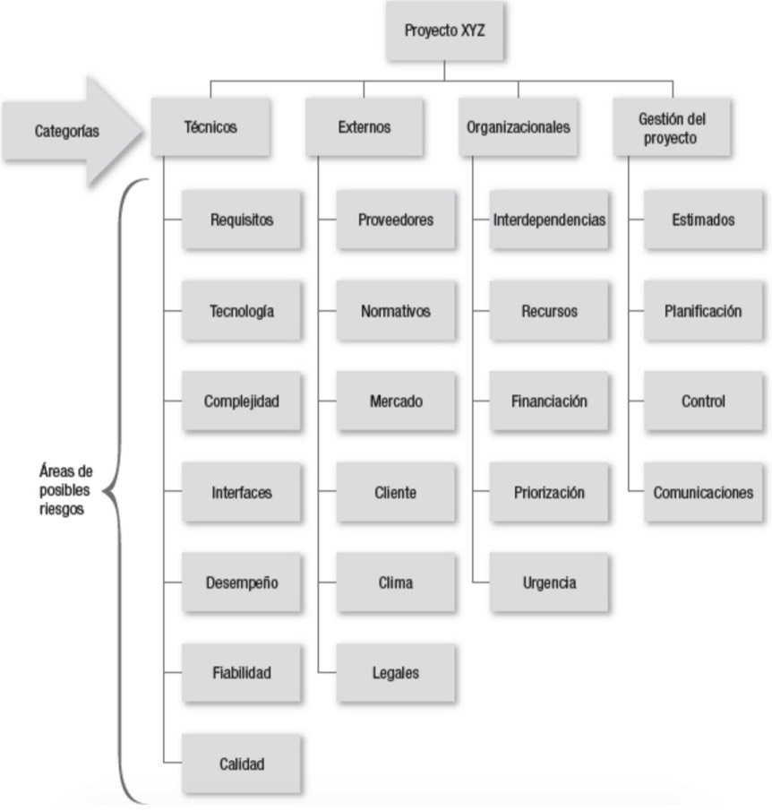

# Análisis y gestión de riesgos

## Análisis de riesgos en la gestión de proyectos

El análisis de riesgos consiste en estudiar posibles amenazas y eventos no deseados, así como los daños que éstos pueden causar en los activos de una organización. La gestión de riesgos se refiere al conjunto de actividades que una organización realiza para evaluar y reducir tales efectos, utilizando para ello metodologías como MAGERIT, una de las más empleadas en la Administración.

### Definiciones

- **Riesgo:** Combinación de la probabilidad de que ocurra un evento y sus consecuencias. En un sentido más específico, se refiere a la posibilidad de pérdida de un activo digital debido a la explotación de una vulnerabilidad por parte de una amenaza.

### Tipos de riesgo

- **Riesgo inherente**: Nivel de riesgo existente antes de implementar medidas de seguridad y salvaguarda.
- **Riesgo residual**: Riesgo remanente tras la aplicación de las medidas de seguridad.
- **Riesgo de terceros**: Riesgo asociado a los componentes y sistemas de terceros con los que interactúa el sistema en evaluación.

### Atributos del riesgo

Los atributos del riesgo incluyen activos, amenazas y vulnerabilidades:

- **Activos**: Elementos tangibles o intangibles con valor, que requieren protección (ej., personas, sistemas informáticos, infraestructuras, información). Es importante estimar su valor y criticidad.
- **Amenazas**: Causas potenciales de incidentes no deseados. Es esencial conocer sus características, probabilidad de ocurrencia e impacto potencial. Las amenazas incluyen:
    - **Fuente de la amenaza**: Proceso o agente que intenta causar el daño.
    - **Evento de la amenaza**: Resultado de la actividad maliciosa.
- **Vulnerabilidades**: Debilidades en el diseño, implementación, operación o control interno que pueden exponer los sistemas a amenazas. Es necesario identificar posibles puntos de acceso y las contramedidas implementadas.

### Probabilidad de impacto de la amenaza

La probabilidad de impacto permite establecer la prioridad de las amenazas que deben abordarse. Se suele utilizar una matriz de "Probabilidad vs. Impacto" para realizar una evaluación cuantitativa y cualitativa de los riesgos.

### Estrategias de gestión de riesgos

- **Reducción del riesgo**: Implementación de medidas de control.
- **Evitación del riesgo**: No participar en la actividad que lo provoca.
- **Transferencia a un tercero**: Ejemplo típico, la contratación de seguros.
- **Aceptación del riesgo**: Se da cuando el riesgo es tolerable o las pérdidas resultantes son asumibles.

### Principios de gestión de riesgos

De acuerdo con la norma ISO 31000:2009, los principios de la gestión de riesgos son:

- Crear y proteger el valor
- Integrarse en los procesos organizativos
- Formar parte de la toma de decisiones
- Manejar explícitamente la incertidumbre
- Ser sistemática, estructurada y en tiempo
- Basarse en la mejor información disponible
- Adaptarse a los recursos disponibles
- Tener en cuenta factores humanos y culturales
- Ser transparente e inclusiva
- Ser dinámica, interactiva y sensible al cambio
- Facilitar la mejora continua en la organización

### Estructura de desglose de riesgos (RBS, Risk Breakdown Structure)

La Estructura de Desglose de Riesgos (RBS) es una representación jerárquica de los riesgos, organizada por categorías y subcategorías, que identifica las distintas áreas y causas de posibles riesgos dentro de un proyecto. Según el PMBOK, la RBS facilita la identificación y clasificación de riesgos según sus características.

## Metodología MAGERIT

La metodología MAGERIT (Metodología de Análisis y Gestión de Riesgos de los Sistemas de Información) es la principal referencia en la administración para el análisis y gestión de riesgos en sistemas de información. Esta metodología, desarrollada por el Consejo Superior de Administración Electrónica, provee un enfoque formal para identificar, analizar y gestionar los riesgos que amenazan a los sistemas de información, recomendando medidas para su control.

### Objetivos

Los objetivos de MAGERIT incluyen concienciar sobre la existencia de riesgos y la necesidad de gestionarlos, ofrecer una metodología clara para su identificación y análisis, y contribuir a mantener los riesgos bajo control. Esta metodología se enmarca en el Esquema Nacional de Seguridad, que regula la gestión de riesgos en la administración.

### Modelo de MAGERIT

MAGERIT se organiza en tres submodelos interrelacionados: el submodelo de elementos, el submodelo de eventos y el submodelo de procesos.

### Submodelo de Elementos

Este submodelo incluye los siguientes elementos clave:

- **Activos**: Componentes o funcionalidades de un sistema susceptibles de ser atacados, cuya afectación impacta a la organización.
    - **Valoración cuantitativa:** Mide el incremento de gasto por la materialización de una amenaza.
    - **Valoración cualitativa:** Ordena el valor de los activos de forma relativa mediante criterios homogéneos.
- **Amenazas**: Causas potenciales de incidentes que pueden causar daño. Se clasifican según su origen (natural, industrial, defectos, errores o ataques intencionados) y se identifican en términos de probabilidad e impacto.
- **Vulnerabilidades**: Posibilidades de que ocurra una amenaza específica sobre un activo concreto, clasificadas como intrínsecas o efectivas.
- **Impacto**: Medida del daño producido al materializarse una amenaza sobre un activo.
    - **Clasificación de impacto:**
        - **Impacto complementario:** Valor del activo más el de los activos dependientes.
        - **Impacto repercutido:** Valor del activo más las amenazas a los activos dependientes.
    - **Medidas complementarias del impacto:**
        - **Impacto complementario:** Suma del valor del activo y de los activos que dependen de él.
        - **Impacto repercutido:** Incluye el valor del activo y las amenazas asociadas a los activos dependientes.
- **Riesgos**: Probabilidad de que se produzca un impacto determinado en el sistema.
    - **Clasificación en cuatro zonas:** desde riesgos muy probables con alto impacto hasta riesgos poco probables con bajo impacto.
- **Salvaguardas**: Medidas que combaten las amenazas y se pueden evaluar por dominio o activo.
    - **Según el efecto:** Preventivo (disuasorias/eliminatorias), Acotador (minimizadoras/correctivas/repercutivas), o Consolidador (monitorización/detección/concienciación/administrativa).

### Submodelo de Eventos

Este submodelo se divide en **tres sub-submodelos**:

- **Submodelo estático de eventos**: Relaciona las entidades del submodelo de elementos.
- **Submodelo organizativo dinámico**: Aporta una dimensión temporal al submodelo estático.
- **Submodelo físico dinámico**: Añade una dimensión temporal al submodelo físico.

### Submodelo de Procesos

Describe el desarrollo de un proyecto de seguridad en **cuatro fases**: planificación, análisis de riesgos, gestión de riesgos y selección de salvaguardas.

### Documentación de MAGERIT

MAGERIT incluye tres documentos esenciales disponibles en la página de administración electrónica:

- **Libro I - Método**: Describe la gestión del riesgo como un proceso que combina análisis y tratamiento. Los componentes de gestión del riesgo incluyen:
    - **Análisis de riesgo:** Valoración de activos, amenazas, salvaguardas e impacto.
    - **Tratamiento de riesgo:** Medidas de protección y reacción.
    - **Proceso de gestión:** Incluye definir el contexto, identificar, analizar, evaluar y tratar riesgos; además de comunicar y revisar continuamente.
- **Libro II - Catálogo de elementos**: Contiene una clasificación detallada:
    - **Activos** (información, datos, servicios, aplicaciones, etc.)
    - **Amenazas** (de origen natural, industrial, defectos, etc.)
    - **Salvaguardas** (protección de datos, claves, seguridad de personal, etc.)
- **Libro III - Guía de técnicas**: Contiene técnicas específicas y generales para el análisis y gestión de riesgos, como el análisis mediante tablas, análisis algorítmico, técnicas gráficas, sesiones de trabajo y valoración Delphi.

### Proceso de Análisis de Riesgos en MAGERIT

El proceso de análisis de riesgos incluye varias etapas clave:

- **Caracterización de los activos**: Identificación y análisis de las dependencias entre los activos de la organización.
- **Caracterización de las amenazas**: Evaluación de la probabilidad de cada amenaza (vulnerabilidad), el impacto que podría generar y el riesgo asociado.
- **Caracterización de las salvaguardas**: Catalogación y evaluación de salvaguardas para reducir el riesgo de vulnerabilidades e impacto.
- **Riesgo residual**: Evaluación del riesgo que permanece después de aplicar las salvaguardas.
- **Estimación del estado de riesgo**: Caracterización de los activos basada en el riesgo residual.

### Implementación de la Metodología

La implementación de MAGERIT incluye las siguientes actividades:

- **Identificación de Activos**: Clasificación de los activos según su función.
- **Valoración de Activos**: Asignación de un valor en función de su criticidad y las cinco dimensiones de seguridad.
- **Identificación de Amenazas**: Identificación de eventos que podrían degradar los activos.
- **Frecuencia y Degradación**: Evaluación de la periodicidad de los eventos y el grado de perjuicio al activo.
- **Impacto y Cálculo de Riesgo**: Evaluación de posibles consecuencias de las amenazas y su probabilidad.
- **Identificación y Valoración de Salvaguardas**: Medidas a tomar para mitigar el riesgo.
- **Cálculo del Riesgo Residual**: Cálculo del riesgo restante tras la implementación de las salvaguardas.

## Caso práctico: análisis de riesgos con MAGERIT

### AARR rápido

El análisis rápido permite identificar riesgos de forma concisa y clasificarlos según la relación entre activos, amenazas, vulnerabilidades, impactos, riesgos y dimensiones afectadas

<table>
<colgroup>
<col style="width: 20%" />
<col style="width: 22%" />
<col style="width: 17%" />
<col style="width: 12%" />
<col style="width: 13%" />
<col style="width: 13%" />
</colgroup>
<thead>
<tr>
<th>Activo</th>
<th>Amenaza</th>
<th>Vulnerabilidad</th>
<th>Impacto</th>
<th>Riesgo</th>
<th>Dimensión</th>
</tr>
</thead>
<tbody>
<tr>
<td>Nueva app</td>
<td>Código dañino</td>
<td>Medio</td>
<td>Alto</td>
<td>Baja</td>
<td>ACID</td>
</tr>
<tr>
<td>Información</td>
<td>
Corrupción de datos

Acceso no autorizado a datos
</td>
<td>
Media

Baja
</td>
<td>
Media

Alto
</td>
<td>
Media

Alto
</td>
<td>
I

C
</td>
</tr>
<tr>
<td>Comunicaciones</td>
<td>Caída redes</td>
<td>Baja</td>
<td>Baja</td>
<td>Baja</td>
<td>D</td>
</tr>
</tbody>
</table>

### AARR detallado

El análisis detallado aborda riesgos específicos en cuatro categorías principales, junto con las salvaguardas propuestas para mitigarlos.

| **Riesgos del proyecto**                         | **Salvaguardas**                                                                  |
| ------------------------------------------------ | --------------------------------------------------------------------------------- |
| Desvios presupuestarios, Enfermedades o bajas,…  | Control de desvíos, cumplir con la normativa de prevención de riesgos laborales,… |
| **Riesgos técnicos**                             | **Salvaguardas**                                                                  |
| Errores de diseño, Incumplimiento del servicio,… | Procedimiento de aseguramiento de la calidad, causas de penalización,…            |
| **Riesgos del negocio**                          | **Salvaguardas**                                                                  |
| A, B, C,…                                        | A, B, C,…                                                                         |
| **Riesgos de cumplimiento**                      | **Salvaguardas**                                                                  |
| A, B, C,…                                        | A, B, C,…                                                                         |
