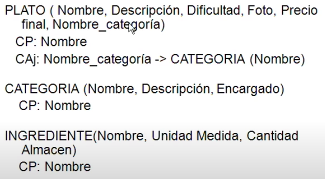
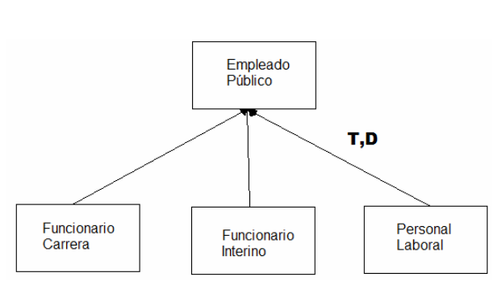
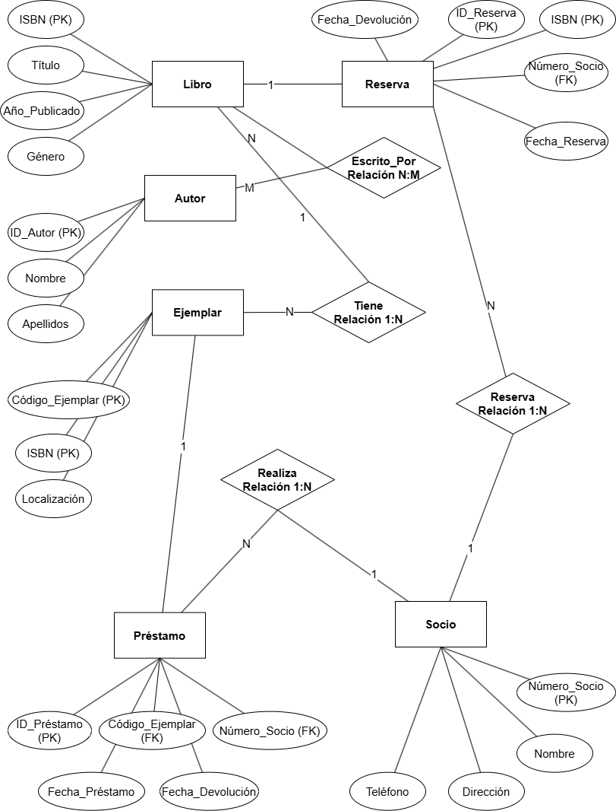

# Bases de datos

## Diseño e implementación de bases de datos relacionales

El diseño e implementación de bases de datos relacionales es fundamental en la gestión eficiente de datos en sistemas informáticos. Un **Sistema de Gestión de Bases de Datos (SGBD o DBMS)** es el software encargado de administrar el acceso y la manipulación de los datos almacenados.

### Modelo de datos y modelo relacional

Un **modelo de datos** es una abstracción que organiza y define cómo se relacionan los datos entre sí y con las propiedades de las entidades del mundo real. El **modelo relacional** es uno de los más utilizados y se basa en la lógica de predicados y la teoría de conjuntos. En este modelo:

- **Relación**: término matemático para "tabla".
- **Atributos**: columnas de la tabla, cada una asociada a un dominio.
- **Grado de relación**: número de atributos (columnas) de la tabla.
- **Cardinalidad**: número de tuplas (filas) en la tabla.
- **Operadores**: lenguajes relacionales utilizados para manipular los datos, como el **Álgebra Relacional** y el **Cálculo Relacional**.

### Diseño y modelos de datos

El proceso de diseño de una base de datos se divide en **tres fases principales**:

1. **Diseño conceptual:** Busca obtener el **esquema entidad-relación** a partir de las necesidades recopiladas durante la toma de requisitos.
    - **Diseño:** Se utiliza el **Modelo Entidad-Relación (E/R)** para representar gráficamente las entidades, atributos y relaciones.
2. **Diseño lógico:** Traduce el esquema conceptual al modelo de datos específico de la implementación elegida, resultando en un esquema relacional normalizado.
    - **Diseño:** Se representa con el **Modelo Relacional** mediante **Pseudocódigo** **DDL**
3. **Diseño físico:** Convierte el esquema lógico en una implementación concreta en el SGBD seleccionado.
    - **Diseño:** Se representa utilizando el lenguaje específico del SGBD (**Código DDL**), por lo es totalmente dependiente de esto. También se conoce como “**Implementación**”.
    - Los **objetivos** del diseño físico son:
        - Optimizar los tiempos de respuesta.
        - Minimizar las necesidades de espacio en disco.
        - Conseguir la máxima seguridad.
        - Minimizar el consumo de recursos.

### Modelo Entidad-Relación (E/R)

Es el **modelo conceptual** más utilizado para el diseño de bases de datos. Aunque no existe una representación gráfica estándar, los conceptos clave son:

**1. Entidades**: Representan objetos o conceptos del mundo real (sustantivos).

- **Tipos de entidades**:
    - **Fuerte**: su existencia **NO** depende de otra entidad.
    - **Débil**: su existencia depende de una entidad fuerte.

**2. Atributos**: Son las propiedades o características (adjetivos) de las entidades.

- **Tipos de atributos**:
    - **Simples/Compuestos:**
        - **Simples**: Indivisibles (ej.: color).
        - **Compuestos**: Pueden descomponerse en subatributos (ejemplo: dirección en calle, número, puerta).
    - **Monovaluados/Multivaluados:**
        - **Monovaluados**: Tienen un solo valor (ej.: DNI).
        - **Multivaluados**: Pueden tener varios valores (ej.: números de teléfono).
    - **Almacenados/Derivados:**
        - **Almacenados**: Se guardan directamente en la base de datos.
        - **Derivados**: Se calculan a partir de otros atributos (ej.: edad a partir de la fecha de nacimiento).
    - **Clave o Identificador**: Atributos que identifican unívocamente a una entidad (ej.: clave primaria).

**3. Relaciones**: Son vínculos o asociaciones (verbos) entre entidades.

- **Grado de relación**: número de entidades que participan en la relación.
    - **Binaria**: Involucra dos entidades (grado 2).
        - **Reflexiva**: La entidad se relaciona consigo misma.
    - **Ternaria y N-aria**: Involucran tres o más entidades (grado 3 o superior).

**4. Restricciones**: Limitan los valores posibles en las relaciones.

- **Restricciones de cardinalidad**: Definen la cantidad de ocurrencias en una relación (1:1, 1:N, N:M).
- **Restricciones de participación**:
    - **Dependencia de existencia o Restricción Total**: Todas las ocurrencias de una entidad deben estar relacionadas con otra (ejemplo: cada empleado debe pertenecer a un departamento).
    - **Restricción Parcial**: No todas las ocurrencias de una entidad deben estar relacionadas (ejemplo: un cliente puede no tener una hipoteca).

### Modelo Entidad-Relación (E/R) Extendido

Introduce conceptos avanzados para modelar situaciones más complejas.

### 1. Especialización y Generalización

Permiten crear jerarquías de **superclases y subclases** (herencia).

- **Solapada (S) o Disjunta (D)**:
    - **Disjunta**: una ocurrencia **no puede** pertenecer a más de una subclase simultáneamente.
    - **Solapada**: una ocurrencia **puede** pertenecer a varias subclases a la vez.
- **Parcial (P) o Total (T)**:
    - **Total**: todas las ocurrencias de la superclase deben pertenecer a alguna subclase.
    - **Parcial**: no todas las ocurrencias de la superclase pertenecen a una subclase.

### 2. Agregación

Permite considerar una relación entre entidades como una entidad única, facilitando la modelación de relaciones entre relaciones.

### Optimización: Normalización y Desnormalización

La **normalización** es el proceso de aplicar reglas para minimizar la redundancia y evitar anomalías en las actualizaciones. La **desnormalización** se utiliza en ocasiones para mejorar la eficiencia.

### Tipos de dependencias

- **Dependencia Funcional**: Un atributo Y depende funcionalmente de X si cada valor de X tiene asociado un único valor de Y
    - **Ejemplo:** DNI → Nombre y Apellidos
- **Dependencia Funcional Completa**: Un atributo depende de la totalidad de una clave compuesta y no de una parte de ella.
    - **Ejemplo:** Dado un grupo de valores Nombre y Apellidos, el DNI siempre toma el mismo valor, pero no con el Nombre o Apellidos por separado.
- **Dependencia Transitiva**: Si X → Y y Y → Z, entonces X → Z
    - **Ejemplo:** Fecha de nacimiento → (Edad) → Capacidad para conducir

### Formas normales

Las formas normales son estándares para estructurar las tablas y reducir redundancias.

- **Primera Forma Normal (1FN)**: No hay acuerdo universal.
    - Todos los atributos son **atómicos**.
    - Solo hay una **clave primaria única**

|-----Primary Key----| uh oh |

V

CourseID | SemesterID | #Places | Marks |

\------------------------------------------------|

IT101 | 2009-1 | 100 | 1,1,1,1 |

IT102 | 2009-1 | 200 | 2,2,2,2 |

IT102 | 2010-1 | 150 | 3,3,3,3 |

La clave primaria **no** contiene atributos **nulos**

- Los campos no-clave dependen funcionalmente de la clave
- **Segunda Forma Normal (2FN)**: 1FN + Todos los atributos que NO son clave dependen

|-----Primary Key----| uh oh |

V

CourseID | SemesterID | #Places | Course Name |

\------------------------------------------------|

IT101 | 2009-1 | 100 | Programming |

IT101 | 2009-2 | 100 | Programming |

IT102 | 2009-1 | 200 | Databases |

IT102 | 2010-1 | 150 | Databases |

IT103 | 2009-2 | 120 | Web Design |

**únicamente** de la clave primaria.

- **Tercera Forma Normal (3FN)**: 2FN + NO existen dependencias **transitivas** de atributos no clave respecto a la clave

|-----Primary Key----| uh oh |

V

Course | Semester | #Places | TeacherID | TeacherName |

\---------------------------------------------------------------|

IT101 | 2009-1 | 100 | 332 | Mr Jones |

IT101 | 2009-2 | 100 | 332 | Mr Jones |

IT102 | 2009-1 | 200 | 495 | Mr Bentley |

IT102 | 2010-1 | 150 | 332 | Mr Jones |

IT103 | 2009-2 | 120 | 242 | Mrs Smith |

primaria.

- **Forma Normal de Boyce-Codd (FNBC)**:
    - Cumple con 3FN.
    - En cada dependencia funcional, el determinante es una **clave candidata**.
- **Cuarta Forma Normal (4FN)**:
    - Cumple con FNBC.
    - No hay dependencias **multivaluadas** no triviales.
    - **Quinta Forma Normal (5FN)**: 4FN + NO existen dependencias de **unión (join)** no triviales que no se deriven de las claves.

Las **formas normales avanzadas (4FN y 5FN)** se ocupan de eliminar dependencias complejas y redundancias en relaciones muchos a muchos.

### Las 12 reglas de Codd

**Edgar F. Codd estableció 13 reglas** (12 más la regla fundamental) que definen los **requisitos para que un SGBD sea considerado verdaderamente relacional**.

- **Regla 0: Regla Fundamental**: Un SGBD relacional debe gestionar sus bases de datos usando exclusivamente el modelo relacional.
- **Regla 1: Regla de la Información**: Todos los datos deben estar representados como valores en tablas.
- **Regla 2: Acceso Garantizado**: Es posible acceder a cualquier dato sabiendo el nombre de la tabla, el valor de la clave primaria y el nombre del atributo.
- **Regla 3: Tratamiento Sistemático de Valores Nulos**: El SGBD debe manejar valores nulos de manera uniforme, representando datos desconocidos o inaplicables.
- **Regla 4: Catálogo Dinámico en Línea Basado en el Modelo Relacional**: El catálogo (metadatos) debe estar almacenado como tablas relacionales y ser accesible mediante el lenguaje SQL.
- **Regla 5: Sublenguaje de Datos Completo**: Debe existir un lenguaje bien definido (como SQL) para definir, manipular y controlar los datos.
- **Regla 6: Actualización de Vistas**: Todas las vistas teóricamente actualizables deben ser actualizables por el sistema.
- **Regla 7: Inserción, Actualización y Borrado de Alto Nivel**: El SGBD debe permitir operaciones que afecten a múltiples filas y/o tablas simultáneamente.
- **Regla 8: Independencia Física de Datos**: Cambios en la estructura física no deben requerir modificaciones en las aplicaciones.
- **Regla 9: Independencia Lógica de Datos**: Cambios en las tablas lógicas no deben afectar a las aplicaciones que las utilizan.
- **Regla 10: Independencia de Integridad**: Las reglas de integridad deben estar definidas en el catálogo y ser gestionadas por el SGBD, no por las aplicaciones.
- **Regla 11: Independencia de Distribución**: El usuario no debe percibir si los datos están distribuidos en múltiples ubicaciones.
- **Regla 12: No Subversión**: No debe ser posible saltarse las reglas del SGBD utilizando lenguajes de bajo nivel.

## Caso práctico: Diseño de un base de datos

### Descripción del escenario

Una biblioteca pública desea implementar un sistema de gestión de sus operaciones diarias. Las necesidades identificadas incluyen:

- **Gestión de libros**: almacenar información sobre los libros disponibles, como título, autores, género, año de publicación e ISBN.
- **Control de ejemplares**: manejar múltiples copias de un mismo libro, identificadas por un código único de ejemplar.
- **Registro de socios**: mantener datos de los usuarios registrados, incluyendo nombre, dirección, teléfono y número de socio.
- **Gestión de préstamos**: administrar el préstamo y devolución de ejemplares, registrando fechas y estados.
- **Reservas de libros**: permitir a los socios reservar libros que actualmente no están disponibles.

### Solución

**1. Análisis de requisitos:** Se puede omitir o hacer un comentario o listado rápido

### 2. Diseño conceptual

### 3. Diseño lógico

Transformamos el modelo E/R en un esquema relacional, definiendo las tablas y sus relaciones.

### Tabla Autor:

ID_Autor INT NOT NULL PRIMARY KEY

Nombre VARCHAR(50)

Apellidos VARCHAR(50)

### Tabla Libro:

ISBN VARCHAR(13) NOT NULL PRIMARY KEY

Título VARCHAR(100)

Año_Publicación YEAR

Género VARCHAR(30)

### Tabla Libro_Autor (Tabla intermedia para la relación N:M):

ISBN VARCHAR(13) NOT NULL

ID_Autor INT NOT NULL

PRIMARY KEY (ISBN, ID_Autor)

FOREIGN KEY (ISBN) REFERENCES Libro(ISBN)

FOREIGN KEY (ID_Autor) REFERENCES Autor(ID_Autor)

### Ejemplar:

Código_Ejemplar INT NOT NULL PRIMARY KEY

ISBN VARCHAR(13) NOT NULL

Localización VARCHAR(30)

FOREIGN KEY (ISBN) REFERENCES Libro(ISBN)

### Tabla Socio:

Número_Socio INT NOT NULL PRIMARY KEY

Nombre VARCHAR(50)

Dirección VARCHAR(100)

Teléfono VARCHAR(15)

### Tabla Préstamo:

ID_Préstamo INT NOT NULL PRIMARY KEY

Código_Ejemplar INT NOT NULL

Número_Socio INT NOT NULL

Fecha_Préstamo DATE

Fecha_Devolución DATE

FOREIGN KEY (Código_Ejemplar) REFERENCES Ejemplar(Código_Ejemplar)

FOREIGN KEY (Número_Socio) REFERENCES Socio(Número_Socio)

### Tabla Reserva:

ID_Reserva INT NOT NULL PRIMARY KEY

ISBN VARCHAR(13) NOT NULL

Número_Socio INT NOT NULL

Fecha_Reserva DATE

FOREIGN KEY (ISBN) REFERENCES Libro(ISBN)

FOREIGN KEY (Número_Socio) REFERENCES Socio(Número_Socio)

### 4. Diseño físico

Adaptamos el esquema lógico al SGBD seleccionado, considerando aspectos como índices, tipos de datos y optimización.

CREATE TABLE Autor (

ID_Autor INT NOT NULL PRIMARY KEY,

Nombre VARCHAR(50),

Apellidos VARCHAR(50)

);

CREATE TABLE Libro (

ISBN VARCHAR(13) NOT NULL PRIMARY KEY,

Titulo VARCHAR(100),

Año_Publicacion YEAR,

Genero VARCHAR(30)

);

CREATE TABLE Libro_Autor (

ISBN VARCHAR(13) NOT NULL,

ID_Autor INT NOT NULL,

PRIMARY KEY (ISBN, ID_Autor),

FOREIGN KEY (ISBN) REFERENCES Libro(ISBN),

FOREIGN KEY (ID_Autor) REFERENCES Autor(ID_Autor)

);

CREATE TABLE Ejemplar (

Codigo_Ejemplar INT NOT NULL PRIMARY KEY,

ISBN VARCHAR(13) NOT NULL,

Localizacion VARCHAR(30),

FOREIGN KEY (ISBN) REFERENCES Libro(ISBN)

);

CREATE TABLE Socio (

Numero_Socio INT NOT NULL PRIMARY KEY,

Nombre VARCHAR(50),

Direccion VARCHAR(100),

Telefono VARCHAR(15)

);

CREATE TABLE Prestamo (

ID_Prestamo INT NOT NULL PRIMARY KEY,

Codigo_Ejemplar INT NOT NULL,

Numero_Socio INT NOT NULL,

Fecha_Prestamo DATE,

Fecha_Devolucion DATE,

FOREIGN KEY (Codigo_Ejemplar) REFERENCES Ejemplar(Codigo_Ejemplar),

FOREIGN KEY (Numero_Socio) REFERENCES Socio(Numero_Socio)

);

CREATE TABLE Reserva (

ID_Reserva INT NOT NULL PRIMARY KEY,

ISBN VARCHAR(13) NOT NULL,

Numero_Socio INT NOT NULL,

Fecha_Reserva DATE,

FOREIGN KEY (ISBN) REFERENCES Libro(ISBN),

FOREIGN KEY (Numero_Socio) REFERENCES Socio(Numero_Socio)

);

### 5. Optimización

Sugerir optimizaciones para mejorar la eficiencia del sistema como normalizaciones para mejorar la integridad referencial y el consumo de memoria, o desnormalizaciones para mejorar la velocidad.
