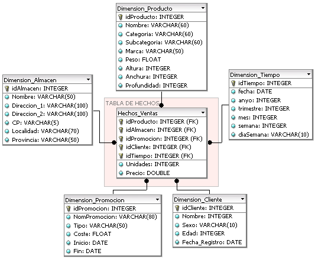

# Gestión de datos corporativos y Big Data

## Almacén de datos (data warehouse) y OLAP

Los sistemas de información operacionales generan datos continuamente, pero esos datos, dispersos y detallados, no sirven directamente para decidir. Los sistemas de información analíticos los integran y agregan para apoyar la toma de decisiones en los niveles **estratégico** (alta dirección), **táctico** y **operativo**.

- **Fuentes de información**: bases de datos corporativas (relacionales, espaciales, temporales, documentales, multimedia), webs y redes sociales, fuentes abiertas (**OSINT**) y dispositivos del **internet de las cosas (IoT)**.

### El almacén de datos (data warehouse)

Según la definición clásica de **Inmon**, un data warehouse es una colección de datos **orientada a un tema, integrada, no volátil y variable en el tiempo**, que sirve de apoyo a la toma de decisiones:

- **Orientada a un tema**: se organiza en torno a los asuntos de la organización (clientes, ventas), no a las aplicaciones que los producen.
- **Integrada**: unifica datos de fuentes heterogéneas con formatos y codificaciones consistentes.
- **No volátil**: los datos se cargan y se consultan; no se modifican ni borran en la operación normal.
- **Variable en el tiempo (historiada)**: conserva el histórico para analizar tendencias y evolución.

Conceptos asociados:

- **Datamart**: subconjunto del almacén centrado en un área de negocio o departamento (usuarios limitados, ámbito específico, función de apoyo). Suele estructurarse en esquema de estrella.
- **Enfoques de construcción**:
    - **Inmon (top-down)**: primero se construye el almacén corporativo normalizado y de él derivan los datamarts.
    - **Kimball (bottom-up)**: se construyen datamarts dimensionales que se integran mediante dimensiones conformadas (arquitectura de bus).

### El modelo multidimensional

Los datos analíticos se organizan como un **hipercubo**:

- **Hechos**: los conceptos de interés que se analizan (ventas, matrículas, ingresos).
- **Medidas**: los aspectos cuantificables de cada hecho (importe, unidades).
- **Dimensiones**: las perspectivas de análisis (tiempo, lugar, producto), con **jerarquías** de agregación (día, mes, año).

Su implementación sobre bases relacionales sigue tres esquemas:

- **Estrella**: una tabla de hechos central rodeada de tablas de dimensiones desnormalizadas. Simple y eficiente en consulta.
- **Copo de nieve**: las dimensiones se normalizan en varias tablas; ahorra espacio a costa de más composiciones (join) y peor rendimiento.
- **Constelación**: varias tablas de hechos comparten tablas de dimensiones.

{width=85%}

### OLTP y OLAP

| Característica | OLTP (procesamiento transaccional) | OLAP (procesamiento analítico) |
| --- | --- | --- |
| Finalidad | Operación diaria (transacciones) | Análisis y toma de decisiones |
| Operaciones | Lecturas y escrituras cortas y frecuentes | Consultas complejas, casi solo lectura |
| Datos | Detallados, normalizados, actuales | Agregados, multidimensionales, históricos |
| Modelo | Relacional normalizado (3FN) | Cubos y esquemas en estrella |
| Usuarios | Muchos usuarios operativos | Analistas y dirección |

- **Operadores OLAP**:
    - **Drill-down**: desagrega a mayor nivel de detalle (de año a mes).
    - **Roll-up**: agrega subiendo por la jerarquía de la dimensión.
    - **Slice**: filtra por un valor de una dimensión (una «rebanada» del cubo).
    - **Dice**: filtra por valores de varias dimensiones (un subcubo).
    - **Pivot**: rota los ejes de análisis para reorientar la vista.
- **Implementaciones**:
    - **ROLAP**: el cubo se simula sobre una base de datos relacional.
    - **MOLAP**: estructuras multidimensionales nativas con agregados precalculados.
    - **HOLAP**: híbrido de las dos anteriores.

### Herramientas de explotación

- **Sistemas de información ejecutiva (EIS)** y **cuadros de mando integral (CMI)**: seguimiento de indicadores clave (KPI) para la dirección.
- **Plataformas de inteligencia de negocio (business intelligence, BI)**: informes, cuadros de mando interactivos y análisis autoservicio (Power BI, Tableau, Qlik Sense).
- **Minería de datos**: descubrimiento de patrones ocultos (sección propia más adelante).

## Procesos ETL, data lake y espacios de compartición

### Los procesos ETL

Los procesos **ETL** (*Extract, Transform, Load*) alimentan el almacén de datos desde los sistemas de origen:

- **Extracción**: obtención de los datos en bruto de las fuentes (bases operacionales, ficheros, APIs).
- **Transformación**: limpieza (duplicados, errores, valores faltantes), normalización de formatos y codificaciones, integración y cálculo de agregados.
- **Carga**: volcado al data warehouse o a los datamarts, inicial o incremental.

Elementos de apoyo:

- **ELT**: variante actual en la que los datos se cargan en bruto y se transforman dentro de la plataforma de destino, aprovechando la potencia de los almacenes en la nube (BigQuery, Snowflake, Redshift).
- **Metadatos**: documentan el origen, la estructura, las transformaciones y el linaje de los datos; su catalogación es una función central de la gobernanza del dato (tema 38).
- **Middleware**: capa de interoperabilidad entre plataformas heterogéneas.

### Data lake y lakehouse

- **Data lake**: repositorio centralizado que almacena grandes volúmenes de datos **en bruto, en su formato original** (estructurados, semiestructurados y no estructurados), aplicando el esquema al leer (*schema-on-read*). Nació ligado a Hadoop/HDFS y hoy se implementa sobre todo en almacenamiento de objetos en la nube (Amazon S3, Azure Data Lake Storage).
    - Sin catálogo, calidad ni gobernanza degenera en un **data swamp** (pantano de datos): información imposible de localizar e interpretar.
- **Data lakehouse**: arquitectura que añade al data lake capacidades de almacén de datos (transacciones ACID, esquemas, rendimiento SQL) mediante formatos de tabla abiertos: **Delta Lake**, **Apache Iceberg**, Apache Hudi.
- **Data fabric**: capa de **integración y gestión unificada** sobre fuentes de datos distribuidas y heterogéneas (locales y en la nube), apoyada en metadatos activos, catálogo y virtualización de datos: los datos se quedan donde están y la capa los hace accesibles y gobernables como un todo. Enfoque tecnológico y centralizado en la gestión.
- **Data mesh**: enfoque **organizativo y descentralizado** (Zhamak Dehghani, 2019) con cuatro principios: propiedad de los datos por **dominios** de negocio, el **dato como producto**, plataforma de datos autoservicio y **gobernanza federada** computacional. Complementario del data fabric: uno reparte la responsabilidad, el otro unifica la tecnología.

### Espacios de compartición de datos

La estrategia europea de datos (2020) impulsa la creación de **espacios comunes europeos de datos** sectoriales (salud, movilidad, energía, agricultura, administración pública), en los que organizaciones públicas y privadas comparten datos de forma soberana, interoperable y conforme a reglas comunes.

- **Reglamento (UE) 2022/868, de Gobernanza de Datos (DGA)**, aplicable desde el **24 de septiembre de 2023**: regula la reutilización de datos protegidos del sector público, los **servicios de intermediación de datos** y la **cesión altruista de datos**.
- **Reglamento (UE) 2023/2854, de Datos (Data Act)**, aplicable en lo esencial desde el **12 de septiembre de 2025**: normas armonizadas de acceso y uso justo de los datos generados por productos conectados (IoT) y facilidades para cambiar de proveedor de nube.
- **Gaia-X**: iniciativa europea de infraestructura federada de datos y nube, soporte técnico de la soberanía del dato en los espacios de datos.

## Big Data: el ecosistema Hadoop/Spark

**Big Data** designa los conjuntos de datos cuyo volumen, velocidad o variedad superan la capacidad de las herramientas tradicionales de almacenamiento y procesamiento. El término se caracterizó con las **3 V** (Laney, 2001) y hoy se manejan habitualmente **5 V**:

- **Volumen**: cantidades masivas de datos.
- **Velocidad**: generación y procesamiento continuos, incluso en tiempo real.
- **Variedad**: heterogeneidad de formatos y fuentes.
- **Veracidad**: fiabilidad y calidad del dato.
- **Valor**: conocimiento útil extraído de los datos.

El almacenamiento se apoya en las bases de datos **NoSQL** (clave-valor, documentales, columnares y de grafos), tratadas en el tema 36. En cuanto al procesamiento:

- **Batch (por lotes)**: grandes volúmenes con latencia alta (MapReduce, Spark).
- **Streaming (en flujo)**: procesamiento continuo casi en tiempo real (Kafka, Flink, Spark Structured Streaming).
- **Híbrido**: arquitectura **Lambda** (capa batch más capa de velocidad más capa de servicio) y arquitectura **Kappa** (todo se trata como flujo, con un único pipeline).

### Apache Hadoop

Marco de código abierto para el almacenamiento y procesamiento distribuidos de grandes volúmenes de datos en clústeres de hardware convencional, con escalado horizontal y tolerancia a fallos. Su núcleo:

- **HDFS**: sistema de ficheros distribuido; divide los ficheros en bloques grandes replicados en varios nodos.
- **YARN**: gestor de recursos y planificador de los trabajos del clúster.
- **MapReduce**: modelo de programación paralela en dos fases (map y reduce) con almacenamiento intermedio en disco.

Sobre ese núcleo creció un ecosistema:

- **Hive**: consultas tipo SQL (HiveQL) sobre datos en HDFS.
- **Pig**: lenguaje de flujos de datos (Pig Latin).
- **HBase**: base de datos NoSQL columnar sobre HDFS.
- **Sqoop** y **Flume**: ingesta desde bases de datos relacionales y de flujos de eventos y logs.
- **ZooKeeper**: coordinación de servicios distribuidos.
- **Oozie**: planificación de flujos de trabajo.

### Apache Spark

Motor de procesamiento distribuido **en memoria**, muy superior a MapReduce en cargas iterativas e interactivas. Es un proyecto independiente de Hadoop, aunque puede ejecutarse sobre YARN y leer de HDFS.

- **Modelo de programación**: RDD y las APIs de alto nivel DataFrame y Dataset, con soporte de Scala, Java, Python, R y SQL.
- **Módulos**: **Spark SQL**, **Structured Streaming**, **MLlib** (aprendizaje automático, sucesor de facto de Mahout) y **GraphX** (grafos).
- **Complementos habituales**: **Apache Kafka** (plataforma distribuida de eventos con publicación-suscripción) y **Apache Flink** (procesamiento nativo de flujos con baja latencia).

## Minería de datos

La **minería de datos** es el proceso de extraer conocimiento útil, comprensible y previamente desconocido a partir de grandes volúmenes de datos. Ese conocimiento (patrones, tendencias, relaciones ocultas) apoya la toma de decisiones estratégicas de la organización.

### El modelo CRISP-DM

**CRISP-DM** (*CRoss Industry Standard Process for Data Mining*, versión 1.0, 2000) es el modelo de proceso estándar más utilizado para estructurar proyectos de minería de datos. Consta de **seis fases** interrelacionadas y no estrictamente secuenciales:

1. **Comprensión del negocio**: objetivos y requisitos desde la perspectiva empresarial; dónde puede aportar valor la minería.
2. **Comprensión de los datos**: exploración de los datos disponibles para evaluar su calidad, relevancia y adecuación.
3. **Preparación de los datos**: recopilación, limpieza, integración y transformación para construir el conjunto de datos final.
4. **Modelado**: selección y aplicación de las técnicas, ajustando sus parámetros.
5. **Evaluación**: valoración de los modelos, técnica y de negocio, frente a los objetivos iniciales.
6. **Despliegue (distribución)**: el conocimiento se integra en los procesos de decisión de la organización.

### Tareas y tipología de problemas

- **Tareas predictivas**: predicen valores o categorías a partir de datos históricos etiquetados.
    - **Clasificación (multiclase)**: asignar una etiqueta de clase a cada instancia.
    - **Categorización (multietiqueta)**: asignar varias etiquetas a cada instancia.
    - **Priorización (ordenación)**: ordenar instancias según un criterio.
    - **Regresión**: predecir valores numéricos continuos.
- **Tareas descriptivas**: descubren patrones en datos no etiquetados.
    - **Agrupamiento (clustering)**: agrupar instancias similares sin categorías predefinidas.
    - **Correlación**: identificar relaciones significativas entre variables.
    - **Reglas de asociación**: descubrir co-ocurrencias frecuentes entre variables.
    - **Detección de anomalías**: identificar instancias que se desvían del comportamiento normal.

### Preparación de los datos

- **Extracción de características**: cada instancia se representa como un vector de atributos relevantes para el análisis.
- **Técnicas habituales**:
    - **Discretización**: convertir atributos numéricos continuos en categorías (binning).
    - **Numerización**: transformar atributos categóricos en representaciones numéricas (codificación one-hot).
    - **Valores faltantes**: imputación o eliminación de instancias incompletas.
    - **Reducción de dimensionalidad**: reducir el número de variables conservando la información relevante (análisis de componentes principales o PCA, autoencoders, selección por ganancia de información).

### Técnicas de modelado

- **Aprendizaje perezoso (lazy learning)**: no construye un modelo explícito; generaliza en el momento de predecir.
    - **k-NN (k vecinos más cercanos)**: clasifica según las clases de los vecinos más próximos en el espacio de características.
- **Aprendizaje anticipativo (eager learning)**: construye un modelo durante el entrenamiento.
    - **Métodos bayesianos**: predicen la clase más probable a partir de probabilidades.
    - **Árboles de decisión**: reglas en forma de árbol, interpretables.
    - **Redes neuronales**: capturan relaciones complejas (base del aprendizaje profundo, tema 34).
    - **Máquinas de vectores de soporte (SVM)**: buscan el hiperplano que mejor separa las clases.
    - **Algoritmos evolutivos**: optimizan soluciones imitando la evolución biológica.
- **Ensembles (meta-clasificadores)**: combinan varios modelos para ganar precisión y robustez.
    - **Bagging**: modelos entrenados en submuestras aleatorias cuyas predicciones se promedian (Random Forest).
    - **Boosting**: modelos secuenciales donde cada uno corrige los errores del anterior.
    - **Stacking**: un modelo de nivel superior aprende a combinar las predicciones de los demás.

### Evaluación de modelos

- **Modos de evaluación**:
    - **División simple (split)**: separar entrenamiento y prueba (por ejemplo, 70 %-30 %).
    - **Validación cruzada (k-fold)**: k particiones; se entrena y prueba k veces rotando la partición de prueba.
    - **Leave-One-Out (LOOCV)**: caso extremo con k igual al número de instancias.
    - **Bootstrap**: muestreo con reemplazo para estimar la variabilidad del modelo.
- **Matriz de confusión**: resume el rendimiento de un clasificador:

|                   | **Predicción positiva** | **Predicción negativa** |
| ----------------- | :---------------------: | :---------------------: |
| **Real positiva** | Verdadero positivo (TP) |   Falso negativo (FN)   |
| **Real negativa** |   Falso positivo (FP)   | Verdadero negativo (TN) |

- **Métricas de clasificación** (cuidado con las traducciones: *accuracy* es la **exactitud**, aunque a menudo se traduce mal como «precisión», que corresponde a *precision*):

| Métrica | Traducción | Fórmula | Qué mide |
| --- | --- | --- | --- |
| **Accuracy** | Exactitud | (TP + TN) / total | Proporción global de aciertos |
| **Precision** | Precisión (valor predictivo positivo) | TP / (TP + FP) | Cuántos positivos predichos son correctos |
| **Recall (TPR)** | Exhaustividad o sensibilidad | TP / (TP + FN) | Cuántos positivos reales se detectan |
| **Specificity (TNR)** | Especificidad | TN / (TN + FP) | Cuántos negativos reales se detectan |
| **FPR** | Tasa de falsos positivos | FP / (FP + TN) | Negativos clasificados como positivos |
| **FNR** | Tasa de falsos negativos | FN / (TP + FN) | Positivos no detectados |
| **F-score (F1)** | Valor F | 2·(P·R) / (P + R) | Media armónica de precisión y exhaustividad |

- **Curva ROC** (*Receiver Operating Characteristic*): representa la tasa de verdaderos positivos frente a la de falsos positivos al variar el umbral de decisión; cuanto más se acerca al vértice superior izquierdo, mejor el clasificador.
- **AUC** (*Area Under the Curve*): área bajo la curva ROC; **1** es el clasificador perfecto y **0,5** el aleatorio.
- **Modelos de regresión**: **MSE** (error cuadrático medio), **RMSE** (su raíz, en las unidades de la variable), **MAE** (error absoluto medio) y coeficiente de correlación de **Pearson (r)**.
- **Modelos de agrupamiento**: **verosimilitud** (qué tan bien explica el modelo los datos observados, a diferencia de la probabilidad, que mide la posibilidad de un evento dado el modelo), **índice de silueta** (similitud de cada instancia con su propio clúster frente a los demás) y **coeficiente de Dunn** (compacidad y separación de los clústeres).
- **Reglas de asociación**: **soporte** (proporción de instancias donde aplica la regla), **confianza** (probabilidad de la consecuencia cuando se da el antecedente) y **lift** (confianza de la regla frente a la probabilidad base de la consecuencia).

### Difusión y estándares

La **explicabilidad** de los modelos es clave para su adopción: los modelos interpretables generan confianza en usuarios y responsables. Para intercambiar modelos entre herramientas existen estándares:

- **PMML** (*Predictive Model Markup Language*, Data Mining Group, versión 4.4 de 2019): formato XML para definir y compartir modelos de minería de datos entre plataformas sin reimplementarlos.
- **ONNX** (*Open Neural Network Exchange*): formato abierto actual de intercambio de modelos de aprendizaje automático, en especial redes neuronales.

### Ciencia de datos y MLOps

La **ciencia de datos** generaliza la minería de datos: combina estadística, computación y conocimiento del dominio para extraer valor de los datos, con el ciclo de vida que ya describe CRISP-DM (adquisición y ETL, preprocesado, modelado, validación y despliegue) y herramientas propias (Python con pandas/scikit-learn, R, notebooks, visualización). Las técnicas de aprendizaje automático se estudian en el tema 34.

**MLOps** aplica los principios de DevOps (tema 26) al ciclo de vida de los modelos para llevarlos a producción de forma fiable y repetible:

- **Versionado** de datos, código y modelos, con **registro de modelos** y *feature stores* reutilizables.
- **Entrenamiento y despliegue automatizados** (pipelines CI/CD que reentrenan, validan y publican el modelo).
- **Monitorización en producción**: rendimiento del modelo y **deriva** de los datos o del concepto (*data/concept drift*), que dispara el reentrenamiento.
- Herramientas habituales: **MLflow**, Kubeflow, y los servicios gestionados de las nubes (SageMaker, Vertex AI, Azure ML).

## Caso práctico: clasificación

### Planteamiento

Se evalúa un sistema de detección de cáncer sobre **1000 pacientes**, de los que solo **10** están realmente enfermos (clase muy desbalanceada: 10 positivos, 990 negativos). Se comparan dos clasificadores:

- **Clasificador A**: predice siempre «no cáncer».
- **Clasificador B**: detecta a 9 de los 10 enfermos, pero marca como positivos a 20 pacientes sanos.

### Resolución

**Clasificador A**: TP = 0, TN = 990, FP = 0, FN = 10.

- **Accuracy** = (0 + 990) / 1000 = **99 %**
- **Recall** = 0 / (0 + 10) = **0 %**
- **Precision** = no detecta ningún positivo (**0 %**)

Pese a su exactitud del 99 %, el modelo es inútil: no identifica ni un solo caso de cáncer. El accuracy engaña porque la clase mayoritaria domina el resultado.

**Clasificador B**: TP = 9, TN = 970, FP = 20, FN = 1.

- **Accuracy** = (9 + 970) / 1000 = **97,9 %**
- **Precision** = 9 / (9 + 20) = 9 / 29 = **31 %**
- **Recall** = 9 / (9 + 1) = **90 %**

| Métrica | Clasificador A | Clasificador B |
| --- | --- | --- |
| Accuracy | 99 % | 97,9 % |
| Precision | 0 % | 31 % |
| Recall | 0 % | 90 % |

### Conclusión

Con clases desbalanceadas, el accuracy no es una métrica fiable: el clasificador B es claramente mejor pese a tener menor exactitud. La métrica debe elegirse según el coste de cada tipo de error: **recall** alto cuando no detectar un positivo es grave (cribados médicos), **precisión** alta cuando el falso positivo es costoso (pruebas invasivas innecesarias). El **F1** equilibra ambas cuando interesan las dos.

## Fuentes {.unnumbered .unlisted}

- W. H. Inmon, *Building the Data Warehouse*, 4.ª ed., Wiley, 2005.
- R. Kimball y M. Ross, *The Data Warehouse Toolkit*, 3.ª ed., Wiley, 2013.
- D. Laney, *3D Data Management: Controlling Data Volume, Velocity and Variety*, META Group, 2001.
- P. Chapman et al., *CRISP-DM 1.0: Step-by-step data mining guide*, SPSS, 2000.
- Z. Dehghani, *Data Mesh: Delivering Data-Driven Value at Scale*, O'Reilly, 2022 (concepto publicado en 2019).
- Documentación oficial de los proyectos Apache Hadoop y Apache Spark (Apache Software Foundation).
- Data Mining Group, *PMML 4.4*, 2019.
- Reglamento (UE) 2022/868, de Gobernanza de Datos (DOUE 3-jun-2022, aplicable desde el 24-sep-2023) y Reglamento (UE) 2023/2854, de Datos (DOUE 22-dic-2023, aplicable en lo esencial desde el 12-sep-2025), verificados en EUR-Lex en julio de 2026.
