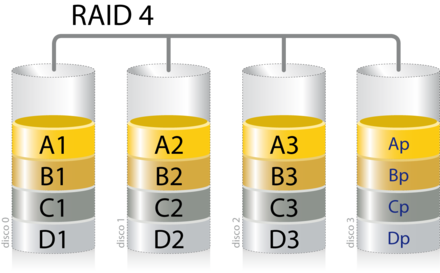
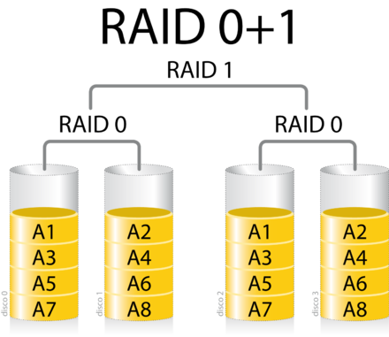
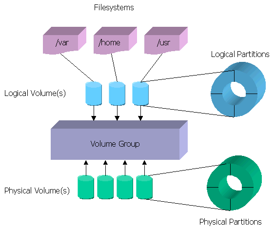

# Sistemas de almacenamiento

!!! warning "Tema pendiente de revisión"
    Este tema **no ha sido revisado** ni actualizado. Su contenido puede estar
    incompleto, desactualizado o contener errores. Úsalo con precaución y
    contrástalo siempre con fuentes oficiales.

## Sistemas de almacenamiento: DAS, NAS, y SAN

Los **sistemas de almacenamiento** son fundamentales en entornos empresariales y departamentales de gran envergadura. Se optimizan mediante la **virtualización del almacenamiento**, lo que permite gestionar los recursos de manera más eficiente y flexible.

### DAS (Direct Attached Storage)

El **DAS** es el método tradicional de almacenamiento que conecta directamente el dispositivo de almacenamiento al computador.

- **Ventajas**:
    - **Económicos**: Coste reducido en comparación con otras soluciones.
- **Desventajas**:
    - **Incapacidad para compartir datos**: No permite compartir recursos no utilizados con otros servidores.
- **Tipo de almacenamiento**: A nivel de archivo.
- **Acceso a dispositivos**: **Directo**, sin intermediarios.
- **Protocolos**:
    - **SCSI (Small Computer System Interface)**: Estándar para la transferencia de datos entre dispositivos en el bus de la computadora.
    - **SAS (Serial Attached SCSI)**: Interfaz de transferencia de datos en serie que mejora el rendimiento de SCSI.
    - **FC (Fibre Channel)**: Tecnología de red utilizada principalmente para redes de almacenamiento, con velocidades de 1 a 128 Gbit/s.

### NAS (Network Attached Storage)

El **NAS** es una tecnología que permite compartir la capacidad de almacenamiento de un computador con otros a través de una red.

- **Ventajas**:
    - **Económicos**: Menor coste en comparación con soluciones más complejas.
- **Desventajas**:
    - **Rendimiento inferior a las SAN**: Menos eficiente en operaciones de alta demanda.
- **Tipo de almacenamiento**: A nivel de archivo.
- **Acceso a dispositivos**: A través de la **red local (LAN)**, mediante peticiones **TCP/IP** usando protocolos como **CIFS** o **NFS**.
- **Protocolos de compartición de archivos**:
    - **SMB (Server Message Block) / CIFS (Common Internet File System)**: Protocolo de red de Windows para compartir archivos.
    - **Samba**: Versión de código abierto de SMB, común en sistemas Linux y Mac.
    - **NFS (Network File System)**: Protocolo de nivel de aplicación para sistemas Unix.

### SAN (Storage Area Network)

La **SAN** es una red dedicada al almacenamiento que se integra con las redes de comunicación de una organización.

- **Ventajas**:
    - **Ampliación casi ilimitada**: Escalabilidad para adaptarse a las necesidades crecientes.
    - **Alta disponibilidad de datos**: Redundancia y tolerancia a fallos.
    - **Eficiencia en compartir datos**: Permite compartir información entre servidores de forma muy eficiente.
- **Desventajas**:
    - **Coste de implementación**: Inversión inicial elevada debido a la infraestructura especializada.
- **Tipo de almacenamiento**: A nivel de bloque.
- **Acceso a dispositivos**: Mediante el **sistema operativo** con protocolos de bajo nivel, similar al acceso a discos locales.
- **Protocolos**:
    - **FC (Fibre Channel)**: Tecnología de red de alta velocidad específica para SAN.
    - **iSCSI (Internet Small Computer System Interface)**: Estándar para la transferencia de datos sobre redes TCP/IP, común en SAN.
- **Elementos de la arquitectura**:
    - **Dispositivos de almacenamiento**: Discos duros, SSD, etc.
    - **Medios de transmisión de alta velocidad**: Fibra óptica, iSCSI.
    - **Equipos de interconexión dedicados**: Routers, switches especializados.

## RAID (Redundant Array of Independent Disks)

El **RAID** es un sistema que utiliza múltiples unidades de almacenamiento para distribuir o replicar datos, presentándolos como una sola unidad lógica.

- **Ventajas**:
    - **Mayor integridad y tolerancia a fallos**: Protección frente a pérdidas de datos.
    - **Aumento de la tasa de transferencia**: Mejor rendimiento en lectura y escritura.
    - **Mayor capacidad**: Combinación de múltiples discos en un volumen único.
- **Soporte**:
    - **Hardware**: Implementación habitual, más eficiente.
    - **Software**: A través del sistema operativo, más lento.

### Niveles RAID estándar

Niveles más utilizados

- **RAID 0 (Volumen dividido o Striping)**:
    - **Características**:
        - Distribuye los datos entre dos o más discos sin redundancia.
        - Permite operaciones de lectura/escritura simultáneas.
        - Capacidad total es la suma de las unidades (e.g., 1TB + 1TB = 2TB).
    - **Desventajas**:
        - Sin tolerancia a fallos; la pérdida de un disco implica la pérdida de todos los datos.
- **RAID 1 (Volumen de espejo o Mirroring)**:
    - **Características**:
        - Crea copias exactas de los datos en múltiples discos.
        - Incrementa la velocidad de lectura; la escritura permanece constante.
        - Capacidad limitada al tamaño del disco más pequeño (e.g., 1TB + 0.5TB = 0.5TB).
    - **Ventajas**:
        - Alta tolerancia a fallos; los datos permanecen accesibles si falla un disco.
- **RAID 5 (Volumen dividido / Striping con paridad distribuida)**:
    - **Características**:
        - Requiere un mínimo de 3 discos.
        - Distribuye la información de paridad entre todos los discos.
        - Capacidad equivalente a N-1 discos (e.g., 3 x 1TB = 2TB útiles).
    - **Ventajas**:
        - Equilibrio entre rendimiento y tolerancia a fallos.
        - Soporta la falla de un disco sin pérdida de datos.
- **Otros niveles RAID**:
    - **RAID 2 y 3**: Poco utilizados en la práctica.
    - **RAID 4**:
        - Similar al RAID 5, pero con paridad almacenada en un disco dedicado.
        - Puede ser un cuello de botella en operaciones intensivas.
    - **RAID 6**:
        - Como RAID 5, pero con doble paridad.
        - Soporta la falla de hasta dos discos simultáneamente.

### Niveles RAID anidados

Las configuraciones RAID pueden anidarse para combinar ventajas de diferentes niveles.

- **RAID 0+1 / 01 (Espejo de divisiones)**:
    - Combina **striping** y **mirroring**.
    - Los datos se dividen entre discos y se duplican en otro conjunto de discos.
    - Ofrece alto rendimiento y redundancia, pero menor tolerancia a fallos que RAID 1+0.
- **RAID 1+0 / 10 (División de espejos)**:
    - Inversión de RAID 0+1; primero se crean espejos y luego se realiza striping.
    - Mayor tolerancia a fallos; puede soportar la pérdida de varios discos si no afectan al mismo espejo.
- **Otros niveles anidados**:
    - **RAID 30 (RAID 3+0)**, **RAID 50 (RAID 5+0)**, **RAID 100 (RAID 10+0)**, etc.
    - Utilizados en sistemas que requieren alto rendimiento y alta disponibilidad.

### Volúmenes físicos y lógicos

En el contexto de sistemas de almacenamiento, es crucial diferenciar entre **volúmenes físicos** y **volúmenes lógicos**.

- **Volúmenes físicos**: Corresponden a las unidades de almacenamiento reales, como discos duros o SSDs.
- **Volúmenes lógicos**: Son abstracciones creadas por el sistema operativo o sistemas de gestión de almacenamiento, permitiendo una gestión más flexible y eficiente del espacio disponible.

Al utilizar volúmenes lógicos, es posible redimensionar, mover y gestionar el almacenamiento sin depender directamente del hardware físico, lo que aporta una gran flexibilidad en entornos dinámicos.

