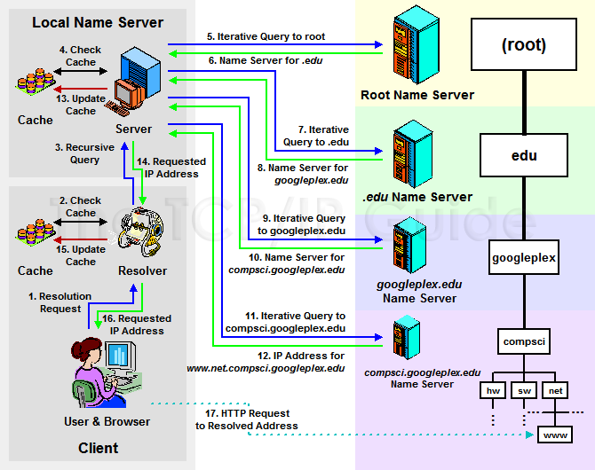
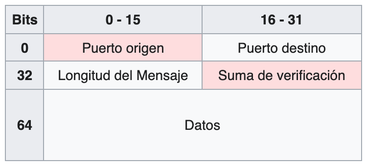
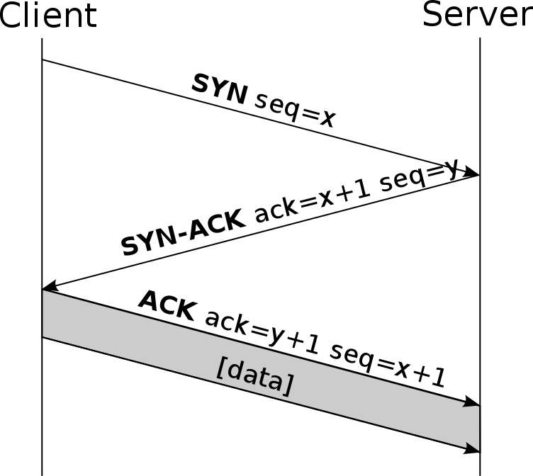
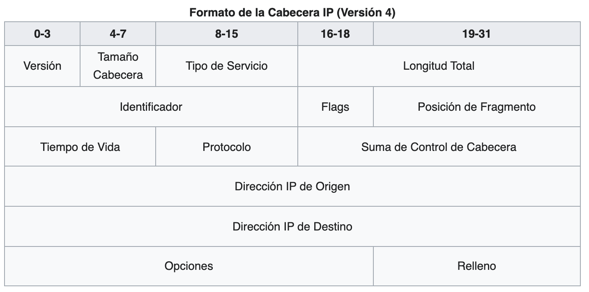
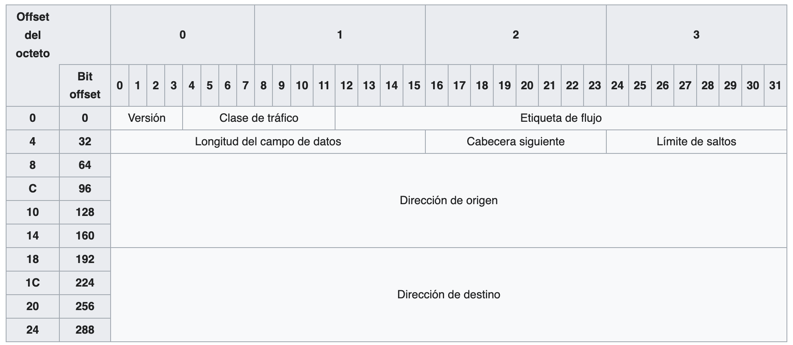

# Protocolos de comunicaciones

**Protocolos de comunicaciones según el Modelo TCP/IP**: Aplicación, Transporte, Internet y Enlace de Datos.

## Protocolos de la Capa de Aplicación

### DNS (Domain Name System)

- Sistema de nomenclatura jerárquico y descentralizado para dispositivos conectados a redes IP, como Internet o redes privadas.
- Utiliza una **base de datos distribuida y jerárquica** que almacena información asociada a nombres de dominio.
- Generalmente emplea el protocolo **UDP** para sus comunicaciones.
- **Componentes:**
    - **Clientes Fase 1:** Navegadores web u otras aplicaciones que solicitan resoluciones de nombres.
    - **Servidores DNS:** Resuelven nombres de dominio o propagan solicitudes a otros servidores.
    - **Zonas de Autoridad:** Espacios de nombres del que es responsable un servidor DNS (ejemplo: **.com**, **.org**, **.es**).
- **Nombres de Dominio:**
    - **FQDN (Fully Qualified Domain Name):** Nombre de dominio completo, como **[www.ejemplo.com](http://www.ejemplo.com).**, resuelto de derecha a izquierda.
    - **Componentes de Dominio de 3 Niveles:**
        - **3er Nivel:** Subdominio o hostname (ejemplo: **www**).
        - **2do Nivel:** Nombre de organización (ejemplo: **ejemplo**).
        - **1er Nivel/TLD (Top-Level Domain):** Dominio de nivel superior (ejemplo: **com**, **org**, **es**).
    - **Subdominios:** Delegaciones de subsecciones de un dominio, como **www.support.ejemplo.org**.
    - **Longitud máxima del nombre de dominio:** **255 caracteres**.
    - **IPs:** Resuelven de izquierda a derecha
- **Servidores Raíz (root server):** Hay **13 servidores raíz** designados ([A-M].root-servers.net), con múltiples réplicas globales.
- **Tipos de Servidores DNS:**
    - **Primarios o Maestros:** Almacenan datos originales de una zona y son **autoritarios**.
    - **Secundarios o Esclavos:** Réplicas de los servidores primarios.
    - **Locales o Caché:** Almacenan respuestas recientes para agilizar futuras resoluciones.
- **Tipos de Resolución de Nombres de Dominio:**
    - **Recursiva:** El servidor DNS realiza todas las consultas necesarias para resolver un nombre y devuelve la respuesta final al cliente.
        - **Caso:** De host a DNS local.
    - **Iterativa:** El servidor DNS proporciona la mejor respuesta que tiene (quizás una referencia a otro servidor) y el cliente continúa la búsqueda.
        - **Caso:** De DNS local a otros servidores.
- **Tipos de Registros DNS:**
    - **A (Address):** Dirección IPv4.
    - **AAAA (Address):** Dirección IPv6.
    - **CNAME (Canonical Name):** Nombre canónico; alias de otro nombre de dominio.
    - **NS (Name Server):** Servidor de nombres autoritario para el dominio.
    - **MX (Mail Exchange):** Intercambio de correo; servidores de correo del dominio.
    - **PTR (Pointer):** Registro inverso; traduce direcciones IP a nombres de dominio.
    - **SOA (Start-of-Authority):** Inicio de autoridad; información sobre el servidor DNS primario de la zona.
    - **SRV (Service Record(:** Registro de servicio; especifica servicios disponibles.
    - **ANY:** Solicita toda la información disponible para un nombre de dominio.
    - **TXT:** Contiene texto informativo o descriptivo.

### HTTP (Hypertext Transfer Protocol)

- Protocolo de comunicación que permite la transferencia de información en la **World Wide Web**.
- **Puertos Estándar:** **80** para HTTP y **443** para HTTPS.
- **HTTP Inseguro:** Transmite datos en **texto plano**, susceptible a ataques como **man-in-the-middle** y **eavesdropping**.
- **HTTPS:** Utiliza **TLS** para crear un canal cifrado y seguro.
- **Sin Estado (Stateless):** Cada petición es independiente y no mantiene contexto con peticiones anteriores.
- **Códigos de Respuesta HTTP:**
    - **1xx (Informativos):** La solicitud ha sido recibida y se está procesando.
    - **2xx (Éxito):** La solicitud se ha recibido, entendido y aceptado correctamente.
    - **3xx (Redirección):** Se requiere acción adicional para completar la solicitud.
    - **4xx (Errores del Cliente):** La solicitud contiene sintaxis incorrecta o no puede ser cumplida.
    - **5xx (Errores del Servidor):** El servidor falló al cumplir una solicitud aparentemente válida.
- **Métodos de Petición:**
    - **GET:** Solicita representación de un recurso; no debe tener efectos secundarios.
    - **HEAD:** Igual que GET pero sin el cuerpo de la respuesta.
    - **POST:** Envía datos al servidor, posiblemente cambiando su estado.
    - **PUT:** Reemplaza todas las representaciones actuales del recurso destino.
    - **DELETE:** Elimina el recurso especificado.
    - **CONNECT:** Establece un túnel hacia el servidor identificado.
    - **OPTIONS:** Describe las opciones de comunicación para el recurso.
    - **TRACE:** Realiza una prueba de bucle de retorno de mensaje.
    - **PATCH:** Aplica modificaciones parciales a un recurso.

### HTTP (Hypertext Transfer Protocol)

HTTP + SSL/TLS, en puerto 443

### SMTP (Simple Mail Transfer Protocol)

- Protocolo utilizado para el intercambio de mensajes de correo electrónico entre computadoras.
- **No define** cómo almacenar o presentar el correo al destinatario.
- **Puertos Estándar:** **25** (servidor a servidor) y **587** (cliente a servidor).
- **Con Estado (Stateful):** Mantiene la conexión durante la sesión de correo.
- **Comandos Populares:**
    - **HELO/EHLO**
    - **MAIL FROM:**
    - **RCPT TO:**
    - **DATA**
    - **QUIT**
- **Finalización del Mensaje:** Se envía con **"."** seguido de **\<CRLF>.\<CRLF>**.
- **Seguridad:** No ofrece cifrado por defecto; se recomienda usar **SMTPS** para comunicaciones seguras.
- **Postfix:** Agente de transferencia de correo ampliamente utilizado en sistemas UNIX.

### FTP (File Transfer Protocol)

- Protocolo de red diseñado para la **transferencia de archivos** entre sistemas conectados a una red **TCP** (Transmission Control Protocol), basado en la arquitectura cliente-servidor.
- **Características:**
    - Diseñado para priorizar **velocidad** sobre **seguridad**.
    - **Intercambio en texto plano:** Las credenciales y los datos se transmiten sin cifrar, lo que lo hace vulnerable a ataques.
    - **Bidireccional:** Permite tanto subir como descargar archivos.
    - Compatible con múltiples sistemas operativos y ampliamente utilizado para el intercambio de archivos en redes locales y remotas.
- **Puertos Utilizados:**
    - **Puerto de Datos (20/TCP):** Utilizado para transferir los datos reales.
    - **Puerto de Control (21/TCP):** Gestiona los comandos y respuestas entre cliente y servidor.
- **Modos de Conexión del Cliente FTP:**
    - **Activo (PORT):**
        - El cliente informa al servidor el puerto al que debe conectarse enviando un comando **PORT**.
        - El servidor inicia la conexión hacia el puerto especificado por el cliente.
        - **Inseguro:** Este método es vulnerable en redes protegidas con firewalls.
    - **Pasivo (PASV):**
        - El cliente solicita al servidor un puerto disponible mediante el comando **PASV**.
        - El servidor informa al cliente del puerto al que debe conectarse, y el cliente inicia la conexión.
        - **Más seguro y compatible** con firewalls.
- **Códigos de Respuesta FTP:** Se componen de tres dígitos y tienen el siguiente significado:
    - **1xx:** Respuesta informativa o acción en proceso.
    - **2xx:** Acción completada con éxito.
    - **3xx:** Se necesita más información o acción adicional para completar la solicitud.
    - **4xx:** Error temporal; la acción puede reintentarse más tarde.
    - **5xx:** Error permanente; la acción no puede completarse.
- **Comandos FTP Populares:**
    - **USER \<nombre>:** Proporciona el nombre de usuario para la autenticación.
    - **PASS \<contraseña>:** Proporciona la contraseña para la autenticación.
    - **LIST:** Lista los archivos y directorios en el servidor.
    - **RETR \<archivo>:** Descarga un archivo del servidor al cliente.
    - **STOR \<archivo>:** Sube un archivo desde el cliente al servidor.
    - **QUIT:** Finaliza la sesión FTP.
- **Ejemplo de Acceso FTP:** ftp://\<usuario>:\<contraseña>@\<servidor ftp>/\<ruta>
- **Implementaciones:**
    - **vsftpd (Very Secure FTP Daemon):** Servidor FTP seguro y rápido para sistemas UNIX y Linux.

### TELNET (Teletype Network)

- Protocolo que permite acceder y gestionar remotamente dispositivos como si se estuviera localmente.
- **Puerto Estándar:** **23**.
- **Problemas de Seguridad:** Transmite credenciales y datos en **texto plano**.
- **En Desuso:** Reemplazado por **SSH** debido a sus mejoras en seguridad.

### Otros Protocolos de la Capa de Aplicación

- **TFTP (Trivial File Transfer Protocol):** Servicio simple y sin conexión que utiliza **UDP** para transferir archivos.
- **NFS (Network File System):** Protocolos desarrollados por Sun Microsystems para acceder a sistemas de archivos remotos.
- **POP (Post Office Protocol):** Protocolo para recuperar correo electrónico de un servidor remoto; **descarga los mensajes** al cliente.
- **IMAP (Internet Message Access Protocol):** Permite gestionar y **manipular mensajes directamente en el servidor**, manteniendo sincronización entre múltiples dispositivos.

## Protocolos de la Capa de Transporte

### UDP (User Datagram Protocol)

- Protocolo que permite el envío de **datagramas** sin necesidad de establecer previamente una conexión.
- **Características:**
    - **No orientado a conexión (Stateless):** No guarda información de estado entre mensajes.
    - **Sin confirmación ni garantías:** No incluye mecanismos de control de flujo, retransmisión ni confirmaciones (ACK).
    - **Eficiente pero menos fiable.**
- **Usos Comunes:**
    - Protocolos como **DHCP**, **BOOTP**, **DNS**.
    - Aplicaciones en tiempo real como **streaming de video/audio**.
- **Cabecera UDP:**
    - Mínimo de **8 bytes** (64 bits), lo que lo hace ligero y rápido.

### TCP (Transmission Control Protocol)

- Protocolo que garantiza una **comunicación confiable**, asegurando que los datos lleguen sin errores y en el mismo orden en que fueron enviados.
- **Orientado a conexión (Stateful):** Establece, mantiene y cierra conexiones.
- **Características:**
    - **Reordenación de Segmentos:** Asegura que los datos se ensamblen correctamente.
    - **Control de Flujo:** Ajusta dinámicamente la tasa de transmisión de datos según las capacidades del receptor.
    - **Mecanismos de Control de Congestión:** Previene la saturación de la red.
- **Funcionamiento:**
    - **Establecimiento de Conexión (Three-way Handshake):**
        1. **SYN:** El cliente solicita una conexión.
        2. **SYN-ACK:** El servidor responde aceptando la conexión.
        3. **ACK:** El cliente confirma y puede iniciar el intercambio de datos.
    - **Transferencia de Datos:** Mecanismos clave:
        - **Número de Secuencia:** Identifica y ordena los segmentos TCP.
        - **Checksum:** Verifica la integridad de los datos.
        - **Ventanas Deslizantes (Sliding Windows):** Controla el flujo de datos, ajustándose al tamaño del buffer del receptor.
    - **Control de Congestión:**
        - **Slow Start (Inicio Lento):** Comienza con una pequeña cantidad de datos y aumenta gradualmente.
        - **Congestion Avoidance (Evitación de Congestión):** Ajusta la ventana para evitar saturar la red.
        - **Fast Retransmit (Retransmisión Rápida):** Detecta pérdidas de paquetes y retransmite rápidamente.
        - **Fast Recovery (Recuperación Rápida):** Continúa la transmisión sin iniciar un nuevo Slow Start.
    - **Terminación de Conexión (Four-way Handshake):**
        1. **FIN:** Una parte solicita cerrar la conexión.
        2. **ACK + FIN:** La otra parte responde y confirma el cierre.
        3. **ACK:** Confirmación final del cierre.

### TLS (Transport Layer Security)

- Protocolo criptográfico que garantiza **comunicaciones seguras** sobre redes como Internet.
- **Sucesor de SSL (Secure Sockets Layer).**
- **Características:**
    - Utiliza **criptografía asimétrica** (certificados X.509, estándar UIT-T) **para autenticar a las partes**.
    - Después, emplea **cifrado simétrico para la comunicación**, asegurando mayor velocidad.
    - \***Nota:** Habitualmente, solo el servidor es autenticado. Es decir, se garantiza su identidad, mientras que el cliente se mantiene sin autenticar.
- **Fases de Operación:**
    - **Negociación de Algoritmos:** Cliente y servidor acuerdan los métodos criptográficos a usar.
        - **Cifrado Asimétrico (Clave pública):** RSA, Diffie-Hellman, DSA,…
        - **Cifrado Simétrico:** AES, DES, Triple DES, RC4,…
        - **Funciones Hash:** MD5, SHA-1, SHA-256,…
    - **Intercambio de Claves Públicas:** Garantiza que ambas partes compartan una clave secreta común.
    - **Autenticación Basada en Certificados:** Verifica la identidad de las partes.
    - **Cifrado del Tráfico:** Utiliza cifrado simétrico para proteger los datos transmitidos.

**\*Clases de Protocolos a Nivel de Transporte**

- **Clase 0 (TP0, Transport Protocol Class 0):**
    - La clase más simple.
    - Soporta una conexión de transporte por cada conexión de red.
    - Fragmenta datos para transmisión y los ensambla en el receptor.
- **Clase 1 (TP1, Transport Protocol Class 1):**
    - Introduce mecanismos básicos de recuperación de errores.
- **Clase 2 (TP2, Transport Protocol Class 2):**
    - Permite multiplexar múltiples conexiones de transporte en una única conexión de red.
    - Puede incluir control de flujo.
- **Clase 3 (TP3, Transport Protocol Class 3):**
    - Soporta recuperación tras desconexiones o reinicios de la red.
- **Clase 4 (TP4, Transport Protocol Class 4):**
    - Introduce mecanismos avanzados de detección de errores.
    - Diseñado para redes de calidad de servicio tipo **C**, con tasas de error altas.

## Protocolos de la Capa de Internet

### IPv4 (Internet Protocol version 4)

- Protocolo utilizado para entregar paquetes desde un host de origen a un host de destino basándose únicamente en direcciones IP contenidas en los encabezados de los paquetes.
- **Direcciones:** Utiliza direcciones de **32 bits**.
- **Protocolo No Orientado a Conexión:** No establece una ruta fija; cada paquete puede seguir un camino diferente.
- **Incluye Checksums de Cabecera:** Verifica únicamente la integridad de la cabecera, no de los datos.
- **Cabecera IPv4:** Mínimo de **20 bytes**.
    - **Versión (4 bits):** Indica IPv4 (**0100** en binario).
    - **Tamaño de Cabecera / Internet Header Length (IHL) (4 bits):** Tamaño en múltiplos de 32 bits. Mínimo: 5 palabras (160 bits = 20 bytes).
    - **Tipo de Servicio (8 bits):** Define la calidad del servicio (prioridades, rutinas...).
    - **Longitud Total (16 bits):** Tamaño total del paquete en octetos. Valor mínimo: **576 bytes** (64B cabecera + 512B datos).
    - **Identificación (16 bits):** Identificador único del datagrama, usado para fragmentación.
    - **Flags (3 bits):** Indicadores de fragmentación.
    - **Offset de Fragmento (13 bits):** Orden de fragmentos dentro del datagrama original, en múltiplos de 64 bits.
    - **TTL (Time to Live, 8 bits):** Máximo número de saltos permitidos antes de descartar el paquete. Valores típicos: **64 o 128**.
    - **Protocolo (8 bits):** Indica el protocolo de la capa superior (ejemplo: TCP, UDP, ICMP).
    - **Checksum (16 bits):** Verifica la integridad de la cabecera.
    - **Dirección IP Origen y Destino (32 bits cada una).**

### IPv6 (Internet Protocol version 6)

- Protocolo diseñado para reemplazar a IPv4 con direcciones de **128 bits**, ofreciendo mejoras significativas en escalabilidad, seguridad y eficiencia.
- **No Compatible Directamente con IPv4:** Sin embargo, es compatible con el resto de protocolos de red.
- **Fragmentación:** Se realiza únicamente en el **nodo origen**; los routers no fragmentan paquetes en tránsito.
- **Ventajas de IPv6:**
    - **Espacio de Direcciones Más Amplio:** Capaz de asignar direcciones únicas a una cantidad masiva de dispositivos.
    - **Seguridad Integrada:** Soporte obligatorio de **IPSec** para autenticar y cifrar comunicaciones.
    - **Encabezado Simplificado:** Reduce la sobrecarga del enrutamiento al usar solo **8 campos**, frente a los **12 campos** de IPv4.
    - **Autoconfiguración de Direcciones:** A través de **SLAAC** (Stateless Address Autoconfiguration) y mensajes de descubrimiento de routers.
    - **Capacidad de Etiquetado de Flujo:** Permite a los paquetes con un mismo flujo recibir tratamiento especial en la red, como prioridad para video en tiempo real.
    - **Soporte Mejorado para Multicast y Anycast:**
        - **Multicast (1-n):** Envío a múltiples destinos en un grupo definido.
        - **Anycast (1-k):** Envío al miembro más cercano de un grupo.
        - **Unicast (1-1):** Comunicación con un único host.
    - **IPv6 Móvil (MIPv6):** Facilita que dispositivos móviles cambien de red sin necesidad de cambiar su dirección IP.
- **Cabecera IPv6:** Mínimo de **40 bytes**, diseñada para ser más eficiente que la de IPv4.
    - **Campos de la Cabecera IPv6:**
        - **Versión (4 bits):** Indica IPv6 (**0110** en binario).
        - **Clase de Tráfico (8 bits):** Define la prioridad del paquete.
        - **Etiqueta de Flujo (20 bits):** Identifica flujos para un tratamiento especial.
        - **Longitud del Campo de Datos (16 bits):** Tamaño del payload del paquete.
        - **Cabecera Siguiente (8 bits):** Especifica el tipo de cabecera o protocolo que sigue.
        - **Límite de Saltos/TTL (8 bits):** Similar al TTL de IPv4, indica el número máximo de saltos permitidos.
        - **Dirección IP Origen (128 bits):** Dirección del remitente.
        - **Dirección IP Destino (128 bits):** Dirección del destinatario.
- **Notación de Direcciones IPv6:**
    - **Formato Estándar: 8 grupos de 4 dígitos hexadecimales** separados por dos puntos, como **2001:0db8:85a3:0000:0000:8a2e:0370:7334**.
    - **Optimización de Notación:**
        - Los ceros iniciales de un grupo pueden omitirse, por ejemplo: **0123** → **123**.
        - Grupos consecutivos de ceros pueden reemplazarse por **"::"**, pero este reemplazo solo puede usarse una vez por dirección.
        - Ejemplo compactado: **2001:db8::8a2e:370:7334**.
    - **Compatibilidad con IPv4:** Direcciones IPv4 pueden representarse dentro de IPv6 como **::192.0.2.33**.
- **Funciones Clave:**
    - **Encabezados Más Simples:** Menor procesamiento por parte de los routers.
    - **Soporte Obligatorio de Seguridad:** IPSec como parte estándar.
    - **Capacidad Multicast y Anycast:** Optimizaciones para comunicaciones grupales.

### ARP (Address Resolution Protocol)

- Protocolo utilizado para mapear direcciones IP a direcciones MAC en una red local.
- **Funcionamiento:**
    - **Solicitud ARP (ARP Request):** Mensaje broadcast preguntando por la dirección MAC asociada a una IP específica.
    - **Respuesta ARP (ARP Reply):** Mensaje unicast enviado por el dispositivo con la dirección MAC correspondiente.

### DHCP (Dynamic Host Configuration Protocol)

- Protocolo que asigna dinámicamente direcciones IP y otros parámetros de configuración de red a dispositivos.
- **Funciones:**
    - Asignación de direcciones IP.
    - Configuración de máscara de subred, gateway predeterminado y servidores DNS.
- **Métodos de Asignación IP:**
    - **Manual (Estática):** Admin asigna una IP fija a un dispositivo.
    - **Automática:** Asigna una IP permanente la primera vez que el dispositivo se conecta.
    - **Dinámica:** Direcciones temporales asignadas por un rango predefinido.
- **Proceso DHCP:**
    1. **DHCP Discover:** El cliente envía un mensaje broadcast buscando servidores DHCP.
    2. **DHCP Offer:** Los servidores responden ofreciendo configuración.
    3. **DHCP Request:** El cliente selecciona una oferta y la solicita.
    4. **DHCP Acknowledge:** El servidor confirma y proporciona la configuración.

### ICMP (Internet Control Message Protocol)

- Protocolo para enviar mensajes de error, diagnóstico y control en redes.
- **Entrega No Garantizada:** Los mensajes pueden perderse.
- **Usos Comunes:**
    - Diagnóstico de red (**ping**, **traceroute**).
    - Notificación de errores (host inaccesible, TTL expirado, etc.).
- **Cabecera ICMP:**
    - **Tipo:** Indica el tipo de mensaje ICMP
        - **Ejemplo:** Echo Request, Echo Reply
    - **Código:** Proporciona detalles adicionales sobre el tipo de mensaje.
    - **Checksum:** Verifica la integridad del mensaje.
    - **Datos Opcionales:** Información adicional relevante.

### Otros Protocolos de la Capa de Red

- **RARP (Reverse Address Resolution Protocol):** Realiza la función inversa de ARP, obteniendo la dirección IP asociada a una dirección MAC.
- **IGMP (Internet Group Management Protocol):** Gestiona la pertenencia a grupos multicast, facilitando la multidifusión en redes IP.

**\*Tipos de Redes Según Calidad de Servicio**

- **Tipo A:** Baja tasa de errores no detectados y baja tasa de errores detectados pero no corregidos.
- **Tipo B:** Baja tasa de errores no detectados, pero alta tasa de errores detectados no corregidos.
- **Tipo C:** Tasa de errores inaceptablemente alta.

## Protocolos de la Capa de Enlace

### Ethernet

- Tecnología estándar para redes de área local (**LAN**).
- **Estándar IEEE 802.3**.
- **Direcciones MAC:** Utiliza direcciones físicas de **48 bits** para identificar dispositivos en la red.
- **Método de Acceso:** **CSMA/CD** (Carrier Sense Multiple Access with Collision Detection).
- **Velocidades Comunes:** **10 Mbps**, **100 Mbps** (Fast Ethernet), **1 Gbps** (Gigabit Ethernet), **10 Gbps** (10 Gigabit Ethernet).

### Wi-Fi (IEEE 802.11)

- Estándar para redes inalámbricas de área local.
- **Frecuencias:** **2.4 GHz** y **5 GHz**.
- **Modos de Operación:**
    - **Infraestructura:** Comunicación a través de un punto de acceso (**AP**).
    - **Ad-Hoc:** Comunicación directa entre dispositivos sin necesidad de AP.
- **Seguridad:** Protocolos como **WEP**, **WPA**, **WPA2**, **WPA3**.

### PPP (Point-to-Point Protocol)

- Protocolo para establecer una conexión directa entre dos nodos de red.
- **Usos Comunes:** Conexiones de acceso telefónico, enlaces seriales y comunicaciones entre routers.
- **Características:**
    - **Autenticación:** Soporta **PAP** (Password Authentication Protocol) y **CHAP** (Challenge Handshake Authentication Protocol).
    - **Compresión de Datos:** Opcional para optimizar el uso del enlace.
    - **Detección de Errores:** Proporciona mecanismos básicos para garantizar la integridad.

### HDLC (High-Level Data Link Control)

- Protocolo orientado a bits para enlaces sincrónicos.
- **Características:**
    - **Control de Flujo y Errores:** Utiliza técnicas de verificación y retransmisión.
    - **Operación en Modo Normal y Asincrónico:** Adaptable a diferentes tipos de enlaces.

### Frame Relay

- Tecnología de conmutación de paquetes para interconectar redes LAN y crear redes WAN.
- **Características:**
    - **Eficiencia:** Menor sobrecarga en comparación con X.25.
    - **Calidad de Servicio (QoS):** Soporta diferentes niveles de servicio.
