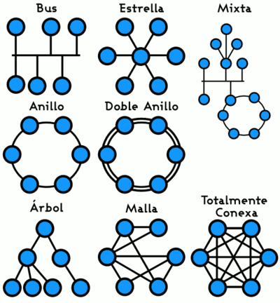

# Redes de computadores

## Red de computadores: Componentes, Categorías, dispositivos,…

Una red de computadores es un conjunto de equipos, conocidos como nodos, y software conectados entre sí mediante dispositivos físicos que transmiten y reciben datos a través de impulsos eléctricos, ondas electromagnéticas u otros medios. Su finalidad es compartir información, recursos y ofrecer servicios entre los dispositivos conectados.

### Categorías de una red

- **Capa física**: Incluye los elementos tangibles utilizados por un equipo para comunicarse con otros dentro de la red, como tarjetas de red, cables y antenas.
- **Capa lógica**: Establece normas y protocolos que permiten proporcionar servicios de comunicación entre dispositivos.

### Componentes de una red (i)

- **Emisor**: Dispositivo que envía el mensaje.
- **Mensaje**: Información que se desea transmitir.
- **Medio**: Canal a través del cual se transmite el mensaje.
- **Receptor**: Dispositivo que recibe el mensaje.

### Componentes básicos de las redes (ii)

- **Hardware**: Dispositivos físicos que conforman la red, como routers, switches y servidores.
- **Software**: Programas y aplicaciones que gestionan la comunicación y el flujo de datos en la red.
- **Protocolos**: Conjuntos de reglas que permiten la comunicación eficiente y segura entre dispositivos de diferentes fabricantes.

### Dispositivos de red

- **Conmutador de red (switch)**: Interconecta dos o más hosts, pasando datos de un segmento a otro según la dirección MAC de destino de las tramas, y elimina la conexión una vez finalizada.
- **Enrutador (router)**: Interconecta redes con distintos prefijos en sus direcciones IP, estableciendo la mejor ruta para que cada paquete de datos llegue a su destino.
- **Puente de red (bridge)**: Interconecta segmentos de red transfiriendo datos de una red a otra basándose en la dirección física de destino de cada paquete.
- **Puente de red y enrutador (brouter)**: Combina las funciones de un puente de red y un enrutador, permitiendo interconectar redes y segmentar el tráfico.
- **Punto de acceso inalámbrico (Wireless Access Point, WAP)**: Dispositivo que interconecta equipos de comunicación inalámbricos para formar una red inalámbrica que conecta dispositivos móviles o tarjetas de red inalámbricas.

### Clasificación de las redes por alcance

- **Red de área personal (Personal Area Network, PAN)**: Red utilizada para la comunicación entre dispositivos cercanos a una persona, como smartphones y relojes inteligentes.
- **Red inalámbrica de área personal (Wireless Personal Area Network, WPAN)**: Similar a la PAN pero inalámbrica, permite la comunicación entre dispositivos cercanos al punto de acceso, generalmente en un rango de pocos metros (ejemplo: Bluetooth).
- **Red de área local (Local Area Network, LAN)**: Red que se limita a un área geográfica pequeña, como una habitación, un edificio o una nave industrial.
- **Red de área local inalámbrica (Wireless Local Area Network, WLAN)**: Sistema de comunicación de datos inalámbrico que utiliza tecnología de radiofrecuencia para conectar dispositivos dentro de un área local.
- **Red de área de campus (Campus Area Network, CAN)**: Red de alta velocidad que conecta redes LAN en un área geográfica limitada, como un campus universitario o un parque tecnológico.
- **Red de área metropolitana (Metropolitan Area Network, MAN)**: Red de alta velocidad que cubre un área geográfica más extensa que una CAN, como una ciudad o un conjunto de edificios públicos.
- **Red de área amplia (Wide Area Network, WAN)**: Red que se extiende sobre un área geográfica extensa, utilizando medios como satélites, cables interoceánicos, Internet o fibras ópticas públicas.

### Clasificación de las redes por topología de red

- **Red en bus (lineal)**: Se caracteriza por tener un único canal de comunicaciones al cual se conectan todos los dispositivos. Es sencilla y económica, pero si el canal falla, toda la red se interrumpe.
- **Red en anillo (ring)**: Cada estación está conectada a la siguiente y la última está conectada a la primera, formando un círculo cerrado. Los datos circulan en una dirección y cada nodo actúa como repetidor.
- **Red en estrella (star)**: Todas las estaciones están conectadas directamente a un punto central, generalmente un switch o hub, y las comunicaciones se realizan a través de este. Es fácil de administrar y escalar.
- **Red en malla (mesh)**: Cada nodo está conectado a todos los demás, proporcionando múltiples rutas para la transmisión de datos. Ofrece alta redundancia y fiabilidad.
- **Red en árbol (tree)**: Los nodos están organizados en forma jerárquica, similar a la estructura de un árbol, combinando características de las topologías en estrella y bus.
- **Red híbrida o mixta**: Combinación de dos o más topologías de red mencionadas anteriormente, adaptándose a necesidades específicas.

### Clasificación de las redes por direccionalidad de datos

- **Simplex (unidireccional)**: La comunicación se realiza en un solo sentido; un dispositivo transmite y otro recibe, como en las transmisiones de radio.
- **Half-duplex (semidúplex)**: La comunicación es bidireccional pero no simultánea; los dispositivos pueden transmitir y recibir, pero no al mismo tiempo, como en el uso de walkie-talkies.
- **Full-duplex (dúplex)**: La comunicación es bidireccional y simultánea; ambos dispositivos pueden transmitir y recibir al mismo tiempo, como en una conversación telefónica.

### Clasificación de las redes por medios de transmisión

- **Medios guiados**:
    - **Cable de par trenzado**: Consiste en pares de cables entrelazados para reducir la interferencia electromagnética. Se utiliza comúnmente en redes LAN.
    - **Cable coaxial**: Cable con un conductor interno rodeado por un aislante y una malla conductora que sirve como blindaje. Fue popular en redes Ethernet antiguas.
    - **Fibra óptica**: Utiliza hilos de vidrio o plástico para transmitir datos en forma de pulsos de luz, ofreciendo altas velocidades y mayor inmunidad a interferencias.
- **Medios no guiados**:
    - **Red por radio**: Utiliza ondas de radio para la transmisión inalámbrica de datos, como en redes Wi-Fi.
    - **Red por infrarrojos**: Emplea luz infrarroja para la comunicación entre dispositivos en línea de visión directa, aunque es susceptible a interferencias y obstrucciones.
    - **Red por microondas**: Utiliza señales de microondas para la transmisión de datos a largas distancias, incluyendo enlaces satelitales.

## Redes de Área Extensa (WAN)

Las redes de área extensa (WAN, *Wide Area Network*) son redes de computadoras que interconectan múltiples redes de ámbito geográfico menor, como redes de área local (LAN), permitiendo la comunicación entre dispositivos que no se encuentran en la misma ubicación física. Las WAN son esenciales para conectar sucursales de empresas, instituciones gubernamentales y para el funcionamiento global de internet. Pueden ser privadas, diseñadas y gestionadas por organizaciones, o públicas, administradas por proveedores de servicios de internet (ISP).

La mayoría de los enlaces WAN son **enlaces punto a punto**, conectando directamente dos ubicaciones específicas. Esto facilita una comunicación directa y constante entre los puntos finales.

### Infraestructura de una WAN

- **Equipamiento local del cliente (CPE)**: Dispositivos y cables ubicados en las instalaciones del cliente que se conectan a la red del proveedor.
- **Equipo de comunicación de datos (DCE)**: Dispositivos que proporcionan la interfaz entre el CPE y la red del proveedor, como módems y multiplexores.
- **Equipo terminal de datos (DTE)**: Dispositivos del cliente que generan y consumen datos, como computadoras y routers.
- **Punto de demarcación**: Límite físico que separa las responsabilidades de mantenimiento entre el cliente y el proveedor de servicios.
- **Bucle local**: Conexión física que une el CPE con la central del proveedor.
- **Centralita de comunicaciones**: Instalación del proveedor donde se gestionan las conexiones y el tráfico de datos.
- **Red interurbana**: Infraestructura que conecta diferentes áreas geográficas, facilitando la comunicación a larga distancia.

### Tipos de Redes WAN

- **Conmutación de circuitos**: Establece un circuito dedicado entre las terminales de los usuarios antes de la transmisión de datos. Este circuito permanece reservado durante toda la comunicación. Ejemplo: la red telefónica tradicional.
- **Conmutación de paquetes**: Los datos se dividen en paquetes que se envían a través de una red compartida. Cada paquete puede tomar rutas diferentes y se reensambla en el destino. Ejemplo: internet.
- **Conmutación de mensajes**: Los mensajes completos se transmiten de nodo en nodo, almacenándose temporalmente en cada uno antes de ser reenviados. Este método es menos común en la actualidad.

### Tipos de conexiones a una WAN

### 1. Conexiones de un Suscriptor a una WAN

- **Línea dedicada**: Conexión punto a punto permanente y exclusiva entre dos puntos. Ofrece alta fiabilidad y seguridad.
    - **Protocolos asociados**: PPP (Point-to-Point Protocol), HDLC (High-Level Data Link Control), SDLC (Synchronous Data Link Control), HNAS.
- **Conmutación de circuitos**: Se establece un circuito dedicado temporal para cada sesión de comunicación.
    - **Protocolos asociados**: PPP, ISDN (Integrated Services Digital Network).
- **Conmutación de paquetes**: Los datos se transmiten en paquetes a través de enlaces compartidos.
    - **Protocolos con estado**: X.25, Frame Relay.
    - **Protocolos sin estado**: IPv4, IPv6.
- **Conmutación de celdas**: Similar a la conmutación de paquetes, pero utiliza celdas de longitud fija.
    - **Protocolo asociado**: ATM (Asynchronous Transfer Mode).
- **Internet**: Utiliza la infraestructura global de internet para la transmisión de datos.
    - **Protocolos asociados**: VPN (Virtual Private Network), DSL (Digital Subscriber Line), módem por cable, conexiones inalámbricas.

### 2. Conexiones a la WAN con Medios Guiados

- **Líneas dedicadas**: Para conexiones permanentes que requieren alta disponibilidad y ancho de banda garantizado.
- **Acceso telefónico (dial-up)**: Utiliza líneas telefónicas analógicas; es lento y se usa cuando no hay otras opciones disponibles.
- **RDSI (Red Digital de Servicios Integrados)**: Permite la transmisión digital de voz y datos a través de líneas telefónicas tradicionales.
- **Frame Relay**: Tecnología de capa 2 que ofrece conmutación rápida de paquetes para interconectar LANs distantes.
- **ATM (Modo de Transferencia Asíncrona)**: Transmite datos en celdas de tamaño fijo, adecuado para voz, vídeo y datos.
- **WAN Ethernet**: Utiliza estándares Ethernet avanzados sobre fibra óptica para conexiones de alta velocidad.
- **MPLS (Conmutación de Etiquetas Multiprotocolo)**: Dirige datos basándose en etiquetas cortas en lugar de direcciones IP, mejorando la eficiencia.
- **WAN DSL**: Utiliza líneas telefónicas de cobre para proporcionar acceso a internet de banda ancha.
- **Cable**: Usa la infraestructura de televisión por cable para ofrecer servicios de internet.
- **Fibra óptica**: Ofrece las velocidades más altas y es inmune a las interferencias electromagnéticas.

### 3. Conexiones a la WAN de Manera Inalámbrica

- **VSAT (Very Small Aperture Terminal)**: Utiliza comunicaciones satelitales para crear una WAN privada, ideal para áreas remotas.
- **Tecnologías inalámbricas**:
    - **Wi-Fi Municipal**: Redes inalámbricas que brindan acceso a internet en áreas urbanas extensas.
    - **WiMAX**: Ofrece acceso inalámbrico de banda ancha en un radio amplio, similar a la cobertura celular.
    - **Datos móviles**: Tecnologías celulares como 3G, 4G/LTE y 5G que permiten acceso a internet móvil de alta velocidad.

### Telefonía Móvil y Nuevas Tecnologías

La telefonía móvil ha evolucionado desde servicios básicos de voz hasta ofrecer conexiones de datos de alta velocidad:

- **3G**: Introdujo servicios de datos más rápidos, permitiendo navegación web y aplicaciones básicas.
- **4G/LTE (Long Term Evolution)**: Mejoró significativamente las velocidades de datos, habilitando streaming de vídeo y aplicaciones en tiempo real.
- **5G**: Proporciona velocidades ultra rápidas, baja latencia y capacidad para una gran cantidad de dispositivos, impulsando el Internet de las Cosas (IoT) y aplicaciones avanzadas como realidad aumentada.

### Nuevos Protocolos

La innovación en tecnologías WAN ha dado lugar a nuevos protocolos:

- **IPv6**: Expande el espacio de direcciones IP, mejora la seguridad y la eficiencia enrutamiento.
- **MPLS**: Mejora la velocidad y gestión del tráfico en redes complejas mediante la utilización de etiquetas.
- **VPN**: Permite crear conexiones seguras a través de redes públicas, utilizando protocolos como IPsec o SSL/TLS.

### Protocolos

| Protocolo   | Funcionamiento                                                                                                                                                                                                                   | Topología                                                | Capa OSI        |
| ----------- | -------------------------------------------------------------------------------------------------------------------------------------------------------------------------------------------------------------------------------- | -------------------------------------------------------- | --------------- |
| Frame Relay | Cada circuito virtual está identificado de forma única por un DLCI local, lo que permite distinguir que enrutador está conectado a cada interfaz.                                                                                | Hub-and-spoke (estrella), Malla completa, malla parcial. | Enlace de datos |
| ATM         | La información es transmitida en forma de paquetes cortos llamados celdas ATM. Longitud constante. Las cuales pueden ser encaminadas individualmente mediante el uso de los denominados canales virtuales y trayectos virtuales. | Malla completa, Punto a punto.                           | Enlace de datos |
| X.25        | Está orientada a la conexión y trabaja con circuitos virtuales conmutados y permanentes, estas redes están obsoletas para algunos propósitos por su velocidad.                                                                   | Punto a punto                                            | Capa de red     |

## Caso práctico: Cálculo de subredes

Para dividir una red en subredes, se utilizan cálculos basados en el número de bits reservados para la identificación de redes y hosts.

**Ejemplo**: Dividir la red **192.169.48.0** con máscara **255.255.255.0** en **4 subredes**.

- **Número de subredes requeridas**: Necesitamos dividir la red en 4 subredes. Por lo que para determinar cuántos bits adicionales se necesitan, usamos la fórmula **2^n**, donde **n** es el número de bits.
    - En este caso, **2^n = 4**, lo que implica que **n = 2**. Es decir, debemos tomar **2 bits adicionales** de la parte destinada a los hosts.
- **Actualización de la máscara de subred**: La máscara original es **/24** (32-8) o **255.255.255.0**. Por ende, al añadir 2 bits para las subredes, la nueva máscara se convierte en **/26** o **255.255.255.192** (los **dos primeros bits** del último octeto son “1”s, lo que equivale a **11**000000 en binario).
- **Número total de direcciones por subred:** Con la nueva máscara **/26**, quedan **(8 – 2) = 6** bits para identificar hosts dentro de cada subred. Así que el número total de direcciones por subred sería **2^6 = 64**
- **Direcciones utilizables por subred**: De las **64** direcciones de cada subred, **2** están reservadas: Una para la dirección de red y otra para la de broadcast. Por tanto, el número de direcciones de host disponibles por subred es: **64 - 2 = 62**
- **Rangos de direcciones por subred:** (rangos de las 4 subredes)
    - **Subred 1:** 192.169.48.0 a 192.169.48.63
        - **Direcciones utilizables:** 192.169.48.1 a 192.169.48.62
    - **Subred 2**: 192.169.48.64 a 192.169.48.127
        - **Direcciones utilizables:** 192.169.48.65 a 192.169.48.126
    - **Subred 3:** 192.169.48.128 a 192.169.48.191
        - **Direcciones utilizables:** 192.169.48.129 a 192.169.48.190
    - **Subred 4:** 192.169.48.192 a 192.169.48.255
        - **Direcciones utilizables:** 192.169.48.193 a 192.169.48.254

**Nota:** La primera dirección (\*.0, \*.64, \*.128, \*.192) y la última (\*.63, \*.127, \*.191, \*.255), no son utilizables porque son la de identificación y la de broadcast, respectivamente

-
