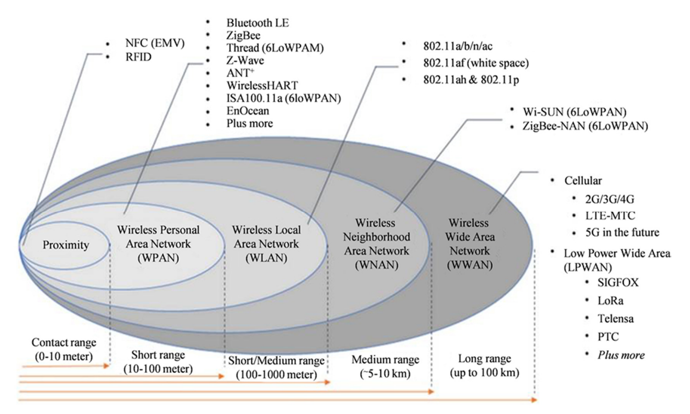

# Redes inalámbricas y 5G

## Redes inalámbricas

Las redes inalámbricas permiten la conexión de nodos mediante ondas electromagnéticas, eliminando la necesidad de una red cableada. Son esenciales en entornos donde la movilidad y la flexibilidad son prioritarias.

### Tipos de redes inalámbricas por alcance

- **WPAN (Wireless Personal Area Network)**\ Red para la comunicación entre dispositivos cercanos al punto de acceso.
    - **Ejemplos**: Bluetooth (2-6 Mbits; 2.4-5 GHz; 5-20 m), RFID, NFC, ZigBee.
    - **Alcance**: 10-100 m.
- **WLAN (Wireless Local Area Network)**\ Red de comunicación para distancias cortas basada en ondas de radio o infrarrojas.
    - **Ejemplos**: Wi-Fi (802.11) → (+600 Mbits; 2.4-5 GHz; 50-250 m).
    - **Alcance**: 100 m-1 km.
- **WMAN (Wireless Metropolitan Area Network)**\ Red de banda ancha para cubrir áreas geográficas extensas.
    - **Ejemplos**: WiMAX (+70 Mbits; 2-11 GHz; 50 km).
    - **Alcance**: 1-50 km.
- **WWAN (Wireless Wide Area Network)**\ Red que utiliza tecnologías de comunicación móvil.
    - **Ejemplos**: 2G, 3G, 4G LTE, 5G, WiMAX, UMTS, GPRS, EDGE, CDMA2000, GSM, CDPD, Mobitex, HSPA.
    - **Alcance**: Hasta 100 km.

### Tipos de redes inalámbricas por el rango de frecuencias

- **Microondas terrestres**: Utilizan antenas parabólicas (∅ 3 m) que requieren alineación para conexiones punto-a-punto.
- **Microondas por satélite**: Enlazan estaciones terrestres (base) con un satélite.
    - **Señal ascendente**: Emitida por la estación terrestre.
    - **Señal descendente**: Retransmitida por el satélite en otra banda de frecuencia.
- **Infrarrojos**: Utilizan transmisores y receptores que modulan luz infrarroja no coherente.

### Estándares IEEE 802

- **IEEE 802.1 (LAN, MAN, WAN)**
    - **802.1D:** Puentes MAC.
    - **802.1Q:** VLANs.
    - **802.1X:** Control de acceso a la red basado en puertos (autenticación).
- **IEEE 802.2 (LLC)**: Control lógico de enlace (LLC).
- **IEEE 802.3 (Ethernet)**: Redes Ethernet cableadas.
- **IEEE 802.11 (WLAN)**: Redes Ethernet inalámbricas
    - **Ejemplo:** WiFi (+600 Mbits; 2.4-5 GHz; 50-250 m).
    - **Estándares**:
        - **a**: 5 GHz.
        - **n**: Estándar actual (2.4/5GHz)
        - **Superior a “n”**: 6GHz
- **IEEE 802.15 (WPAN)**: Redes de área personal inalámbricas
    - **Ejemplo:** Bluetooth (50 Mbits; 2.4 GHz; 0.5-100 m)
- **IEEE 802.16 (WMAN)**: Redes metropolitanas inalámbricas
    - **Ejemplo**: WiMAX

### Conceptos generales IEEE 802.11

- **Estaciones**: Dispositivos con interfaz de red.
- **Medio**: Radiofrecuencias o infrarrojos.
- **Punto de acceso (AP)**:
    - Funciona como un puente, conectando redes con niveles de enlace similares o distintos.
    - Realiza conversiones de tramas.
- **Sistema de distribución**:
    - Proporciona movilidad entre APs.
    - Controla la ubicación de las estaciones para enviar tramas correctamente.
- **Conjunto de Servicio Básico (BSS)**: Grupo de estaciones intercomunicadas.
    - **Independientes**: Comunicación directa entre estaciones.
    - **Infraestructura**: Comunicación a través de un punto de acceso.
- **Conjunto de Servicio Extendido (ESS)**: Unión de varios BSS.
- **Área de servicio básico**:
    - Define la capacidad de movilidad entre terminales cambiando de BSS.
    - La transición es correcta dentro del mismo ESS.
- **Límites de la red**:
    - Difusos debido al solapamiento de diferentes BSS.

<table>
<colgroup>
<col style="width: 19%" />
<col style="width: 19%" />
<col style="width: 20%" />
<col style="width: 19%" />
<col style="width: 19%" />
</colgroup>
<thead>
<tr>
<th>Generation</th>
<th>IEEE Standard</th>
<th>
Maximum Linkrate

(Mbit/s)
</th>
<th>Adopted</th>
<th>Radio Frequency (GHz)</th>
</tr>
</thead>
<tbody>
<tr>
<td>Wi‑Fi 7</td>
<td>802.11be</td>
<td>40000</td>
<td>2024</td>
<td>2.4/5/6</td>
</tr>
<tr>
<td>Wi‑Fi 6E</td>
<td rowspan="2">802.11ax</td>
<td rowspan="2">600 - 9608</td>
<td>2020</td>
<td>2.4/5/6</td>
</tr>
<tr>
<td>Wi‑Fi 6</td>
<td>2019</td>
<td>2.4/5</td>
</tr>
<tr>
<td>Wi‑Fi 5</td>
<td>802.11ac</td>
<td>433 - 6933</td>
<td>2014</td>
<td>5</td>
</tr>
<tr>
<td>Wi‑Fi 4</td>
<td>802.11n</td>
<td>72 - 600</td>
<td>2008</td>
<td>2.4/5</td>
</tr>
<tr>
<td>(Wi-Fi 3*)</td>
<td>802.11g</td>
<td>6 - 54</td>
<td>2003</td>
<td>2.4</td>
</tr>
<tr>
<td>(Wi-Fi 2*)</td>
<td>802.11a</td>
<td>6 - 54</td>
<td>1999</td>
<td>5</td>
</tr>
<tr>
<td>(Wi-Fi 1*)</td>
<td>802.11b</td>
<td>1 - 11</td>
<td>1999</td>
<td>2.4</td>
</tr>
<tr>
<td>(Wi-Fi 0*)</td>
<td>802.11</td>
<td>1 - 2</td>
<td>1997</td>
<td>2.4</td>
</tr>
</tbody>
</table>

| Enmienda       | Fecha de publicación | Descripción                                                                                                                                             |
| -------------- | -------------------- | ------------------------------------------------------------------------------------------------------------------------------------------------------- |
| 802.11i | 2004                 | Agrega mecanismos de **identificación y encriptación de datos** (WPA), para reemplazar el algoritmo WEP original del estándar 802.11 que está obsoleto. |
| 802.11w | 2009                 | **Aumenta la seguridad** de los marcos de gestión.                                                                                                      |

## Redes 5G

La quinta generación de comunicaciones móviles (5G) se caracteriza por su capacidad para ofrecer **mayor velocidad**, **menor latencia** y **mayor capacidad de conectividad**. No es una tecnología estática, ya que evoluciona mediante la publicación de nuevas “releases”. Esta red inalámbrica se adapta a diversos casos de uso, proporcionando soluciones especializadas según el tipo de conexión.

### Características básicas de las redes 5G

- **Velocidad máxima**: 20 Gbps de bajada y 10 Gbps de subida.
- **Latencia**: 1 ms.
- **Disponibilidad**: 99,999%.
- **Capacidad de volumen de datos**: Hasta 10 TB/s por km².
- **Dispositivos conectados**: Soporta hasta 1 millón de dispositivos por km².
- **Eficiencia energética**: 90% más eficiente que 4G.

### Bandas de frecuencia utilizadas

- **Banda de 700 MHz** (694-790 MHz): Ideal para amplias coberturas rurales.
- **Banda de 3,5 GHz** (3,4-3,8 GHz): Banda principal para ofrecer altas velocidades.
- **Banda de 26 GHz** (24,25-27,5 GHz): Proporciona capacidades para zonas densamente pobladas.

### Tipos de comunicaciones en 5G

- **Banda ancha móvil mejorada (eMBB / Enhanced Mobile Broadband)**: Alta tasa de transmisión de datos en movilidad (10-20 Gbps de bajada, 1-10 Gbps de subida).
- **Comunicaciones de baja latencia y alta fiabilidad (URLLC / Ultra-Reliable Low-Latency Communications)**: Comunicaciones críticas con latencia de 1-10 ms y fiabilidad del 99,999%.
- **Comunicaciones masivas para IoT (mMTC /** **Massive Machine Type Communications)**: Orientadas a dispositivos de bajo coste y bajo consumo, con capacidad para conectar hasta 1 millón de nodos por km².

### Multi-access Edge Computing (MEC)

Permite la ejecución de aplicaciones en los bordes de la red, reduciendo la latencia y mejorando la eficiencia al procesar los datos más cerca de donde se generan.

### Organizaciones de normalización del 5G

- **3GPP**: Asociación del Proyecto de 3ª Generación.
- **ETSI**: Instituto Europeo de Normas de Telecomunicaciones.
- **UIT-T**: Sector de Normalización de las Telecomunicaciones de la UIT.
- **IETF**: Grupo de Trabajo de Ingeniería de Internet.
- **IEEE**: Instituto de Ingenieros Eléctricos y Electrónicos.

### Tecnología básica de redes 5G

- Uso de **bandas de alta y ultra alta frecuencia**.
- Empleo de técnicas avanzadas de modulación y codificación para mejorar la eficiencia de transmisión.
- Utilización de tecnologías de multiplexación como **FDMA**, **TDMA** y **CDMA** para transmitir múltiples señales simultáneamente.

### Aplicaciones del 5G

- **Industria 4.0**: Automatización y robótica avanzada.
- **Agricultura de precisión**: Uso de UAVs para aplicación en tiempo real de fitosanitarios.
- **Ingeniería y construcción**: Modelos digitales de proyectos.
- **Infraestructuras digitales**: Smart Cities.
- **Control de fronteras**: Sistemas de defensa y seguridad avanzados.
- **Sector audiovisual**: Producción y distribución de contenidos con alta conectividad.
- **Ciencia aplicada**: Aplicaciones en metaversos e Internet de los sentidos (IoS).

### Programa de Universalización de Infraestructuras Digitales para la Cohesión (UNICO)

Este programa fomenta la universalización del acceso a la banda ancha ultra rápida y la extensión del 5G mediante convocatorias específicas.\ Los principales subprogramas son:

- **UNICO-Banda Ancha**
- **UNICO-Servicios Públicos**
- **UNICO-Industria y Empresas**
- **UNICO-Bono Social**
- **UNICO-Edificios**
- **UNICO 5G I+D**
- **UNICO 5G Redes – Pasivas y Backhaul Fibra Óptica**
- **UNICO-Bono Pyme**
- **UNICO-Demanda Rural**
- **UNICO I+D 6G**
- **UNICO Sectorial 5G**

### Programa UNICO-Banda Ancha

El objetivo principal es facilitar el despliegue de infraestructuras de banda ancha de muy alta velocidad mediante ayudas dirigidas a operadores de telecomunicaciones.

### Características

- Servicios de velocidad simétrica entre **300 Mbps y 1 Gbps**.

### Actuaciones

- **UNICO Banda Ancha Acceso**: Proporcionar velocidades de 300 Mbps (actualizables a 1 Gbps) en zonas sin cobertura.
- **UNICO Banda Ancha Interconexión terrestre**: Ampliar la conectividad a 1 Gbps para entidades públicas, centros educativos, redes de investigación y defensa.
- **UNICO Banda Ancha Interconexión submarina**: Incrementar la capacidad en cables submarinos para instituciones públicas y redes de defensa.

### Objetivos

- Garantizar el acceso universal a internet de alta velocidad para todos los hogares y empresas en España.
- Impulsar la competitividad y el desarrollo económico.
- Desplegar infraestructuras avanzadas como fibra óptica y tecnologías móviles de última generación (5G).

## Tecnologías de transmisión

| Poco consumo  | Bluetooth, z-wave, zigbee | LoRaWAN, SIGFOX, NB-IoT |
| ------------- | ------------------------- | ----------------------- |
| Mucho consumo | WiFi                      | 3G, 4G, 5G              |
|               | **Poco alcance**          | **Mucho alcance**       |

|                              | SIGFOX                                                                             | LoRaWAN                                                  | NB-IoT                          | WiFi                            | 5G                                                                    |
| ---------------------------- | ---------------------------------------------------------------------------------- | -------------------------------------------------------- | ------------------------------- | ------------------------------- | --------------------------------------------------------------------- |
| Tipo                         | Propietaria                                                                        | Abierta                                                  | Estándar (3GPP)                 | Estándar (IEEE)                 | Estándar (3GPP)                                                       |
| Espectro                     | No licenciado                                                                      | No licenciado                                            | Licenciado                      | Licenciado                      | Licenciado                                                            |
| Ancho de banda               | 100Hz                                                                              | 125kHz                                                   | 125kHz                          | 2.4; 5GHz                       | 700Mhz; 3.5Ghz; 26Ghz                                                 |
| Throughput                   | 600bps                                                                             | 50kbps                                                   | 60kbps                          | 1-3Gbps                         | 20Gbps                                                                |
| Latencia                     | 2s - 10min                                                                         | 1s - 2min                                                | 1.6s - 10s                      | \<1ms                           | 1ms                                                                   |
| Cobertura                    | Urbano: 3-10km  Campo: 30-50km                                                     | Urbano: 2-5km  Campo: 15km                               | Urbano: 2km  Campo: 15km        | 50m-100m                        | 100m-20km                                                             |
| Vida batería                 | 15 años                                                                            | 15 años                                                  | 10 años                         | Horas                           | Horas-Días                                                            |
| Bidireccionalidad            | Sí (limitado)                                                                      | Sí                                                       | Sí                              | Sí                              | Sí                                                                    |
| Robustez                     | Alta                                                                               | Alta                                                     | Alta                            | Media                           | Alta                                                                  |
| Capacidad                    | 1M/nodo                                                                            | 40k/nodo                                                 | 200k/nodo                       | >250/dispositivo                | 1M/Km2                                                                |
| Consumo                      | Bajo (25mW)                                                                        | Bajo (10mW - 50mW)                                       | Bajo (5mW - 50mW)               | Alto                            | Medio-Alto                                                            |
| Resistencia a interferencias | Media                                                                              | Alta (espectro ensanchado)                               | Alta                            | Media                           | Alta                                                                  |
| Consideraciones              | Ancho de banda limitado, red propietaria, no sirve para transmisión en tiempo real | Tecnología abierta y flexible, no sirve para tiempo real | Se integra con la redes móviles | Uso común en hogares y oficinas | Alta velocidad, capacidad y baja latencia, pero mayor consumo y coste |
