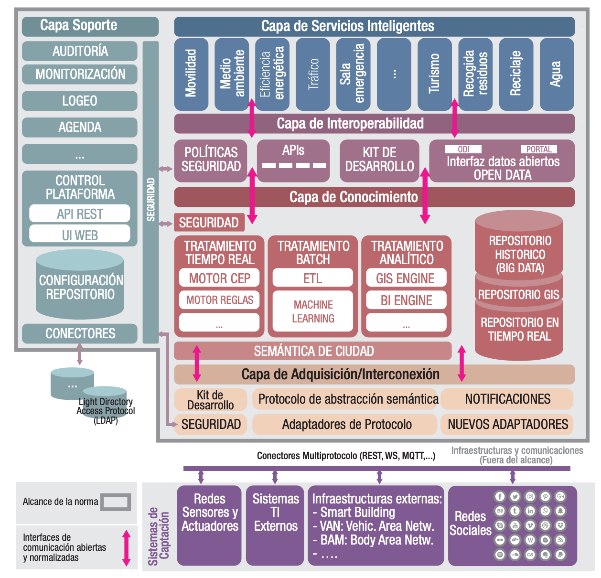

# Ciudades inteligentes

!!! warning "Tema pendiente de revisión"
    Este tema **no ha sido revisado** ni actualizado. Su contenido puede estar
    incompleto, desactualizado o contener errores. Úsalo con precaución y
    contrástalo siempre con fuentes oficiales.

## Ciudades Inteligentes (Smart Cities)

### Definiciones:

- **Ciudad inteligente:** Es una visión holística que aplica las tecnologías de la información y la comunicación (TIC) para mejorar la calidad de vida y la accesibilidad de sus habitantes, asegurando un desarrollo sostenible en los ámbitos económico, social y ambiental. Permite a los ciudadanos interactuar de forma multidisciplinar y adaptarse en tiempo real a sus necesidades, ofreciendo datos abiertos, soluciones y servicios eficientes en calidad y costes. Esto aborda los efectos del crecimiento urbano en ámbitos públicos y privados mediante la integración innovadora de infraestructuras con sistemas de gestión inteligente. En este contexto, la participación del **Internet de las Cosas (IoT)** se vuelve imprescindible.
- **Smart City Platforms (SCPs)**: Son plataformas urbanas que ofrecen integración directa entre sistemas y plataformas urbanas, con el fin de proporcionar operaciones y servicios que apoyen el funcionamiento de los servicios urbanos, mejorando la eficiencia, el rendimiento, la seguridad y la escalabilidad.

**\*Retos:** Las ciudades inteligentes enfrentan desafíos como la escalabilidad, las tecnologías heredadas (legacy), la gobernanza, la falta de bancos de pruebas (testbeds), la interoperabilidad y la reutilización.

### Tecnologías Clave

- **IoT (Internet de las Cosas):** Incluye hardware como sensores y actuadores, middleware y recolección de datos.
- **Big Data:** Comprende el procesamiento, almacenamiento, análisis y visualización de datos.
- **Sistemas Ciberfísicos:** Integran la computación en sistemas físicos y permiten la actuación en la ciudad.
- **Cloud Computing:** Ofrece servicios de hosting, almacenamiento, computación, elasticidad y escalabilidad.

### Arquitectura Tecnológica de una Plataforma Urbana

Se centra en el uso de sensores y dispositivos IoT para recopilar datos sobre la ciudad, facilitando la toma de decisiones y mejorando los servicios urbanos.

**Estándares Internacionales:** Para garantizar la interoperabilidad y calidad, se siguen estándares como **ITU-T Y.4201**, **ISO/IEC 24039**, **UNE 178104:2017**, **DIN 91357-2017** y **FIWARE**.

### Capas Comunes (5):

- **Capa de Adquisición:** Se encarga de la adquisición e integración de datos de sistemas de información y dispositivos IoT. Incluye sensores desplegados en la ciudad (semáforos, farolas, riego de parques, temperatura, aforo, etc.), sistemas de información e infraestructuras externas, dispositivos ciudadanos (aplicaciones móviles) y redes sociales. Se recomienda el uso de protocolos estándar.
- **Capa de Conocimiento:** Responsable del procesamiento y análisis de la información. Debe integrar software y herramientas para la gestión y tratamiento de datos, minería de datos, análisis de ingeniería, control de sistemas, aprendizaje automático, evaluación medioambiental y análisis económicos y sociales. Además, debe compartir datos e información entre las partes interesadas de la ciudad e integrar herramientas de modelización como SIG, CIM y BIM.
- **Capa de Interoperabilidad:** Proporciona interfaces estándar y abiertas que garantizan el envío y acceso a los datos por parte de diferentes aplicaciones y sistemas. Los datos abiertos deben estructurarse en torno a normas bien definidas y acompañarse de los metadatos correspondientes. La licencia asociada a los datos debe indicar claramente si pueden ser compartidos y utilizados libremente por terceros, y se deben anonimizar los datos cuando sea necesario.
- **Capa de Servicios Inteligentes:** Integra herramientas específicas para interactuar con los ciudadanos, la administración, proveedores de servicios, profesionales y visitantes. Se debe difundir información a diferentes grupos y recibir información, comentarios y peticiones de las partes interesadas de la ciudad.
- **Capa de Soporte:** Se encarga de la gestión y soporte de la seguridad, incluyendo servicios de auditoría, monitorización, seguridad, registro (logging), operaciones, administración, gestión y configuración (OAM). Debe ofrecer una visión única y centralizada.

**Interfaces:** Se definen interfaces de adquisición, de servicios y de interoperabilidad.

### Soluciones

Las soluciones en ciudades inteligentes abarcan la sensorización medioambiental, eficiencia energética, iluminación inteligente, tráfico inteligente, gestión de residuos urbanos, aplicaciones para la promoción del comercio y movilidad urbana inteligente.

### Gobierno

El gobierno en las ciudades inteligentes busca crear un marco para el desarrollo y despliegue de soluciones, así como el establecimiento de políticas y reglamentos que garanticen un uso ético y responsable. La gobernanza en torno a la plataforma de datos de la ciudad es crucial, y la cooperación y colaboración entre los ámbitos público y privado son esenciales.

### Norma Y.4201

La **Norma Y.4201** ("Requisitos de alto nivel y marco de referencia de las plataformas de ciudades inteligentes") es un estándar internacional que establece los requisitos y el marco de referencia para plataformas de ciudades inteligentes. Garantiza la calidad y la interoperabilidad de estas plataformas, definiendo los requisitos para su implementación y proporcionando un marco para su diseño y desarrollo.

### Aspectos principales:

- **Integración de Datos:** Requisitos para la integración de datos de diferentes fuentes y sistemas en una plataforma de ciudad inteligente.
- **Interoperabilidad:** Requisitos para garantizar la interoperabilidad entre diferentes sistemas y servicios en una plataforma de ciudad inteligente.
- **Seguridad y Privacidad:** Requisitos para garantizar la seguridad y la privacidad de los datos y la información en una plataforma de ciudad inteligente.
- **Gestión de Cambios:** Requisitos para la gestión de cambios en una plataforma de ciudad inteligente, incluyendo la implementación de nuevos servicios y la actualización de sistemas existentes.

