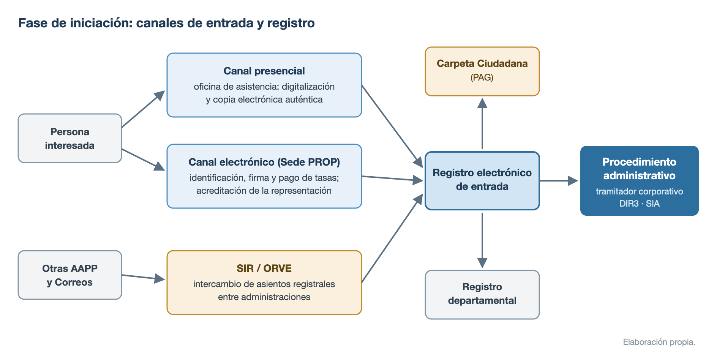
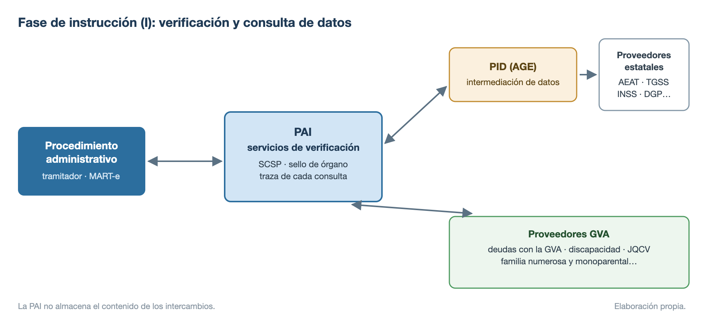
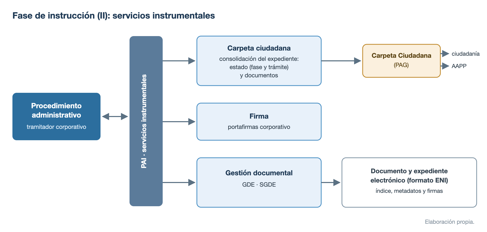
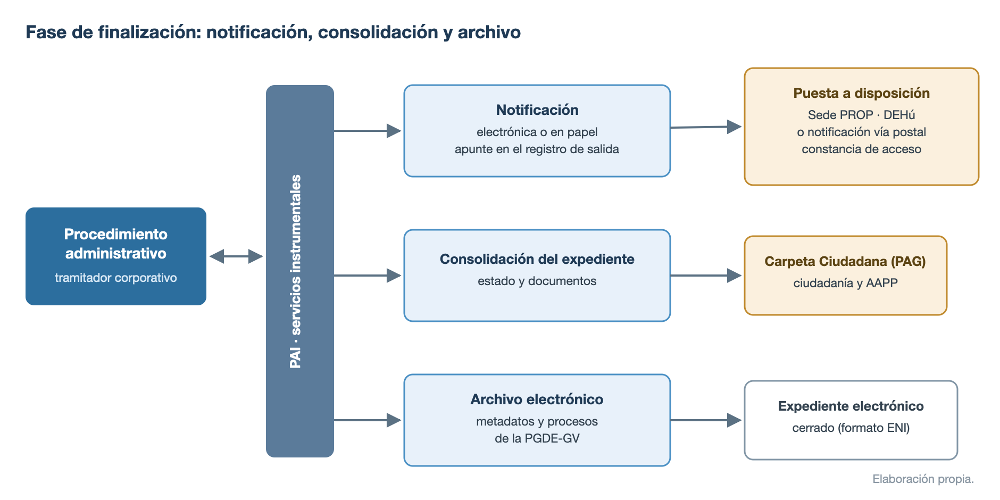

# Administración electrónica y plataformas de la Generalitat

La administración electrónica de la Generalitat se rige hoy por el **Decreto 54/2025, de 15 de abril, del Consell, de simplificación administrativa y transformación digital**, que sustituye al antiguo Reglamento de administración electrónica (Decreto 220/2014) y desarrolla la **Ley 6/2024, de 5 de diciembre, de simplificación administrativa**. Este tema repasa ese marco reglamentario, los instrumentos y servicios comunes que lo materializan (Sede PROP, carpeta ciudadana, registro electrónico, tramitador corporativo) y la Plataforma Autonómica de Interoperabilidad (PAI).

## Decreto 54/2025, de simplificación administrativa y transformación digital

**Texto consolidado a 26 de diciembre de 2025.**

### Características y estructura

El **Decreto 220/2014**, que aprobó el Reglamento de administración electrónica de la Comunitat Valenciana, quedó en gran parte desplazado por la regulación estatal del **RD 203/2021** (Reglamento de actuación y funcionamiento del sector público por medios electrónicos). Tras la aprobación de la **Ley 6/2024, de 5 de diciembre, de la Generalitat, de simplificación administrativa**, el Consell actualizó el régimen reglamentario autonómico integrando la simplificación administrativa y la transformación digital como dos bases de una misma política de gestión de los servicios públicos.

- **Norma**: Decreto 54/2025, de 15 de abril, del Consell (**DOGV núm. 10092, de 22 de abril de 2025**). Entrada en vigor el **23 de abril de 2025**, salvo los apartados 4 a 6 del art. 29 y los arts. 30 a 33 (ligados a la MAIN), cuya vigencia quedó diferida a la publicación del acuerdo del Consell que aprueba la **Guía metodológica MAIN** (aprobada en **febrero de 2026**).
- **Deroga expresamente**: el **Decreto 165/2010** (medidas de simplificación y reducción de cargas administrativas) y el **Decreto 220/2014** (Reglamento de administración electrónica de la Comunitat Valenciana).
- **Modificado por**: el **Decreto-ley 14/2025, de 26 de diciembre**, de medidas urgentes frente a la hiperregulación (art. 38), que retoca los arts. 39, 40, 47, 49, 50, 51, 52 y 53 y el anexo I.
- **Marco normativo**: Leyes 39/2015 y 40/2015, RD 203/2021, Ley 6/2024, ENI (RD 4/2010) y ENS (RD 311/2022).
- **Estructura**: **6 títulos y 62 artículos**, 10 disposiciones adicionales, 1 transitoria, 1 derogatoria, 3 finales y **3 anexos** (I: órganos responsables de los servicios y aplicaciones comunes; II y III: contenido común de las declaraciones responsables y de las comunicaciones).

| Título | Contenido |
| --- | --- |
| I. Disposiciones generales | Objeto, ámbito, principios, derechos y deberes, gobernanza |
| II. Instrumentos de la transformación digital | Puntos de acceso, sedes, registro, notificaciones, tramitador |
| III. Simplificación normativa y del procedimiento electrónico | MAIN, catálogo, formularios, firma, automatización, IA |
| IV. Documento administrativo y expediente electrónico | Documento, copias, gestión documental, archivo |
| V. Gobierno del Dato e interoperabilidad | Modelo y Programa de Gobierno del Dato, PAI |
| VI. Órganos colegiados y catálogos de sistemas | Sesiones electrónicas, catálogos de aplicaciones |

### Disposiciones generales (Título I)

- **Art. 1. Objeto**: «desarrollar la normativa en materia de simplificación administrativa», «establecer el régimen jurídico relativo a la transformación digital» de la Administración y del sector público instrumental de la Generalitat, y «determinar los responsables funcionales y técnicos de los servicios y las aplicaciones comunes» (anexo I).
- **Art. 2. Ámbito de aplicación**: la Administración y el sector público instrumental de la Generalitat; los arts. 8 y 9 se aplican además a las instituciones de autogobierno; la norma se dirige también a las personas físicas y jurídicas en sus relaciones electrónicas con la Generalitat.
- **Arts. 3 y 4. Principios, derechos y deberes**: remiten a los principios de la Ley 6/2024 (art. 3), la Ley 40/2015 y el RD 203/2021. No se podrán solicitar datos o documentos que se puedan interoperar o consten en el Registro electrónico de información de personas usuarias. Están **obligados a relacionarse por medios electrónicos** (ex art. 14.3 de la Ley 39/2015): quienes concurran a **procesos selectivos de empleo público y bolsas de trabajo temporal**, el **personal empleado público** (en trámites por su condición profesional), las **personas empresarias individuales o autónomas** en su actividad y las personas solicitantes de **becas, ayudas o subvenciones** cuando lo establezcan las bases de forma motivada.
- **Arts. 5 y 6. Gobernanza**: la estrategia se articula mediante los planes de simplificación administrativa. Hay dos tipos de responsables: **funcionales** (definición, impulso, gestión y evaluación) y **técnicos** (garantía de las condiciones y requisitos técnicos). La coordinación corresponde a la **CITSA** (Comisión Interdepartamental para la Transformación Digital y Simplificación Administrativa de la Comunitat Valenciana); la detección de necesidades formativas, a la **Oficina de Simplificación Administrativa y Gobierno del Dato** (creada por la Ley 6/2024).
- **Art. 7. Servicios y aplicaciones comunes de transformación digital**: soluciones informáticas que estandarizan la gestión electrónica de procedimientos. Son de **uso obligatorio** para la Administración y los organismos autónomos; su uso por el resto del sector público instrumental requiere autorización del responsable funcional. La relación del anexo I se actualiza por resolución publicada en el DOGV.

### Simplificación normativa y del procedimiento electrónico (Título III)

En lo normativo, el decreto desarrolla los instrumentos de calidad regulatoria de la Ley 6/2024; en lo procedimental, ordena el catálogo de procedimientos, los formularios y la automatización.

- **Art. 29. Planificación normativa**: el **Plan normativo anual** aprobado por el Consell se publica en el **primer trimestre** de cada año en el Portal de Transparencia; las propuestas no incluidas deben justificarse en la MAIN.
- **Art. 30. Memoria del Análisis de Impacto Normativo (MAIN)**: documento electrónico que «recogerá y unificará toda la información que deberá acompañar a las propuestas normativas» (oportunidad, necesidad, impactos y metodología de evaluación posterior). Existe una **MAIN abreviada** para normas sin impacto apreciable (organizativas o modificaciones parciales sin impactos significativos). Su contenido lo fija la **Guía metodológica MAIN**.
- **Arts. 31 a 33. Análisis e informes preceptivos**: la MAIN incorpora tres análisis: de **simplificación administrativa** (con informe preceptivo del órgano competente en simplificación: régimen de intervención, silencio, documentos exigidos, cargas), de **coordinación informática** (volumen de expedientes, medios electrónicos necesarios y plazos) y de **protección de datos** (con informe de la Delegación de Protección de Datos de la Generalitat).
- **Art. 35. Catálogo de procedimientos y servicios administrativos**: información permanente y actualizada de los procedimientos, disponible en la Sede PROP e interoperable con el **SIA** estatal; cada procedimiento lleva asociada información de gestión (manual, flujograma, indicadores, serie documental, servicios de interoperabilidad).
- **Art. 36. Formularios normalizados**: disponibles en las **dos lenguas cooficiales**, accesibles y de **uso obligatorio**; el DOGV ya no publica imágenes de formularios, sino la remisión a la Sede PROP. Las declaraciones responsables y comunicaciones se ajustan al contenido mínimo de los **anexos II y III**.
- **Art. 37. Prestación proactiva**: avisos personalizados, envío de información según el perfil y borradores precumplimentados con los datos que ya obran en la Administración.
- **Art. 39. Política de identidad y firma electrónica** (redacción del DL 14/2025): se aprueba por **acuerdo del Consell** e incorpora los contenidos de la NTI de Política de Firma y Sello Electrónicos y de Certificados. Los **sellos electrónicos** se crean por resolución de la persona titular del departamento o de la dirección del organismo, y su relación se publica en la **Sede PROP** o sede asociada; debe garantizarse la firma con **pseudónimo** para el personal que requiera confidencialidad.
- **Art. 40. Actuación administrativa automatizada** (redacción del DL 14/2025): actos realizados íntegramente por medios electrónicos **sin intervención directa de una persona empleada pública**. Se autoriza por **resolución del órgano competente por razón de la materia**, publicada en la Sede PROP o sede asociada, con: actos a automatizar, mecanismo de firma y lugar de verificación, órganos competentes de especificaciones/programación/mantenimiento/supervisión, **órgano encargado de auditar el sistema y su código fuente** y régimen de recursos. Audita la **Intervención General** (o sus análogos en el sector público instrumental).
- **Art. 41. Robotización e inteligencia artificial**: se admiten soluciones de robotización en tareas **repetitivas, mecánicas y masivas**, con registro de evidencias de ejecución y trazabilidad. Los sistemas de IA deben **evaluarse antes de su puesta en marcha** (riesgos, impacto en derechos, protección de datos) e integrarse en el **Registro de sistemas algorítmicos**. En decisiones automatizadas con efectos jurídicos rige el derecho del **art. 22 del RGPD** a no ser objeto de decisiones basadas únicamente en tratamiento automatizado.

### Documento, expediente y archivo electrónico (Título IV)

- **Arts. 43 y 44. Documento y expediente electrónico**: los metadatos son los del **ENI** y sus NTI, más la política de gestión documental de la Generalitat. El expediente se forma con documentos «ordenados, foliados y numerados mediante un **índice electrónico autenticado**» y dispone de un **código único e inalterable** durante todo el procedimiento.
- **Art. 46. Copias auténticas**: las expide el **personal funcionario habilitado** de las Oficinas de asistencia en materia de registros (documentos presentados en papel) o de los órganos emisores (documentos administrativos ya emitidos).
- **Art. 47. Destrucción de documentos en papel digitalizados** (redacción del DL 14/2025): requiere **dictamen preceptivo de la Junta Qualificadora de Documents Administratius** y resolución del conseller competente en materia de hacienda publicada en el DOGV; nunca se destruyen documentos con valor histórico o artístico.
- **Art. 48. Externalización de la digitalización**: posible para las tareas mecánicas, exigiendo el cumplimiento de las **NTI** de documento electrónico, digitalización y copiado auténtico, y la firma de las copias por el órgano competente.
- **Art. 49. Sistema de Gestión de Documentos Electrónicos de la Generalitat (SGDE)**: sistema **común** para la Administración y los organismos autónomos, que cubre las fases activa y semiactiva de la documentación; debe interoperar con el resto de servicios comunes. Se desarrolla conforme al ENI: identificación única, metadatos mínimos, cuadro de clasificación, calendario de conservación y plan de preservación.
- **Arts. 50 a 52. Archivo electrónico**: el **Archivo electrónico de la Generalitat** es común y garantiza conservación y disponibilidad en la **fase inactiva**; el órgano competente en materia de hacienda (tras el DL 14/2025) determina los períodos de conservación y la política de gestión documental.

### Gobierno del Dato (Título V)

- **Art. 53. Modelo de Gobierno del Dato**: instrumento organizativo aprobado por **acuerdo del Consell**. Criterios: los datos son un **activo digital compartido** cuya reutilización debe maximizarse, modelo común con responsabilidades y roles asignados, estándares que garanticen la homogeneidad semántica y sintáctica, y efectividad del **criterio de dato único** (identificación unívoca de la fuente más fiable). El **Plan estratégico** de implantación lo aprueba la persona titular del departamento competente en simplificación administrativa (redacción del DL 14/2025).
- **Art. 54. Programa de Gobierno del Dato**: se aprueba por **resolución** y recoge, como mínimo: roles y responsabilidades, calidad, ciclo de vida, modelado y arquitectura, seguridad, metadatos, catálogo de datos, analítica, gobierno de los procesos predictivos (IA), privacidad y ética, control del sesgo y explicabilidad, e interoperabilidad y espacios de datos.
- **Art. 55. Registro electrónico de información de personas usuarias**: repositorio común de datos de quienes se relacionan con la Generalitat (identificación, idioma y canal preferentes, datos de contacto), reutilizable por todos los procedimientos.

### Órganos colegiados y catálogos de sistemas (Título VI)

- **Arts. 60 y 61. Gestión electrónica de órganos colegiados**: convocatorias y actas en soporte electrónico, sesiones y acuerdos a distancia por medios electrónicos, y grabación de sesiones con base de legitimación e información previa a los asistentes (el soporte audiovisual puede sustituir la transcripción de los debates).
- **Art. 62. Catálogos de sistemas de información y aplicaciones**: cada órgano directivo TIC mantiene su catálogo con responsables funcional y técnico; la CITSA designa responsable funcional a quien no lo tenga; las soluciones pueden declararse de **uso obligatorio** previa resolución.

## Sede electrónica y servicios comunes de la GVA

El Título II del Decreto 54/2025 regula los instrumentos por los que la ciudadanía se relaciona electrónicamente con la Generalitat: los puntos de acceso, las sedes electrónicas, el registro, las notificaciones y el sistema tramitador.

### Puntos de acceso electrónico

Son el «conjunto de páginas web agrupadas bajo el dominio de internet **gva.es**» (art. 8):

- **Portal corporativo de la Generalitat** (**www.gva.es**): es su **Punto de Acceso General Electrónico**; da acceso a portales, Sede PROP, DOGV, tablón de anuncios, carpeta ciudadana, datos abiertos y participación (gvaoberta, gvaparticipa).
- **Portales institucionales** de los departamentos del Consell y entidades del sector público instrumental, y **portales específicos** por materias (de creación excepcional, previa validación de los órganos de simplificación y de imagen institucional).
- **Canal Empresa** (art. 12): portal específico que unifica información y servicios para **actividades económicas y personas emprendedoras**, con tramitación guiada y unificada (aportar datos y documentos una única vez) e integración de la información de las entidades locales.
- **Apps móviles específicas**: de creación excepcional, desarrolladas por los órganos TIC y gratuitas.
- **Funcion@GVA** (art. 19): portal de intranet del personal empleado público (información laboral, formación, aplicaciones, ciberseguridad y el Sistema Interno de Información SII-GVA).
- La **Sede PROP** y las **sedes electrónicas asociadas**.

### La Sede PROP y las sedes asociadas

Toda actuación electrónica que requiera identificación o firma de las personas interesadas tiene lugar, con carácter general, en una sede electrónica (art. 14), con los contenidos mínimos del art. 11 del RD 203/2021.

- **Sede PROP de la Generalitat** (art. 15): sede electrónica de la Generalitat, accesible en **sede.gva.es**. Da acceso a: la relación de sedes de la Generalitat, el Registro electrónico de representantes, la carpeta ciudadana, el módulo de notificaciones, los servicios de verificación de datos de la PAI, la pasarela de pagos, el DOGV y el Tablón Electrónico Único de Anuncios.
- **Sedes asociadas** (art. 16): pueden crearse para el ámbito de un departamento o entidad, por orden o resolución de su titular, **previo informe favorable** del responsable funcional de la Sede PROP y del órgano de simplificación administrativa.
- **Tablón Electrónico Único de Anuncios (TEUA)** (art. 18): unifica la publicación electrónica de actos y comunicaciones; su uso es **obligatorio**, salvo publicación exigida en diarios oficiales o circunstancias excepcionales. Genera **evidencias electrónicas** de la fecha y hora de publicación y retirada.
- **Carpeta ciudadana de la Generalitat** (art. 17): zona privada de relación electrónica, con perfiles diferenciados (persona física, jurídica o representante). Ofrece, al menos: estado de tramitación y acceso a expedientes, solicitudes presentadas, notificaciones y comunicaciones, información del Registro de personas usuarias, un **repositorio personal de documentación** de aportación frecuente y los certificados, tarjetas y carnés expedidos por la Generalitat (con valor de **copia electrónica auténtica**).

### Registro electrónico y representación

- **Registro electrónico de la Generalitat** (art. 20): es **único** para la Administración y los organismos autónomos y accesible desde la Sede PROP. Anota entradas (y las salidas de notificaciones) por orden temporal con fecha y hora, y está disponible **todos los días del año, las 24 horas**. Es plenamente **interoperable** con los registros del resto de administraciones: la interconexión se realiza a través del **Sistema de Interconexión de Registros (SIR)**, conforme al modelo de datos **SICRES 4.0** (NTI aprobada por Resolución de 22 de julio de 2021, que sustituyó a SICRES 3.0).
- **Presentación** (art. 21): cualquier persona puede presentar electrónicamente; las personas no obligadas pueden hacerlo además **presencialmente** en las oficinas de asistencia en materia de registros (el funcionario habilitado digitaliza y devuelve los originales) o mediante **atención en remoto**. El registro rechaza, entre otros, escritos sin identificación del interesado, documentos con **código malicioso**, paquetes u objetos, publicidad y comunicaciones por fax o correo electrónico.
- **Justificante de presentación** (art. 22): incluye fecha y hora, número de registro de entrada, enumeración de los documentos adjuntos con su **huella electrónica**, código del órgano destinatario y copia del escrito.
- **Registro electrónico de representantes** (art. 42): registro de **apoderamientos** de la Generalitat, accesible desde la Sede PROP; inscribe apoderamientos, revocaciones, renuncias y entes habilitados, y es interoperable con el registro de apoderamientos de la AGE.
- **Comunicaciones internas** (art. 24): no se anotan en el registro salvo que surtan efectos en un procedimiento; la **valija electrónica** es la herramienta de intercambio interno de documentos cuando no hay un gestor de expedientes implantado.

### Notificaciones y comunicaciones

- **Notificación electrónica** (art. 23): accesible desde la **Sede PROP** y desde la **DEHú** (Dirección Electrónica Habilitada única) estatal. Toda notificación genera un apunte de salida en el registro, deja constancia de la **puesta a disposición y del acceso al contenido**, y lleva adjunto el documento a notificar. Las personas interesadas pueden señalar un correo o dispositivo para recibir **avisos**.
- **Comunicaciones informales** (art. 25): intercambios de información sin efectos jurídicos ni autenticación necesaria (correo, teléfono, formularios web, redes sociales, videollamadas o chats).

### Tramitación electrónica y aplicaciones comunes

- **Sistema tramitador corporativo de expedientes** (art. 26): los procedimientos de la Administración y organismos autónomos se gestionan con el tramitador corporativo (salvo peculiaridades que aconsejen otro gestor). El órgano de simplificación define **flujos genéricos de tramitación** y los órganos tramitadores están obligados a tramitar todas las fases en un gestor de expedientes y a **consolidarlas en la carpeta ciudadana**.
- **Asistente de tramitación telemática**: servicio común que guía a la ciudadanía paso a paso en la presentación electrónica de trámites, garantizando su validación y correcta tramitación (anexo I).
- Otros **servicios comunes** del anexo I: pasarela de pagos, **portafirmas corporativo** (firma electrónica centralizada de documentos), **servicio corporativo de verificación de documentos** (validación de documentos mediante **CSV**, código seguro de verificación), SGDE, archivo electrónico, PAI, TEUA, valija electrónica, registro de personal funcionario habilitado, **Registro de sistemas algorítmicos** y los registros de convenios y de contratos. Para cada uno, el anexo I fija su responsable funcional y técnico.
- **Aplicaciones comunes** para la gestión de procedimientos (anexo I):

| Procedimiento | Aplicación |
| --- | --- |
| Becas profesionales | eBecas |
| Contratación | gvContratos |
| Gestión económico-financiera | NEFIS |
| Quejas administrativas | gvQuejas |
| Responsabilidad patrimonial | gvRESPAT |
| Sanciones | gvSancionador |
| Subvenciones | ESTER |

La identificación y firma de la ciudadanía se realiza con los mecanismos que fije la política de identidad y firma de la Generalitat (certificados electrónicos y sistemas estatales como **Cl@ve**); las plataformas de firma (@firma, FIRe, Cl@ve Firma) se desarrollan en el tema de identificación y firma electrónica.

### Las fases del procedimiento administrativo electrónico

Los componentes anteriores se articulan a lo largo de las fases del procedimiento (iniciación, instrucción y finalización).

- **Iniciación**: la persona interesada presenta su solicitud por la Sede PROP (con identificación, firma y, en su caso, pago de tasas), presencialmente (con digitalización y copia auténtica en la oficina de asistencia) o desde otra administración a través del **SIR**; la representación se acredita contra el Registro electrónico de representantes y todo asiento genera justificante.

{width=95%}

- **Instrucción**: el órgano gestor consulta los datos necesarios mediante los **servicios de verificación de la PAI** (que enlazan con la PID estatal y con los proveedores propios de la GVA), evitando pedir documentos que ya obren en poder de las administraciones, y usa los servicios instrumentales corporativos: firma, gestión documental (**GDE**) y consolidación del expediente en la carpeta ciudadana.

{width=95%}

{width=95%}

- **Finalización**: la resolución se notifica electrónicamente (módulo de notificaciones, con acceso también por la DEHú) o por vía postal, el estado del expediente y sus documentos se consolidan en la carpeta ciudadana, y el expediente cerrado pasa al archivo electrónico conforme a la política de gestión documental.

{width=95%}

## La Plataforma Autonómica de Interoperabilidad (PAI)

### Concepto y funciones

La **PAI** es la plataforma de interoperabilidad de servicios horizontales de la Generalitat: permite **compartir e integrar servicios entre entidades públicas**, y está disponible para todas las consellerias y organismos de la Generalitat y para las **entidades locales** de la Comunitat Valenciana. Su fundamento es el derecho de las personas interesadas a **no aportar documentos** que ya obren en poder de la Administración (**art. 28.2 de la Ley 39/2015**).

La PAI actúa como **nodo de interoperabilidad** en dos planos:

- Entre la **Plataforma de Intermediación de Datos del Estado (PID)** y los organismos gestores autonómicos y locales: intermedia los **servicios de verificación y consulta de datos** conforme a las especificaciones **SCSP** (Sustitución de Certificados en Soporte Papel) y a las directrices de la PID; sin autorización previa de la PID no puede autorizar el acceso a sus servicios.
- Entre los organismos gestores y los **servicios instrumentales** que dan soporte a la gestión administrativa (por ejemplo, las notificaciones).

Las condiciones y garantías de acceso y utilización de la PAI se establecieron por el **Acuerdo del Consell de 28 de junio de 2013**.

### Regulación en el Decreto 54/2025 (arts. 56 a 59)

- **Art. 56**: el intercambio de información entre administraciones se realiza mediante los servicios de verificación de la PAI, que se rige por la **NTI de Protocolos de intermediación de datos** (funciones, gobernanza, requisitos técnicos, trazabilidad y auditoría) y aplica las medidas del **ENS**. La plataforma asegura la **identidad de todos los agentes** en cada intercambio.
- **Art. 57. Acceso como consumidor**: las subsecretarías (u órganos equivalentes) designan **personas administradoras delegadas** que trasladan a la PAI las solicitudes de acceso; para otras administraciones, mediante adhesión al **convenio marco** de administración digital.
- **Art. 58. Publicación como proveedor**: el **catálogo de servicios de verificación** se consulta en la Sede PROP; la Administración de la Generalitat y su sector público instrumental **deben poner a disposición de la PAI** toda la información susceptible de intercambio.
- **Art. 59. Trazabilidad y auditoría**: las entidades cedentes tienen «el derecho y la obligación» de auditar el uso de sus servicios. Consumidores y cedentes conservan la traza de cada consulta (servicio, entidad y usuario final, código del procedimiento autorizado, afectado y expediente, identificador de transacción, fecha y hora). La PAI **no almacena el contenido** de los intercambios.

### Roles y funcionamiento

- **Cedente (proveedor de servicios)**: entidad que custodia y ofrece los datos o servicios; define las condiciones del servicio en el **contrato de integración** (descripción del servicio, esquemas y formatos de mensajes, respuestas y errores).
- **Cesionario (consumidor de servicios)**: entidad que solicita y consume los datos, en el marco de un procedimiento que la habilite. La normativa reguladora del procedimiento debe **justificar la consulta**; hay que informar a la persona interesada y permitirle la **oposición motivada** (o recabar autorización expresa para datos tributarios), y en los procedimientos de oficio la consulta debe ampararse en una **ley**.
- **Certificados**: los servicios de verificación exigen **certificado de sello de órgano**; los instrumentales admiten certificado de aplicación o de sello. Las peticiones se firman conforme al estándar **WS-Security**.

### Servicios ofrecidos

- **Servicios de verificación de datos o de intermediación**: permiten comprobar información sin exigir documentación a la ciudadanía. Ejemplos del catálogo, por organismo cedente:
    - **AEAT**: estar al corriente de obligaciones tributarias, nivel de renta, IRPF, validación del NIF.
    - **DGP**: verificación y consulta de datos de identidad; residencia de extranjeros.
    - **TGSS e INSS**: estar al corriente con la Seguridad Social, vida laboral, situación laboral, prestaciones.
    - **SEPE**: situación de desempleo, demandante de empleo, importes de prestaciones.
    - **INE**: datos de residencia y convivencia (padrón).
    - **Ministerio de Justicia**: antecedentes penales, **delitos sexuales**, nacimiento, matrimonio y defunción.
    - **Ministerio de Educación y CRUE**: títulos universitarios y no universitarios, condición de becado, matrículas.
    - **IMSERSO**: nivel y grado de dependencia.
    - **DGT, Catastro, Consejo General del Notariado**, entre otros.
    - **GVA como cedente**: estar al corriente de pago con la Generalitat, **familia monoparental**, conocimientos de valenciano (**JQCV**), Renta Valenciana de Inclusión.
- **Servicios web instrumentales**: procesos internos de soporte a la gestión, como las **comunicaciones y notificaciones** electrónicas, el **SDC** (Sistema de Datos del Ciudadano, para que las entidades locales consulten el padrón de forma unificada), el Registro de Grupos de Interés de la Generalitat y servicios de tramitación de expedientes (WSCARBUITS).

### Garantías de seguridad y arquitectura

La PAI sigue una **arquitectura SOA** cuya pieza central es un **bus** de servicios que proporciona enrutamiento inteligente, **transformación de mensajes** al formato esperado por cada servicio, **orquestación** de flujos con gestión unificada de errores, monitorización y una herramienta interna de administración y autorizaciones. Las garantías que ofrece:

- **Autenticidad**: identificación de todos los agentes mediante certificado digital (firma de mensajes SOAP con **WS-Security**, certificado cliente en SSL), IP del servidor invocante y **API-key** en los servicios REST.
- **Autorización**: control en dos niveles: identificación con certificado reconocido por **@firma** y comprobación de que la aplicación está autorizada para cada servicio.
- **Confidencialidad**: cifrado de los mensajes (total o de los bloques sensibles) y protocolo **HTTPS**; la PAI **no almacena información personal** de la ciudadanía.
- **Integridad**: validación de la firma de las peticiones y, en algunos servicios, firma de las respuestas.
- **Disponibilidad**: **24x7** (condicionada a la del servicio final).
- **Trazabilidad**: guarda la información del intercambio de mensajes, sin almacenar su contenido.

### El Cliente de la PAI

El **Cliente PAI CV** es un **frontal web** que permite realizar consultas a los servicios de verificación sin necesidad de integrar una aplicación de tramitación: ofrece los servicios de la PID estatal, los no intermediados de la AEAT y los propios de la Generalitat. Para su uso, el certificado de sello de órgano del organismo debe instalarse en los servidores de la **DGTIC**. Cada organismo designa un **Personal Administrador Delegado (PAD)** que gestiona las altas de usuarios; cada acceso se vincula a un procedimiento concreto (código **SIA**, norma legal y artículos que justifican la consulta, y régimen de consentimiento).

## Fuentes {.unnumbered .unlisted}

- Decreto 54/2025, de 15 de abril, del Consell, de simplificación administrativa y transformación digital (DOGV núm. 10092, de 22 de abril de 2025), con las modificaciones del art. 38 del Decreto-ley 14/2025, de 26 de diciembre, de medidas urgentes frente a la hiperregulación (DOGV núm. 10270 bis, de 29 de diciembre de 2025).
- Ley 6/2024, de 5 de diciembre, de la Generalitat, de simplificación administrativa (marco legal; BOE-A-2025-1, consultada online en julio de 2026).
- Portal de la Plataforma Autonómica de Interoperabilidad (pai.gva.es), consultado en julio de 2026; Acuerdo del Consell de 28 de junio de 2013, de condiciones de acceso a la PAI.
- NTI de Modelo de Datos para el intercambio de asientos entre las entidades registrales, SICRES 4.0 (Resolución de 22 de julio de 2021, BOE de 10 de agosto de 2021).
