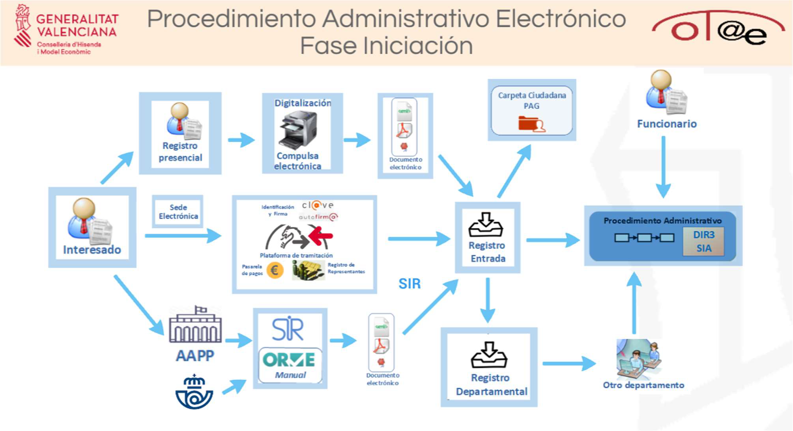
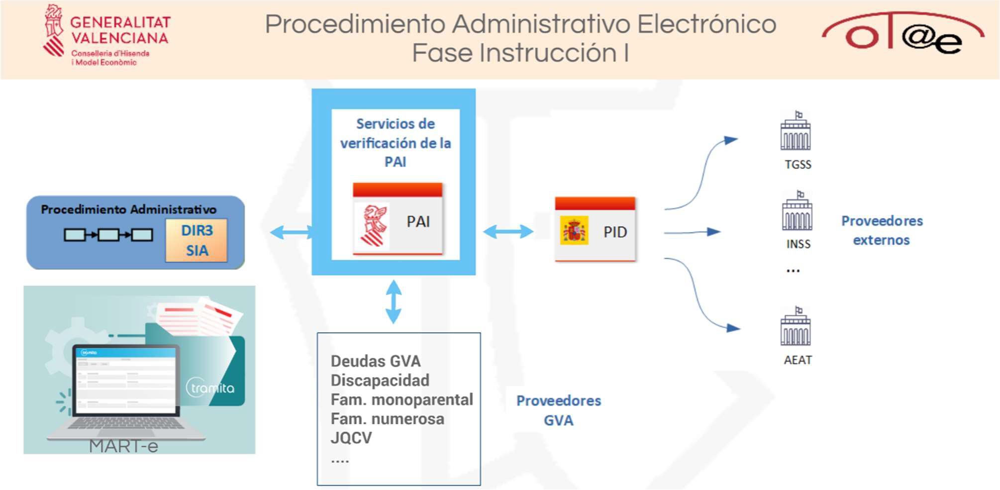
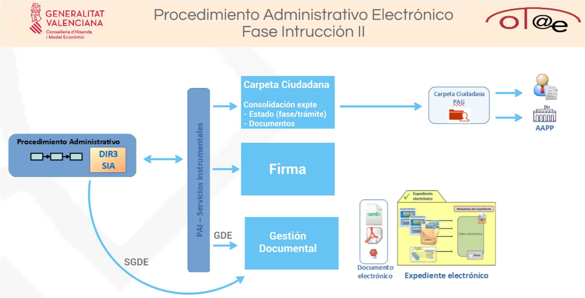
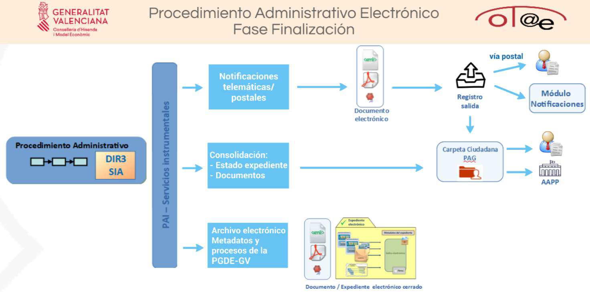

# Administración electrónica y plataformas de la Generalitat

!!! warning "Tema pendiente de revisión"
    Este tema **no ha sido revisado** ni actualizado. Su contenido puede estar
    incompleto, desactualizado o contener errores. Úsalo con precaución y
    contrástalo siempre con fuentes oficiales.

## Decreto 220/2014, del Reglamento de administración electrónica de la Comunitat Valenciana

### Objetivos Específicos

- **Implementación de servicios electrónicos**: Facilitar el acceso a los servicios públicos mediante medios electrónicos.
- **Participación ciudadana**: Fomentar la implicación de los ciudadanos en los asuntos públicos a través de plataformas digitales.
- **Transparencia y buen gobierno**: Mejorar la transparencia de la administración y la rendición de cuentas.

### Ámbito de Aplicación

Se aplica a:

- **Administración de la Generalitat**: Incluye todas las consellerías y organismos dependientes.
- **Sector público instrumental**: Empresas, fundaciones y otros entes públicos de la Comunitat Valenciana.

### Principios Rectores

- **Simplificación administrativa**: Reducir trámites y facilitar la gestión electrónica.
- **Accesibilidad universal**: Garantizar que todos los ciudadanos puedan acceder a los servicios electrónicos.
- **Calidad en la prestación de servicios**: Asegurar la eficacia y eficiencia en la atención al ciudadano.

### Servicios Electrónicos

- **Sede electrónica**: Punto de acceso general a los servicios y trámites electrónicos de la Generalitat.
- **Carpeta ciudadana**: Espacio personalizado donde los ciudadanos pueden consultar sus expedientes y comunicaciones.
- **Tablón electrónico**: Publicación oficial de actos y comunicaciones de la administración.

### Identificación y Autenticación

- **Medios admitidos**: Certificados electrónicos reconocidos, sistemas de clave concertada y otros medios seguros.
- **Registro de funcionarios habilitados**: Permite a funcionarios actuar en representación de ciudadanos que no disponen de medios electrónicos.

### Gestión Documental y Archivo Electrónico

- **Documento electrónico**: Establece los requisitos para la creación y conservación de documentos en formato digital.
- **Archivo electrónico único**: Centraliza la gestión documental para garantizar la integridad y disponibilidad a largo plazo.

### Interoperabilidad

- **Plataformas comunes**: Uso de plataformas y servicios compartidos para mejorar la coordinación entre administraciones.
- **Normas técnicas**: Adopción de estándares que faciliten la compatibilidad y el intercambio de información.

### Protección de Datos y Seguridad

- **Confidencialidad**: Garantizar la protección de los datos personales tratados por la administración.
- **Seguridad de la información**: Implementar medidas técnicas y organizativas para prevenir riesgos.

## Administración electrónica en la Generalitat

### Introducción a la Administración Electrónica

La Administración Electrónica (AE) busca transformar la interacción entre la ciudadanía y la Administración Pública mediante herramientas digitales, mejorando la eficiencia y la accesibilidad de los servicios públicos.

### Normativa relevante

- **Ley 39/2015**: Procedimiento Administrativo Común (PAC)
- **Ley 40/2015**: Régimen Jurídico del Sector Público (RJSP)
- **RD 203/2021**: Reglamento de actuación y funcionamiento del sector público por medios electrónicos
- **RD 220/2014**: Reglamento de la Administración Electrónica de la Comunidad Valenciana

### Oficina Técnica de Administración Electrónica (OTAE)

La OTAE desempeña un papel clave en la implementación de la AE en la Generalitat Valenciana, con las siguientes funciones:

- Soporte a sistemas para la adaptación a la AE
- Soporte in situ a componentes de la AE
- Formación en AE para empleados públicos
- Identificación de nuevas necesidades tecnológicas
- Revisión de la normativa de AE
- Definición de indicadores y cuadros de mando para la evaluación del desempeño\ Además, gestiona el **Portal de la AE (PAE)**, que centraliza todos los componentes de AE en la Generalitat.

### Catálogo de Recursos Comunes (CRC)

El **CRC** es una base de datos centralizada que unifica y redistribuye información proveniente de diversas bases de datos corporativas como **CATI**, **JIRA**, o **CMDB**. Este sistema tiene varias funciones clave:

- **Visibilización del catálogo de datos corporativo**: Permite un acceso más claro y estructurado a los datos.
- **Estandarización de parámetros**: Garantiza la coherencia en el manejo y representación de los datos.
- **Automatización y control de accesos**: Mejora la eficiencia y asegura la gestión segura de los recursos.

**Tipos de solicitudes disponibles**:

- **Consumir datos**: Solicitar acceso a datos existentes en el catálogo.

### MARTE: Módulo de Administración, Registro y Tramitación Electrónica

- **MART-e Aplicaciones**: Es el **arquetipo estándar** empleado en el desarrollo de todos los módulos de **MART-e**, proporcionando una base estructurada y homogénea para las aplicaciones.
- **MART-e Escritorio**: Interfaz centralizada donde los usuarios pueden visualizar y acceder a los distintos módulos y aplicaciones disponibles en el entorno de **MART-e**.
- **MART-e Tramita**: Herramienta para la gestión de **procedimientos administrativos**, permitiendo a los gestores tramitar expedientes de forma electrónica.
    - **Pasos para crear un nuevo trámite**:
        - **Abrir JIRA**: Crear una solicitud en el sistema.
        - Utilizar el **arquetipo estándar**.
        - Solicitar recursos necesarios, como **GVlogin** (gestión de identidad y autenticación).
        - Configurar los servicios web requeridos para el procedimiento.
- **MART-e Administra**: Módulo dedicado a la **gestión de aplicaciones y usuarios**. Permite definir configuraciones específicas para garantizar el correcto funcionamiento del entorno **MART-e** y asignar los roles necesarios.
- **MART-e Mis asuntos**: Un espacio personalizado que proporciona al gestor información relevante sobre las tareas asignadas y su estado.
- **MART-e Dinote**: Punto de acceso único para las **notificaciones y comunicaciones electrónicas**. Centraliza toda la información en un único lugar, facilitando el acceso y seguimiento de las notificaciones administrativas.

### Componentes de la Administración Electrónica

Los componentes de la AE incluyen plataformas y herramientas que facilitan la interacción entre la ciudadanía y la Administración Pública.

- **Catálogos DIR3 y SIA**:
    - **DIR3 (Directorio Común de Unidades Orgánicas y Oficinas)**:\ Codificación única de los órganos administrativos de las AAPP, actualizada mediante el SIAC.
        - **Usos**: Notificaciones, facturas, y en la Plataforma Autonómica de Interoperabilidad (PAI).
    - **SIA (Sistema de Información Administrativa)**:\ Codificación única de procedimientos y servicios de las AAPP, también gestionada por el SIAC.
        - **Usos**: Fuente de información del Punto de Acceso General (PAGe), consolidación de expedientes en la Carpeta Ciudadana, notificaciones, etc.
- **Documentación Electrónica**:
    - **Documento electrónico**: Contiene contenido, firma electrónica y metadatos según la NTI.
    - **Expediente electrónico**: Conjunto ordenado de documentos y actuaciones administrativas, incluye un índice firmado y metadatos.\ **Metadatos mínimos**: Versión NTI, identificador, órgano, fecha, tipo de firma y código seguro de verificación (CSV).

### Procedimiento Administrativo Electrónico

Se estructura en las fases de **iniciación**, **instrucción** y **finalización**:

**Fase de Iniciación**:

- **Interesado**: Puede actuar personalmente, a través de un **funcionario habilitado** o mediante **representación legal** (Registro Electrónico de Apoderamientos o poderes notariales).
- **Presentación de documentos**:
    - Presencialmente en una oficina.
    - Por correo postal.
    - A través de la **Oficina de Registro Virtual (ORVE)**.
- **Registros relevantes**:
    - **Registro de Representantes de la Comunidad Valenciana (RRCV)**: Gestiona las autorizaciones para que los representantes puedan actuar en nombre de los interesados.
    - **Registro Electrónico General (RegistroGVA)**: Facilita la gestión de la documentación de entrada y salida en la Generalitat Valenciana. Este registro está interconectado con el **Sistema de Interconexión de Registros (SIR)** a través del estándar **SICRES 3.0**.
    - **Registro presencial**: Cuando la documentación se presenta físicamente, se entrega un justificante al interesado.
    - **Registro Departamental (RD)**: Funciona como una **valija electrónica** que permite enviar comunicaciones internas entre los departamentos de la Generalitat, dejando constancia de los intercambios.
    - **Oficina de Registro Virtual (ORVE)**: Permite a las administraciones públicas mantener un registro digital propio para gestionar la documentación de entrada y salida. Al estar certificada con **SICRES 3.0**, facilita el intercambio de registros electrónicos con otras administraciones conectadas al SIR.
- **Sede Electrónica**: Es el punto de acceso general a procedimientos y servicios de la GVA, identificada mediante un certificado de sede electrónica.
- **SIAC (Sistema de Información y Atención a la Ciudadanía)**:\ Ofrece información sobre procedimientos, trámites y servicios públicos.
- **Digitalización certificada con WebScan**: Proceso regulado por la NTI para convertir documentos físicos en electrónicos:
    - **Requisitos técnicos**: 200 ppi, formatos según ENI, geometría respetada.
    - **Pasos**: Digitalización, optimización de la imagen, asignación de metadatos y firma, si aplica.
- **Plataforma de Tramitación Telemática (PTT):** Herramienta clave para la tramitación de procedimientos:
- **Componentes principales de la PTT**:
    - **Asistente de Tramitación Telemática (ATT)**: Proporciona al ciudadano una guía paso a paso durante el trámite.
    - **Gestor de Trámites (GTT)**: Configura los pasos que se muestran en el ATT para un procedimiento concreto.
    - **Gestor Simple de Expedientes (GSE)**: Gestiona trámites genéricos que no requieren configuraciones avanzadas.
    - **Componente de Integración de Organismos (CIO)**: Facilita la comunicación entre la PTT y los sistemas de tramitación externos, como aplicaciones de destino.
- **Métodos de autenticación y firma**:
    - **Autenticación**:
        - **PTT-Cl@ve** (PIN, Permanente y Certificado Digital).
        - **ClientCert**: Certificados de cliente para autenticaciones avanzadas.
    - **Firma electrónica**:
        - **FIRe (Firma Remota)**: Permite firmar documentos de manera local o en la nube.
- **Otras funcionalidades de la PTT**:
    - **Representación**: El ATT se conecta al **RRCV** para verificar si el usuario tiene una representación válida.
    - **Pago de tasas**: Se gestiona mediante la **pasarela de pagos de la GVA**.
    - **Justificantes**: Generación automática de justificantes cada vez que se crea un asiento registral.
- **Tipos de trámites**: Genérico, Específico, Z DGM-Z, Y Servicio.
- **eTurnos**: Sistema para gestionar las citas en trámites específicos.

**Fase de Instrucción**

- **Plataforma Autonómica de Interoperabilidad (PAI)**: La PAI permite acceder a la **Plataforma de Intermediación de Datos (PID)** y a proveedores externos como la JQCV, AEAT, INSS, entre otros, evitando solicitar al ciudadano documentos que ya estén en poder de otras administraciones públicas.
    - **Buses de datos en la PAI**: La plataforma organiza sus servicios en diferentes **buses** para garantizar su funcionamiento:
        - **Bus de verificación**: Proporciona servicios de consulta para validar información del ciudadano (por ejemplo, datos personales, títulos académicos).
        - **Bus instrumental**: Facilita la realización de procesos internos de gestión administrativa, como la autenticación o el intercambio de datos.
        - **Bus de innovación**: Apoya el desarrollo de proyectos avanzados en interoperabilidad y servicios innovadores.
    - **Acceso a los servicios de la PAI**: Para utilizar los servicios de la PAI, las entidades deben solicitarlo mediante los **formularios de acceso**, que deben incluir:
        - Código **DIR3** del organismo solicitante.
        - Código **SIA** del procedimiento asociado.
        - Certificados necesarios.
        - Datos de contacto.
        - Información de la aplicación que utilizará el servicio.
    - **Consulta de servicios consumidos**: A través del sistema **CATI**, es posible consultar qué servicios de la PAI han sido utilizados por cada aplicación.
    - **Tipos de servicios de la PAI**:
        - **Servicios de verificación de datos / Intermediación**: Verifican información administrativa sin necesidad de que el ciudadano presente documentación. **Ejemplos:**
            - Consulta de datos de identidad (DNI, NIE).
            - Verificación de títulos universitarios y no universitarios.
            - Certificado de estar al corriente de pago con la AEAT, Seguridad Social o Generalitat Valenciana.
            - Situación de desempleo e inscripción como demandante de empleo.
            - Grado y nivel de dependencia.
            - Datos de nacimiento, matrimonio o defunción.
            - Residencia legal y cambio de domicilio.
            - Certificado de inexistencia de antecedentes penales y delitos sexuales.
            - Grado de conocimiento de valenciano (JQCV).
            - Títulos de familia numerosa.
        - **Servicios Web Instrumentales**: Permiten realizar operaciones internas en las administraciones públicas.\ Ejemplos:
            - **Port@firmas de la GVA**: Herramienta de firma electrónica.
            - **GVLOGIN**: Sistema de autenticación para usuarios.
            - **GDE (Gestión de Documentos Electrónicos)**: Archivo digital corporativo.
            - **Pasarela de pagos**: Para gestionar el cobro de tasas.
            - **Gestor documental**: Repositorio de documentos.
            - **Envío de correos o SMS**.
            - **Servicios de traducción SALT**.
        - **Servicios de otras administraciones**:
            - **Fogasa**, **Lexnet**, **Face**.
        - **Servicios para empresas**:
            - **Servicio de prohibidos**, entre otros.
    - **Notas importantes sobre los servicios de la PAI**:
        - La administración puede consultar datos del interesado basándose en:
            - **No oposición** del ciudadano.
            - **Consentimiento expreso** del ciudadano.
            - Lo dispuesto en una **ley** específica.
        - Estas condiciones no aplican a los servicios de verificación.

- **Carpeta Ciudadana**: La **Carpeta Ciudadana de la GVA** es un área personal para el ciudadano que centraliza la información administrativa disponible. Está integrada con el **Punto de Acceso General (PAGe)** de la Administración General del Estado.
    - **Contenidos de la Carpeta Ciudadana**:
        - Solicitudes realizadas (presenciales o telemáticas).
        - Firmas electrónicas efectuadas.
        - Estado de tramitación de expedientes.
        - Documentos y justificantes generados.
        - Notificaciones recibidas.
- **Firmas de la Generalitat**
    - **Firmas Automatizadas (AAA)**: Utilizadas para firmar documentos de forma automática, como justificantes.
        - **Tipos de firmas automatizadas**:
            - **Sello de Órgano (PTT-SAYFE)**.
            - **Código Seguro de Verificación (CSV)**, que también puede funcionar como localizador.
    - **Firmas con Certificado Personal**:\ Los funcionarios firman documentos mediante su certificado personal.
        - **Tipos**:
            - **Firma en circuito**: A través de herramientas como **Port@firmas**.
            - **Firma individual**: Mediante **PTT-Cl@ve**.
- **Gestión de Documentos Electrónicos (GDE / SGDE)**: El **Gestor de Documentos Electrónicos (GDE)** es el repositorio corporativo que permite acceder, crear y gestionar documentos y expedientes electrónicos.
    - El GDE se transformará en un sistema de archivo definitivo (**SGDEA**).
- **gvComparte**
    - Herramienta para compartir archivos de forma segura con usuarios externos.
        - **Tipos de documentos**:
        - **Públicos**: Accesibles sin autenticación.
        - **Restringidos**: Requieren autenticación para acceder.

### Fase de Finalización

- **Notificaciones y Comunicaciones**:
    - **Notificación**: Acto administrativo formal que comunica un hecho relevante que afecta a los derechos del interesado. Requiere constancia de recepción.
    - **Comunicación**: Información meramente informativa, sin necesidad de constancia de recepción.
- **Normativa sobre notificaciones electrónicas**:
    - La **notificación electrónica** es el método estándar.
    - Las notificaciones están conectadas con la **DEHú** (Dirección Electrónica Habilitada única).
- **Módulo de Notificaciones**:Está integrado con **blockchain** para garantizar la trazabilidad y la inmutabilidad de las acciones realizadas sobre cada notificación.
- **Requisitos técnicos para notificaciones**:
    - Disponer de un código **DIR3** y **SIA** asociado al procedimiento.
    - Los documentos no pueden visualizarse hasta que el interesado acepte la notificación.
    - El documento notificado debe estar firmado electrónicamente.
- **Blockchain en las notificaciones**:\ Permite:
    - Generar y registrar evidencias digitales de los eventos asociados a una notificación.
    - Certificar la inmutabilidad y trazabilidad de las acciones realizadas.

## La Plataforma Autonómica de Interoperabilidad (PAI)

La PAI facilita el intercambio de información entre los diferentes departamentos de la Generalitat y entre estos y el resto de las administraciones públicas.

### Detalles:

- Canaliza la relación con la Plataforma de Intermediación de Datos Estatal (PID) a través de la Red SARA.
- Centraliza el intercambio de información y gestiona las solicitudes e incidencias técnicas y organizativas.
- Potencia la interoperabilidad entre aplicaciones de diferentes entidades.

**Arquitectura:** Implementada sobre Oracle Service Bus (OSB).

### Componentes:

- **Bus de Verificación**
- **Bus Instrumental**
- **Bus de Innovación**

### Tecnologías y funcionalidades:

- **Autenticación y autorización:** Control de acceso seguro a los servicios.
- **Firmado y sellado electrónico:** Garantiza la integridad y autenticidad de la información.
- **Transformación de mensajes:** Adaptación de formatos para la interoperabilidad entre sistemas.
- **Registro y auditoría:** Seguimiento y control de las transacciones realizadas.
- **Orquestación de servicios:** Coordinación de múltiples servicios para cumplir procesos complejos.
- **Herramienta de administración:** Gestión y configuración de la plataforma.

### Roles de los participantes:

- **Proveedor de Servicios (Cedente):** Entidad que ofrece datos o servicios.
- **Consumidor de Servicios (Cesionario):** Entidad que consume datos o servicios.

### Servicios ofrecidos:

- **Servicios de verificación de datos/intermediación:** Permiten verificar información para evitar solicitar al ciudadano documentación ya disponible en la administración.
    - **Ejemplos:**
        - Consulta de datos de identidad y verificación.
        - Verificación de títulos universitarios y no universitarios.
        - Comprobación de estar al corriente de pago con la Agencia Tributaria, Seguridad Social o Generalitat Valenciana.
        - Información sobre situación actual de desempleo e inscripción como demandante de empleo.
        - Grado y nivel de dependencia.
        - Datos de nacimiento, matrimonio y defunción.
        - Residencia legal y cambio de domicilio.
        - Inexistencia de antecedentes penales o delitos sexuales.
        - Consulta del grado de conocimiento de valenciano de la JQCV.
        - Verificación de título de familia numerosa.
- **Servicios Web Instrumentales:** Facilitan procesos internos en la gestión administrativa con el ciudadano.
    - **Tipos y ejemplos:**
        - **Componentes comunes de administración electrónica desarrollados o adaptados por la DGTIC:**
            - Comunicaciones y notificaciones.
            - Pasarela de pagos.
            - Localizador y generación de nuevos CSV.
            - Gestor documental.
            - Sistema de Autenticación y Firma Electrónica (SAFE).
            - Envío de correos electrónicos y SMS.
            - Portafirmas.
            - Servicios de traducción (SALT).
        - **Servicios de otras administraciones públicas:** Fogasa, Lexnet, FACE.
        - **Servicios ofrecidos a empresas:** Servicio de prohibidos.

### Roles en la PAI y Contratos de Integración

En el funcionamiento de la PAI participan diferentes roles esenciales para garantizar la interoperabilidad y el correcto intercambio de información.

### Roles:

- **Cedente (Proveedor de Servicios):** Entidad que proporciona los datos o servicios. Es responsable de elaborar el contrato de integración y definir las condiciones y especificaciones del servicio ofrecido.
- **Cesionario (Consumidor de Servicios):** Entidad que solicita y consume los datos o servicios proporcionados por el cedente.

**Contrato de Integración:** Documento que establece las reglas y condiciones para consumir un servicio a través de la PAI. Incluye:

- Descripción detallada del sistema y del servicio ofrecido.
- Definición del intercambio de mensajes, incluyendo esquemas y formatos.
- Especificación de respuestas y posibles errores.
- Anexos con información adicional relevante.
